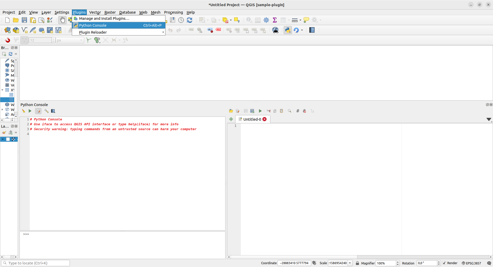

# Harjoitus 1: Python-konsoli

**Harjoituksen sisältö:** QGISin Python-konsoli ja skriptieditori.

**Harjoituksen tavoite:** Tutustua Python-komentojen ajamiseen konsolissa ja
skriptien ajamiseen skriptieditorissa.

::: note-box
Seuraavissa harjoituksissa oletetaan, että tunnet Python-kielen perusteet.
Tarvittaessa voit kerrata Pythonia [täällä](00_harjoitus_0.html).
:::

Yksinkertaisin tapa käyttää Python-rajapintaa QGISissä on Python-konsolin kautta.
Konsolin avulla voidaan syöttää ja ajaa yksittäisiä komentoja tai pidempiä skriptejä.
Windowsilla QGIS-asennukseen sisältyy erillinen Python-tulkki, jonka versio on 3.12.
Lisäksi asennukseen sisältyy joitain Python-paketteja standardikirjaston lisäksi.
Asennukseen kuuluu myös QGIS- ja gdal/ogr-kirjastot, jotka mahdollistavat eri
komponenttien hyödyntämisen konsolissa ja lisäosissa. Näiden lisäksi asennukseen
kuuluu myös PyQt-kirjasto, eli Qt-käyttöliittymäkirjaston Python-sidonta (binding),
joka mahdollistaa graafisen käyttöliittymän luomisen lisäosille.

::: hint-box
Python toimii käyttöjärjestelmien välillä hieman eri tavalla. Windows- ja
MacOS-käyttöjärjestelmissä QGIS-asennukseen kuuluu oma Python-tulkki, kun
taas Linux-pohjaisilla käyttöjärjestelmillä QGIS käyttää järjestelmän Python-tulkkia.
:::

Python-konsoliin pääsee usealla tavalla (kts. alla oleva kuva): 

- Sen voi avata QGISin ylävalikosta Lisäosat > Python-konsoli (Plugins > Python Console),
- Pikanäppäinyhdistelmällä Ctrl + Alt + P,
- Klikkaamalla työkalupalkista Python-logon kohdalta



Tarkastellaan konsoli-ikkunan eri osia: vihreästä kolmiosta klikkaamalla komennot
suoritetaan (enter-näppäin ajaa saman asian). Muista ikoneista:

- 
Avaa skripti-editorin. Editori helpottaa pidempien skriptien tekoa ja ajamista

- 
Tyhjentää konsoli-ikkunan edellisistä komennoista

- 
Täältä löydät kätevästi linkit PyQGIs API -dokumentaatioon, PyQGIS Cookbookiin
sekä konsolin ohjeisiin.

Avaa konsolista skripti-editori ja tutki samoin sen ominaisuuksia.

## Harjoitusten rakenne

## Esimerkit

Eri harjoitusosioissa on annettu esimerkkejä Python-koodista. Suosittelemme,
että esimerkkejä läpikäydessä kopioit esimerkin QGIS-konsolin skriptieditorin
puolelle ja ajat koodin. Esimerkkien yhteydessä voi myös muokata koodia
kokeillakseen eri toimintoja ja lopputuloksia. Esimerkit on annettu
koodilaatikossa, josta sen sisällön voi kopioida viemällä hiiren osoittimen
laatikon päälle ja klikkaamalla laatikon oikeaan yläreunaan ilmestyvää
painiketta.

::: code-box
```python
# Esimerkkikoodia

print("Run me as an example!")
```
:::

## Harjoitukset

Suosittelemme, että työstät myös harjoitusten vastaukset skriptieditorissa.
Harjoitusten yhteydessä on joskus annettu oikeaan suuntaan ohjaava vinkki,
sekä aina malliratkaisu. Saat nämä näkyville painamalla **Näytä ratkaisu** ja
**Näytä vinkki** -painikkeita. Suosittelemme kuitenkin, ettet katso malliratkaisua
liian aikaisin vaan yrität ensin keksiä ratkaisun itse.
Saman asian voi myös tehdä usealla tavalla, ja malliratkaisu on vain yksi
tapa ratkaista ongelma!

## Harjoitus 1.1

Aseta muuttujan a arvoksi 5 Python- konsolissa ja tulosta muuttujan arvo.

<button onclick="toggleAnswer(this)" class="btn answer_btn">vinkki</button>

::: hidden-box
::: code-box
```python
# Aseta ensin arvo
a = 5

# Millä funktiolla voit tulostaa muuttujan arvon?
```
:::
:::

<button onclick="toggleAnswer(this)" class="btn answer_btn">ratkaisu</button>

::: hidden-box
::: code-box
```python
a = 5

print("Muuttujan a arvo", 5)
```
:::
:::

\
\

::: hint-box
Lisävinkkejä konsolin käyttöön:

- Konsoli sopii hyvin myös esimerkiksi PyQGIS-olioiden ominaisuuksien tutkimiseen sekä
testailuun, ja se tukee esimerkiksi PyQGIS-kirjastojen koodintäydennystä (code completion).

- Konsolissa voi myös suorittaa useammalle riville jatkuvia komentoja, kuten for-loopin.
Konsoliin ilmestyy tällöin rivinvaihdon jälkeen kolme pistettä sen merkiksi, että se
odottaa lisäkomentoja. Huomaa kuitenkin, että pisteet eivät vastaa Python-koodin
sisennystä, vaan käyttäjän on huolehdittava tästä.

- Nuolinäppäimillä ylös- ja alaspäin pääsee siirtymään konsoliin syötettyjen komentojen
historiassa.

- Konsolipaneeli aukeaa todennäköisesti karttaikkunan alapuolelle, mutta sen pystyy
raahaamaan ja telakoimaan haluttaessa muuallekin QGISin käyttöliittymässä tai irrottamaan
omaksi ikkunakseen.
:::

