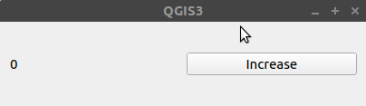

# Harjoitus 4: Qt-käyttöliittymät

**Harjoituksen sisältö:** PyQt:n perusteet.

**Harjoituksen tavoite:** Ymmärtää Qt-kirjaston toiminnan perusteet ja luoda yksinkertaisia graafisia käyttöliittymiä.

## Qt-käyttöliittymistä

QGISin käyttöliittymä on luotu hyödyntäen Qt:ta, joka on C++-kielellä kirjoitettu
käyttöliittymäkirjasto ja ohjelmointiympäristö. Qt:ta voidaan kuitenkin käyttää myös
muilla ohjelmointikielillä kuten Pythonilla.

### QWidget

Qt-kirjasto mahdollistaa käyttöliittymien luomisen. Qt:ssa keskeinen käsite on
"Widget", jota voi ajatella käyttöliittymän yhtenä komponenttina. **QWidget** on
siis Qt:n koodissa luokka, josta periytyy paljon erilaisia alaluokkia, joilla on
erilaisia ominaisuuksia. Esimerkkinä vaikka **QPushButton**, joka käyttöliittymässä
on klikattava painike.

Joihinkin widgetteihin voidaan lisätä ns. lapsiwidgettejä (child Widget), mikä
mahdollistaa käyttöliittymän suunnittelun.
Lapsiwidgetit voidaan järjestää eri asetelmiin (layout), esimerkiksi asettaa
ne vaaka- tai pystytasoon sekä ruudukkoon.

Omaan käyttöön voi luoda myös omia widgettejä. Tällöin luodaan oma luokka, joka
perii jonkin olemassa olevan widget-luokan. QGISiin on luotu sille ominaisia
widgettejä esimerkiksi karttatasojen tai koordinaattijärjestelmän valitsemiseen.
Näitä voidaan käyttää myös QGIS-lisäosissa.

Tässä minimiesimerkki käyttöliittymän luomisesta PyQt:lla. Esimerkin voi ajaa
jälleen QGISin Python-konsolin skriptieditorissa.

<button onclick="toggleAnswer(this)" class="btn answer_btn">esimerkki</button>

::: hidden-box
::: code-box
``` python
# Luodaan widget ja säädetään sen kokoa
widget = QWidget()
widget.resize(420, 320)

# Luodaan layout ja määritetään se widgetille
layout = QVBoxLayout()
widget.setLayout(layout)

# Luodaan painike ja lisätään se layoutiin
button = QPushButton("Close")
layout.addWidget(button)

# Näytetään widget
# Jos widget itsessään ei ole minkään muun widgetin
# "lapsi", se avautuu uuteen ikkunaan
widget.show()
```
:::
:::

Tässä esimerkissä luodaan "Close"-painike. Sitä painettaessa ei kuitenkaan tapahdu mitään.

### Signaalit ja slotit

Toinen keskeinen ajatus Qt-kirjastossa on **signaalit** ja **slotit**. Nämä mahdollistavat
käyttöliittymän interaktiivisuuden, siten että esimerkiksi painiketta (QPushButton)
painettaessa tapahtuu ennalta määritetty toiminto.

Kun widgettien kanssa vuorovaikutetaan, ne lähettävät eri toiminnoista **signaaleja**, jotka
voidaan yhdistää jonkin toisen widgetin **slottiin**. Qt:n valmiit widgetit sisältävät jo
valmiiksi monia signaaleja ja slotteja. Kirjaston käyttäjä voi hyödyntää niitä yhdistämällä
signaaleja eri slotteihin, mutta myös omien signaalien ja slottien määrittäminen on mahdollista.

PyQt:ssa signaali on **Signal-luokan** olio, kun taas slot on **funktio**, joka yhdistetään
signaaliin. Signaali voidaan määritellä lähetettäväksi (*emit*) eri tilanteissa.

Signaali voidaan yhdistää slottiin seuraavasti, edellistä esimerkkiä hyödyntäen:

<button onclick="toggleAnswer(this)" class="btn answer_btn">esimerkki</button>

::: hidden-box
::: code-box
``` python
widget = QWidget()
widget.resize(420, 320)

layout = QVBoxLayout()
widget.setLayout(layout)

button = QPushButton("Close")
layout.addWidget(button)

# Yhdistetään QPushButtonin "clicked"
# signaali QWidgetin "close" slottiin
button.clicked.connect(widget.close)

widget.show()
```
:::
:::

Nyt painikkeen pitäisi oikeasti sulkea ikkuna.

## Harjoitus 4.1: Counter-widget

Kirjoita skripti joka määrittelee uuden, QWidgetin perivän alaluokan
`Counter`, joka koostuu kahdesta komponentista: QLabel ja QPushButton.
Label on tekstikomponentti. Counter toimii siten, että kun sen painiketta
painetaan, nollasta lähtevä arvo kasvaa aina yhdellä. Arvo näytetään
QLabelissa.



Voit käyttää tätä pohjana skriptille:

::: code-box
```python
class Counter(QWidget):
    def __init__(self, *args):
        super(Counter, self).__init__(*args)

        # Luo widgetit

    @pyqtSlot()
    def on_increase_clicked(self):
        pass

    def refresh_label(self):
        pass

counter = Counter()
counter.show()
```
:::

<button onclick="toggleAnswer(this)" class="btn answer_btn">vinkki</button>

::: hidden-box
::: code-box
```python
class Counter(QWidget):
    def __init__(self, *args):
        super(Counter, self).__init__(*args)

        # Tarvitaan muuttuja johon arvo tallennetaan
        self.count = 0

        # Tarvitaan layout widgetille
        self.layout = QHBoxLayout()

        self.label = QLabel()
        self.button = QPushButton("Increase")

        # Miten lisäät widgetit?
        <funktio>
        <funktio>

        # Miten asetat layoutin tälle
        # widgetille?
        <funktio>

        # Yhdistä painikkeen painallus alla
        # määriteltyyn on_increase_clicked
        # slottiin
        <funktio>

        # Päivitä label
        <funktio>

    @pyqtSlot()
    def on_increase_clicked(self):
        # Lisää arvoa ja päivitä label
        <funktio>
        <funktio>

    def refresh_label(self):
        # Miten voit asettaa QLabelille
        # uuden tekstin?
        <funktio>


counter = Counter()
counter.show()
```
:::
:::


<button onclick="toggleAnswer(this)" class="btn answer_btn">ratkaisu</button>

::: hidden-box
::: code-box
```python
class Counter(QWidget):
    def __init__(self, *args):
        super(Counter, self).__init__(*args)

        self.count = 0

        self.layout = QHBoxLayout()

        self.label = QLabel()
        self.button = QPushButton("Increase")

        self.layout.addWidget(self.label)
        self.layout.addWidget(self.button)

        self.setLayout(self.layout)

        self.button.clicked.connect(self.on_increase_clicked)

        self.refresh_label()

    @pyqtSlot()
    def on_increase_clicked(self):
        self.count +=1
        self.refresh_label()

    def refresh_label(self):
        self.label.setText(str(self.count))

counter = Counter()
counter.show()
```
:::
:::

## Harjoitus 4.2: QGISin widgetit

Luo käyttöliittymä, jossa käyttäjä valitsee QGIS-projektin tason.
Painiketta painamalla luodaan uusi polygonitaso, jossa on yksi
kohde. Sille luodaan geometria, joka on suorakaiteen muotoinen
polygoni, jonka muoto on valitun tason laajuuden (extent)
mukainen.

Tallenna myös fid-tunniste sekä toisena attribuuttina tason nimi,
josta laajuus luotiin. Luo uusi polygonitaso koordinaattijärjestelmällä
EPSG:4326, ja tarvittaessa muunna lähdetason laajuus samaan
koordinaattijärjestelmään. Käytä **QgsMapLayerComboBox**-widgettiä
tason valitsemiseen.

Laajuuden voi laskea taso-oliosta [`extent()`-metodilla](https://qgis.org/pyqgis/latest/core/QgsMapLayer.html#qgis.core.QgsMapLayer.extent).
Se ei kuitenkaan palauta suoraan `QgsGeometry`-oliota. Selvitä
mitä **extent()** palauttaa ja miten voit luoda sen
pohjalta geometriaolion.


Voit käyttää tätä pohjaa:

::: code-box
```python
class LayerExtentWidget(QWidget):
    def __init__(self, *args):
        super(LayerExtentWidget, self).__init__(*args)

        # ...

    @pyqtSlot()
    def on_button_clicked(self):
        pass

    def create_layer(self, layer: QgsMapLayer):
        new_layer = QgsVectorLayer("Polygon?crs=EPSG:4326", f"laajuus: {layer.name()}", "memory")

        new_layer.startEditing()

        new_layer.addAttribute(QgsField("fid", QVariant.Int))
        new_layer.addAttribute(QgsField("layer", QVariant.String))

        # ...

        new_layer.commitChanges()

        QgsProject.instance().addMapLayer(new_layer)
```
:::


<button onclick="toggleAnswer(this)" class="btn answer_btn">ratkaisu</button>

::: hidden-box
::: code-box
```python
class LayerExtentWidget(QWidget):
    def __init__(self, *args):
        super(LayerExtentWidget, self).__init__(*args)

        layout = QHBoxLayout()

        self.layer_combobox = QgsMapLayerComboBox()
        self.button = QPushButton("Create Extent")

        layout.addWidget(self.layer_combobox)
        layout.addWidget(self.button)

        self.setLayout(layout)

        self.button.clicked.connect(self.on_button_clicked)

        self.resize(420, 150)

    @pyqtSlot()
    def on_button_clicked(self):
        layer = self.layer_combobox.currentLayer()

        self.create_layer(layer)

    def create_layer(self, layer: QgsMapLayer):
        new_layer = QgsVectorLayer("Polygon?crs=EPSG:4326", f"laajuus: {layer.name()}", "memory")

        new_layer.startEditing()

        new_layer.addAttribute(QgsField("fid", QVariant.Int))
        new_layer.addAttribute(QgsField("layer", QVariant.String))

        new_feature = QgsFeature(new_layer.fields())
        new_feature.setAttributes([1, layer.name()])

        new_geom = QgsGeometry.fromRect(layer.extent())
        source_crs = layer.crs()
        target_crs = QgsCoordinateReferenceSystem(4326)

        if source_crs != target_crs:
            transform = QgsCoordinateTransform(source_crs, target_crs, QgsProject.instance())
            new_geom.transform(transform)

        new_feature.setGeometry(new_geom)

        new_layer.addFeature(new_feature)

        new_layer.commitChanges()

        QgsProject.instance().addMapLayer(new_layer)

extent_widget = LayerExtentWidget()
extent_widget.show()
```
:::
:::
