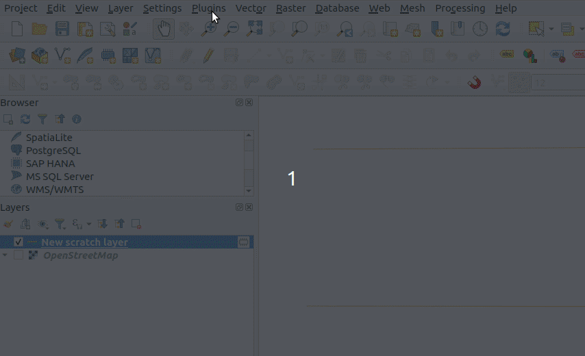
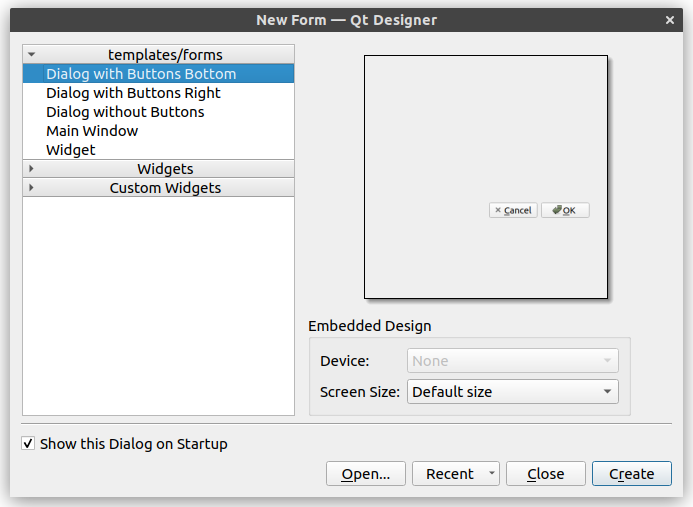
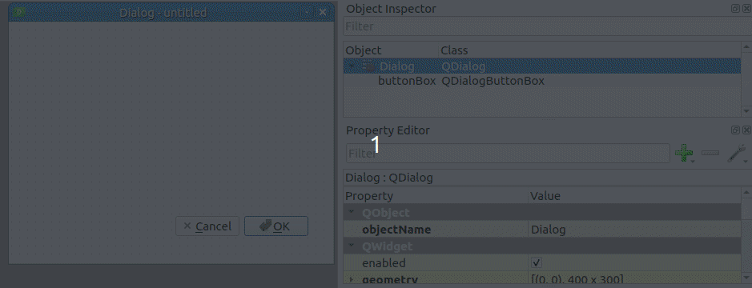
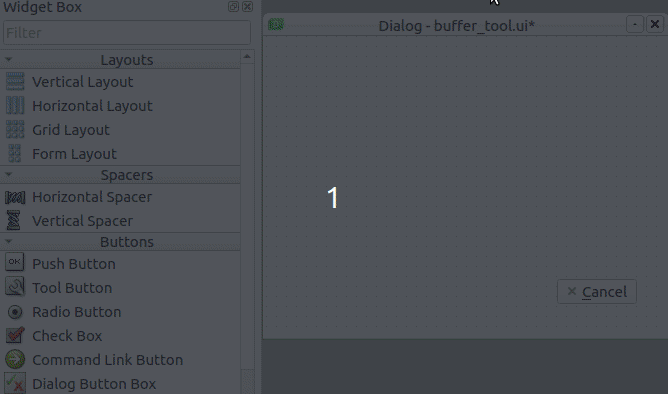
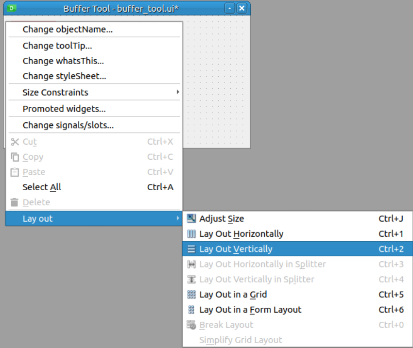

# Harjoitus 6: Buffer- työkalu

Harjoituksen tarkoituksena on luoda yksinkertainen työkalu, jolla voi valita
vektoritason ja luoda sen pohjalta uusi taso, jonka kohteille on luotu vyöhyke (buffer).
Työkalulle tehdään dialogikäyttöliittymä, jossa voidaan valita lähdetaso,
vyöhykkeen etäisyys ja vyöhykkeen segmenttien määrä.

Alla havainnollistava esimerkkivideo työkalun ominaisuuksista:




## Harjoitus 6.1: Käyttöliittymän suunnittelu

Kuten kappaleessa 4 opittiin, käyttöliittymiä voi luoda
ohjelmallisesti kirjoittamalla koodia. Etenkin monimutkaisten
käyttöliittymien suunnittelu ja toteutus tällä tavalla voi kuitenkin
olla hankalaa. Qt tarjoaa tähän ongelmaan ratkaisuksi Qt Designer -ohjelman,
jolla käyttöliittymiä voi suunnitella graafisesti. Sillä rakennetaan
käyttöliittymä, joka voidaan tallentaa **.ui**-tiedostoksi, jota
voidaan käyttää osana lisäosaa. Windowsilla Qt Designer kuuluu yleensä
QGIS-asennukseen, ja sen voi avata hakemalla sitä nimellä.

Luodaan aluksi minimaalinen käyttöliittymä ja yhdistetään se lisäosaan.
Avaa Qt Designer, jolloin pitäisi avautua seuraavanlainen valikko:



Valitse pohjaksi **Dialog with Buttons Bottom** ja paina **Create**.
Seuraavaksi vaihda oikeasta yläkulmasta "Object Inspector"-valikosta
QDialog-olion nimeksi **BufferToolDialog** ja lopuksi muokkaa
buttonBox-oliota siten, että poistetaan **OK**- painike. Valitse
buttonBox-olio ja skrollaa Object Inspectorin alapuolella olevaa
**Property Editoria** alas, kunnes näet QDialogButtonBox-luokan
ominaisuudet. Täältä avaamalla standardButtons-valikon pystyy
kontrolloimaan eri painikkeita. Kaksoisklikkaa OK-painike pois.



Tallenna käyttöliittymätiedosto aiemmin luodon lisäosakansion polkuun
`test-plugin/testplugin/resources/ui/buffer_tool.ui`.

::: hint-box
On hyvä tallentaa tiedosto juuri tähän sijaintiin, koska lisäosassa pian
käytettävä qgis_plugin_tools-paketti pystyy hakemaan kyseisen polun helposti.
:::

## Harjoitus 6.2: Käyttöliittymän kytkeminen lisäosaan

Seuraavaksi muokataan lisäosaa siten, että saadaan käyttöliittymä avattua QGISin kautta.

Määritellään ensin äsken luodulle dialogille oma luokka, joka perii
QDialog-luokan. 

1. Luo `test-plugin/testplugin/ui`-kansioon `__init.py__` ja `buffer_tool_dialog.py`
tiedostot.
2. Jätä `__init.py__` tyhjäksi.
3. Kopioi `buffer_tool_dialog.py`:hyn koodi:

::: code-box
``` python
import logging
from typing import Optional

from qgis.PyQt.QtWidgets import (
    QDialog,
    QWidget,
)

from testplugin.qgis_plugin_tools.tools.resources import load_ui, plugin_name

FORM_CLASS: QWidget = load_ui("buffer_tool.ui")
LOGGER = logging.getLogger(plugin_name())

class BufferToolDialog(QDialog, FORM_CLASS):

    def __init__(self, parent: Optional[QWidget] = None) -> None:
        """Constructor."""
        super().__init__(parent)
        self.setupUi(self)
```
:::

Avaa seuraavaksi `test-plugin/testplugin/plugin.py` tiedosto. Lisää import-komentoihin:

::: code-box
``` python
from testplugin.ui.buffer_tool_dialog import BufferToolDialog
```
:::

Tiedostossa pitäisi olla seuraava import-komento valmiina. Lisää loppuun import
`tr()` komennolle:

::: code-box
``` python
from testplugin.qgis_plugin_tools.tools.i18n import setup_translation, tr # lisää 'tr'
```
:::

::: note-box
Kyseessä on funktio, joka riippuen valitusta kielestä vaihtaa merkkijonot
vastaamaan valitun kielen käännöstä. Jos lisäosaan halutaan eri käännöksiä,
`tr`-funktiota tulee käyttää kaikille merkkijonoille, jotka näkyvät tavalla tai
toisella lisäosan käyttöliittymässä.
:::

Seuraavaksi etsi Plugin-luokan koodista `initGui()`-funktio. Muokkaa `self.add_action`-funktiokutsua:

::: code-box
``` python
        self.add_action(
            "",
            text=tr("Buffer Tool"),
            callback=self.open_buffer_tool,
            parent=iface.mainWindow(),
            add_to_toolbar=False,
        )
```
:::

::: note-box
Tässä määritetään QGISin plugin-valikkoon lisättäviä QAction-widgettejä.
Lisäosapohjassa oletuksena lisätään QGISin **Lisäosat**-ylävalikkoon
valikko lisäosalle. Tässä määritellään painikkeet, jotka lisätään lisäosan
nimeä kantavaan valikkoon.

{width="50%"}

Järjestyksessä argumenttien merkitys:

1.  Polku ikoniin. Tässä jätetty tyhjäksi.
2.  Painikkeen teksti.
3.  Callback. Funktio, joka kutsutaan kun painiketta klikataan.
4.  Parent. Lisätään QGISin pääikkunaan.
5.  Lisätäänkö työkalupainike myös työkalupalkkiin? Tässä tapauksessa ei.
:::

Määritellään lopuksi `open_buffer_tool()`-funktio, johon äsken viitattiin.
Etsi lopusta `run()`-metodi, jonka voi poistaa ja sen tilalle kirjoittaa
uuden funktion:

::: code-box
```python
    def open_buffer_tool(self) -> None:
        """Opens buffer tool dialog"""
        BufferToolDialog().exec()
```
:::

Muista ajaa komentorivillä:

::: commandline-box
```bash
python build.py deploy
```
:::

Lataa lisäosa uudelleen **Plugin Reloader**illa.
Nyt **Lisäosat**-valikosta pitäisi löytyä **Test Plugin** valikosta uusi
vaihtoehto **Buffer Tool**, jota klikatessa avautuu aikaisemmin luotu
käyttöliittymä.

## Harjoitus 6.3: Työkalun toiminta

Lisää seuraavaksi Qt Designerissa käyttöliittymän tarvittavat komponentit.
Vasemmalla näkyy listaus erilaisista Widgeteistä, jota käyttöliittymään
voi lisätä.

Voit noudattaa esimerkiksi seuraavia askelia. Vedä vasemmalta
dialogiin **Horizontal Layout**. Voit kasvattaa sen kokoa hieman.
Seuravaaksi vedä ja pudota layoutiin **Label**-widget. Seuraavaksi
raahaa layoutiin oikealle puolelle **QgsMapLayerComboBox**.



Kaksoisklikkaa Label-widgettiä ja kirjoita tekstiksi **Layer**.
Vaihda **QgsMapLayerComboBox**-olion nimeksi `layerComboBox`.
Halutessasi voit myös vaihtaa **QLabel**-olion nimen.

Toista äskeiset askeleet siten, että lopulta käyttöliittymässä on seuraavat
komponentit **Label**eineen:

{width="33%"}

* Layer: QgsMapLayerComboBox (nimi: layerComboBox)
* Buffer Distance: QgsDoubleSpinBox (nimi: distanceSpinBox)
* New layer name: QLineEdit (nimi: newLayerLineEdit)
* QPushButton (nimi: newLayerPushButton, painikkeen teksti: Create new layer)

Järjestele komponentit esimerkiksi allekkain ja lopuksi voit
määrittää koko BufferToolDialog-oliolle layoutin klikkaamalla hiiren oikealla
sen taustaa:

{width="50%"}

Kun nämä muutokset on tehty, voidaan kirjoittaa lisäosan varsinainen
toiminta askelittain. Organisoidaan lisäosan koodi siten, että lisäosan
käyttöliittymän toiminta on määritelty `test-plugin/testplugin/ui`-kansion
tiedostoissa. Varsinainen työkalun toiminta määritellään kuitenkin
`test-plugin/testplugin/core`-kansiossa.

1. Luo kyseinen kansio ja lisää sinne tyhjä `__init__.py` tiedosto.
2. Luo kansioon myös `buffertool.py`-tiedosto ja lisää seuraava koodi:

::: code-box
```python
from qgis.core import (
    QgsVectorLayer,
)

class BufferTool:

    @staticmethod
    def create_buffer_layer(src_layer: QgsVectorLayer, buffer_distance: float, new_layer_name: str, segments: int) -> Optional[QgsVectorLayer]:
        print("Creating buffer layer")
```
:::

Toistaiseksi määritetään `create_buffer_layer()` vain tulostamaan
viestin, lisätään varsinainen toiminto hieman myöhemmin. Määritetään
metodi dekoraattorilla `@staticmethod`, joka tarkoittaa että meidän
ei tarvitse luoda BufferTool-luokasta oliota.

Muokkaa nyt `test-plugin/testplugin/ui/buffer_tool_dialog.py`-tiedostoa:

Lisää import-komentoihin:

::: code-box
```python
from testplugin.core.buffertool import BufferTool
from qgis.core import QgsMapLayerProxyModel
```
:::

Lisää BufferToolDialog-luokan konstruktoriin (`__init__`-metodi):

::: code-box
```python
        self.layerComboBox.setFilters(
            QgsMapLayerProxyModel.PointLayer |
            QgsMapLayerProxyModel.PolygonLayer |
            QgsMapLayerProxyModel.LineLayer
        )

        self.newLayerPushButton.clicked.connect(self._create_buffer_layer)
```
:::

Tässä lisätään layerComboBox-oliolle suodatin, jolloin se näyttää vain
piste-, viiva- ja polygonitasot. Lisäksi yhdistetään painikkeen
`clicked`-signaali seuraavaksi määritettävään `_create_buffer_layer`-metodiin.

Lisää uusi metodi dialogiluokalle:

::: code-box
```python
    @log_if_fails
    def _create_buffer_layer(self) -> None:
        selected_layer = self.layerComboBox.currentLayer()
        buffer_distance = self.distanceSpinBox.value()
        new_layer_name = self.newLayerLineEdit.text()
        segments = 5 # tähän palataan myöhemmin

        new_layer = BufferTool.create_buffer_layer(
            selected_layer,
            buffer_distance,
            new_layer_name,
            segments
        )

        if new_layer is not None:
            QgsProject.instance().addMapLayer(new_layer)
```
:::

Tässä haetaan widgeteistä tarvittavat tiedot ja kutsutaan aikaisemmin
määritetystä **BufferTool**-luokasta metodia argumenteilla.

::: note-box
Koodin organisointi eri luokkiin **ui** ja **core** kansioihin saattaa
tuntua ainakin näin yksinkertaisessa lisäosassa tarpeettoman monimutkaiselta.
Sillä on kuitenkin etunsa, näin voidaan pitää käyttöliittymän toiminta
ja vyöhykkeen luominen erillään, joka helpottaa myös testien kirjoittamista.
:::

Kokeile tässä vaiheessa, että työkalu toimii odotetusti. Muista jälleen
päivittää muutokset:

::: commandline-box
```bash
python build.py deploy
```
:::

Lataa QGISissä lisäosa uudestaan **Plugin Reloader**illa. **Create new layer**
-painiketta klikatessa Python-konsoliin pitäisi ilmestyä viesti.

Kirjoitetaan sitten lopulta varsinainen vyöhyketyökalu. Muokkaa
`test-plugin/testplugin/core/buffertool.py`-tiedostoa:

<button onclick="toggleAnswer(this)" class="btn answer_btn">koodi</button>

::: hidden-box
::: code-box
```python
from typing import Optional

from testplugin.qgis_plugin_tools.tools.i18n import tr
from testplugin.core.exceptions import BufferToolException

from qgis.core import (
    QgsFeature,
    QgsProject,
    QgsVectorLayer,
    QgsWkbTypes,
)

from testplugin.qgis_plugin_tools.tools.custom_logging import bar_msg

class BufferTool:

    @staticmethod
    def create_buffer_layer(src_layer: QgsVectorLayer, buffer_distance: float, new_layer_name: str, segments: int) -> Optional[QgsVectorLayer]:
        if src_layer.featureCount() == 0:
            raise BufferToolException(
                tr("Buffer Tool"),
                bar_msg=bar_msg(tr("Could not create buffer layer. Source layer has no features"))
            )

        src_geom_type = QgsWkbTypes.displayString(src_layer.wkbType()).lower()
        new_geom_type = 'MultiPolygon' if 'multi' in src_geom_type else 'Polygon'

        crs = src_layer.crs().authid()

        geom_string = f"{new_geom_type}?crs={crs}"

        buffer_layer = QgsVectorLayer(geom_string, new_layer_name, "memory")

        buffer_layer.startEditing()

        src_fields = src_layer.fields()

        for field in src_fields:
            buffer_layer.addAttribute(field)

        for feature in src_layer.getFeatures():
            old_geom = feature.geometry()
            new_geom = old_geom.buffer(buffer_distance, segments)

            new_feature = QgsFeature(feature)
            new_feature.setGeometry(new_geom)

            buffer_layer.addFeature(new_feature)

        buffer_layer.updateFields()
        buffer_layer.commitChanges()

        return buffer_layer
```
:::
:::

Koodissa käytetään **BufferToolException**-poikkeusta, jota ei ole vielä
olemassa. Luo tiedosto `test-plugin/testplugin/core/exceptions.py` ja
lisää sinne seuraava koodi:

::: code-box
```python
from testplugin.qgis_plugin_tools.tools.exceptions import QgsPluginException

class BufferToolException(QgsPluginException):
    pass
```
:::

## Harjoitus 6.4: Segmentit

Kun geometrialle luodaan vyöhyke on yhtenä parametrina segmentit, joka
vaikuttaa siihen kuinka paljon vyöhykkeelle lisätään taitepisteitä.

Oppimasi perusteella tee lisäosaan vaihtoehto määrittää segmenttien määrä
käyttöliittymässä ja muokkaa koodia siten, että se huomioidaan
vyöhykkeitä luodessa.

Käyttöliittymässä voit käyttää **QgsSpinBox**-widgettiä.

## Yksikkötestit

Ohjelmoinnissa on tärkeää kirjoittaa testejä ja lisäosat eivät ole
poikkeus. Lisäosien testaamiseen voidaan käyttää **pytest**-pakettia.

Testien kirjoittaminen toimii siten, että
`test-plugin/tests`-kansioon luodaan `test_`-alkuinen
Python-tiedosto. Tiedostoon kirjoitetaan testifunktioita, joissa
käytetään lisäosassa olevia luokkia ja funktioita. Lopuksi testataan
saadaanko niistä odotetut tulokset. Testit voi ajaa komentoriviltä
`pytest` komennolla, olettaen että olet `test-plugin/testplugin`-kansiossa.

Testaus on kuitenkin integroitu myös VSCodeen, josta testit voi ajaa
myös käyttöliittymän kautta, kuten edellisessä harjoituksessa nähtiin.

Testejä varten voidaan luoda ns. fixtuureja, jotka ovat
funktioita, joka palauttaa jonkin arvon tai olion. Näiden avulla voidaan
määritellä esimerkiksi valmiiksi QGISin taso, jota voidaan sitten
hyödyntää useammassa testeissä. Fixtuurit voi määrittää testikansiossa
olevaan `conftest.py`-tiedostoon.

::: note-box
On olemassa myös ohjelmointikäytäntö (ns. test-driven development), jossa
ominaisuuksille kirjoitetaan ensin testi ja implementoidaan toiminta vasta
sen jälkeen. Tällä kurssilla asia on tehty toisin päin, ajatuksena on ollut
se että on selkeämpää päästä näkemään lisäosa ja sen käyttöliittymä toiminnassa
ensin ennen testien kirjoittamista. 
:::

## Harjoitus 6.5: Testit

Määritellään ensin fixtuurit testeille, avaa `test-plugin/tests/conftest.py`
ja lisää seuraavat fixtuurit:

<button onclick="toggleAnswer(this)" class="btn answer_btn">fixtuurit</button>

::: hidden-box
::: code-box
```python
import pytest
from qgis.core import (
    QgsFeature,
    QgsField,
    QgsFields,
    QgsGeometry,
    QgsPointXY,
    QgsVectorLayer,
)
from qgis.PyQt.QtCore import QVariant

from testplugin.ui.buffer_tool_dialog import BufferToolDialog


@pytest.fixture
def dialog():
    return BufferToolDialog(None)


@pytest.fixture
def point() -> QgsGeometry:
    return QgsGeometry.fromPointXY(QgsPointXY(0.0, 0.0))


@pytest.fixture
def line() -> QgsGeometry:
    return QgsGeometry.fromPolylineXY(
        [
            QgsPointXY(0.0, 0.0),
            QgsPointXY(1.0, 0.0),
        ]
    )


@pytest.fixture
def square() -> QgsGeometry:
    return QgsGeometry.fromPolygonXY(
        [
            [
                QgsPointXY(0.0, 0.0),
                QgsPointXY(1.0, 0.0),
                QgsPointXY(1.0, 1.0),
                QgsPointXY(0.0, 1.0),
            ]
        ]
    )


@pytest.fixture
def fields() -> QgsFields:
    fields = QgsFields()
    fields.append(QgsField("fid", QVariant.Int))
    return fields


@pytest.fixture
def point_feature(fields, point) -> QgsFeature:
    feature = QgsFeature(fields)
    feature.setGeometry(point)
    feature.setAttribute("fid", 1)
    return feature


@pytest.fixture
def square_feature(fields, square) -> QgsFeature:
    feature = QgsFeature(fields)
    feature.setGeometry(square)
    feature.setAttribute("fid", 1)
    return feature


@pytest.fixture
def line_feature(fields, line) -> QgsFeature:
    feature = QgsFeature(fields)
    feature.setGeometry(line)
    feature.setAttribute("fid", 1)
    return feature


@pytest.fixture
def point_layer(fields, point_feature) -> QgsVectorLayer:
    layer = QgsVectorLayer("Point?crs=epsg:4326&index=yes", "test_points", "memory")
    provider = layer.dataProvider()
    provider.addAttributes(fields)
    layer.updateFields()
    provider.addFeature(point_feature)
    layer.updateExtents()
    return layer


@pytest.fixture
def square_layer(fields, square_feature) -> QgsVectorLayer:
    layer = QgsVectorLayer("Polygon?crs=epsg:4326&index=yes", "test_polygon", "memory")
    provider = layer.dataProvider()
    provider.addAttributes(fields)
    layer.updateFields()
    provider.addFeature(square_feature)
    layer.updateExtents()
    return layer


@pytest.fixture
def line_layer(fields, line_feature) -> QgsVectorLayer:
    layer = QgsVectorLayer("LineString?crs=epsg:4326&index=yes", "test_line", "memory")
    provider = layer.dataProvider()
    provider.addAttributes(fields)
    layer.updateFields()
    provider.addFeature(line_feature)
    layer.updateExtents()
    return layer
```
:::
:::

### Harjoitus 6.5.1: Käyttöliittymätesti

Kirjoitetaan yksinkertainen testi lisäosan dialogille. Luo uusi
tiedosto `test-plugin/tests/test_buffer_tool_dialog.py`:

::: code-box
```python
from qgis.PyQt.QtWidgets import QDialog, QDialogButtonBox


def test_dialog_close(dialog):
    """Test we can close the dialog."""

    button = dialog.buttonBox.button(QDialogButtonBox.Close)
    button.click()

    result = dialog.result()

    assert result == QDialog.Rejected
```
:::

Lopussa esitetään väittämä `assert`. Jos lausekkeen tulos on
**False**, testi ei mene läpi.

### Harjoitus 6.5.2: BufferTool-testi

Seuraavaksi tehdään testit varsinaiselle **BufferTool**-luokalle.
Luo uusi tiedosto `test-plugin/tests/test_buffer_tool.py`:

<button onclick="toggleAnswer(this)" class="btn answer_btn">testi</button>

::: hidden-box
::: code-box
```python
from qgis.core import QgsWkbTypes

from testplugin.core.buffertool import BufferTool


def test_create_buffer_layer_polygon(square_layer):
    buffer_distance = 1.0
    new_layer_name = "Test buffer layer"
    segments = 1

    buffer_layer = BufferTool.create_buffer_layer(
        square_layer,
        buffer_distance,
        new_layer_name,
        segments,
    )

    buffered_feature = buffer_layer.getFeature(1)

    expected_geometry = "Polygon ((-1 0, -1 1, 0 2, 1 2, 2 1, 2 0, 1 -1, 0 -1, -1 0))"

    assert buffered_feature.geometry().asWkt(2) == expected_geometry
    assert buffer_layer.featureCount() == 1
    assert buffer_layer.crs().authid() == "EPSG:4326"
    assert buffer_layer.wkbType() == QgsWkbTypes.Polygon
```
:::
:::

Huomaa, että tässä testifunktiossa argumentiksi annetaan
fixtuuri square_layer. Pytest hoitaa argumenttien
lähettämisen testifunktioille automaattisesti. Testissä
määritellään parametrit funktiolle, joka luo vyöhyketason.
Geometrioita testatessa on kätevää käyttää WKT-formaattia.
Lopuksi määritellään geometria, jota odotetaan funktion
tuottavan ja testataan saatiinko oikea tulos. Lisäksi voidaan
testata, että funktio ei lisää ylimääräisiä kohteita tai
muuta tason koordinaattijärjestelmää tai geometriatyyppiä.

### Harjoitus 6.5.3: Lisää testejä

Seuraavaksi oppimasi perusteella kirjoita BufferToolille
vastaavat testit piste- sekä viivatasolle.

## Mallilisäosa

Voit tarvittaessa tarkastella mallilisäosan koodia
seuraavista linkeistä:

::: note-box
Mallilisäosan paketin nimi on `sampleplugin`. Tämä
tulee huomioida import-komennoissa.
:::

[test-plugin/testplugin/plugin.py](https://github.com/GispoCoding/pyqgis-training-sample-plugin/blob/feature-1/sampleplugin/plugin.py)                                          \
[test-plugin/testplugin/ui/buffer_tool_dialog.py](https://github.com/GispoCoding/pyqgis-training-sample-plugin/blob/feature-1/sampleplugin/ui/buffer_tool_dialog.py)            \
[test-plugin/testplugin/core/buffertool.py](https://github.com/GispoCoding/pyqgis-training-sample-plugin/blob/feature-1/sampleplugin/core/buffertool.py)                        \
[test-plugin/testplugin/core/exceptions.py](https://github.com/GispoCoding/pyqgis-training-sample-plugin/blob/feature-1/sampleplugin/core/exceptions.py)                        \
[test-plugin/tests/conftest.py](https://github.com/GispoCoding/pyqgis-training-sample-plugin/blob/feature-1-tests/tests/conftest.py)                                 \
[test-plugin/tests/test_buffer_tool_dialog.py](https://github.com/GispoCoding/pyqgis-training-sample-plugin/blob/feature-1-tests/tests/test_buffer_tool_dialog.py)   \
[test-plugin/tests/test_buffer_tool.py](https://github.com/GispoCoding/pyqgis-training-sample-plugin/blob/feature-1-tests/tests/test_buffer_tool.py)                 \
[test-plugin/testplugin/resources/ui/buffer_tool.ui](https://github.com/GispoCoding/pyqgis-training-sample-plugin/blob/feature-1/sampleplugin/resources/ui/buffer_tool.ui)      \

