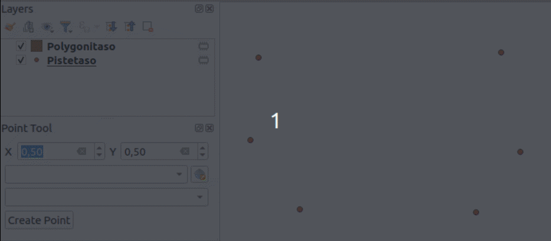

# Harjoitus 7: Pistetyökalu

Harjoituksen tarkoituksena on luoda pistetyökalu, jolla voi luoda koordinaattien
pohjalta pistekohteen. Käyttöliittymässä on alasvetolaatikko pistetasoille
(tasoja, joilla on eri geometriatyyppi ei näytetä ollenkaan).
Jos tasoa ei ole valittu, täytyy käyttäjän valita koordinaattijärjestelmä, ja
tällöin työkalu luo uuden pistetason kyseisellä koordinaattijärjestelmällä.
Tasolle lisätään pistekohde ja tallennetaan sen koordinaatit 'x' ja 'y'-kenttiin.


Jos käyttäjä ei ole valinnut tasoa _eikä_ koordinaattijärjestelmää, lisäosa
näyttää virheen. Jos käyttäjä on valinnut pistetason, koordinaattijärjestelmä-widget
inaktivoituu ja se ei vaikuta lisättävään pisteeseen mitenkään.



Edellisessä harjoituksessa käytiin yksityiskohtaisesti läpi
työkalun toteutus lisäosaan. Tämän harjoituksen on tarkoitus
olla itsenäisempi. Tälle työkalulle luodaan paneelikäyttöliittymä
(QDockWidget), joten käydään aluksi sen luominen läpi pääpiirteittäin.

## Harjoitus 7.1: Paneelin lisääminen

Avaa Qt Designer ja valitse **New Form** -dialogissa **Widgets**-valikon
alta QDockWidget. Vaihda widgetin nimeksi **PointToolDockWidget**.
Luo kuvan mukainen käyttöliittymä, jossa on käytetty seuraavia
widgettejä:


* X: QgsDoubleSpinBox (nimi: xSpinBox)
* Y: QgsDoubleSpinBox (nimi: ySpinBox)
* QgsProjectionSelectionWidget (nimi: crsWidget)
* QgsMapLayerComboBox (nimi: layerComboBox)
* QPushButton (nimi: createPushButton)

Tallenna käyttöliittymä polkuun `test-plugin/testplugin/resources/ui/point_tool.ui`.
Halutessasi voit tallentaa ikonin työkalulle polkuun `test-plugin/testplugin/resources/icons/point_tool.png`.
Voit ladata esimerkiksi tämän kuvan: 

Luo uusi tiedosto `test-plugin/testplugin/ui/point_tool_dockwidget.py` ja lisää koodi:

::: code-box
```python
import logging
from typing import Optional

from qgis.PyQt.QtCore import pyqtSignal

from testplugin.core.pointtool import PointTool

from qgis.PyQt.QtWidgets import (
    QDockWidget,
    QWidget,
)
from testplugin.qgis_plugin_tools.tools.custom_logging import bar_msg
from testplugin.qgis_plugin_tools.tools.decorations import log_if_fails
from testplugin.qgis_plugin_tools.tools.resources import load_ui, plugin_name

FORM_CLASS: QWidget = load_ui("point_tool.ui")
LOGGER = logging.getLogger(plugin_name())

class PointToolDockWidget(QDockWidget, FORM_CLASS):

    closingPlugin = pyqtSignal()

    def __init__(self, iface, parent=None):
        """Constructor."""
        super(PointToolDockWidget, self).__init__(parent)

        self.setupUi(self)

    def close_event(self, event):
        self.closingPlugin.emit()
        event.accept()
```
:::

Avaa seuraavaksi `test-plugin/testplugin/plugin.py` ja tee seuraavat
muutokset:

Muokkaa importteja:

Koodissa pitäisi olla import jo QCoreApplicationille ja QTranslatorille.
Lisää joukkoon Qt.

::: code-box
```python
from qgis.PyQt.QtCore import Qt, QCoreApplication, QTranslator
```
:::

Koodissa pitäisi olla import jo plugin_namelle.
Lisää joukkoon resources_path.

::: code-box
```python
from testplugin.qgis_plugin_tools.tools.resources import plugin_name, resources_path
```
:::

Importoi äsken luotu dockwidget-luokka.

::: code-box
```python
from testplugin.ui.point_tool_dockwidget import PointToolDockWidget
```
:::

Seuraavaksi muokkaa **Plugin**-luokan konstruktoria (`__init__`-metodi).
Lisää rivit:

::: code-box
```python
        self.dockwidget = PointToolDockWidget(iface)
        self.pluginIsActive = False

```
:::

Lisää `initGui()`-metodiin:

::: code-box
```python
        self.add_action(
            resources_path("icons/point_tool.png"),
            text=tr("Point Tool"),
            callback=self.open_point_tool,
            parent=iface.mainWindow(),
        )
```
:::

Lisää `onClosePlugin()`-metodiin:

::: code-box
```python
        self.dockwidget.closingPlugin.disconnect(self.onClosePlugin)

        self.pluginIsActive = False
```
:::

Lisää uusi metodi `open_point_tool()`:

::: code-box
```python
    def open_point_tool(self) -> None:
        """Opens point tool dock widget"""
        if not self.pluginIsActive:
            self.pluginIsActive = True

            self.dockwidget.closingPlugin.connect(self.onClosePlugin)

            iface.addDockWidget(Qt.LeftDockWidgetArea, self.dockwidget)
        self.dockwidget.show()
```
:::

Voit myös luoda jo valmiiksi uuden tiedoston **core**en
`test-plugin/testplugin/core/pointtool.py`

::: code-box
```python
from testplugin.core.exceptions import PointToolException


class PointTool:
    pass
```
:::

Ja lisätä `test-plugin/testplugin/core/exceptions.py`-tiedostoon:

::: code-box
```python
class PointToolException(QgsPluginException):
    pass
```
:::

Päivitä plugin. Työkalua klikatessa QGIS-ikkunan vasempaan reunaan
pitäisi avautua uusi paneeli.

## Harjoitus 7.2: Työkalu

Seuraavaksi lisää lisäosalle kuvatun mukainen toiminnallisuus.
Tarvittaessa kysy apua kouluttajalta tai katso apua mallilisäosasta:

[test-plugin/testplugin/plugin.py](https://github.com/GispoCoding/pyqgis-training-sample-plugin/blob/feature-2/sampleplugin/plugin.py)                                                 \
[test-plugin/testplugin/ui/point_tool_dockwidget.py](https://github.com/GispoCoding/pyqgis-training-sample-plugin/blob/feature-2/sampleplugin/ui/point_tool_dockwidget.py)             \
[test-plugin/testplugin/resources/ui/point_tool.ui](https://github.com/GispoCoding/pyqgis-training-sample-plugin/blob/feature-2/sampleplugin/resources/ui/point_tool.ui)               \
[test-plugin/testplugin/core/pointtool.py](https://github.com/GispoCoding/pyqgis-training-sample-plugin/blob/c019b85ed7c7bb66b799f633e139d790f3ab21d0/sampleplugin/core/pointtool.py)  \
[test-plugin/testplugin/core/exceptions.py](https://github.com/GispoCoding/pyqgis-training-sample-plugin/blob/feature-2/sampleplugin/core/exceptions.py)                               \

### Harjoitus 7.2.1: Lisähaaste - nimiöinti

Kun työkalu lisää uuden taso, määritä tasolle nimiönti joka
piirtää kartalle niiden x ja y koordinaatit:


## Harjoitus 7.3: Testit

Luo uusi tiedosto `test-plugin/testplugin/tests/test_point_tool.py`.
Kirjoita kaksi testiä:

* `test_create_new_point_layer()`
* `test_add_point_to_layer()`

Toisessa testissä nimien mukaisesti luodaan piste ilman valittua
pistetasoa, jolloin työkalun tulisi luoda uusi pistetaso.
Toisessa lisätään pisteitä jo olemassa olevalle pistetasolle.

[test-plugin/testplugin/tests/test_point_tool.py](https://github.com/GispoCoding/pyqgis-training-sample-plugin/blob/feature-2-tests/tests/test_point_tool.py)

