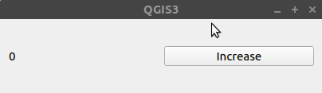
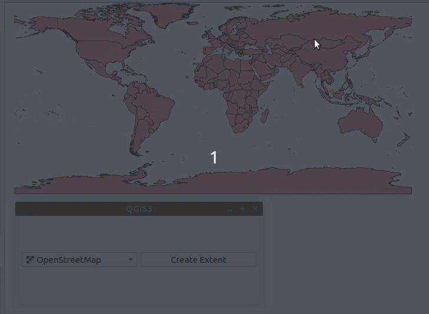

# Exercise 4: GUIs with Qt

**Contents:** The basics of PyQt.

**Goal:** To understand how to create simple graphical user interfaces with PyQt.

## About Qt GUIs

The QGIS user interface is created using Qt, which is a collection
of libraries written in C++. It is likely most well-known for its
graphical user interface (GUI) library. Qt has several bindings
for different programming languages, such as Python.

### QWidget

The Qt GUI library enables you to create GUIs. A central concept
in Qt is a "Widget", which can be thought of as one component
of the GUI. In practice QWidget is a class which is inherited
by many other classes which are specialized for some specific
purpose. For example a **QPushButton** inherits QWidget and is a
clickable button in a GUI.

Some widgets work as containers and you can add _child widgets_
to them. These can be set to different layouts, for example
organized horizontally, vertically or in a grid. This lets you
organize the GUI.

By inheriting the QWidget class you can also write your own widgets
for some specialized purpose. QGIS has used this feature of Qt
and it has its own widgets that can also be used in plugins.
For example there are specific widgets for selecting layers or
CRSs.

Here is a minimal example of creating a GUI with PyQt. You can run
the example in the script editor.

<button onclick="toggleAnswer(this)" class="btn answer_btn">example</button>

::: hidden-box
::: code-box
``` python
# create the widget and resize
widget = QWidget()
widget.resize(420, 320)

# create a vertical ayout and add it to the widget
layout = QVBoxLayout()
widget.setLayout(layout)

# create a button and add it to the layout
button = QPushButton("Close")
layout.addWidget(button)

# show the widget.
# if the widget is not a child of some other widget
# it will be show in a new window
widget.show()
```
:::
:::

In this example we create a **Close** button. However when clicked it doesn't do anything.

### Signals and slots

Another central idea in the Qt library are **signals** and **slots**. These enable
you to define the interactivity of the GUI, so that when clicking a QPushButton
a pre-defined action takes place.

When you interact with widgets, they _emit_ different **signals** which can be
connected to a **slot** in the same or any other widget. The base Qt Widgets
already have many defined signals and slots, which you can utilize by creating
**connections** between the signals and slots. You can also define your own
signals and slots.

In PyQt a signal is an object of type **Signal** whereas a slot is a function
that can be connected to a signal. You can then **emit** the signal wherever
you want.

Here's an example of creating a connection, using the previous example as a base:

<button onclick="toggleAnswer(this)" class="btn answer_btn">example</button>

::: hidden-box
::: code-box
``` python
widget = QWidget()
widget.resize(420, 320)

layout = QVBoxLayout()
widget.setLayout(layout)

button = QPushButton("Close")
layout.addWidget(button)

# Connect the "clicked" signal of QPushButtons
# to the "close" slot of QWidget
button.clicked.connect(widget.close)

widget.show()
```
:::
:::

Now the button should actually close the window.

## Exercise 4.1: Counter-widget

Write a script that defines a new widget called `Counter`
which inherits QWidget. It has two child widgets: QLabel
and QPushButton. A QLabel is a text component. The Counter
widget has value that you can increment by clicking the
button. This value starts at 0 and is shown in the QLabel.



You can use this as a base:

::: code-box
```python
class Counter(QWidget):
    def __init__(self, *args):
        super(Counter, self).__init__(*args)

        # Create the widgets

    @pyqtSlot()
    def on_increase_clicked(self):
        pass

    def refresh_label(self):
        pass

counter = Counter()
counter.show()
```
:::

<button onclick="toggleAnswer(this)" class="btn answer_btn">hint</button>

::: hidden-box
::: code-box
```python
class Counter(QWidget):
    def __init__(self, *args):
        super(Counter, self).__init__(*args)

        # define a variable where the count is tracked
        self.count = 0

        # create a horizontal layout for the widget
        self.layout = QHBoxLayout()

        self.label = QLabel()
        self.button = QPushButton("Increase")

        # how do you add the widgets to the layout?
        <functino>
        <function>

        # how do you set the layout to this
        # widget?
        <function>

        # create a connection so that
        # the on_increase_clicked slot
        # is run when the button is
        # pushed
        <function>

        # refresh the label
        <function>

    @pyqtSlot()
    def on_increase_clicked(self):
        # increase the count and
        # refresh the label
        <function>
        <function>

    def refresh_label(self):
        # how do you set a new text for
        # the QLabel?
        <function>


counter = Counter()
counter.show()
```
:::
:::


<button onclick="toggleAnswer(this)" class="btn answer_btn">answer</button>

::: hidden-box
::: code-box
```python
class Counter(QWidget):
    def __init__(self, *args):
        super(Counter, self).__init__(*args)

        self.count = 0

        self.layout = QHBoxLayout()

        self.label = QLabel()
        self.button = QPushButton("Increase")

        self.layout.addWidget(self.label)
        self.layout.addWidget(self.button)

        self.setLayout(self.layout)

        self.button.clicked.connect(self.on_increase_clicked)

        self.refresh_label()

    @pyqtSlot()
    def on_increase_clicked(self):
        self.count +=1
        self.refresh_label()

    def refresh_label(self):
        self.label.setText(str(self.count))

counter = Counter()
counter.show()
```
:::
:::

## Exercise 4.2: QGIS custom widgets

Create a GUI where the user can select a layer from the
QGIS project. By clicking a button a new polygon layer
is created which as one feature. This feature gets the
geometry which is a rectangular polygon which is calculated
from the extent of the selected layer.

Also save a fid identifier and as another attribute the
name of the layer from which the extent was calculated.
Create the new polygon layer with the CRS EPSG:4326 and,
if needed, transform the extent calculated from the source
layer to the same EPSG:4326 CRS. Use the **QgsMapLayerComboBox**
widget for selecting the layers.

You can calculate the extent from the layer object with the
[`extent()` method](https://qgis.org/pyqgis/latest/core/QgsMapLayer.html#qgis.core.QgsMapLayer.extent).
However it does not return a QgsGeometry object directly.
Find out what it returns and how you can create a geometry
object from it.



You can use this as a base:

::: code-box
```python
class LayerExtentWidget(QWidget):
    def __init__(self, *args):
        super(LayerExtentWidget, self).__init__(*args)

        # ...

    @pyqtSlot()
    def on_button_clicked(self):
        pass

    def create_layer(self, layer: QgsMapLayer):
        new_layer = QgsVectorLayer("Polygon?crs=EPSG:4326", f"extent: {layer.name()}", "memory")

        new_layer.startEditing()

        new_layer.addAttribute(QgsField("fid", QVariant.Int))
        new_layer.addAttribute(QgsField("layer", QVariant.String))

        # ...

        new_layer.commitChanges()

        QgsProject.instance().addMapLayer(new_layer)
```
:::


<button onclick="toggleAnswer(this)" class="btn answer_btn">answer</button>

::: hidden-box
::: code-box
```python
class LayerExtentWidget(QWidget):
    def __init__(self, *args):
        super(LayerExtentWidget, self).__init__(*args)

        layout = QHBoxLayout()

        self.layer_combobox = QgsMapLayerComboBox()
        self.button = QPushButton("Create Extent")

        layout.addWidget(self.layer_combobox)
        layout.addWidget(self.button)

        self.setLayout(layout)

        self.button.clicked.connect(self.on_button_clicked)

        self.resize(420, 150)

    @pyqtSlot()
    def on_button_clicked(self):
        layer = self.layer_combobox.currentLayer()

        self.create_layer(layer)

    def create_layer(self, layer: QgsMapLayer):
        new_layer = QgsVectorLayer("Polygon?crs=EPSG:4326", f"extent: {layer.name()}", "memory")

        new_layer.startEditing()

        new_layer.addAttribute(QgsField("fid", QVariant.Int))
        new_layer.addAttribute(QgsField("layer", QVariant.String))

        new_feature = QgsFeature(new_layer.fields())
        new_feature.setAttributes([1, layer.name()])

        new_geom = QgsGeometry.fromRect(layer.extent())
        source_crs = layer.crs()
        target_crs = QgsCoordinateReferenceSystem(4326)

        if source_crs != target_crs:
            transform = QgsCoordinateTransform(source_crs, target_crs, QgsProject.instance())
            new_geom.transform(transform)

        new_feature.setGeometry(new_geom)

        new_layer.addFeature(new_feature)

        new_layer.commitChanges()

        QgsProject.instance().addMapLayer(new_layer)

extent_widget = LayerExtentWidget()
extent_widget.show()
```
:::
:::
