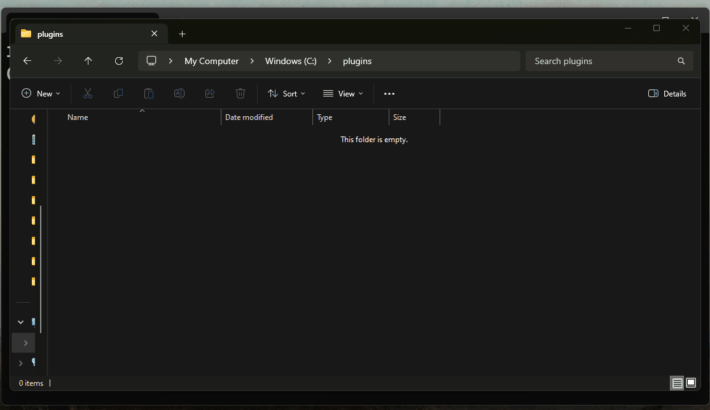
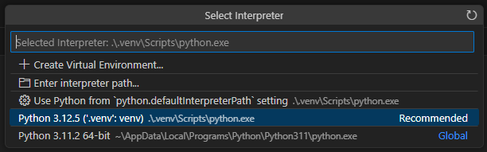
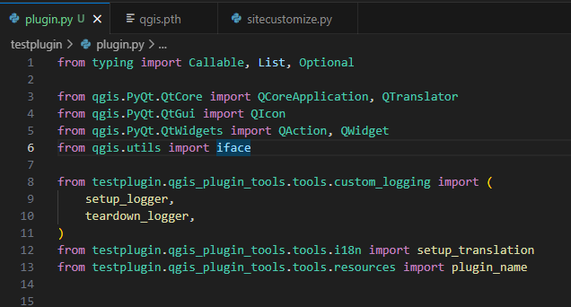

# Exercise 5: Uuden lisäosan luominen

**Contents:** Lisäosien luominen käyttäen Cookiecutteria

**Goal:**  Kurssilainen osaa luoda omia lisäosiaan

Lisäosapohja luodaan komentorivityökaluilla. Käytetään komentorivinä
QGIS-asennukseen kuuluvaa OSGeo4W Shelliä. Avaa se esimerkiksi hakupalkista
kirjoittamalla OSGeo4W.


## Gitin konfigurointi

Ennen lisäosan luomista konfiguroidaan [git](https://git-scm.com/)-versionhallintatyökalu toimimaan oikein.

1. Ensin OSGeo4W shellissä polku git.exe:en täytyy lisätä ensin Path-ympäristömuuttujaan:

::: commandline-box
```bash
set Path=%Path%;"C:\Program Files\Git\cmd"
```
:::

2. Aseta gitille käyttäjänimesi ja sähköpostiosoitteesi

::: commandline-box
```bash
git config --global user.name käyttäjänimesi-gitissä
```
:::

::: commandline-box
```bash
git config --global user.email sähköpostiosoitteesi
```
:::

3. Aseta gitin submoduulien (kuten qgis_plugin_tools) päivittäminen tapahtumaan `git pull`:n yhteydessä

::: commandline-box
```bash
git config --global submodule.recurse true
```
:::

4. Seuraavaksi pakota git asettamaan tiedostojen rivinvaihdot Unix-yhteensopiviksi

::: commandline-box
```bash
git config --global core.autocrlf input
```
:::

## Lisäosan luominen

Luo ensin sopivaan sijaintiin kansio lisäosalle ja navigoi kansioon
OSGeo4W Shellissä:



1. Luo oma virtuaaliympäristö cookiecutter-pluginille

::: commandline-box
```bash
%PYTHONHOME%/python.exe -m venv cookiecutter-venv
```
:::

::: note-box
%PYTHONHOME%-ympäristömuuttuja OSGeo4W-shellissä viittaa QGIS-asennukseen
kuuluvaan Python-tulkkiin.
:::

2. Aktivoi luomasi virtuaaliympäristö *cookiecutter-venv*

::: commandline-box
```bash
.\cookiecutter-venv\Scripts\activate
```
:::

3. Asenna virtuaaliympäristöön kirjastot `cookiecutter` ja `pip-tools`

::: commandline-box
```bash
python -m pip install -U pip
pip install cookiecutter pip-tools
```
:::

4. Luo uusi template:

::: commandline-box
```bash
cookiecutter https://github.com/GispoCoding/cookiecutter-qgis-plugin.git
```
:::

* Voit käyttää oletusasetuksia **paitsi kohdissa**:
	* `Select a name for your plugin`: Test Plugin
	* `Include processing algorithm in your plugin?`: y

5. Deaktivoi cookiecutteria varten luotu virtuaaliympäristö ja siirry cookiecutterin luomaan lisäosakansioon:

::: commandline-box
```bash
deactivate
cd test-plugin
```
:::

6. Aja kansiossa oleva valmis Python-skripti, joka luo lisäosakehitykselle sopivan
virtuaalisen ympäristön:

::: commandline-box
```bash
python create_qgis_venv.py
```
:::

::: hint-box
Jos tietokoneellasi on monta QGIS- asennusta, skripti saattaa kysyä mitä niistä halutaan käyttää kehityksessä.
Valitse niistä parhaiten sopiva, mielellään uusin LTR- versio.
:::

7. Aktivoi uusi virtuaaliympäristö:

::: commandline-box
```bash
.venv\Scripts\activate
```
:::

8. Asenna virtuaaliympäristöön pip:

::: commandline-box
```bash
python -m pip install -U pip
```
:::

9. Asenna pip-tools:

::: commandline-box
```bash
pip install pip-tools
```
:::

10. Käännä pip-compile-työkalulla tekstitiedostoon listaus
tarvituista Python-paketeista:

::: commandline-box
```bash
pip-compile requirements-dev.in
```
:::

11. Äskeisessä vaiheessa työkalu kirjoitti `requirements-dev.txt`-tiedostoon
listan asennettavista Python-paketeista. Asenna ne seuraavaksi:

::: commandline-box
```bash
pip install -r requirements-dev.txt
```
:::

12. Komennon jälkeen on hyvä tarkistaa, että asennukset ovat onnistuneet komennolla
`pip freeze`. Pakettien joukossa pitäisi olla mm. `pytest` ja `pytest-qgis`.

13. Tässä vaiheessa päästään viimein avaamaan Visual Studio Code. Avaa kansiosta
`test-plugin.code-workspace`-tiedosto. Sen pitäisi avautua automaattisesti VS Codessa.

14. Ensin asetetaan VS Code käyttämään äsken luotua `.venv`-ympäristöä. Valitaan
**Help**-valikosta **Show All Commands** ja kirjoitetaan hakuun `Python: Select Interpreter`.



15. Kun poistut VS Codesta, avaat sen uudelleen ja avaat `test-plugin`-kansion,
kehitysympäristön pitäisi olla täysin kunnossa. Voit todeta tämän avaamalla
`testplugin`-kansion alta tiedoston `plugin.py`. Tiedoston yläosan 
importeissa ei pitäisi näkyä virheistä kertovia korostuksia.



16. Projekti sisältää myös yhden testin, jonka avulla on hyvä tutustua VS Coden
Testing-laajennukseen. Vasemman palkin symbolista avautuu paneeli, jonka kahden
kolmion symbolilla pääsee ajamaan kaikki määritellyt testit.


Kehitysympäristö on nyt konfiguroitu ja valmiina käyttöä varten. Hienoa!

## Ensimmäinen commit
Nyt on aika tehdä ensimmäinen `commit`, eli `git commit`. Avaa uusi komentorivi
VS Coden sisällä klikkaamalla *Terminal->New Terminal*. 

> Tarkastele komentorivin sisältöä. Se avautuu oletuksena PowerShellinä, mutta
myös perinteinen komentorivi kelpaa hyvin. VS Code yrittää automaattisesti
aktivoida virtuaaliympäristön. PowerShellillä tämä ei välttämättä onnistu ja
voit saada virheilmoituksen: `Activate.ps1 cannot be loaded because running
scripts is disabled on this system`, aja seuraava koodinpätkä ja avaa tämän
jälkeen uusi terminaali-ikkuna: `Set-ExecutionPolicy RemoteSigned -Scope CurrentUser`.

Sitten tehdään ensimmäinen commit

1. Lisää kaikki tiedostot lisättäväksi committiin kirjoittamalla:

::: commandline-box
```bash
git add -A
```
:::

1. Tarkastele `git status`-komennolla mitä kaikkea on nyt lisätty lisättäväksi.
1. Kokeile nyt tehdä ensimmäinen commit komennolla: 

::: commandline-box
```bash
git commit -m "Initial commit"
```
:::

Onneksi olkoon, olet nyt onnistuneesti luonut ensimmäisen commitin lisäosaan!

## Lisäosan käyttöönotto
Ensimmäistä lisäosaa on hyvä kokeilla. Avataan siis QGIS ja testataan lisäosaa.

1. Avaa QGIS ja luo sille uusi profiili `training`
1. Muokkaa VS Codella `testplugin/build.py`-tiedostoa ja muuta: `profile = "training"`
1. Navigoi komentorivillä kansioon `testplugin` ja lataa lisäosa käyttöön käyttäen `build.py deploy` -komentoa.

::: commandline-box
```bash
cd testplugin
python build.py deploy
```
:::

1. Käynnistä nyt QGIS uudelleen ja varmistu, että se on profiilissa **training**
1. Avaa Lisäosien hallintatyökalu ja valitse paneelista *Asennettu* **Test Plugin**
    *  Asenna samalla myös paneelista *Kaikki* lisäosa **Plugin Reloader**. Tarvitsemme sitä aina, kun haluamme ottaa uudet muutokset käyttöön käynnistämättä QGISiä uudelleen.
1. Testaa nyt lisäosan toiminnallisuutta. Avaa ensin QGISin Python-konsoli ja käynnistä sitten lisäosa *Lisäosat -> TestPlugin -> Test Plugin*. Huomaat, että konsoliin ilmestyy tekstiä...


## Lisäosan rakenne
Tutustutaan seuraavaksi lisäosan rakenteeseen. Alla on hieman yksinkertaistettu kaavio tärkeimmistä tiedostoista.

```
📦test-plugin
 ┣ 📂.git
 ┣ 📂testplugin
 | ┣ 📂qgis_plugin_tools
 | ┣ 📂resources
 ┃ ┣ 📜metadata.txt
 ┃ ┣ 📜plugin.py
 ┃ ┗ 📜__init__.py
 ┣ 📂tests
 ┃ ┣ 📜test_plugin.py
 ┣ 📜.gitignore
 ┣ 📜LICENSE
 ┣ 📜README.md
 ┣ 📜requirements-dev.txt
 ┗ 📜pyproject.toml
```


### Tiedosto: plugin.py
Tutustu ensin tiedostoon `testplugin/plugin.py` ja sen sisällä olevaan luokkaan
`Plugin`. Siinä pitäisi olla ainakin seuraavat metodit:

>* `__init__`: luokan konstruktori, sitä kutsutaan `testplugin/__init__.py`-tiedostosta.
>* `initGui`: lisää lisäosan QGISin GUIhin, eli graafiseen käyttöliittymään
>* `unload`: poistaa lisäosan QGISin GUIsta
>* `run`: koodi, jota suoritetaan, kun käyttäjä käynnistää lisäosan


Metodin `run` nimeä voi muuttaa, mutta muiden nimet pitää olla täsmälleen samat,
sillä QGIS kutsuu niitä sisäisesti.

### Tiedosto: \_\_init\_\_.py
Tämä tiedosto sisältää tärkeän metodin `classFactory`. QGIS alustaa lisäosan kutsumalla tätä metodia. Se taas puolestaan palauttaa QGISille koko lisäosan yllä mainitun `Plugin`-luokan. 

::: code-box
```python
def classFactory(iface: QgisInterface):
    from testplugin.plugin import Plugin

    return Plugin()
```
:::

