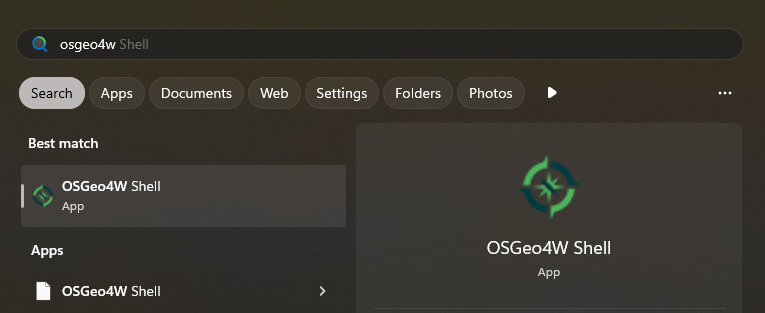

# Exercise 5: Creating a plugin

**Contents:** Creating a plugin by using Cookiecutter

**Goal:** To know how to use Cookiecutter to create a base for your own plugin.

The base is created using commandline tools. Let's use the OSGeo4W Shell
as a commandline. This should be included in the QGIS installation.
You can open it from the search bar by writing OSGeo4W.



## Configuring Git

Before creating the plugin we need to configure
Git to work correctly.

1. Add the path to the Git executable to the PATH environment variable:

::: commandline-box
```bash
set Path=%Path%;"C:\Program Files\Git\cmd"
```
:::

2. Configure your username and email

::: commandline-box
```bash
git config --global user.name your_user_name
```
:::

::: commandline-box
```bash
git config --global user.email your_email
```
:::

3. Make Git also update any submodule when doing a `git pull`. This affects qgis_plugin_tools which you need.

::: commandline-box
```bash
git config --global submodule.recurse true
```
:::

4. Force git to use Unix-compatible end of line symbols

::: commandline-box
```bash
git config --global core.autocrlf input
```
:::

## Creating the plugin

First create a folder for the plugin in a suitable location and
navigate to this folder in OSGeo4W Shell:


1. Create a virtual environment for the plugin

::: commandline-box
```bash
%PYTHONHOME%/python.exe -m venv cookiecutter-venv
```
:::

::: hint-box
In the OSGeo4W shell the %PYTHONHOME% environment variable refers to the Python interpreter
included in the QGIS installation.
:::

2. Activate the virtual environment

::: commandline-box
```bash
.\cookiecutter-venv\Scripts\activate
```
:::

3. Install the `cookiecutter` and `pip-tools` Python packages to the new environment

::: commandline-box
```bash
python -m pip install -U pip
pip install cookiecutter pip-tools
```
:::

4. Create a new template:

::: commandline-box
```bash
cookiecutter https://github.com/GispoCoding/cookiecutter-qgis-plugin.git
```
:::

* You can use the default settings **except for**:
	* `Select a name for your plugin`: Test Plugin
	* `Include processing algorithm in your plugin?`: y

5. Deactivate the cookiecutter virtual environment and navigate the plugin folder:

::: commandline-box
```bash
deactivate
cd test-plugin
```
:::

6. The folder already contains a Python script which creates a new
virtual environment suitable for plugin development. Run the script.

::: commandline-box
```bash
python create_qgis_venv.py
```
:::

::: hint-box
If your computer has many QGIS installations the script might ask which one of
them to use. Preferably choose the latest LTR version.
:::

7. Activate the new virtual environment

::: commandline-box
```bash
.venv\Scripts\activate
```
:::

8. Install pip:

::: commandline-box
```bash
python -m pip install -U pip
```
:::

9. Install pip-tools:

::: commandline-box
```bash
pip install pip-tools
```
:::

10. Use the pip-compile tool to compile a list
of the needed Python packages to a text file:

::: commandline-box
```bash
pip-compile requirements-dev.in
```
:::

11. The list was created to the `requirements-dev.txt` file.
Install the packages:

::: commandline-box
```bash
pip install -r requirements-dev.txt
```
:::

12. After running the command it's good to confirm that the installation was
successful. You can use the `pip freeze` command and you should see
for example `pytest` and `pytest-qgis` in the listed packages.

13. After this you can open Visual Studio Code. Open the `test-plugin.code-workspace`
file which should open in VS Code by default.

14. Make VS Code use the correct `.venv` which was just created. Select
from the **Help** menu **Show All Commands** and type to search
`Python: Select Interpreter`.


15. When you close and reopen VS Code the development environment should be
fully set up. You can confirm this by opening the `plugin.py` file inside
the `testplugin` folder. The import commands on the top of the file
should not have any error messages.


16. The project includes one test by default which you can check by opening
the panel from the left and running the tests.


## Adding the plugin to QGIS

As a next step add the plugin to QGIS.

1. Open QGIS and create a new profile called `training`
2. Edit the `testplugin/build.py` file and change `profile = "training"`
3. Navigate into the `testplugin` folder and deploy the plugin by using the `build.py` script.

::: commandline-box
```bash
cd testplugin
python build.py deploy
```
:::

1. Reopen QGIS and check that you're using the **training** profile.
2. Open the Plugin menu and from the left click _Installed_ **Test Plugin**
    * From the _All_ tab search for **Plugin Reloader** and install it. You need it later on to reload the plugin as you're developing it.
3. Test that the plugin works correctly. Open the QGIS Python Console and then
run the plugin from the top menu **Plugins** -> **TestPlugin** -> **Test Plugin**.
Some text should be printed out to the console.

## Structure of the plugin

Here's a simplified overview of the plugin folder structure.

```
📦test-plugin
 ┣ 📂.git
 ┣ 📂testplugin
 ┃ ┣ 📂qgis_plugin_tools
 ┃ ┣ 📂resources
 ┃ ┣ 📜metadata.txt
 ┃ ┣ 📜plugin.py
 ┃ ┗ 📜__init__.py
 ┣ 📂tests
 ┃ ┣ 📜test_plugin.py
 ┣ 📜.gitignore
 ┣ 📜LICENSE
 ┣ 📜README.md
 ┣ 📜requirements-dev.txt
 ┗ 📜pyproject.toml
```


### File: plugin.py

Inspect the `testplugin/plugin.py` file. It should contain a class definition
of `Plugin` and it should have at least the following methods:

>* `__init__`: constructor of the class which is called from the `testplugin/__init__.py` file
>* `initGui`: adds the plugin to the QGIS GUI
>* `unload`: removes the plugin from the QGIS GUI
>* `run`: code that runs when the plugin is activated

The `run` method can be renamed, but the other method names need to be the same,
since QGIS calls them internally.

### File: \_\_init\_\_.py

This file includes an important method called `classFactor`. QGIS
initializes the plugin by calling this method. It returns `Plugin`
class which was mentioned above to QGIS:

::: code-box
```python
def classFactory(iface: QgisInterface):
    from testplugin.plugin import Plugin

    return Plugin()
```
:::

