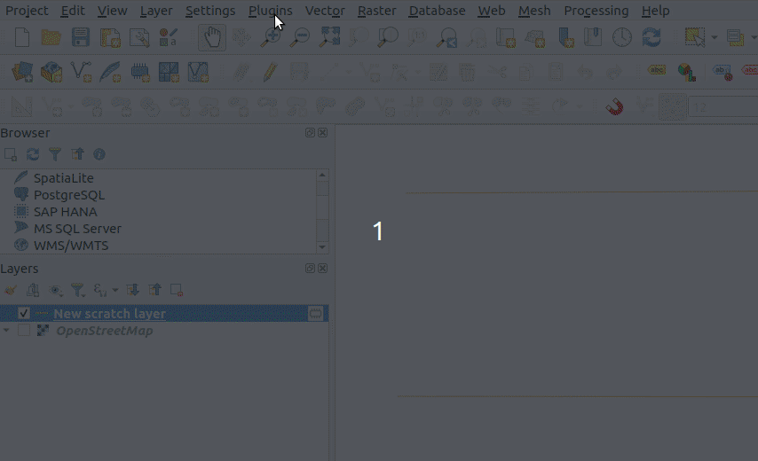
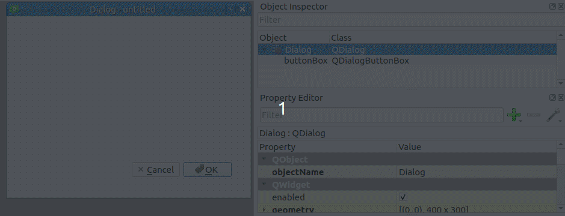
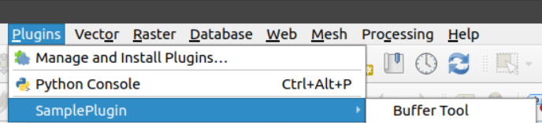
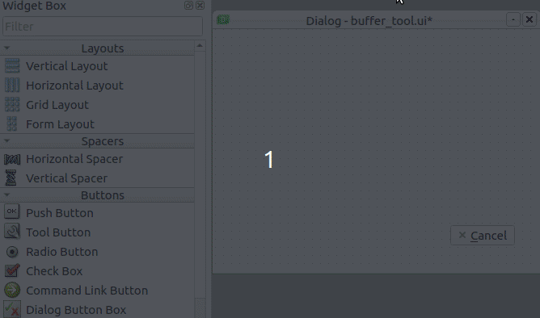
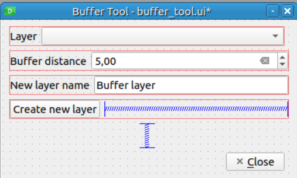
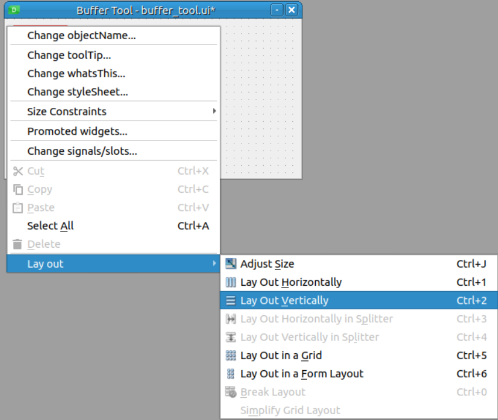

# Exercise 6: Buffer tool

The goal of this exercise is to create a simple tool which can
be used to select a vector layer and use it to create a new
layer in which a buffer is created from the source layer to
each new feature. A dialog interface is created for the
tool where you can choose a source layer, the distance and
segments of the buffer:

Here is a video showing the functionality of the tool:




## Exercise 6.1: Creating the GUI

As learned previously you can create GUIs programmatically
using PyQt. However especially creating more complex GUIs
by writing code can be difficult. Qt offers a solution in the
form of a separate program called Qt Designer where you can
design GUIs graphically. You can use it to build your GUI
and save it as a **.ui** file which can be used as a part of
the plugin. On Windows Qt Designer is typically included
as a part of the QGIS installation and can be opened by
searching its name.

First create a minimal GUI and link it up with
the plugin you created in the previous exercise.
Open Qt Designer where you should be greeted with the following
dialog:


Select **Dialog with Buttons Bottom** and press **Create**.
Next from the top right "Object Inspector" menu change the
name of the QDialog object to **BufferToolDialog** and edit
the buttonBox object so that the **OK** button is removed.
Select the buttonBox object and scroll down in the **Property
Editor** which is located below from the Object Inspector.
At the bottom you should see the attributes of the
QDialogButtonBox class. Here you can open the standardButtons
menu to edit the different buttons. Double click the OK button
to exclude it from the GUI.



Save this GUI into the plugin folder that was previously created
with this path: `test-plugin/testplugin/resources/ui/buffer_tool.ui`.

::: hint-box
You should save the file in this exact location, because the
`qgis_plugin_tools` package will be used later on and can locate
this path easily.
:::

## Exercise 6.2: Connecting the GUI to the plugin

Next edit the plugin so that you can open the GUI through QGIS.

Define a new class for the dialog you just created. It should
inherit QDialog

1. Create two new files in the `test-plugin/testplugin/ui` directory: `__init__.py` and `buffer_tool_dialog.py`
2. Leave `__init__.py` as empty.
3. Copy the following code to `buffer_tool_dialog.py`:

::: code-box
``` python
import logging
from typing import Optional

from qgis.PyQt.QtWidgets import (
    QDialog,
    QWidget,
)

from testplugin.qgis_plugin_tools.tools.resources import load_ui, plugin_name

FORM_CLASS: QWidget = load_ui("buffer_tool.ui")
LOGGER = logging.getLogger(plugin_name())

class BufferToolDialog(QDialog, FORM_CLASS):

    def __init__(self, parent: Optional[QWidget] = None) -> None:
        """Constructor."""
        super().__init__(parent)
        self.setupUi(self)
```
:::

Next open the `test-plugin/testplugin/plugin.py` file. Add to the import commands:

::: code-box
``` python
from testplugin.ui.buffer_tool_dialog import BufferToolDialog
```
:::

The next import command should already exist, but add `tr` to the end of it.

::: code-box
``` python
from testplugin.qgis_plugin_tools.tools.i18n import setup_translation, tr # add 'tr'
```
:::

::: hint-box
`tr()` is a function that translates string depending on the language that is
selected. If you want to translate your plugin for different localities you
should use the function for every string that is visible to the user one way
or another.
:::

Next find the `initGui()` function inside the Plugin class. Edit the `self.add_cation` function call:

::: code-box
``` python
        self.add_action(
            "",
            text=tr("Buffer Tool"),
            callback=self.open_buffer_tool,
            parent=iface.mainWindow(),
            add_to_toolbar=False,
        )
```
:::

::: hint-box
Here you are defining QAction widgets which will me added to the QGIS
plugin menu. In the plugin template a menu is added to the QGIS
**Plugins** top menu. Here you define the buttons which are
added to a secondary menu which is named after the plugin.

{width="50%"}

In order the meaning of the arguments:

1. Path to a icon file. If empty the button will have no icon.
2. The text of the button.
3. Callback, i.e. the function that will be called when the button is clicked.
4. Parent. Add to the QGIS main window
5. Should a button be added also to a toolbar? In this case no.
:::

Then you can define the `open_buffer_tool()` function which was
referred to previously. Find the `run()` method at the end of
the Plugin class definition and delete it and copy this new
function over:

::: code-box
```python
    def open_buffer_tool(self) -> None:
        """Opens buffer tool dialog"""
        BufferToolDialog().exec()
```
:::

Remember to run this on the commandline:

::: commandline-box
```bash
python build.py deploy
```
:::

Reload the plugin with **Plugin Reloader**. Now inside the
**Plugins** > **Test Plugin** menu there should be a new
button **Buffer Tool** and by clicking it the GUI you saved
earlier should open.

## Exercise 6.3: The functionality of the tool

Next add the needed widgets to the GUI. On the left you have
a list of widgets that can be added used.

You can follow the following step:

1. Drag a **Horizontal Layout** to the dialog. You can make it a bit larger.
2. Drag a **Label** widget **into the layout**.
3. Drag a **QgsMapLayerComboBox** also into the layout, to the right of the label.



4. Double click the label widget and write **Layer** as its text.
5. Change the name of the QgsMapLayerComboBox object to `layerComboBox`.
6. If you prefer you can also rename the QLabel object.

Repeat the previous steps so that finally you have the following components
alongside a label for them as needed:

{width="33%"}

* Layer: QgsMapLayerComboBox (name: layerComboBox)
* Buffer Distance: QgsDoubleSpinBox (name: distanceSpinBox)
* New layer name: QLineEdit (name: newLayerLineEdit)
* QPushButton (name: newLayerPushButton, button text: Create new layer)

Organize the widgets vertically and finally you can create a layout for the
BufferToolDialog itself by right-clicking on the background:

{width="50%"}

Once these changes have been made you can write the actual functionality
of the tool step by step. Organize the code of the plugin so that the
functionality of the GUI is defined in Python files under the
`test-plugin/testplugin/ui` folder. The actual buffer functionality
is defined in `test-plugin/testplugin/core`.

1. Create the core folder and add an emptry `__init__.py` file.
2. To the same folder add a new file `buffertool.py` and add the following code:

::: code-box
```python
from qgis.core import (
    QgsVectorLayer,
)

class BufferTool:

    @staticmethod
    def create_buffer_layer(src_layer: QgsVectorLayer, buffer_distance: float, new_layer_name: str, segments: int) -> Optional[QgsVectorLayer]:
        print("Creating buffer layer")
```
:::

So far the `create_buffer_layer()` only prints a message, the actual
functionality will be added later. A Python _decorator_ @staticmethod
is used, which means the function can be called without creating an
object of the BufferTool class.

Edit the `test-plugin/testplugin/ui/buffer_tool_dialog.py` file:

Add to the import commands:

::: code-box
```python
from testplugin.core.buffertool import BufferTool
from qgis.core import QgsMapLayerProxyModel
```
:::

Add to the class constructor (`__init__`() method):

::: code-box
```python
        self.layerComboBox.setFilters(
            QgsMapLayerProxyModel.PointLayer |
            QgsMapLayerProxyModel.PolygonLayer |
            QgsMapLayerProxyModel.LineLayer
        )

        self.newLayerPushButton.clicked.connect(self._create_buffer_layer)
```
:::

Here a filter is applied to the layerComboBox object which means only
point, line and polygon layers are shown. A connection is create from the
push buttons `clicked` signal to the `_create_buffer_layer` method that
will be defined next.

Add a new method:

::: code-box
```python
    @log_if_fails
    def _create_buffer_layer(self) -> None:
        selected_layer = self.layerComboBox.currentLayer()
        buffer_distance = self.distanceSpinBox.value()
        new_layer_name = self.newLayerLineEdit.text()
        segments = 5 # this'll be returned to later

        new_layer = BufferTool.create_buffer_layer(
            selected_layer,
            buffer_distance,
            new_layer_name,
            segments
        )

        if new_layer is not None:
            QgsProject.instance().addMapLayer(new_layer)
```
:::

Here the required information is fetched from the widgets and the
`create_buffer_layer` method is called from the **BufferTool**
class.

::: hint-box
Organizing the coude to different classes into the separate **ui** and
**core** folders may seem unnecessarily complex for a fairly simple
plugin. However keeping the GUI and core functionalities separate has
its own benefits, for example later when writing tests.
:::

Confirm that the tool works as expected. Remember to deploy the changes:

::: commandline-box
```bash
python build.py deploy
```
:::

Reload the plugin inside QGIS using **Plugin Reloader**. Now when
you open the dialog and press the **Create new layer** button a
message should appear inside the Python console.

Now you can create the actual functionality for the buffer tool.
Edit the `test-plugin/testplugin/core/buffertool.py` file:

<button onclick="toggleAnswer(this)" class="btn answer_btn">code</button>

::: hidden-box
::: code-box
```python
from typing import Optional

from testplugin.qgis_plugin_tools.tools.i18n import tr
from testplugin.core.exceptions import BufferToolException

from qgis.core import (
    QgsFeature,
    QgsProject,
    QgsVectorLayer,
    QgsWkbTypes,
)

from testplugin.qgis_plugin_tools.tools.custom_logging import bar_msg

class BufferTool:

    @staticmethod
    def create_buffer_layer(src_layer: QgsVectorLayer, buffer_distance: float, new_layer_name: str, segments: int) -> Optional[QgsVectorLayer]:
        if src_layer.featureCount() == 0:
            raise BufferToolException(
                tr("Buffer Tool"),
                bar_msg=bar_msg(tr("Could not create buffer layer. Source layer has no features"))
            )

        src_geom_type = QgsWkbTypes.displayString(src_layer.wkbType()).lower()
        new_geom_type = 'MultiPolygon' if 'multi' in src_geom_type else 'Polygon'

        crs = src_layer.crs().authid()

        geom_string = f"{new_geom_type}?crs={crs}"

        buffer_layer = QgsVectorLayer(geom_string, new_layer_name, "memory")

        buffer_layer.startEditing()

        src_fields = src_layer.fields()

        for field in src_fields:
            buffer_layer.addAttribute(field)

        for feature in src_layer.getFeatures():
            old_geom = feature.geometry()
            new_geom = old_geom.buffer(buffer_distance, segments)

            new_feature = QgsFeature(feature)
            new_feature.setGeometry(new_geom)

            buffer_layer.addFeature(new_feature)

        buffer_layer.updateFields()
        buffer_layer.commitChanges()

        return buffer_layer
```
:::
:::

An exception called **BufferToolException** is used. This hasn't been
defined yet so do that next. Create a new file `test-plugin/testplugin/core/exceptions.py`
and add the following code:

::: code-box
```python
from testplugin.qgis_plugin_tools.tools.exceptions import QgsPluginException

class BufferToolException(QgsPluginException):
    pass
```
:::

## Exercise 6.4: Segments

When a buffer is created from a geometry one parameter is `segments`
which affects how many new vertexes the buffer geometry gets.

Based on what you've learned add an option to the tool dialog to
change the number of the segments in the GUI and edit the code
so that the number defined in the GUI will be used.

You can use the **QgsSpinBox** widget.

## Unit tests

In programming it is important to write tests and QGIS plugins are
not an exception. You can use the **pytest** package to create and
run tests.

To write tests you create new files ins the `test-plugin/tests` folder.
These files are **.py** files and their name has to begin with `test_`.
Functions are defined in the file which use the classes and functions
defined in the plugins. Then you check if you get the expected results
from these classes and functions. The tests can be executed from the
command line by running the `pytest` command assuming you're in the
`test-plugin` folder. However you can also run tests inside VS Code
like done in a previous exercise.

You can also define _fixtures_ which are funtions that return a value
or an object. Using these you can for example define a QGIS layer which
can then be used in more than one test. The fixtures are defined in the
`test-plugin/tests/conftest.py` file.

::: hint-box
There is a common programming practice called _test-driven development_
where you define a test first and implement the actual feature after
that. In this course we write the functionalities first and tests later.
This is more of an educational choice, we think it's clearer for the
participants to see the plugin in action first instead of writing
tests first, which might seem abstract for some participants. In actual
development we'd recommend a test-driven approach.
:::

## Exercise 6.5: Tests

First you can define some fixtures for the tests. Open the
`test-plugin/tests/conftest.py` file and add the
following fixtures:

<button onclick="toggleAnswer(this)" class="btn answer_btn">fixtures</button>

::: hidden-box
::: code-box
```python
import pytest
from qgis.core import (
    QgsFeature,
    QgsField,
    QgsFields,
    QgsGeometry,
    QgsPointXY,
    QgsVectorLayer,
)
from qgis.PyQt.QtCore import QVariant

from testplugin.ui.buffer_tool_dialog import BufferToolDialog


@pytest.fixture
def dialog():
    return BufferToolDialog(None)


@pytest.fixture
def point() -> QgsGeometry:
    return QgsGeometry.fromPointXY(QgsPointXY(0.0, 0.0))


@pytest.fixture
def line() -> QgsGeometry:
    return QgsGeometry.fromPolylineXY(
        [
            QgsPointXY(0.0, 0.0),
            QgsPointXY(1.0, 0.0),
        ]
    )


@pytest.fixture
def square() -> QgsGeometry:
    return QgsGeometry.fromPolygonXY(
        [
            [
                QgsPointXY(0.0, 0.0),
                QgsPointXY(1.0, 0.0),
                QgsPointXY(1.0, 1.0),
                QgsPointXY(0.0, 1.0),
            ]
        ]
    )


@pytest.fixture
def fields() -> QgsFields:
    fields = QgsFields()
    fields.append(QgsField("fid", QVariant.Int))
    return fields


@pytest.fixture
def point_feature(fields, point) -> QgsFeature:
    feature = QgsFeature(fields)
    feature.setGeometry(point)
    feature.setAttribute("fid", 1)
    return feature


@pytest.fixture
def square_feature(fields, square) -> QgsFeature:
    feature = QgsFeature(fields)
    feature.setGeometry(square)
    feature.setAttribute("fid", 1)
    return feature


@pytest.fixture
def line_feature(fields, line) -> QgsFeature:
    feature = QgsFeature(fields)
    feature.setGeometry(line)
    feature.setAttribute("fid", 1)
    return feature


@pytest.fixture
def point_layer(fields, point_feature) -> QgsVectorLayer:
    layer = QgsVectorLayer("Point?crs=epsg:4326&index=yes", "test_points", "memory")
    provider = layer.dataProvider()
    provider.addAttributes(fields)
    layer.updateFields()
    provider.addFeature(point_feature)
    layer.updateExtents()
    return layer


@pytest.fixture
def square_layer(fields, square_feature) -> QgsVectorLayer:
    layer = QgsVectorLayer("Polygon?crs=epsg:4326&index=yes", "test_polygon", "memory")
    provider = layer.dataProvider()
    provider.addAttributes(fields)
    layer.updateFields()
    provider.addFeature(square_feature)
    layer.updateExtents()
    return layer


@pytest.fixture
def line_layer(fields, line_feature) -> QgsVectorLayer:
    layer = QgsVectorLayer("LineString?crs=epsg:4326&index=yes", "test_line", "memory")
    provider = layer.dataProvider()
    provider.addAttributes(fields)
    layer.updateFields()
    provider.addFeature(line_feature)
    layer.updateExtents()
    return layer
```
:::
:::

### Exercise 6.5.1: GUI test

Write a simple for the plugin dialog. Create a new file
`test-plugin/tests/test_buffer_tool_dialog.py`:

::: code-box
```python
from qgis.PyQt.QtWidgets import QDialog, QDialogButtonBox


def test_dialog_close(dialog):
    """Test we can close the dialog."""

    button = dialog.buttonBox.button(QDialogButtonBox.Close)
    button.click()

    result = dialog.result()

    assert result == QDialog.Rejected
```
:::

At the end of the we `assert` that an expression
`result == QDialog.Rejected` is `True`. If it is not,
then test fails.

### Exercise 6.5.2: BufferTool test

Next define a test for the actual **BufferTool** class.
Create a new file `test-plugin/tests/test_buffer_tool.py`:

<button onclick="toggleAnswer(this)" class="btn answer_btn">test</button>

::: hidden-box
::: code-box
```python
from qgis.core import QgsWkbTypes

from testplugin.core.buffertool import BufferTool


def test_create_buffer_layer_polygon(square_layer):
    buffer_distance = 1.0
    new_layer_name = "Test buffer layer"
    segments = 1

    buffer_layer = BufferTool.create_buffer_layer(
        square_layer,
        buffer_distance,
        new_layer_name,
        segments,
    )

    buffered_feature = buffer_layer.getFeature(1)

    expected_geometry = "Polygon ((-1 0, -1 1, 0 2, 1 2, 2 1, 2 0, 1 -1, 0 -1, -1 0))"

    assert buffered_feature.geometry().asWkt(2) == expected_geometry
    assert buffer_layer.featureCount() == 1
    assert buffer_layer.crs().authid() == "EPSG:4326"
    assert buffer_layer.wkbType() == QgsWkbTypes.Polygon
```
:::
:::

Note that a fixture is given as an argument in the test function.
Pytest handles passing the arguments to the test function
automatically.

In the test variables are defined with which the BufferTool
method is called. When writing tests involving geometries
the WKT format works well since you can't see the geometries
visually.

An expected buffered geometry is defined and then asserted for.
It is also tested that the function doesn't add extra features
or change the CRS or geometry type.

### Exercise 6.5.3: More tests

Based on what you've learned write two more tests for the BufferTool,
testing the functionality for a point and a line layer.

## Sample plugin

If needed you can inspect the code of a sample plugin
containing the same functionalities from the following links:

[test-plugin/testplugin/plugin.py](https://github.com/GispoCoding/pyqgis-training-sample-plugin/blob/feature-1/sampleplugin/plugin.py)                                          \
[test-plugin/testplugin/ui/buffer_tool_dialog.py](https://github.com/GispoCoding/pyqgis-training-sample-plugin/blob/feature-1/sampleplugin/ui/buffer_tool_dialog.py)            \
[test-plugin/testplugin/core/buffertool.py](https://github.com/GispoCoding/pyqgis-training-sample-plugin/blob/feature-1/sampleplugin/core/buffertool.py)                        \
[test-plugin/testplugin/core/exceptions.py](https://github.com/GispoCoding/pyqgis-training-sample-plugin/blob/feature-1/sampleplugin/core/exceptions.py)                        \
[test-plugin/tests/conftest.py](https://github.com/GispoCoding/pyqgis-training-sample-plugin/blob/feature-1-tests/tests/conftest.py)                                 \
[test-plugin/tests/test_buffer_tool_dialog.py](https://github.com/GispoCoding/pyqgis-training-sample-plugin/blob/feature-1-tests/tests/test_buffer_tool_dialog.py)   \
[test-plugin/tests/test_buffer_tool.py](https://github.com/GispoCoding/pyqgis-training-sample-plugin/blob/feature-1-tests/tests/test_buffer_tool.py)                 \
[test-plugin/testplugin/resources/ui/buffer_tool.ui](https://github.com/GispoCoding/pyqgis-training-sample-plugin/blob/feature-1/sampleplugin/resources/ui/buffer_tool.ui)      \

::: hint-box
The name of the sample plugin package is `sampleplugin`.
This has to be changed in every import command that
references the package.
:::
