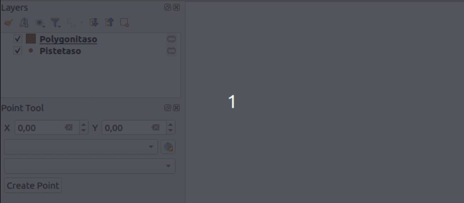
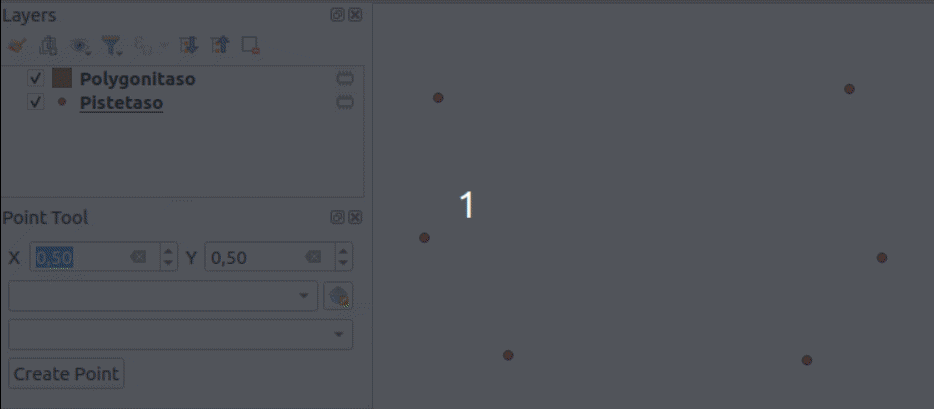

# Exercise 7: Point tool

The point of this exercise is to create a point tool into which you can
enter coordinates and create point features at that location. In the
GUI there is a drop-down menu for suitable layers (only point layers
are shown). If no layer is selected the user has to select a CRS and
then the tool creates a new point layer with that chosen CRS. Then a
new point feature is created to the layer and its coordinates saved
to fields called `x` and `y`.



If the user hasn't chosen a layer _or_ a CRS the tool gives an error.
If the user has chosen a point layer the CRS widget deactivates and
doesn't affect the added points in any way.



In the last exercise each step was gone over in a lot of detail.
This exercise is more independent. However the tool has a different
kind of GUI where it opens as a panel `QDockWidget`. Let's go
over creating a panel GUI first.

## Exercise 7.1: Creating a panel

Open Qt Designer and in the **New Form** dialog select
**QDockWidget** from under the **Widgets** menu.
Change the name of the widget to **PointToolDockWidget**.
Create a GUI similar to this image:


* X: QgsDoubleSpinBox (name: xSpinBox)
* Y: QgsDoubleSpinBox (name: ySpinBox)
* QgsProjectionSelectionWidget (name: crsWidget)
* QgsMapLayerComboBox (name: layerComboBox)
* QPushButton (name: createPushButton)

Save the GUI to this path: `test-plugin/testplugin/resources/ui/point_tool.ui`.
If you prefer you can save an icon for the tool to the
`test-plugin/testplugin/resources/icons/point_tool.png` path. You can
create an icon yourself of download this image: 

Create a new file `test-plugin/testplugin/ui/point_tool_dockwidget.py` and add this code:

::: code-box
```python
import logging
from typing import Optional

from qgis.PyQt.QtCore import pyqtSignal

from testplugin.core.pointtool import PointTool

from qgis.PyQt.QtWidgets import (
    QDockWidget,
    QWidget,
)
from testplugin.qgis_plugin_tools.tools.custom_logging import bar_msg
from testplugin.qgis_plugin_tools.tools.decorations import log_if_fails
from testplugin.qgis_plugin_tools.tools.resources import load_ui, plugin_name

FORM_CLASS: QWidget = load_ui("point_tool.ui")
LOGGER = logging.getLogger(plugin_name())

class PointToolDockWidget(QDockWidget, FORM_CLASS):

    closingPlugin = pyqtSignal()

    def __init__(self, iface, parent=None):
        """Constructor."""
        super(PointToolDockWidget, self).__init__(parent)

        self.setupUi(self)

    def close_event(self, event):
        self.closingPlugin.emit()
        event.accept()
```
:::

Open `test-plugin/testplugin/plugin.py` and make the following changes:

Edit the imports:

There should already exist an import for `QCoreApplication` and `QTranslator`.
Add `Qt` to the same command.

::: code-box
```python
from qgis.PyQt.QtCore import Qt, QCoreApplication, QTranslator
```
:::

There should already exist an import for `plugin_name`.
Add `resources_path` to the same command.

::: code-box
```python
from testplugin.qgis_plugin_tools.tools.resources import plugin_name, resources_path
```
:::

Import the dockwidget class which was previously defined.

::: code-box
```python
from testplugin.ui.point_tool_dockwidget import PointToolDockWidget
```
:::

Edit the constructor (`__init__` method) of the `Plugin` class. Add
these rows:

::: code-box
```python
        self.dockwidget = PointToolDockWidget(iface)
        self.pluginIsActive = False

```
:::

Add to the `initGui()` method:

::: code-box
```python
        self.add_action(
            resources_path("icons/point_tool.png"),
            text=tr("Point Tool"),
            callback=self.open_point_tool,
            parent=iface.mainWindow(),
        )
```
:::

Add to the `onClosePlugin()` method:

::: code-box
```python
        self.dockwidget.closingPlugin.disconnect(self.onClosePlugin)

        self.pluginIsActive = False
```
:::

Add a new method `open_point_tool()`:

::: code-box
```python
    def open_point_tool(self) -> None:
        """Opens point tool dock widget"""
        if not self.pluginIsActive:
            self.pluginIsActive = True

            self.dockwidget.closingPlugin.connect(self.onClosePlugin)

            iface.addDockWidget(Qt.LeftDockWidgetArea, self.dockwidget)
        self.dockwidget.show()
```
:::

You can also already create a new file `test-plugin/testplugin/core/pointtool.py`:

::: code-box
```python
from testplugin.core.exceptions import PointToolException


class PointTool:
    pass
```
:::

And add to the `test-plugin/testplugin/core/exceptions.py` file:

::: code-box
```python
class PointToolException(QgsPluginException):
    pass
```
:::

Reload the plugin. Clicking on the tool should open a new
panel to the left side of the QGIS window.

## Exercise 7.2: Point Tool

Next implement the functionality that was previously defined.
If you need help you can as the trainer or look at the
sample plugin:

[test-plugin/testplugin/plugin.py](https://github.com/GispoCoding/pyqgis-training-sample-plugin/blob/feature-2/sampleplugin/plugin.py)                                                 \
[test-plugin/testplugin/ui/point_tool_dockwidget.py](https://github.com/GispoCoding/pyqgis-training-sample-plugin/blob/feature-2/sampleplugin/ui/point_tool_dockwidget.py)             \
[test-plugin/testplugin/resources/ui/point_tool.ui](https://github.com/GispoCoding/pyqgis-training-sample-plugin/blob/feature-2/sampleplugin/resources/ui/point_tool.ui)               \
[test-plugin/testplugin/core/pointtool.py](https://github.com/GispoCoding/pyqgis-training-sample-plugin/blob/c019b85ed7c7bb66b799f633e139d790f3ab21d0/sampleplugin/core/pointtool.py)  \
[test-plugin/testplugin/core/exceptions.py](https://github.com/GispoCoding/pyqgis-training-sample-plugin/blob/feature-2/sampleplugin/core/exceptions.py)                               \

### Exercise 7.2.1: Extra challenge - labeling

When the tool creates a new layer add a style to it which
includes a label that shows the x and y coordinates of the
point on the map:


## Exercise 7.3: Tests

Create a new file `test-plugin/tests/test_point_tool.py`.
Write two tests:

* `test_create_new_point_layer()`
* `test_add_point_to_layer()`

In the first test a point is create without a selected point layer
in which case the tool should create a new point layer. In the
other one points are added to an existing layer.

[test-plugin/tests/test_point_tool.py](https://github.com/GispoCoding/pyqgis-training-sample-plugin/blob/feature-2-tests/tests/test_point_tool.py)

