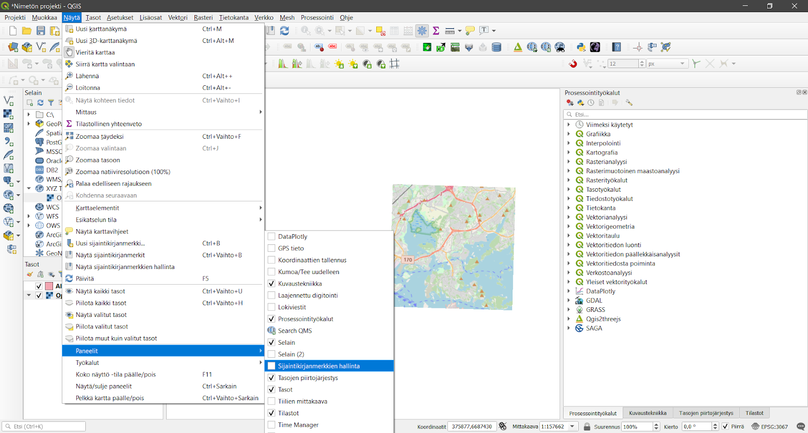
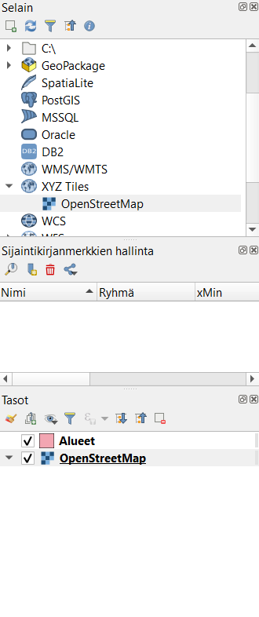
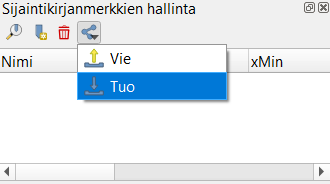
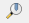
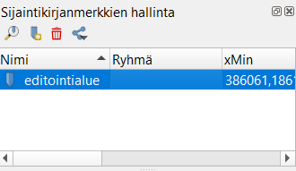
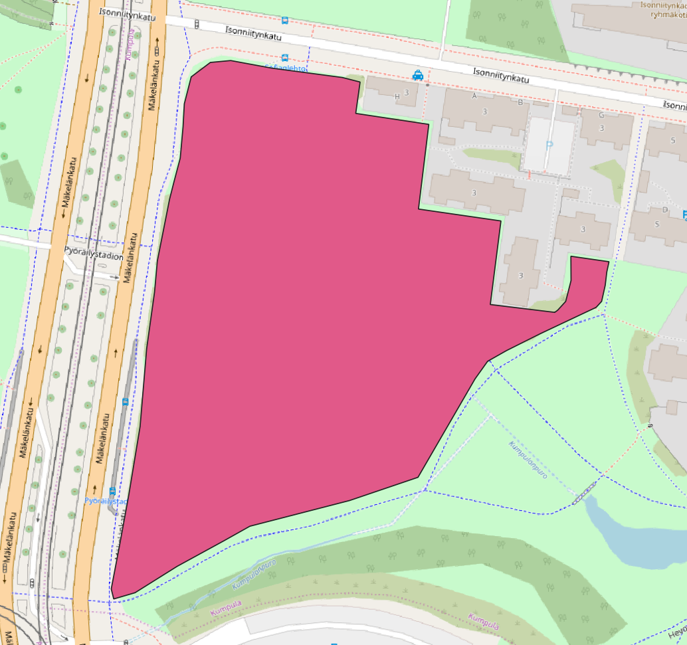
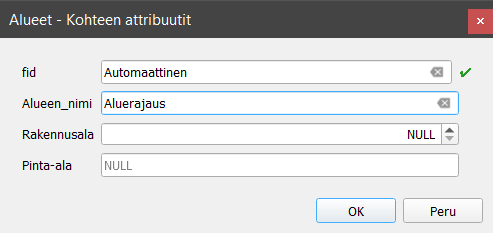
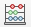

# Harjoitus 1: Digitoinnin perusteet

**Harjoituksen sisältö**

Harjoituksessa luodaan vektoriaineisto hyödyntäen digitoinnin perustyökaluja.

**Harjoituksen tavoite**

Harjoituksen jälkeen osallistuja osaa lisätä ja luoda tasoja QGISiin.

**Arvioitu kesto**

30 minuuttia.

## **Valmistautuminen**

Avaa uusi QGIS-projekti (**Projekti \> Uusi**) ja tallenna se nimellä "**QGIS-harjoitus 1**".

## **Muokkauksen yleisasetukset**

Muokkauksen toimintoa ja muita yleisiä muokkaustyöasetuksia voit muuttaa päävalikon ikkunassa **Asetukset \> Valinnat \> Digitointi**. Jos et esimerkiksi halua, että ominaisuustietojen muokkausikkuna tulee esiin jokaisen polygonin piirtämisen jälkeen niin rastita **Älä näytä ominaisuustietojen pop-up lomaketta kohteen luonnin jälkeen**. Jätä se kuitenkin päälle tällä kertaa. Kokeile myös vaihtaa kohteiden muokkausväri keltaiseksi (**Kuminauha**) ja **Taitepisteen** symbolin tyyli ja koko. Paina **OK**, niin asetukset tulevat voimaan.

## **Editoinnin valmistelu**

Aloitetaan tekemällä editointia helpottavia valmisteluja. Ensimmäisenä aktivoi omaan projektiisi **Työkalut-valikosta** seuraavat työkalut:

-   Digitoinnin työkalupalkki

-   Digitoinnin lisätyökalujen palkki

-   Tarttumisen työkalut\

Usein ensimmäinen operaatio aineistojen luomisessa on taustakartan lisääminen. Taustakartta helpottaa liikkumista ja aineistojen tarkistusta. Uudemmissa QGISin versioissa on OpenStreetMapin taustakarttatasot saatavilla valmiina. Lisää taustakartta projektiin vasemmalta tuplaklikkaamalla  **Selain-paneelista XYZ Tiles \> OpenStreetMap**.

Zoomaa kartta Suomen kohdalle ja koska haluamme tehdä tarkkaa editointia oikeassa koordinaattijärjestelmässä, muutetaan projektin koordinaattijärjestelmä Suomen kansalliseen **EUREF-FIN 3067**. Klikkaa projektin oikeasta alakulmasta, jossa lukee tällä hetkellä EPSG:3857, jonka QGIS on asettanut taustakartan perusteella.

Paina tämän jälkeen **OK,** jonka jälkeen avautuva ikkuna kysyy sinulta koordinaattimuunnoksesta. Valitse uudestaan **OK** ja nyt projektisi on oikeassa koordinaattijärjestelmässä.

## **GeoPackagen luonti**

Luo uusi GeoPackage-taso valitsemalla päävalikosta **Tasot \> Luo taso \> Uusi Geopackage-taso**.

GeoPackage on tietokanta, jossa tieto on tallennettu tauluihin. Anna tietokannan nimeksi **"Aluesuunnitelma"** ja luotavan tason nimeksi **"Alueet"**. Valitse taulun geometriaksi polygoni ja koordinaattijärjestelmäksi **3067**. Lisää GeoPackageen nyt muutama muu uusi sarake seuraavasti:

-   Nimi: Alueen_nimi / Tyyppi: teksti

-   Nimi: Rakennusala / Tyyppi: kokonaisluku

-   Nimi: Pinta-ala / Tyyppi: desimaalinumero

Muista aina klikata **Lisää kenttälistaan -painiketta**, jotta jokainen kenttä ilmestyy listaukseen.

::: hint-box
Integer, 32bit integer vai Integer 64 bit? Tässä tapauksessa valitsemme kentän tyypiksi Integerin, mutta mistä tietää jatkossa, kumman valitsee?\
\
Ensin käyttötarkoitus: mitä lukuja kenttään tallennetaan?\
\
16-bit unsigned integer voi sisältää luvun väliltä -32 768 - 32 767\
Signed: 0 - 65 535.\
32-bit unsigned integer voi sisältää luvun välillä −2 147 483 648 - 2 147 483 647\
Signed: 0 - 4 294 967 295.\
64-bit unsigned integer voi sisältää luvunvälillä −9 223 372 036 854 775 808 - 9 223 372 036 854 775 807\
Signed: 0 - 18 446 744 073 709,55.\
\
QGIS:issä (versioissa 3.10+) integerit ovat oletuksena signed-tyyppisiä, ellei toisin mainita.\
Toisakseen tulee harkittavaksi, mihin tuota tietoa tallennetaan: Geopackage, PostgreSQL vai joku muu? Mitä enemmän käytetään bittejä, sitä suuremmaksi kasvaa tiedostojen koot (myös PostgreSQL:ssä on tiedostoja tietokannan takana). Mitä suuremmat tiedostot, sitä hitaammin asiat sujuvat.\
\
Kolmanneksi pitäisi ottaa huomioon, että siirretäänkö kyseistä aineistoa johonkin toiseen järjestelmään / tiedostoformaattiin. Tuleeko tilanteita, joissa 64bit tallennettu tieto pitääkin viedä tiedostoon, joka ei salli noin suuria numeroita (kuten Shapefile).\
:::

## **Aloita geometrioiden editointi**

Siirrytään editointialueelle hyödyntämällä **sijaintikirjanmerkkejä**. Valitse ylävalikosta **Näytä \> Paneelit \> Sijaintikirjanmerkkien hallinta**, jolloin QGIS-työtilaasi ilmestyy uusi paneeli (yleensä Selain-paneelin ja Tasot-paneelin väliin).

Tuo kurssihakemistoon tallennettu kirjanmerkki Editointialue.xml QGIS-projektiin klikkaamalla **Vie/tuo kirjanmerkit -painiketta Sijaintikirjanmerkkien hallinta -paneelissa**.

Listaan ilmestyy tuotu **Editointialue-sijaintikirjanmerkki**. Pääset sijaintikirjanmerkin osoittamalle alueelle klikkaamalla **Zoomaa kirjanmerkkiin -painiketta** .

Seuraavaksi aloitamme aineiston muokkaamisen klikkaamalla **Tason muokkaus päälle/pois -painiketta** . Huomaa, että **Digitoinnin työkalupalkin** työkalut aktivoituvat. 

Valitse työkaluksi **Lisää polygonikohde** ja aloita alueiden digitointi. Hiiren vasemmalla näppäimellä voit klikata kartalla kohteen kulmapisteet. Kun monikulmio on valmis, niin napauta hiiren oikeaa näppäintä, uusi monikulmio on luotu. Digitoi alla olevaa kuvan punaista aluetta vastaava monikulmio.

Kun editointi on valmis, QGISiin avautuu **Alueet - Kohteen attribuutit -ikkuna**. Laita **Alueen_nimi-kohtaan "Aluerajaus"**. Muihin kenttiin ei vielä tarvitse täyttää mitään.

Luodaan seuraavaksi uusi GeoPackage-taso, mutta kokonaan uuden tietokannan luomisen sijaan teemme aikaisemmin luotuun **Aluesuunnitelma-GeoPackageen** vain uuden tason. Anna taulun nimeksi **"Kulkureitit"** ja lisää siihen seuraavat kentät:

-   Nimi: Reitin_nimi / Tyyppi: teksti

-   Nimi: Pituus / Tyyppi: desimaalinumero

Kun klikkaat **OK**, QGIS kysyy, haluatko korvata olemassa olevan GeoPackage-tiedoston (ja sen taulut) tällä tiedostolla vai lisätä tiedostoon/tietokantaan uuden tason. Valitse **Lisää uusi taso**, jolloin projektiin lisätään jälleen uusi taso.

Laita nyt vuorostaan tämän juuri luodun tason editointi päälle klikkaamalla **Tason muokkaus päälle/pois -kuvaketta** (kynäikoni). Koska haluamme että kulkureittien editointi alkaa aivan alueen reunasta, on kytkettävä **Tarttuminen (snapping)** päälle. Voit tehdä tämän klikkaamalla **Ota tarttuminen käyttöön -painiketta** . Valitse ensimmäisestä alasvetovalikosta **Kaikki tasot** ja toisesta valikosta kuvan mukaisesti **Piste** ja **segmentti**. Aseta **tarttumisherkkyydeksi** 12 pikseliä (oletusherkkyys).

Luodaan seuraavaksi kulkureitti, joka kulkee alueen läpi kuvan mukaisesti. Anna tälle kulkureitille nimeksi **"Raitiotie"**. Jätä pituus-kenttä vielä tyhjäksi.

Päivitetään attribuuttitaulun kenttiin puuttuvat tiedot **Kentän arvojen laskin -työkalun** avulla. Avaa laskin klikkaamalla **Ominaisuustietojen työkalupalkista** **Avaa kentän arvojen laskin -painiketta**  

Klikkaa avautuvasta ikkunasta **Päivitä olemassa oleva kenttä** ja valitse alasvetovalikosta **Pituus-kenttä**. Kirjoita **Lauseke-kenttään** lauseke, joka laskee viivamaisen kohteen pituuden sekä pyöristää sen yhden desimaalin tarkkuudelle:

::: code-box
round(\$length, 1)
:::

Laita lopuksi molempien tasojen tason muokkaus pois päältä klikkaamalla kynäkuvaketta. Tallenna kaikki muutokset tasoihin. Kun olet valmis, tallenna projektitiedosto kurssihakemistoon pikanäppäimellä **CTRL + T** (englanninkielisessä QGISissä **CTRL + S**) tai päävalikosta **Projekti \> Tallenna**.

::: hint-box
Psst! Muista tukipalvelu! Koulutuksen jälkeen saat henkilökohtaista tukea Gispon tukipalvelun kautta lähettämällä yksinkertaisesti tuki\@gispo.fi-sähköpostiosoitteeseen kysymyksen tai kommentin jostakin sinua mietityttävästä asiasta. Gispon tiimi auttaa sinua toimiesi äärellä. Kysymykset käsitellään henkilökohtaisesti.
:::
