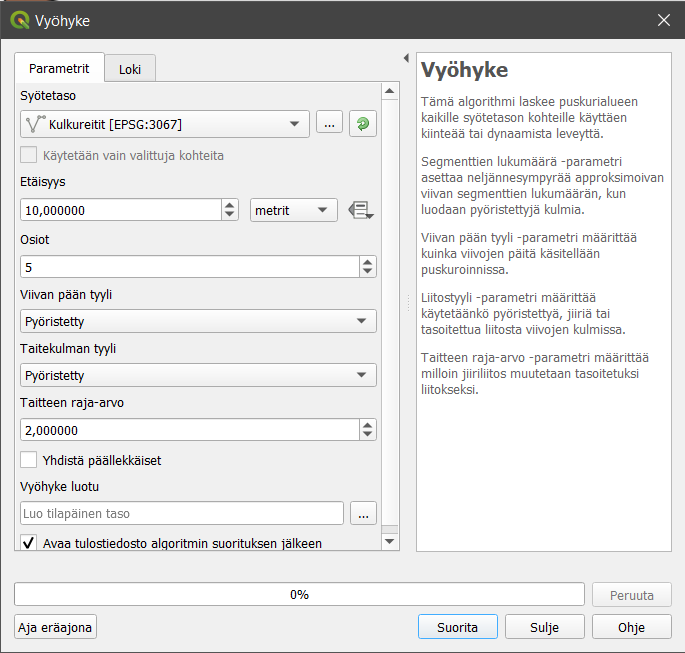
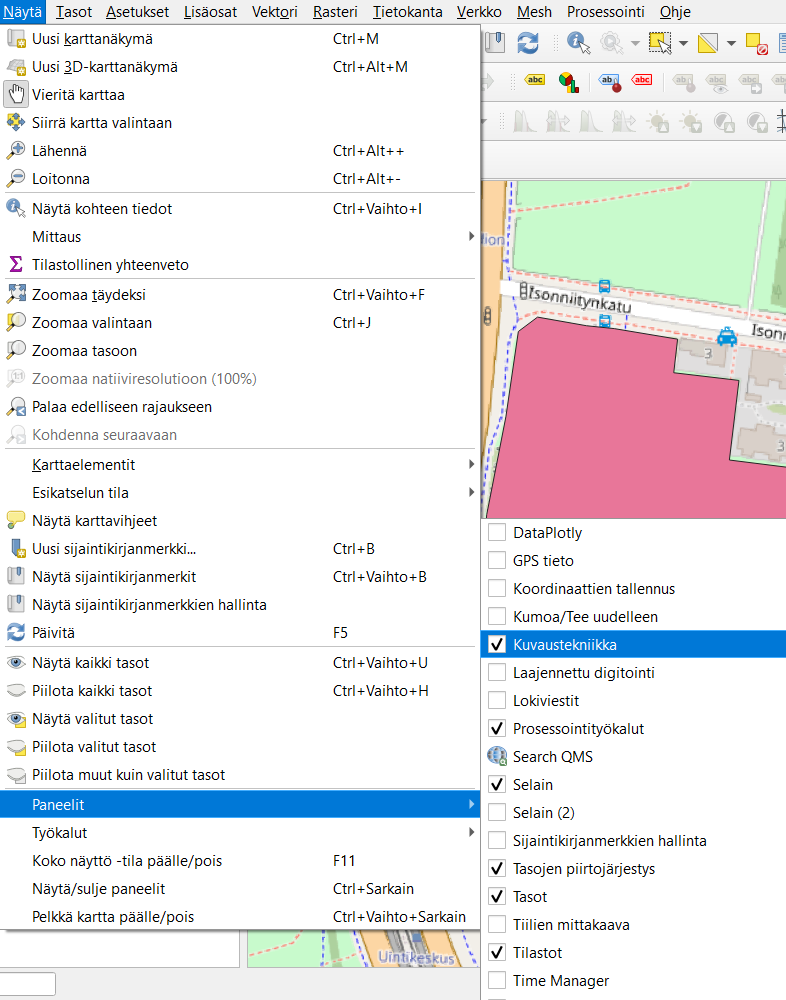
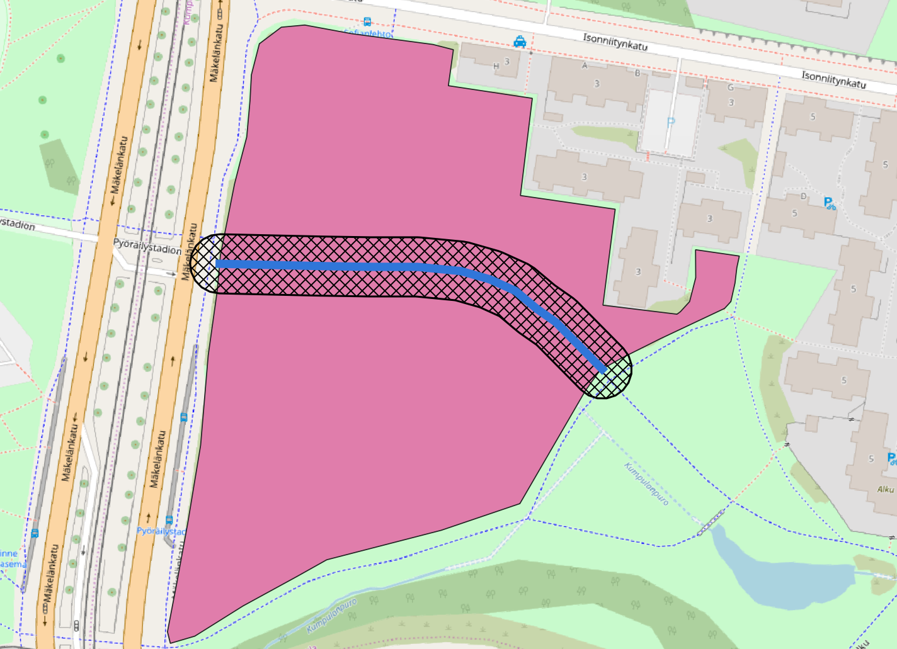
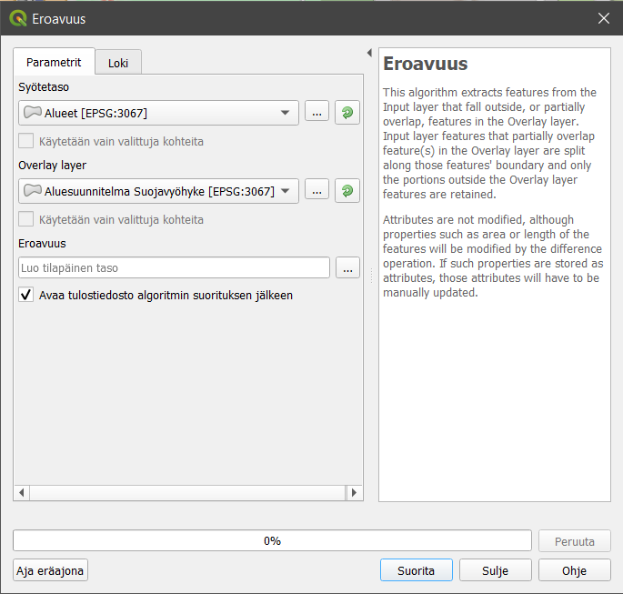
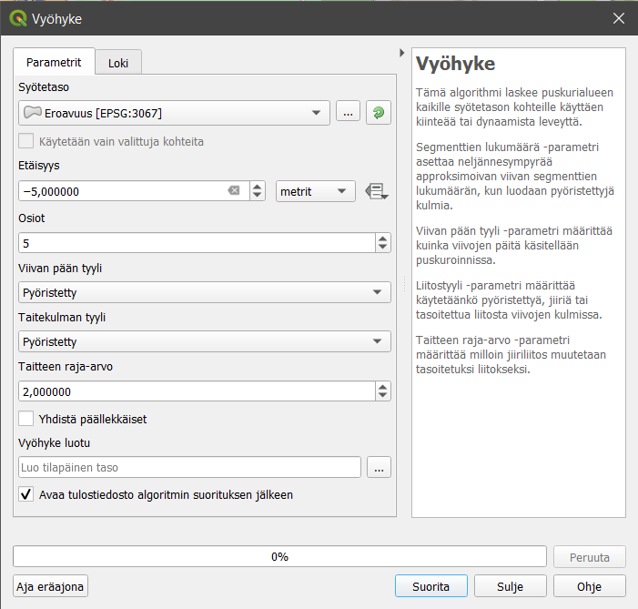

# Harjoitus 2: Edistyneet digitointiominaisuudet

**Harjoituksen sisältö**

Harjoituksessa tehdään edistyneitä digitoinnin operaatioita QGISillä.

**Harjoituksen tavoite**

Harjoituksen jälkeen opiskelija osaa hyödyntää monipuolisemmin editoinnin ominaisuuksia.

**Arvioitu kesto**

45 minuuttia.

## **Valmistautuminen**

Avaa uusi QGIS-projekti (**Projekti \> Uusi**) ja tallenna se nimellä "**QGIS-harjoitus 2**". Lisää projektiin seuraavat aineistot:

-   **Aluesuunnitelma.gpkg (Alueet- ja Kulkureitit-tasot)**

-   **OpenStreetMap**

## **Edistyneen digitoinnin ominaisuudet**

Luodaan ensimmäisenä Kulkureitit-tason raitiotielle puskurivyöhyke, jonka sisälle ei sallita rakentamista. Valitse **Prosessointityökalut-paneelista Vektorigeometria \> Vyöhyke**, eli vyöhykeanalyysi. Jos tiedät mitä työkalua haet, voit kirjoittaa sen nimen **Prosessointityökalut-paneelin Etsi-kenttään**. Muodosta Vyöhyke-työkalulla haluamasi levyinen vyöhyke, mutta voit tehdä vyöhykkeen esimerkiksi seuraavan kuvan mukaisesti:

Paina lopuksi **Suorita**, jolloin QGIS luo projektiisi uuden **väliaikaisen** geometriatason vyöhykkeelle. Väliaikaisen tason tunnistaa mikropiiri-kuvakkeesta . Uusi vyöhyketaso halutaan kuitenkin pysyväksi osaksi aineistoa, joten tallenna vyöhyke osaksi aikaisemmin luotua **Aluesuunnitelma-GeoPackagea** klikkaamalla hiiren oikealla väliaikaista **Vyöhyke luotu -tasoa** ja valitsemalla **Vie \> Tallenna kohteet nimellä...** Valitse tiedostomuodoksi GeoPackage, valitse tiedostoksi **Aluesuunnitelma.gpkg** ja anna tasolle nimeksi **"Suojavyöhyke"**. Paina sitten **OK**, niin QGIS tallentaa tason osaksi aikaisemmin luotua GeoPackagea.

Kun tiedosto on tallennettu, visualisoidaan vyöhyketasoa hieman, jotta analysointi olisi helpompaa. Valitse **Näytä \> Paneelit \> Kuvaustekniikka**, niin saat **Kuvaustekniikka-paneelin** näkyviin QGISiin. Tasoa voi visualisoida myös klikkaamalla tason kohdalla hiiren oikeaa nappia ja valitsemalla **Ominaisuudet... \> Kuvaustekniikka**.

Muuta vyöhyke osittain läpinäkyväksi ja tee sille muita haluamiasi muutoksia, jotka helpottavat vaikutusalueen tulkintaa.

Seuraavaksi luomme **Alueet-tason** sisälle rakennuspaikkoja, jotka tulevat olemaan suojavyöhykkeen ulkopuolella ja korkeintaan viiden metrin etäisyydellä alueen reunasta. Leikataan **Alueet-taso Suojavyöhyke-tasolla**, koska suojavyöhykkeelle ei kuitenkaan saa rakentaa. Valitse **Prosessointityökalut-paneelista Vektoritiedon päällekkäisanalyysit \> Eroavuus**. Aseta syötetasoksi **Alueet-taso** ja peitetasoksi **Suojavyöhyke-taso**. Paina sitten **Suorita**.

Saat tämän jälkeen uuden väliaikaisen tason, joka toimii pohjana seuraavaan vaiheeseen.

## **Negatiivinen vyöhyke**

Valitse Prosessointityökalut-paneelista jälleen **Vektorigeometria \> Vyöhyke**. Teemme edellisessä vaiheessa luodulle tasolle negatiivisen vyöhykeanalyysin, jotta saamme määritettyä rakennuspaikat viisi metriä sisäänpäin **Alueet-tason** reunasta.

Tallenna tästä syntyvä taso Aluesuunnitelma-GeoPackageen nimellä **"Rakennuspaikat"**.

## **Kohteiden editoiminen alkuperäisessä tiedostossa**

Aiemmin QGIS loi usein uuden tason, kun sille tehtiin jokin geoprosessoinnin operaatio. Lopputuloksena saattoi olla projekti, joka oli täynnä väliaikaisia tasoja. Uutena ominaisuutena QGIS mahdollistaa nykyään **Muokkaa ominaisuuksia suoraan -toiminnon (**engl**.** **In-Place Editing)**, jonka avulla voidaan esimerkiksi pehmentää tason geometriaa tekemättä siitä uutta tasoa. Muutokset siis tehdään suoraan lähtötasoon.

Toiminto löytyy **Prosessointityökalut**-paneelin ylävalikosta.

Toiminto on käytössä vain sellaisille prosessointityökaluille, joissa kohteen geometriatyyppi ei muutu.

## **Kohteisiin tarttuminen (snapping) ja rakennustila (construction mode)**

Seuraavaksi teemme rakennuksia rakennuspaikoille. Luo **Aluesuunnitelma-GeoPackageen** uusi taso rakennuksia varten seuraavasti:

Aloita valitsemalla työkalupalkista jälleen **Uusi GeoPackage-taso**. Tällä kertaa kuitenkin valitsemme **Tietokanta**-kenttään kohteeksi aiemmin luodun Aluevaraus-Geopackagen, jolloin uusi taso tuleelisätyiksi siihen. Kun olet valinnut Aluevaraus.gpkg:n tietokannaksi, anna tason nimeksi "Rakennukset" ja täytä tason tiedot kuten alla olevassa kuvassa:

Tallennettaessa QGIS kysyy, korvataanko aiemmin luotu GeoPackage vai lisätäänkö uusi taso siihen. Valitse Lisää uusi taso.

Seuraavaksi laita **Tarttuminen** , **Seuraaminen**  **ja Self-snapping **päälle **Tarttumisen työkalut -paneelista**. Aseta muut tarttumisasetukset seuraavan kuvan mukaisiksi:

Valinnat järjestyksessä vasemmalta oikealle:

-   Tarttuminen

-   Kaikki tasot (klikkaa kuvaketta ja voit valita asetuksen pudotusvalikosta)

-   Taitepiste (klikkaa kuvaketta ja voit valita asetuksen pudotusvalikosta)

-   10

-   px (pikseliä)

-   Ei käytössä

-   Ei käytössä

-   Ei käytössä

-   Ota seuraaminen käyttöön

-   Self snapping (tarttuminen työn alla olevaan digitoitavaan kohteeseen)

Rakennusten luonnissa on kolme sääntöä:

-   Rakennusten tulee olla 45 tai 90 asteen kulmassa suhteessa rakennuspaikan reunaan

-   Rakennuksen tulee sijaita vähintään 5 metriä rakennuspaikan reunasta

-   Rakennuksen tulee sijaita vähintään 5 metriä toisesta rakennuksesta

**Rakentamistila** tarkoittaa tilaa, jossa voit valita kohteita kartalla, määrittää liikkumisen kulmia ja napata kiinni kohteisiin, mutta tilassa ei varsinaisesti luoda uusia geometrioita tai kulmapisteitä. Voit siis vaihdella rakentamis- ja editointitilan välillä yhden kohteen digitoinnin aikana.

Aseta **Rakennukset-tason** editointi päälle kynäkuvakkeesta. Kun valitset **Lisää polygonikohde -työkalun**, **Laajennettu digitointi -kuvake** aktivoituu . Klikkaa kuvaketta niin saat **Laajennettu digitointi -hallintapaneeliin** QGISiin.

Aloita nyt **Rakennukset-tason** editointi. Tarkoituksena on luoda rakennuksia rakennuspaikkojen sisään aikaisemmin mainittujen sääntöjen mukaan. Toimi seuraavasti:

-   Klikkaa **Rakentamistila** päälle  -painikkeesta tai näppäimistöltä pikakomennolla **c**

-   Valitse rakennusalueen reunasta kohta, johon rakennus tulee

-   Laita d-kentän arvoksi 5

-   Klikkaa **Kohtisuora-kuvaketta**  ja valitse ulkoreunalta viiva, jonka suhteessa rakennuksen tulisi olla 90 asteen kulmassa

-   Nyt QGIS lukitsee aloituspisteen ja voit siirtyä pois rakentamistilasta klikkaamalla uudestaan  (tai pikanäppäimellä **c**) ja ryhtyä digitoimaan rakennusta.

Tämän jälkeen editoi aineistoon rakennuksia vähintään kolme kappaletta edellä mainittujen sääntöjen mukaisesti hyödyntäen laajennetun digitoinnin ominaisuuksia. Koita myös kääntää rakennuksia 45 astetta hyödyntäen **Kierrä kohteita -työkalua** . Ota lopuksi tason editointi pois päältä ja tallenna tasoon tehdyt muutokset. Avaa **Kuvaustekniikka-paneeli** tai mene tason ominaisuuksien kautta **Kuvaustekniikka-välilehdelle** ja muokkaa editoitujen kohteiden värit vastaamaan taustakartan värejä **Värin valitsin -työkalua** hyödyntäen.

Voit vielä hyödyntää alueen reunaa käyttäen **Seuraaminen-ominaisuutta**:

 <https://docs.qgis.org/3.22/en/docs/user_manual/working_with_vector/editing_geometry_attributes.html#automatic-tracing>

Kun olet valmis, tallenna projektitiedosto kurssihakemistoon pikanäppäimellä **CTRL + T** (englanninkielisessä QGISissä **CTRL + S**) tai päävalikosta **Projekti \> Tallenna**.

::: hint-box
Psst! Muista tukipalvelu! Koulutuksen jälkeen saat henkilökohtaista tukea Gispon tukipalvelun kautta lähettämällä yksinkertaisesti tuki\@gispo.fi -sähköpostiosoitteeseen kysymyksen tai kommentin jostakin sinua mietityttävästä asiasta. Gispon tiimi auttaa sinua toimiesi äärellä. Kysymykset käsitellään henkilökohtaisesti.
:::
