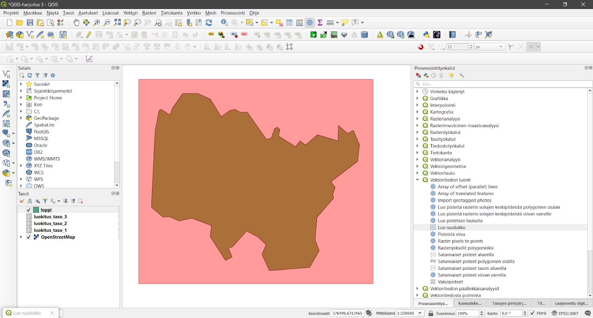
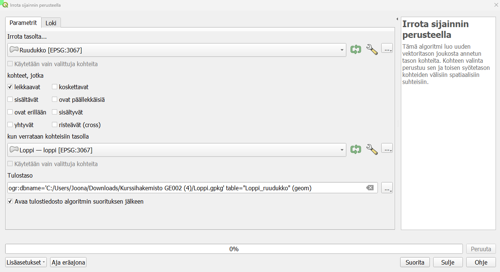
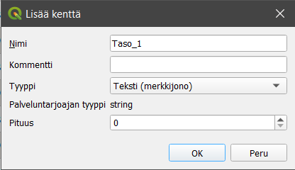
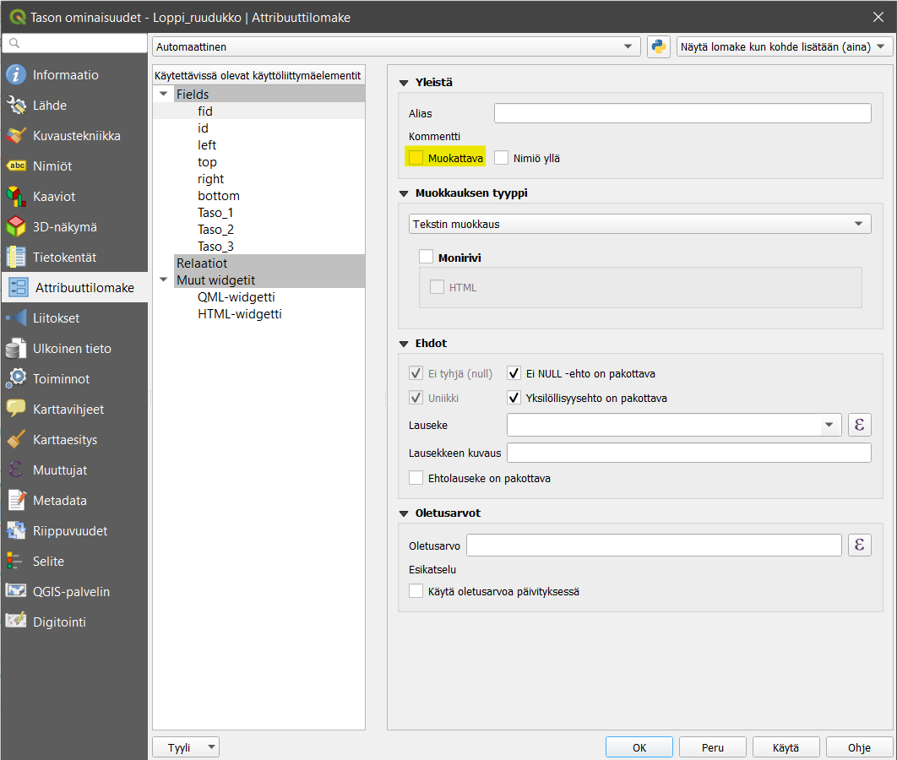
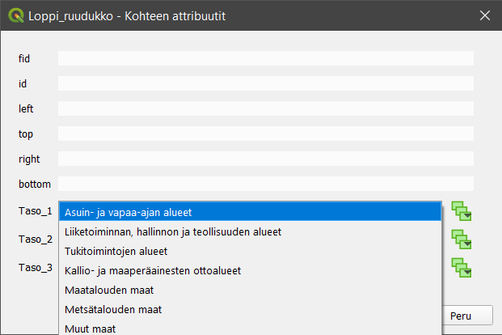
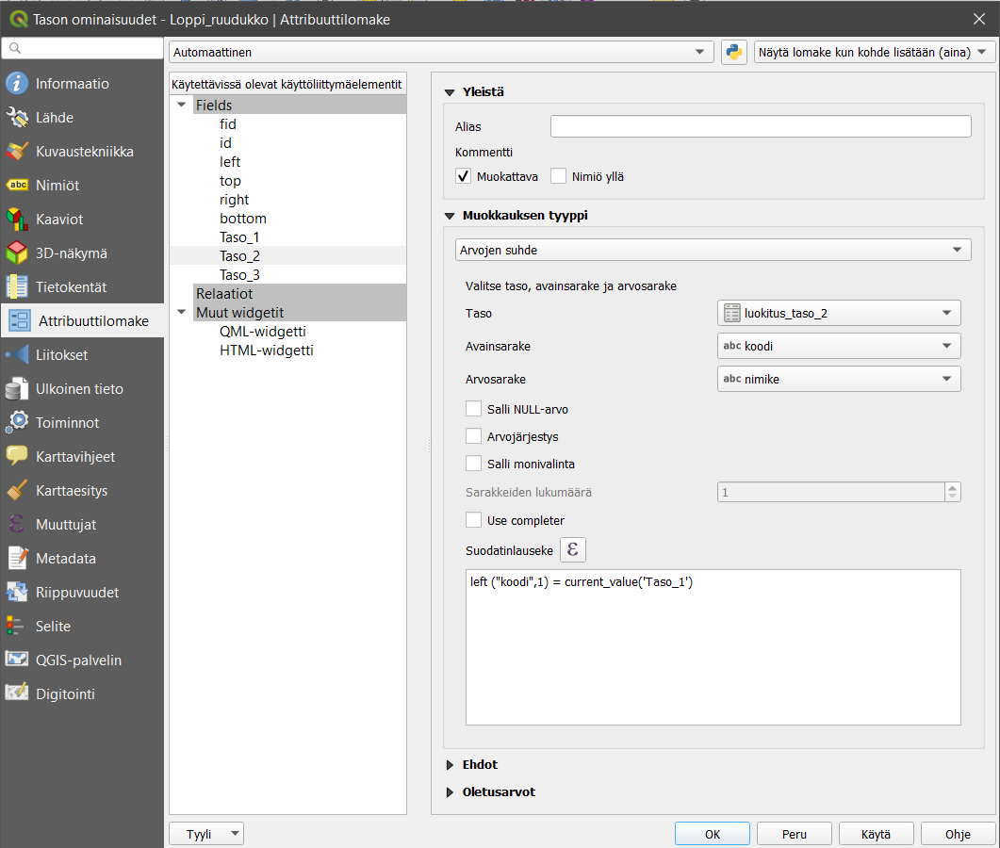
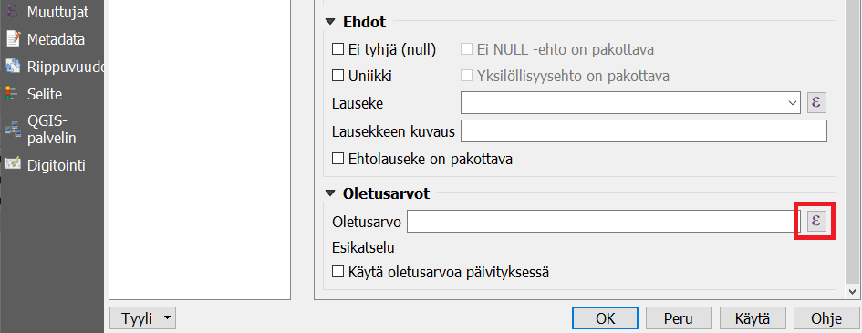
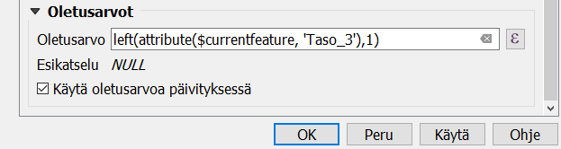
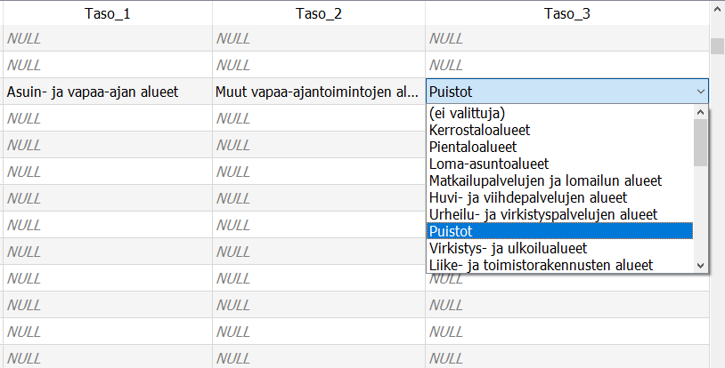

# Harjoitus 3: Relaatiot

**Harjoituksen sisältö**

Harjoituksessa opetellaan hyödyntämään ulkopuolisia tauluja aineiston editoinnissa.

**Harjoituksen tavoite**

Harjoituksen jälkeen osallistuja osaa hyödyntää tehokkaasti QGISin Attribute Forms toiminnallisuutta ominaisuustietojen editoinnissa.

**Arvioitu kesto**

30 minuuttia.

## **Valmistautuminen**

Avaa uusi QGIS-projekti (**Projekti \> Uusi**) ja tallenna se nimellä \"**QGIS-harjoitus 3**\". Lisää projektiin seuraavat aineistot:

-   **OpenStreetMap**

-   **Luokat.gpkg (luokitus_taso_1, luokitus_taso_2, luokitus_taso_3)**

-   **Loppi.gpkg**

## **Aineistojen valmistelu**

GeoPackage-tietokantaan voi lisätä myös tasoja/tiedostoja/aineistoja, jotka eivät sisällä lainkaan geometrioita -- käytännössä QGISiin avautuu silloin kuinkin kohteen attribuuttitaulut. Projektiin avatut **Luokat-GeoPackagen** sisältämät tasot ovat juuri tällaisia aineistoja, joilla ei ole geometriaa. **Luokat-aineisto** sisältää kolmiportaisen maankäyttöluokitusjärjestelmän, joka perustuu [SLICES](https://www.stat.fi/meta/luokitukset/maankaytto/001-2000-05-01/kuvaus.html)-luokitukseen. Avaa kunkin tason attribuuttitaulut ja tarkastele niiden sisältöä.

Luokittelu on hierarkinen ja logiikka on helppo ymmärtää:

-   Jokaisella maankäyttöluokalla on oma koodinsa, jonka pituus riippuu hierarkian tasosta

-   Jokaisella luokalla on myös sanallinen kuvaus luokasta

Editoinnin tarkoituksena on hyödyntää ja rajoittaa luokkien välisiä suhteita attribuuttitietojen editoinnissa. Tehdään maankäytön suunnitelma näillä luokituksilla, joka perustuu kuusikulmioihin. Useassa kaupungissa on luotu yleiskaavoja, joissa kerrotaan ruuduittain alueiden käytön suunnittelusta. Harjoituksessa luomme kuvitteellisen yleiskaavan Lopelle Kanta-Hämeeseen heksagonien avulla.

Seuraavaksi luomme koko kunnan alueen kattavan kuusikulmioaineiston. Valitse **Prosessointityökalut-paneelista Vektoritiedon luonti \> Luo ruudukko**. Täytä avautuva Luo ruudukko -ikkunan tiedot seuraavan kuvan mukaisesti:

Valitse **Ruudukon laajuus -kohdassa ... \> Valitse laajuus piirtoalueelta**, jonka jälkeen QGIS pyytää sinua valitsemaan kursorilla alueen jolle ruudukko muodostetaan.

Jätä **tyhjäksi tallennussijainti** kohta, jolloin tiedosto tallentuu väliaikaiseksi tiedostoksi nimellä **Ruudukko**. Kun klikkaat **Suorita**, QGIS luo heksagoniruudukon valitsemallesi alueelle.

Kun ruudukko on luotu, valikoimme siitä vain Loppi-polygonin kohdalle osuvat ruudut. Tämä tehdään **Prosessointityökalut-paneelista Vektoritiedosta poiminta \> Irrota sijainnin perusteella -työkalulla**. Valitse Irrota tasolta kohtaan äsken luotu väliaikainen-tasosta **Ruudukko** ja valitse ne kohteet, jotka leikkaavat. Valitse tallennussijainniksi **Loppi.gpkg** ja anna tason nimeksi **Loppi_ruudukko** ja klikkaa **Suorita**.

Seuraavaksi lisäämme tasoon uudet attribuuttitietokentät, jotka kertovat kyseisen tason maankäytöstä. Seuraamme luokituksessa SLICES-luokitusta, jonka luemme toisesta taulusta. Luokittelu on kolmiportainen, joten ensimmäisenä luomme ominaisuustietokentän nimeltä **\"Taso_1\"** **Loppi_ruudukko-tason** attribuuttitauluun. Avaa ruudukko-tason attribuuttitaulu klikkaamalla **Avaa attribuuttitaulu -kuvaketta**  **Ominaisuustietojen työkalupalkista** tai klikkaamalla tasoa hiiren oikealla painikkeella ja valitsemalla **Avaa attribuuttitaulu**. Luo uusi kenttä klikkaamalla **Uusi kenttä -kuvaketta**  attribuuttitaulussa.

Lisää samalla tavalla myös kentät \"Taso_2\" ja \"Taso_3\". Nyt sinulla on suunnitelman pohja valmiina.

## **Editointi relaatioita hyödyntämällä**

Lähdetään tutkimaan luodun tason **attribuuttilomaketta**. Klikkaa tason päällä hiiren oikeaa painiketta ja valitse **Ominaisuudet... \> Attribuuttilomake**. Tehdään ensin muista kuin kolmesta luomastamme kentästä sellaisia, ettei niitä pysty muokkaamaan. Tämä tehdään poistamalla rasti **Muokattava-kohdasta**.

Siirry seuraavaksi tehtyjen luokitusten kenttiin. Valitse Taso_1-kentän muokkauksen tyypiksi **Arvojen suhde** ja aseta määritykset seuraavan kuvan mukaisesti:

Lisää samalla tavalla myös relaatiot kentille **Taso_2** ja **Taso_3**, mutta muuta **Taso-kohtaan** oikea luokitustaso (2 ja 3). Paina sitten **OK**.

Valitse nyt kartalta useampi ruutu ja klikkaa sitten **Muokkaa samalla kaikkien valittujen kohteiden attribuutteja -kuvaketta** . Pääset nyt valitsemaan alasvetovalikosta oikeita luokkia näihin ruudukoihin.

Käytännössä saat siis oikeat arvot kenttiin kirjoittamatta niitä manuaalisesti. Kuitenkin tässä tapauksessa käyttäjän on vielä mahdollista tehdä ns. vääriä valintoja, eli on mahdollista että valitset ylemmästä luokasta jonkun, joka ei vastaa alemman luokan määrityksiä. Valitse kuitenkin kaikille valituille ruuduille jokin pääluokka.

## **Relaatioiden sisäiset säännöt**

Asetetaan nyt säännöt, jonka mukaan relaatiot riippuvat lomakkeen täytössä tehdyistä valinnoista. Mene uudestaan tason **Attribuuttilomakkeeseen** ja valitsemaasi tason ominaisuuskenttään (Taso_1, Taso_2 tai Taso_3). Syötä Taso_2 -kentän **Suodatinlauseke-kenttään** seuraava lauseke:

::: code-box
left("koodi",1)=current_value('Taso_1')
:::

Käytännössä tämä määrittää rajoituksen, jonka mukaan lomakkeella näytetään ainoastaan sellaisia kohteita, joiden koodi vastaa ylemmän tason määritystä. Tee samalla logiikalla määritykset tasolle 3, mutta muuta lausekkeen numerot 1 numeroiksi 2. Mene nyt **Loppi_ruudukko-tasolle** ja yritä luoda kokonaan uusi geometria. Jos määritykset toimivat, editointi ei anna nyt käyttäjän syöttää vääriä tietoja!

## **Lisätehtävä: automaattisesti täydentyvät arvot**

**Attribuuttilomake**-välilehden avulla voit myös asettaa lausekkeita, joiden avulla kenttien arvot täydentyvät automaattisesti. Lauseke annetaan välilehden alaosan **Oletusarvo** -kohdassa.

Asetetaan nyt oletusarvot siten, että käyttäjän valitessa suoraan sopivan maankäyttöluokan tasolla 3, tasojen 1 ja 2 arvot täydentyvät automaattisesti vastaaviksi. Huomaa, että jos käytät oletusarvoja, edellisessä tehtävässä tehdyt suodatuslausekeet eivät toimi yhtäaikaisesti oletusarvojen kanssa. Ne on siis ensin poistettava.

Tasolla 3 ei anneta mitään suodatuslauseketta eikä myöskään oletusarvoa. Tasolle 2 asetetaan oletusarvo-kohtaan lauseke siten, että se poimii Taso_3-kentän nykyisestä arvosta kaksi vasemmanpuoleisinta merkkiä ja kirjoittaa saamansa tuloksen Taso_2 -kenttään.

::: code-box
left(attribute(\$currentfeature, 'Taso_3'),2)
:::

Ruksi myös **Käytä oletusarvoa päivityksessä** -kohta.

Vastaavasti Taso_1:n oletusarvoksi asetetaan yhden vasemmanpuoleisimman merkin poiminta Taso_3-kentästä.

Testaa lausekkeiden toimivuutta editoimalla muutaman kuusikulmion ominaisuustietoja: valitse Taso_3-kentässä haluamasi maanäyttöluokka ja tarkista, että kentät Taso_1 ja Taso_2 päivittyvät. 

Muita hyödyllisiä käyttötarjoituksia **oletusarvo** -toiminnolle on mm. kohteen editointihetken tallentaminen komennolla **now()** sekä kohteen luojan tai editoijan käyttäjätunnuksen tallentaminen komennolla **user_account_name**.

Kun olet valmis, tallenna projektitiedosto kurssihakemistoon pikanäppäimellä **CTRL + T** (englanninkielisessä QGISissä **CTRL + S**) tai päävalikosta **Projekti \> Tallenna**.

::: hint-box
Psst! Muista tukipalvelu! Koulutuksen jälkeen saat henkilökohtaista tukea Gispon tukipalvelun kautta lähettämällä yksinkertaisesti tuki\@gispo.fi-sähköpostiosoitteeseen kysymyksen tai kommentin jostakin sinua mietityttävästä asiasta. Gispon tiimi auttaa sinua toimiesi äärellä. Kysymykset käsitellään henkilökohtaisesti.
:::
