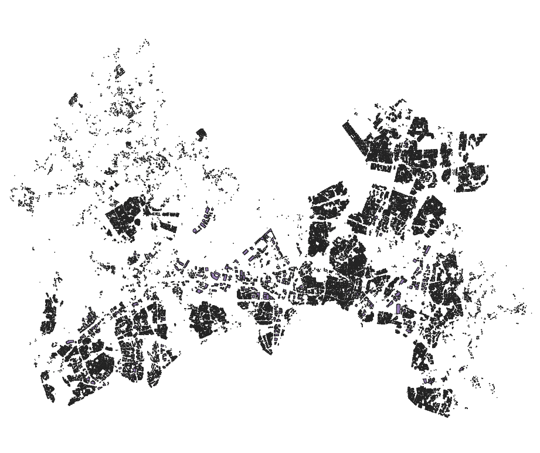
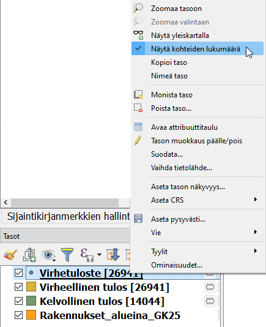
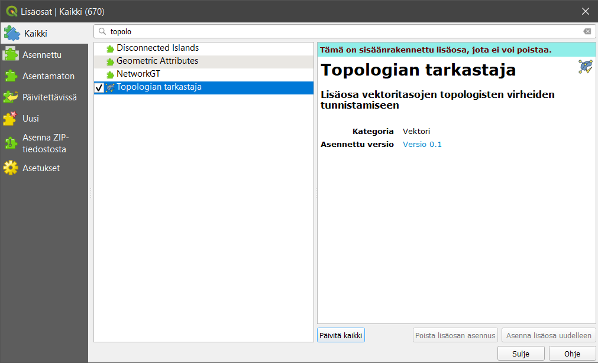
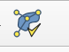
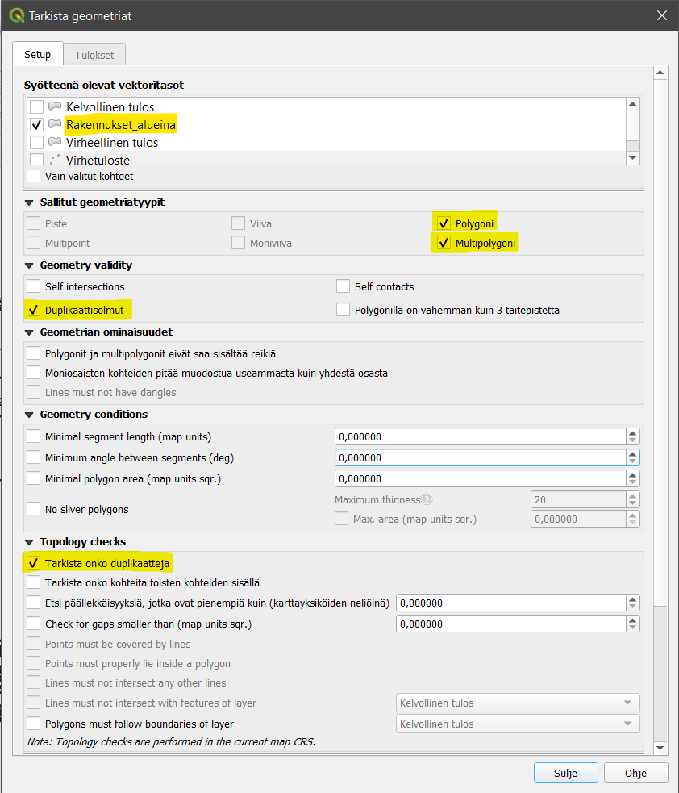
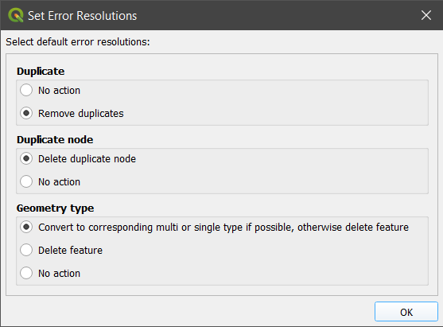
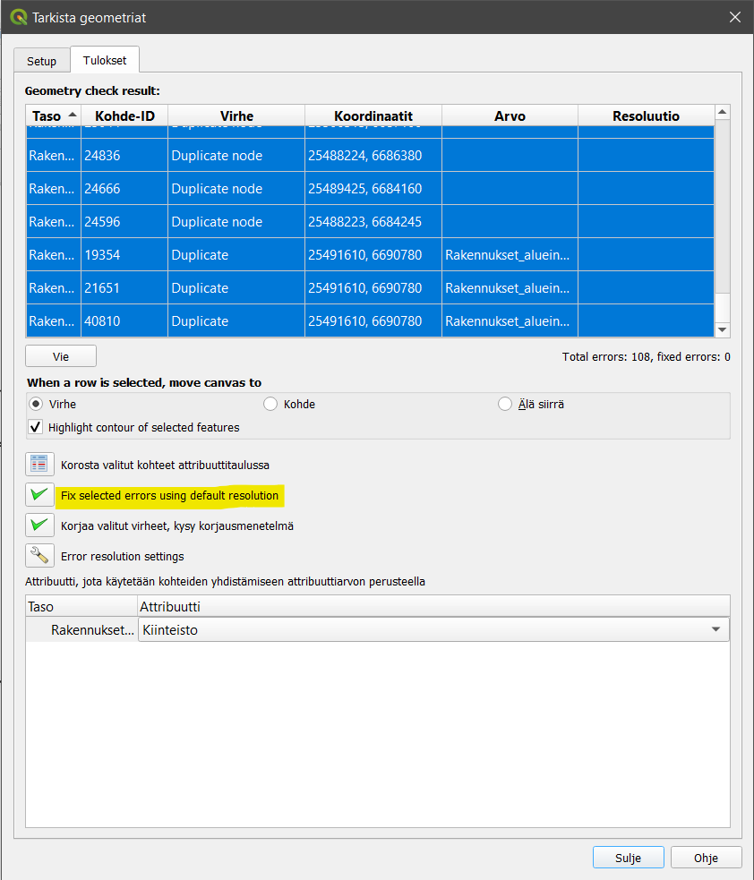
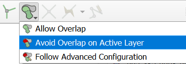

# Harjoitus 4: Topologia ja geometria

**Harjoituksen sisältö**

Harjoituksessa opetellaan käyttämään QGISia topologian ja geometrian tarkistukseen.

**Harjoituksen tavoite**

Harjoituksen jälkeen opiskelija osaa tarkastaa aineistonsa geometrioita ja tehdä niihin manuaalisesti ja automaattisesti tarvittavia korjauksia.

**Arvioitu kesto**

30 minuuttia.

## **Valmistautuminen**

Avaa uusi QGIS-projekti (**Projekti \> Uusi**) ja tallenna se nimellä \"**QGIS-harjoitus 4**\". Lisää projektiin seuraavat aineistot:

-   **Rakennukset_alueina_GK25.shp**

## **Virheellisen aineiston tuonti QGISiin**

**Rakennukset_alueina_GK25-tiedosto** on Helsinki Region Infoshare -sivustolta ladattu avoin aineisto, joka sisältää Vantaan kaupungin rakennukset. Aineiston on kerrottu päivittyvän viikoittain ja sen lähteeksi on merkitty Vantaan kaupungin kiinteistöt ja asuminen, mutta pienellä tarkastelulla huomaamme, että kyseinen aineisto ei ole täysin virheetöntä.

Aineisto näyttää silmämääräisesti olevan kunnossa, mutta entä sen koneluettavuus? Jos aineisto ei ole kaikkien teknisten määritysten mukainen, voi olla että sillä ei pysty esimerkiksi suorittamaan kaikkia spatiaalisia operaatioita tai sen siirrossa formaatista toiseen tulee ongelmia. Tarkastetaan siis onko tässä aineistossa joitain mahdollisia ongelmia. Tähän tarkoitukseen löytyy QGISistä useita erilaisia työkaluja.

## **Tarkista kelpoisuus (Check validity)**

Aloitetaan aineiston koneluettavuuden (= aineiston laadun) tarkistus \"kevyimmällä\" tarkistustyökalulla. Valitse QGISin päävalikosta **Vektori \> Geometria-työkalut \> Tarkista kelpoisuus...**, jolloin QGISiin avautuu **Tarkista kelpoisuus -ikkuna**.

Kyseinen algoritmi tekee kelpoisuustarkistuksen tason geometrioille. Geometriat luokitellaan kolmeen ryhmään (**Kelvollinen tulos, Virheellinen tulos** ja **Virhetuloste**) ja kullekin näistä luodaan uusi taso. Oletusarvoisesti algoritmi käyttää tiukkaa OGC-määritystä polygonin validoinnissa, mutta me emme halua ottaa tiukinta mahdollista määritystä huomioon, joten valitse  **Ignore ring self intersections**. Koska rakennus voi olla geometrialtaan täysin validi vaikka siinä olisi reikä, jätetään kyseiset virheilmoitukset huomiotta. Paina sitten **Suorita**.

QGIS tuottaa oletusasetuksilla kolme väliaikaista tasoa, jotka se lisää projektiin. Saat vielä kohteiden määrän näkyviin klikkaamalla tasoa hiiren oikealla ja valitsemalla **Näytä kohteiden lukumäärä**. Kuten alla olevasta kuvasta näkyy, aineisto sisältää melkoisen määrän virheellisiä geometrioita.

Avaa **Virheellinen tulos -tason** attribuuttitaulu ja tarkastele **\_error-saraketta**. Sarake sisältää selkokielisen kuvauksen virheen luonteesta. Suurin osa virheilmoituksista on **Self-intersection-virheitä**, mikä tarkoittaa että polygoni leikkaa itsensä. Tämä analyysi tuo siis **tiedon virheellisistä kohteista, mutta ei auta niiden korjaamisessa**.

## **Topologian tarkastaja (Topology checker)**

Seuraava vaihtoehto aineiston laatutarkistukseen on **Topologian tarkastaja -työkalu**. Se on QGISin ns. **ytimeen kuuluva lisäosa**, eli se tulee QGISin mukana, mutta sitä ei ole aina aktivoitu. Mene ylävalikosta **Lisäosat \> Hallitse ja asenna lisäosia...** ja kirjoita hakukenttään **\"Topologian tarkastaja\"**. Klikkaa työkalu aktiiviseksi, jolloin se ilmestyy ylävalikon **Vektori-valikkoon**.

**Topologian tarkistin -paneeli** aukeaa seuraavasta **Topologian tarkastaja -kuvakkeesta** . Aineiston topologisen eheyden voi tarkistaa tästä paneelista.

Valitse ensimmäiseksi **Topologian tarkastaja -paneelista Konfiguroi** , jolloin QGISiin aukeaa uusi **Topologiasääntöjen asetukset -ikkuna**. Tässä ikkunassa voidaan määritellä ne säännöt, joiden mukaan QGIS käsittelee aineiston geometrioita. Säännöt voivat koskea vain yhtä tasoa tai ne voivat olla kahden tason välisiä sääntöjä. Sääntöjä voi olla esimerkiksi etteivät kaksi tasoa saa olla päällekkäin. Lisää aineistoon kolme sääntöä kuvan mukaisesti ja paina **OK**.

Klikkaa sitten **Topologian tarkastaja -paneelissa Tarkasta kaikki -kuvaketta** , jolloin QGIS ajaa kaikki äsken listatut säännöt. Minkälaisia tuloksia saat? Tarkastele tuloksia paneelin valikosta.

## **Tarkista geometriat (Geometry checker)**

Kolmas ja järein vaihtoehto geometrioiden tarkistukseen on **Tarkista geometriat -työkalu**. Tämäkin työkalu pitää käydä aktivoimassa edellisen tapaan lisäosien valikoimasta. Tämäkin työkalu ilmestyy ylävalikon **Vektori-valikkoon**.

Kuten heti huomaat kyseisen työkalun valikosta, **Tarkista geometriat -työkalu** antaa ylivoimaisesti laajimman valikoiman validoinnin toiminnallisuuksista. Tehdään kuitenkin perustason tarkastus aineistolle ja etsitään ainoastaan duplikaatteja. Valitse siis kuvan mukaiset asetukset aineiston validoinnissa ja valitse viimeiseksi vaihtoehdoksi (vieritä ikkunaa alaspäin) **Muokkaa syötetasoja**. Paina sitten **Suorita**.

Työkalu ajaa algoritmia hetken, mutta palauttaa sen jälkeen virheilmoitukset havaitsemistaan virheellisistä kohteista. Voit tarkastella yksittäistä virhettä klikkaamalla riviä; kartta zoomautuu oikeaan sijaintiin ja virheellinen kohde korostuu. Virheitä voi korjata yksitellen, mutta myös useamman virheen voi valita ja korjata isomman osion kerralla. Ennen varsinaista virheiden korjausta voit määrittää virheiden ratkaisumenetelmät valitsemalla **Error resolution settings**. Aseta **Duplicate-kohtaan** ratkaisuksi **Remove duplicates**.

Korjaa virheet valitsemalla **Fix selected errors using default resolution**, jolloin QGIS poistaa duplikaattigeometriat, kuten määrittelimme äsken.

Voit lukea lisää työkalusta QGISin dokumentaatiosta: 

<https://docs.qgis.org/3.22/en/docs/user_manual/plugins/core_plugins/plugins_geometry_checker.html>

::: hint-box
Miksi kaikki menetelmät tuottivat niin erilaisia tuloksia ja miksi vaihtoehtoja tarkastukseen on niin monta? Entä mikä olisi omalle aineistollesi paras mahdollinen tapa tarkistukseen?
:::

## **Geometrian ja topologian validointi tasoa muokattaessa**

Voit välttää virheellisten geometrioiden muodostumista jo aineistoa digitoidessa ja editoidessa. Avaa muokattavan tason **Ominaisuudet** -ikkuna ja mene **Digitointi** -välilehdelle. Ruksi aktiivisiksi haluamasi korjaukset.

Nimestään huolimatta tämä toiminto ei tee korjauksia automaattisesti, mutta huomauttaa virheellisistä geometrioista. 

Editoidessa voit hyödyntää myös **Tarttumisen työkalut** -palkin toimintoa päällekkäisten kohteiden digitoinnin välttämiseen.

Kun olet valmis, tallenna projektitiedosto kurssihakemistoon pikanäppäimellä **CTRL + T** (englanninkielisessä QGISissä **CTRL + S**) tai päävalikosta **Projekti \> Tallenna**.

::: hint-box
Psst! Muista tukipalvelu! Koulutuksen jälkeen saat henkilökohtaista tukea Gispon tukipalvelun kautta lähettämällä yksinkertaisesti tuki\@gispo.fi-sähköpostiosoitteeseen kysymyksen tai kommentin jostakin sinua mietityttävästä asiasta. Gispon tiimi auttaa sinua toimiesi äärellä. Kysymykset käsitellään henkilökohtaisesti.
:::