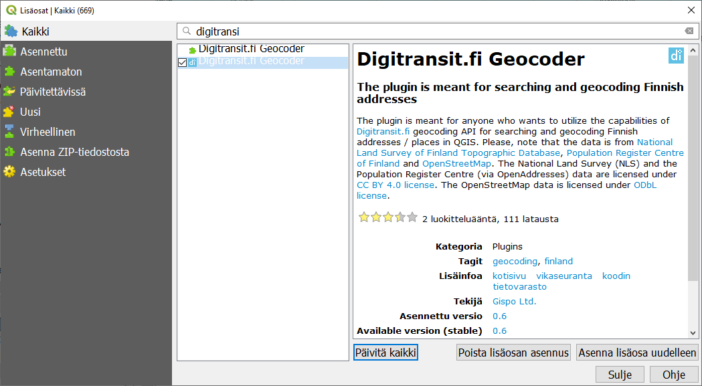
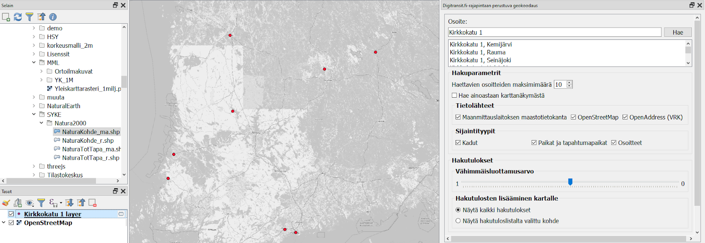

# Harjoitus 5: Geokoodaus

**Harjoituksen sisältö**

Tutustutaan erilaisiin geokoodauksen mahdollistaviin toimintoihin ja lisäosiin.

**Harjoituksen tavoite**

Opiskelija ymmärtää mihin geokoodaus perustuu ja osaa valita omaan käyttöönsä tarkoituksenmukaisen välineen.

**Arvioitu kesto**

20 minuuttia.

## **Valmistautuminen**

Avaa uusi QGIS-projekti (Projekti \> Uusi) ja tallenna se nimellä \"QGIS-harjoitus 5\".

Avaa projektiisi jokin taustakartta, esimerkiksi OpenStreetMap. Löydät sen **Selain**-ikkunan alareunasta XYZ Tiles -valikosta.

## **GeoCoding -lisäosa**

Avaa **Lisäosat** -valikko ja etsi **GeoCoding** -niminen lisäosa. Tutustu sen esittelytekstiin: se voi hyödyntää sekä Googlen että OpenStreetMapin osoitetietoja ja niiden omia hakupalveluita. Asenna lisäosa.

Avaa GeoCoding Lisäosat-valikosta GeoCoding \> GeoCoding.

Testaa, löytääkö lisäosa esimerkiksi kotiosoitteesi. Mikäli useassa kaupungissa on saman niminen katu, GeoCoding kysyy, minkä niistä haluat näyttää kartalla.

Löydetyistä osoitteista syntyy uusi tilapäinen tulostaso projektiisi.

Avaa nyt **GeoCoding-lisäosan** asetukset ja tutustu sen toimintaan. Se hyödyntää kerralla vain yhtä geokoodauspalvelua. Voit myös valita, mihin mittakaavaan kartta zoomautuu onnistuneen haun jälkeen. Vaihda Geocoding Engine toiseen vaihtoehtoon ja kokeile äsken tekemääsi hakua uudestaan. Ovatko tulokset samanlaiset? Uuden haun tulokset lisätään automaattisesti jo olemassa olevaan tulostasoon. Kuten huomaat, **GeoCoding-lisäosaan** voi syöttää vain yhden osoitteen kerrallaan, ja työkalu täytyy avata joka kerta uudelleen. Entä, jos geokoodattavana on pitkä lista osoitteita, esimerkiksi jonkin suuren yrityksen tai organisaation toimipisteet?

## **DigiTransit.fi Geocoder**

Gispon kehittämä **DigiTransit.fi Geocoder -lisäosa** hyödyntää mm. HSL:n Reittioppaan taustalla olevan DigiTransitin geokoodausta. Se käyttää kolmea osoitetietolähdettä: OpenStreetMap, Maastotietokanta ja Väestörekisterikeskus. Lisäksi siihen voi ladata listan osoitteista csv-tekstitiedostona. Osoitetietolähteidensä vuoksi lisäosa toimii vain suomalaisilla osoitteilla. Lisäosa kuuluu QGISin viralliseen lisäosien kirjastoon, joten voit etsiä ja asentaa sen samaan tapaan kuin edellisen lisäosan.

Asentamisen jälkeen **Digitransit.fi-dialogi-ikkuna** aukeaa **Lisäosat-valikosta**. Huomaa, että ikkunassa on enemmän asetuksia, mutta edelleen voit hakea vain yhden osoitteen kerrallaan. Syötä sama osoite kuin edellistä lisäosaa testatessasi. Tämäkin lisäosa luo löytämistään osoitteista uuden tilapäisen tason. Millaisia tuloksia löydät nyt?

Hakeaksesi monta osoitetta kerralla tarvitset **csv-tiedoston**,johon osoitteet on tallennettu. Csv-tiedostoa käytettäessä lisäosa pitää avata yläpalkista **Prosessointi \> Työkalut**. Etsi työkalu kirjoittamalla hakukenttään \"Digitransit\" ja avaa se tuplaklikkauksella.

Valitse kurssihakemistosta tiedosto **CSV/elykeskukset.csv**. Anna työkalulle osoitekenttien nimet, jotta se osaa etsiä csv-tiedostosta osoitteet oikein. Tässä aineistossa osoitekentän nimi on katuosoite ja kunnan paikkakunta, ja ne täytyy muistaa erottaa toisistaan pilkulla. Klikkaa **Suorita** käynnistääksesi prosessoinnin.

Tuloksena syntyy tilapäinen tulostaso. Tarkastele tuloksia kartalla ja attribuuttitaulussa. Alkuperäisessä csv-tiedostossa on 15 riviä, ja kaikille löytyy osoite. Attribuuttitaulusta voit tutkia myös sijaintien luotettavuutta. Minkä ELY-keskuksen sijainti on epätarkin? Zoomaa kohteeseen kartalla. Tämäkin kohde osuu OpenStreetMap-kartassa oikean rakennuksen sisään.

Vastaavanlainen työkalu, osoitteiden geokoodaus csv-tiedostosta, löytyy mm. lisäosasta MMQGIS. Sen tietolähteet ovat Google, OpenStreeetMap, US Census Bureau ja Esri.

Kun olet valmis, tallenna projektitiedosto kurssihakemistoon pikanäppäimellä **CTRL + T** tai päävalikosta **Projekti \> Tallenna**.

::: hint-box
Muista tukipalvelu! Koulutuksen jälkeen saat henkilökohtaista tukea Gispon tukipalvelun kautta lähettämällä yksinkertaisesti tuki\@gispo.fi-sähköpostiosoitteeseen kysymyksen tai kommentin jostakin sinua mietityttävästä asiasta. Gispon tiimi auttaa sinua toimiesi äärellä. Kysymykset käsitellään henkilökohtaisesti.
:::