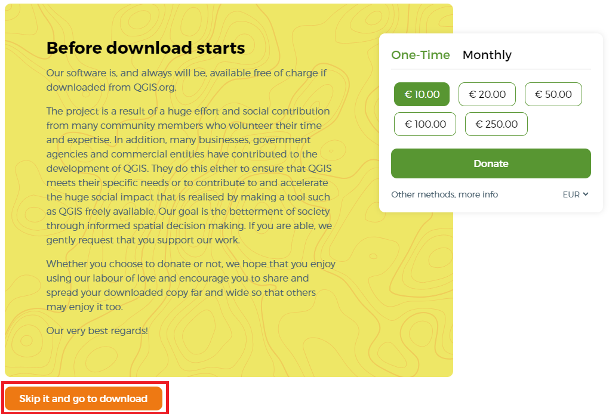
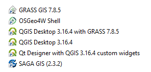

# Harjoitus 1: Koulutusympäristön valmistaminen

**Harjoituksen sisältö**

Harjoituksessa ladataan QGIS ja tallennetaan kurssimateriaalit käytettävälle tietokoneelle.

**Harjoituksen tavoite**

Harjoituksen jälkeen koulutettava osaa asentaa QGISin ja tietää oman kurssihakemistonsa sijainnin.

**Arvioitu kesto**

10 minuuttia.

**Valmistautuminen**
Avaa web-selain ja mene QGISin suomenkielisille verkkosivuille:

:::{.note-box}
http://www.qgis.org/fi/site/
:::


## QGISin lataus ja asennus
Löydät QGISin verkkosivujen etusivulta linkin, jonka avulla pääset lataamaan QGIS-työpöytäohjelmiston. Lataa sivustolta viimeisin **QGIS LTR** (long term release eli pitkäaikaisversio). Pitkäaikaisversio sopii parhaiten ammattikäyttöön, sillä se on vakain QGIS-versio – siitä voi kuitenkin puuttua joitakin uudempien versioiden ominaisuuksia. QGISin voi asentaa Windows-, Linux- tai Mac-käyttöjärjestelmään. Eri järjestelmien QGIS-versioiden välillä huomattavimmat erot ovat väriskeemoissa ja tiedostopoluissa – muuten erot ovat hyvin pieniä.


Avaa tietokoneeltasi sijainti, jonne asennuspaketti latautui ja tuplaklikkaa asennuspaketin kuvaketta asentaaksesi QGIS-paketin tietokoneellesi. Kun asennus on suoritettu, kurkista työpöydälle ilmestyneeseen **QGIS 3.34 -kansioon** ja tarkastele sieltä löytyviä pikakuvakkeita.




QGISin perusasennuspaketin mukana tietokoneellesi asennetaan **QGIS Desktop -perusohjelmiston** lisäksi mm. **QGIS Desktop with GRASS** sekä **SAGA GIS**. Nämä QGISin perusversion mukana tulevat ohjelmistot tuovat QGISin käyttöön lisää erilaisia prosessointi- ja analysointityökaluja.

## Kurssimateriaalien lataus
Kurssilla tarvittavat paikkatieto-aineistot on ladattavissa Google Drivestä linkistä

:::{.note-box}
[Kurssihakemisto.zip](https://drive.google.com/uc?id=12pfk4z7ouTeNe4QZHNI0ZKNx49IlJxEX&export=download)
:::

Avaa yllä oleva linkki ja klikkaa **Lataa**. Tämä lataa aineistot kokonaisuudessaan pakattuna zip-tiedostona **Kurssihakemisto.zip**. 
Pura kurssimateriaalit omalle tietokoneellesi haluamaasi kansioon niin, että löydät ne helposti harjoituksia tehdessä. Kun kurssimateriaalissa viitataan **../kurssihakemisto/**, tarkoitetaan itse määrittelemääsi kurssihakemiston polkua. Kysy tarvittaessa apua kouluttajalta.

## Testaa tietosi...

```{=html}
<iframe src="https://docs.google.com/forms/d/e/1FAIpQLScCmdrM2AzkDkD7dSfw9pV1o9s8bUZDQBI3_ln8Oj3vpcE6Hw/viewform?embedded=true" width="700" height="600" frameborder="0" marginheight="0" marginwidth="0"></iframe>
```