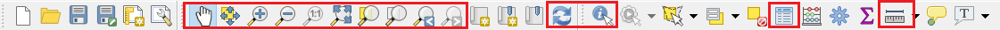
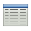
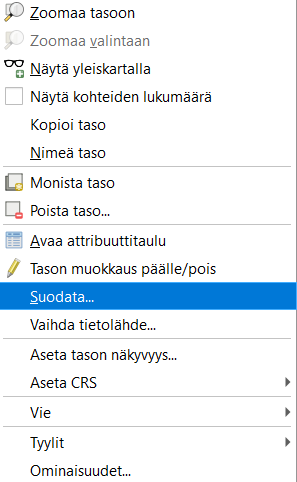

# Harjoitus 2: Paikkatietoaineistot ja QGISin käyttöliittymä

**Harjoituksen sisältö**

Harjoituksessa tutustutaan eri paikkatietoaineistoihin käyttäen
resurssienhallintaa, avataan ensimmäinen paikkatietoaineisto ja
tutustutaan QGISin käyttöliittymän perustoiminnallisuuksiin.

**Harjoituksen tavoite**

Harjoituksen jälkeen koulutettava tuntee paikkatietoaineistojen
perusominaisuudet, osaa tarkastella vektoriaineiston geometriaa ja
ominaisuustietoja QGISissä sekä valita ja suodattaa aineistoa.

**Arvioitu kesto**

30 minuuttia.

**Valmistautuminen** Avaa uusi QGIS-projekti (**Projekti \> Uusi**) ja
tallenna se nimellä "**QGIS-harjoitus 2**".

## Ensimmäinen paikkatietoaineisto

QGISin käyttöliittymä saattaa aueta englanninkielisenä ensimmäisellä
käyttökerralla, mutta voit vaihtaa kielen suomeksi valitsemalla QGISin
ylävalikosta **Settings \> Options** ja tämän jälkeen **General \> User
interface translation \> suomi**. Paina lopuksi **OK**.


Jotta juuri tekemäsi muutos tulee voimaan, sinun tulee käynnistää QGIS
uudelleen.

Tuodaan seuraavaksi paikkatietoaineisto QGISiin. Voit tarkastella
Kurssihakemiston **2. Harjoitus- kansiota** QGISin **Selain-paneelissa** (löytyy
ylhäältä vasemmalta tai, jos se ei ole näkyvillä, klikkaa yläpalkin harmaalla
alueella hiiren oikeaa ja valitse Selain-paneeli).


Lisää nyt **TieViiva.gpkg**-paikkatietoaineisto QGIS-projektiisi joko tuplaklikkaamalla
aineistoa Selain-paneelissa tai valitsemalla **Avaa tietolähteiden
hallinta** . Sama toiminto löytyy myös QGISin
ylävalikon kohdasta **Tasot \> Lisää taso \> Lisää vektoritaso...** . Valitse
avautuvasta **Tietolähteiden hallinta -ikkunasta Vektori-välilehti** ja
lisää **TieViiva-aineisto** kurssihakemistostasi **(../kurssihakemisto/2.
Harjoitus)**. Paina lopuksi **Lisää** ja sulje ikkuna.

{width="70%"}

## QGISin käyttöliittymä

QGISin karttaikkunassa pitäisi nyt näkyä Maanmittauslaitoksen
vektorimuotoinen tieaineisto. Viivan väri saattaa vaihdella, sillä
kuvaustekniikka ei ole kiinteä osa paikkatietoaineistoa -- QGIS luo
satunnaisen värityksen aineistolle kunnes sille luodaan erillinen
kuvaustekniikka.


**1. Työkalupalkit** Työkalupalkit sisältävät nimensä mukaisesti
erilaisia työkaluja. QGIS-työtilassasi saattaa olla näkyvissä enemmän
tai vähemmän työkalupalkkeja, kuin yllä olevassa kuvankaappauksessa.
Napauttamalla hiiren oikea näppäintä työkalupalkkien päällä, voit
piilottaa tai ottaa esiin työkalupalkkeja. Voit myös raahata
työkalupalkkeja eri kohtiin.

**2. Karttaikkuna** Karttaikkunaan piirtyvät ne paikkatietoaineistot,
jotka ovat tasoluettelossa aktivoituna näkyväksi. Voit lähentää ja
loitontaa karttaa sekä paneroida siinä hiiren avulla (koita myös hiiren
scrollia).

**3. Selain-paneeli** Tutustuimmekin jo hieman QGISin Selain-paneeliin.
Tästä paneelista löydät erilaisia kansiopolkuja.

**4. Tasoluettelo** Tähän osioon tulevat näkyviin paikkatietoaineistot,
jotka näkyvät karttaikkunassa. Voit hallita tasojen järjestystä ja
näkyvyyttä.

**5. Hakutoiminto** QGISin hakutoiminnolla löydät kätevästi esimerkiksi
työkalujen ja toimintojen sijainnit.

**6. Tilapalkki** Tilapalkista löydät hiiren kursorin koordinaatit (joko
metreinä tai leveys- ja pituusasteina), mittakaavan, suurennuksen,
kierron, projektin koordinaattijärjestelmän sekä QGISin lokiviestit.
Tilapalkista pääset nopeasti muuttamaan mm. projektin
koordinaattijärjestelmää.

## Kokeile itse

Kokeile nyt vapaasti QGIS-työkaluja. Tarkastele ainakin
**Karttanavigoinnin työkalupalkkien** sekä **Ominaisuustietojen
työkalupalkkien** toiminnallisuuksia:



Paikanna edellä näkyneestä työkalurivistä seuraavat työkalut ja tunnista
niiden tarkoitukset:

|                       |                                  |
|:----------------------|:--------------------------------:|
| Zoomaa täydeksi       |   |
| Zoomaa tasoon         |   |
| Näytä kohteen tiedot  |  |
| Avaa attribuuttitaulu |  |
| Mittaa viivan pituus  |  |

Kokeile myös **tilapalkin** ja **tasoluettelon** toimintoja.


## Paikkatietoaineiston kohteiden valinta

Kokeile työkalua **Valitse kohteet**  .
Klikkaa työkalu aktiiviseksi ja piirrä kartalle suorakaide. Kaikki
Tieviiva-tason elementit, jotka osuvat edes osittain valintarajauksesi
sisään, korostuvat keltaisella.


Avaa nyt **tason attribuuttitaulu** joko
 -painikkeella tai klikkaamalla
tasoluettelossa tasoa hiiren oikealla napilla ja valitsemalla **Avaa
attribuuttitaulu**. Kaikki ne tie-elementit, jotka tulivat kartalta
valituksi, ovat korostuneet taulussa sinisellä. Voit suodattaa
attribuuttitaulun näkymää sen vasemmasta alanurkasta ja näyttää vain
valitut kohteet:


Poista aineiston valinta klikkaamalla **Poista valinnat kaikilta
tasoilta -painiketta**  , joka löytyy
attribuuttitaulun työkalupalkista.

## Paikkatietoaineiston kohteiden suodatus

Suuria aineistoja käsiteltäessä on joskus hyödyllistä suodattaa
karttaikkunassa näkyvän aineiston määrää -- tämä voidaan tehdä
suodattamalla aineistoa sen ominaisuustietojen perusteella. Klikkaa
hiiren oikealla painikkeella **TieViiva-tasoa** ja valitse
**Suodata...**



QGISiin aukeaa **Kyselyn muodostaja** -ikkuna, jossa voit muodostaa
erilaisia suodatuslausekkeita. Kaikki kohteet, jotka täyttävät
lausekkeen ehdon, jäävät näkyviin kartalle -- muut kohteet suodattuvat
pois. **Tietokentät**-kohdassa listataan käytettävissä olevat
ominaisuustiedot (kentät/sarakkeet). Tuplaklikkaamalla riviä se siirtyy
**Suodattimena käytettävä lauseke** -kenttään. Kentän arvoja voit etsiä
oikealta **Otos**- tai **Kaikki**-painikkeella. Suodatetaan nyt
aineistoa niin, että vain tieluokan 1 tieviivat jäävät näkyviin.


Jos suodatinlausekkeesi on muodostettu oikein, klikkaa
**OK**-painiketta. Nyt suurin osa tieviivoista katoaa kartalta ja
attribuuttitaulukin näyttää vain lausekkeen läpäisevät kohteet.
Alkuperäinen koneellesi tallennettu aineisto on edelleen kokonainen:
QGIS vain suodattaa, mitä osia näet siitä.

Suodatusehtoina voit käyttää esim. suurempi kuin -, pienempi tai yhtä
suuri kuin -, tai erisuuri kuin -operaattoreita. Voit myös yhdistellä
eri kenttien ehtoja AND- ja OR-operaattoreilla. Muistutuksena siitä,
että aineistoa on suodatettu, tasoluettelossa näkyy pieni suppilokuvake
 . Tätä kuvaketta klikkaamalla voit
milloin tahansa palata suodatinlausekkeeseen, muokata sitä tai poistaa
sen.


Kokeile vielä toista suodatusehtoa: poista edellinen ehto ja anna
uudeksi ehdoksi "Tienumeron on oltava pienempi kuin 100". Huomaat, että
myös numeroimattomat pikkutiet tulevat mukaan suodatukseen, koska niiden
tienumero on 0. Millä ehdoilla saat nämä numeroimattomat tiet pois
näkymästä?

Kun olet valmis, tallenna projektitiedosto kurssihakemistoon
pikakomennolla **CTRL + T** (englanninkielisellä QGISillä **CTRL + S**)
tai päävalikosta **Projekti \> Tallenna**.

::: hint-box
**Psst! Koulutuksen jälkeen saat henkilökohtaista tukea Gispon
tukipalvelusta. Lähetä kysymyksesi tai kommenttisi osoitteeseen
[koulutustuki\@gispo.fi](mailto:koulutustuki@gispo.fi){.email} !**
:::

## Testaa tietosi...

```{=html}
<iframe src="https://docs.google.com/forms/d/e/1FAIpQLSfmTsA8OF6nD1aS-LWlFrXf030Y8beGVzTgDuLHUJ5P0nCOOA/viewform?embedded=true" width="700" height="600" frameborder="0" marginheight="0" marginwidth="0"></iframe>
```
