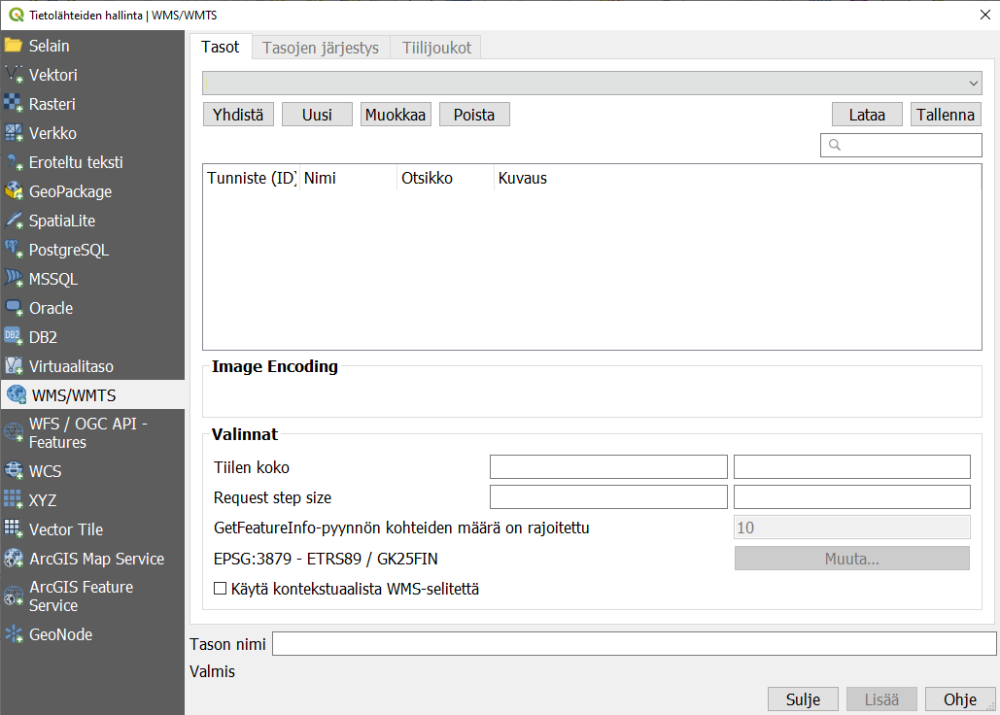
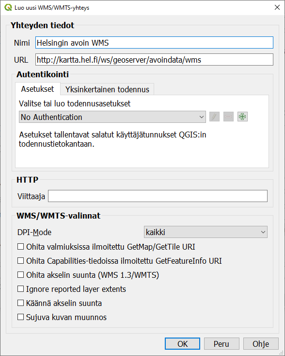
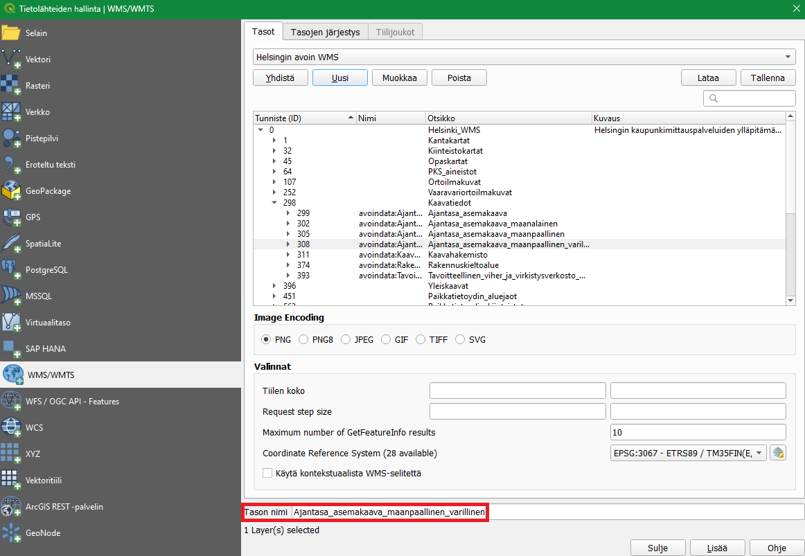
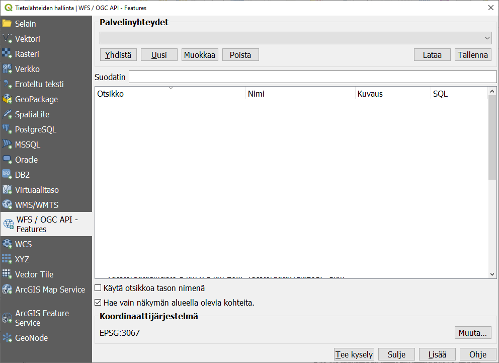

# Harjoitus 3: Paikkatietopalvelut

**Harjoituksen sisältö**

Harjoituksessa lisätään erilaisia paikkatietopalveluita QGISiin.

**Harjoituksen tavoite**

Harjoituksen jälkeen koulutettava osaa lisätä erilaisia paikkatietopalveluita QGISiin.

**Arvioitu kesto**

30 minuuttia.

**Valmistautuminen** Avaa uusi QGIS-projekti (**Projekti \> Uusi**) ja tallenna se nimellä "**QGIS-harjoitus 3**". Tässä harjoituksessa muodostetaan yhteyksiä erilaisiin paikkatietopalveluihin, jonka kautta lisätään rasteri- ja vektoriaineistoja QGIS-projektiin.

## WMS-palvelun lisääminen

Luodaan ensimmäiseksi yhteys WMS (Web Map Service)-paikkatietopalveluun, josta saadaan ensimmäiset rasteriaineistot projektiin. Avaa **Tietolähteiden hallinta** ja valitse **WMS/WMTS-välilehti**.



Tämä työkalu avaa WMS-palvelujen käyttö- ja määrityslomakkeen. QGISissäsi saattaa olla jo määriteltynä joitakin WMS-palveluja. Saat ne auki alasvetovalikosta. Lisätään uusi WMS-palvelu klikkaamalla **Uusi**. Määrittele avautuvassa **Luo uusi WMS/WMTS-yhteys** -ikkunassa haluamasi nimi WMS-palvelulle.

::: hint-box
**Psst! Nimeä paikkatietopalveluyhteydet esimerkiksi aineiston tuottajan (kuten kaupungin) mukaan. Tarkentavana lisätietona voi tarvittaessa olla esimerkiksi aineiston teema.**
:::

Lisää **URL-kenttään** Helsingin kaupungin WMS-palvelun osoite: <http://kartta.hel.fi/ws/geoserver/avoindata/wms>. Jotkin paikkatietopalvelut voivat vaatia kirjautumisen palveluun, mutta avoimet aineistot eivät -- jätä siis **No Authentication** aktiiviseksi.

{width="331"}

Kun yhteyden tiedot on määritelty, paina **OK**. Paina vielä **Tietolähteiden hallinta** -ikkunassa **Yhdistä**. Nyt QGIS muodostaa yhteyden määriteltyyn paikkatietopalveluun ja ikkunaan ilmestyy listaus palvelun paikkatietoaineistoista. Huomaa, että listauksessa on alatasoja. Jatkossa QGIS muistaa tallennetut yhteydet.


Valitse saatavilla olevista aineistoista **Ajantasa_asemakaava_maanpaallinen_varillinen**. Voit vaihtaa QGIS-projektiin lisättävän tason nimen haluamaksesi kohdassa Tason nimi. Paina lopuksi **Lisää**, niin QGIS lisää tason projektiisi.



Huomaa, että voit joutua odottamaan hetken, kun karttatasoa ladataan palvelimelta. Voit nyt sulkea **Tietolähteiden hallinta** -ikkunan ja palata karttaikkunaan. Karttaikkunassasi pitäisi nyt näkyä Helsingin kaupungin värillinen asemakaava-aineisto rasteritasona.


Luo nyt muutama WMS-paikkatietopalveluyhteys lisää. Voit käyttää hyväksesi Gispon ylläpitämää listausta avoimista paikkatietopalveluista osoitteessa <https://www.gispo.fi/blogi/avoimen-datan-wms-ja-wfs-karttapalveluita/>. Lisää esimerkiksi seuraavat yleishyödylliset WMS-palvelut QGIS-projektiisi:

**Tilastokeskus (väestöruutuaineisto)**: <http://geo.stat.fi/geoserver/vaestoruutu/wms>

**Väylävirasto**: <https://julkinen.vayla.fi/inspirepalvelu/avoin/wms>

**SYKE**: <https://paikkatieto.ymparisto.fi/ArcGIS/services/INSPIRE/SYKE_Maanpeite/MapServer/WMSServer>

Voit navigoida lisäämiesi WMS-paikkatietopalveluiden välillä Tietolähteiden hallinta -ikkunan WMS/WMTS-välilehden ensimmäisen alasvetovalikon avulla.


Kun olet valinnut haluamasi paikkatietopalvelun, muista klikata **Yhdistä** alasvetovalikon alapuolelta. Paikkatietopalveluiden aineistot eivät tule automaattisesti näkyviin pelkän palveluvalinnan kautta, vaan siihen on erikseen luotava vielä yhteys.

## WFS-palvelun lisääminen

Luodaan seuraavaksi yhteys WFS (Web Feature Service)-paikkatietopalveluun, jonka kautta QGIS-projektiin saadaan lisättyä erilaisia vektoriaineistoja. WFS-palveluihin yhdistäminen tapahtuu muuten samalla tavalla kuin WMS-palveluihin yhdistäminen, mutta WMS/WMTS-välilehden sijaan on valittava WFS-välilehti. Avaa siis jälleen **Tietolähteiden hallinta \> WFS-välilehti** tai klikkaa suoraan **Tasojen hallinnan työkalupalkista** löytyvää **Lisää WFS-taso** -painiketta .



::: hint-box
**Psst! WFS-paikkatietopalvelussa pystyt lataamaan aineiston tai osan aineistosta erilaisten lausekkeiden avulla.**
:::

Luo uusi yhteys alla listattuihin WFS-paikkatietopalveluihin tai valitse haluamasi palvelut aikaisemmin mainitusta Gispon ylläpitämästä listauksesta.

-   **Tilastokeskus (väestöruutuaineisto)**: <http://geo.stat.fi/geoserver/vaestoruutu/wfs>

-   **Väylävirasto**: <https://julkinen.vayla.fi/inspirepalvelu/avoin/wfs>

-   **Jyväskylän yliopisto (liikuntapaikat)**: <http://lipas.cc.jyu.fi/geoserver/lipas/ows>

Kun olet lisännyt WFS-paikkatietopalvelun tiedot QGISiin, voit ottaa siihen yhteyden samalla tavalla kuin WMS-palveluiden yhteydessä. Kun lisäät aineistoja WFS-palveluista QGIS-projektiisi, voit huomata, että aineistot ovat vektorimuotoisia. Jos haluat käsitellä WFS-palvelun kautta lisäämääsi aineistoa (esimerkiksi editoida kohteita), täytyy se tallentaa lokaalisti omalle tietokoneellesi.

## Paikkatietopalvelujen tallentaminen

QGIS tallentaa automaattisesti siihen lisätyt paikkatietopalvelut käyttämääsi QGIS-profiiliin. Eli kun seuraavan kerran avaat QGISin samalla käyttäjäprofiililla, paikkatietopalvelut löytyvät valmiiksi Tietolähteiden hallinnan WMS/WMTS- ja WFS-välilehdiltä. Paikkatietopalvelut on kuitenkin myös mahdollista tallentaa erilliseksi XML-tiedostoksi, jonka voit ladata toiseen QGIS-käyttäjäprofiiliin tai jakaa eteenpäin muille kollegoille käytettäväksi. Avaa **Tietolähteiden hallinta** ja valitse **WFS-välilehti**. Klikkaa **Tallenna**-painiketta.


QGISiin avautuu **Hallitse yhteyksiä** -ikkuna, jossa on listaus kaikista QGISiin lisätyistä WFS-palveluista. Voit tallentaa palveluita yksitellen tai viedä kaikki yhteydet yhteen XML-tiedostoon. Haluamme nyt tallentaa kaikki yhteydet samaan tiedostoon, joten klikkaa **Valitse kaikki** ja tämän jälkeen paina **Vie**.


Tallenna yhteydet haluamaasi sijaintiin omalla tietokoneellasi. Koita tämän jälkeen ladata tämä XML-tiedosto klikkaamalla **Lataa Tietolähteiden hallinta** -ikkunassa.


Voit valita aukeavassa **Hallitse yhteyksiä** -ikkunassa erikseen yhteydet, jotka haluat lisätä käyttämääsi QGIS-profiiliin ja QGIS-projektiin.

Kun olet valmis, tallenna projektitiedosto kurssihakemistoon pikanäppäimellä **CTRL + T** (tai **CTRL + S**) tai päävalikosta **Projekti \> Tallenna**.

::: hint-box
**Psst! Koulutuksen jälkeen saat henkilökohtaista tukea Gispon tukipalvelusta. Lähetä kysymyksesi tai kommenttisi osoitteeseen [tuki\@gispo.fi](mailto:tuki@gispo.fi){.email}!**
:::

## Testaa tietosi...

```{=html}
<iframe src="https://docs.google.com/forms/d/e/1FAIpQLSd_auuC6qnUoYGoOcL1sZjQY8_jpLOEUFSLoOD9tM7B98zAuA/viewform?embedded=true" width="700" height="600" frameborder="0" marginheight="0" marginwidth="0"></iframe>
```
