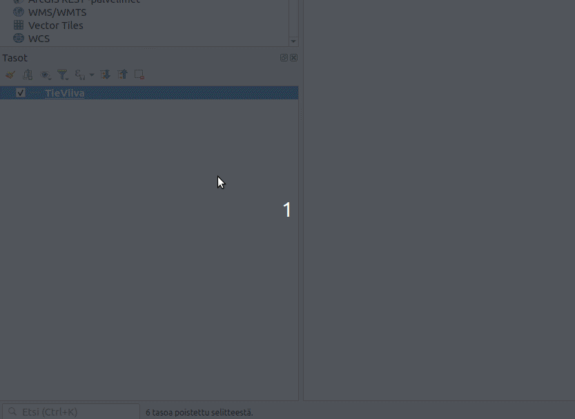
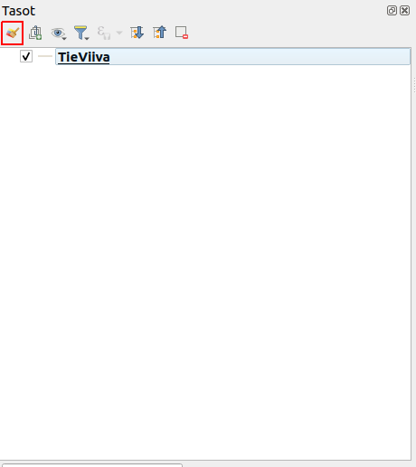
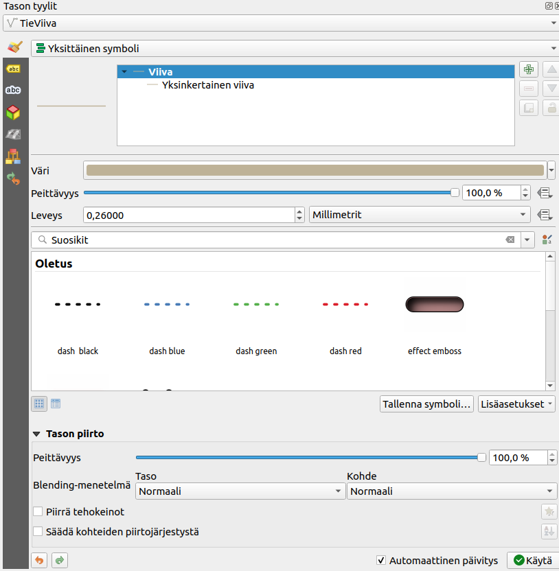
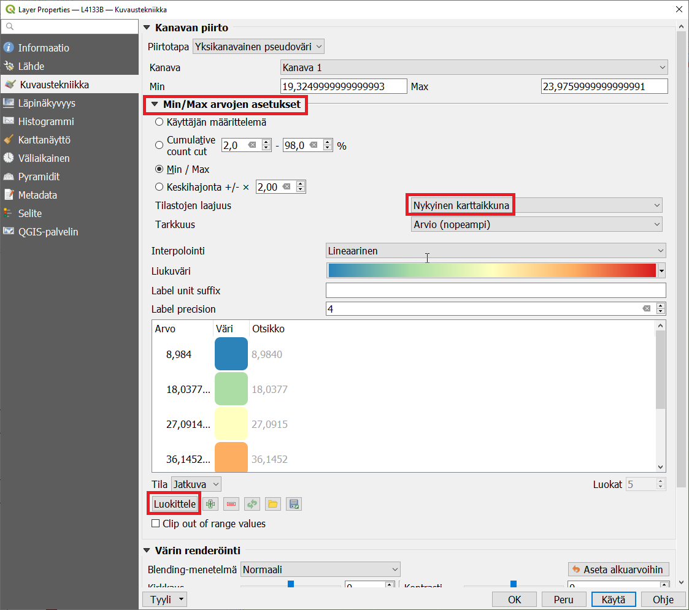
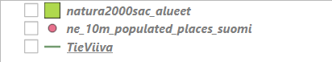
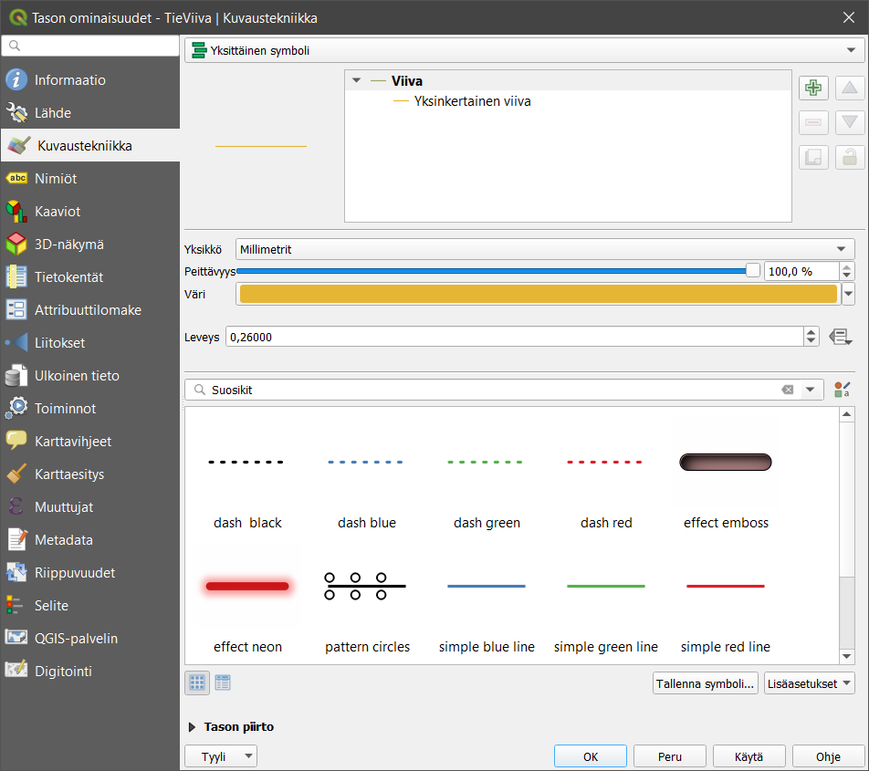
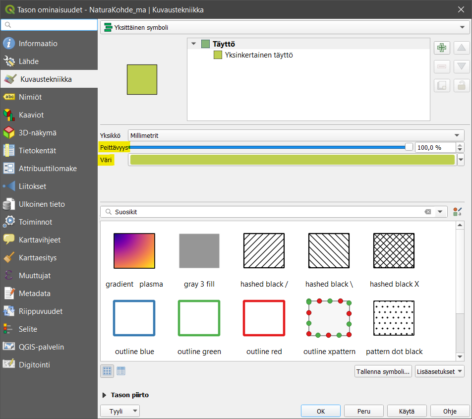
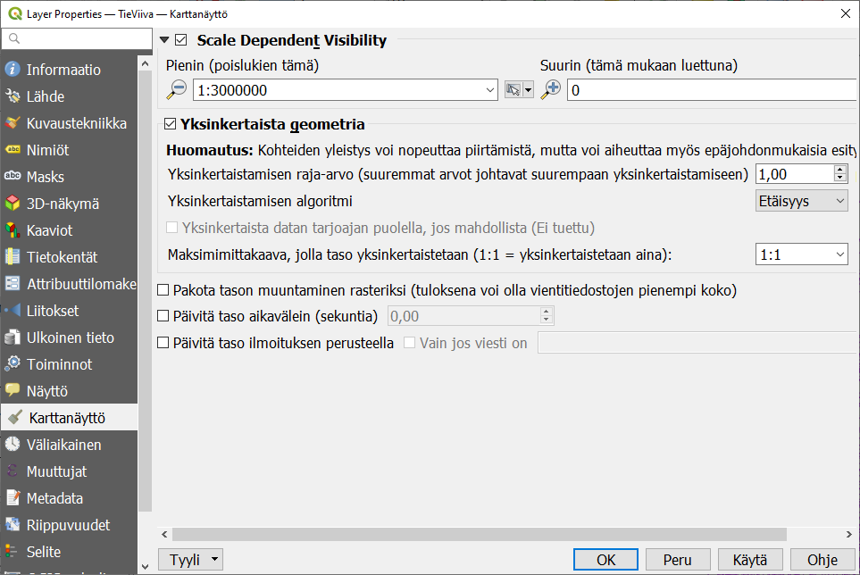
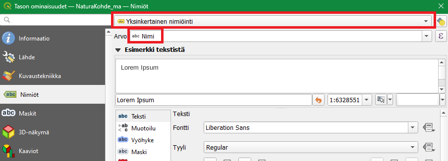
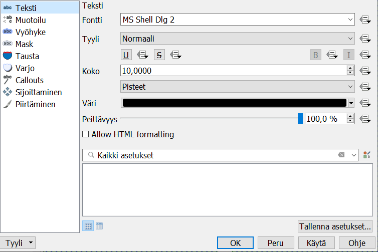

# Harjoitus 5: Paikkatietoaineiston visualisointi ja nimiöinti

**Harjoituksen sisältö**

Harjoituksessa tutustutaan eri rasteri- ja vektoriaineistoihin ja niiden perusvisualisointitekniikoihin sekä vektoriaineistojen nimiöintitoimintoihin.

**Harjoituksen tavoite**

Harjoituksen jälkeen opiskelija tuntee eri paikkatietoaineistojen visualisoinnin perustyökalut ja osaa lisätä vektoriaineistoon haluamansa nimiöt.

**Arvioitu kesto**

60 minuuttia.

**Valmistautuminen**

Avaa uusi QGIS-projekti (**Projekti \> Uusi**) ja tallenna se nimellä **"QGIS-harjoitus 5"**. Lisää projektiin seuraavat aineistot:

-   **..kurssihakemisto/5. Harjoitus/L4133B.asc**

-   **..kurssihakemisto/5. Harjoitus/TieViiva.shp**

-   **..kurssihakemisto/5. Harjoitus/ne_10m_populated_places_suomi.shp**

-   **..kurssihakemisto/5. Harjoitus/Naturakohde_ma.shp**

## Tasojen visualisoinnin valikko

Tasojen visualisointia ja nimiöintiä määritetään QGISin kuvaustekniikkavalikossa. Tämän valikon käyttöön on kaksi vaihtoehtoa:

1. Avaamalla **Tason ominaisuudet**- valikko:



2. Avaamalla **Tyylipaneeli**:

    2.1 Klikkaa Tasot- paneelista **"Avaa tason tyylit- paneeli"**
    
    
  
    2.2 Tämän pitäisi avata tyylipaneeli, yleensä QGIS- ikkunan oikeaan reunaan:
    
    

Molemmilla tavoilla saat saman valikon auki. Tyylipaneelissa on oletusvaihtoehtona "Automaattinen päivitys", joka tarkoittaa että kuvaustekniikkaan tehdyt muutokset näkyvät välittömästi kartalle. Kun valikon avaa **Tason ominaisuudet**- valikon kautta, tulee tyyli erikseen päivittää **Käytä** painikkeesta, sekä hyväksyäksesi muutokset tulee lopuksi klikata **OK**- painiketta.

Kokeile avata valikko molemmilla keinoilla. Seuraavissa harjoituksissa voit käyttää menetelmää, joka tuntuu paremmalta.

## Rasteriaineiston visualisointi

Aseta nyt **L4133B-rasteriaineisto** näkyväksi ja piilota muut aineistot. L4133B.asc on Maanmittauslaitoksen avoin korkeusmalliaineisto, joka sisältää osan Helsingistä. Jos aineisto avautuu tuntemattomassa koordinaattijärjestelmässä (= virheellisessä projektiossa), aseta tasolle koordinaattijärjestelmäksi **ETRS89/TM35FIN (EPSG:3067)**. Muista tarkistaa myös projektin koordinaattijärjestelmä. Oletuksena korkeusmalli näyttää tällaiselta:


Huomaa, että QGIS on tunnistanut, että aineisto sisältää jatkuvia arvoja ja on visualisoinut ne yksittäisenä harmaana kanavana. Oletusvärityksellä onnistut erottamaan Pasilan ratapihan oikeassa yläkulmassa.


Avaa tason **Kuvaustekniikka-asetukset**. Muista, että rasteriaineistojen kuvaustekniikkatyökalut ovat erilaiset kuin vektoriaineistoilla. Voit vaihtaa harmaasävyesityksen **pseudoväreiksi**. Voit kokeilla myös **rinnevarjostetta**.



## Vektoriaineistojen visualisointi

Siirrytään nyt visualisoimaan vektoriaineistoja. Tarkastele kaikkia QGIS-projektiin avaamiasi vektoriaineistoja. Voit huomata, että jokaisen tason vasemmalla puolella on muoto, joka kuvastaa kyseisen tason vektorityyppiä. **TieViiva** on viiva-aineisto, **ne_10m_populated_places_suomi** on pisteaineisto ja **NaturaKohde_ma** on polygoniaineisto.



## Viiva-aineiston visualisointi

Aseta **TieViiva**-aineisto näkyviin ja piilota muut aineistot. Avaa TieViiva-aineiston kuvaustekniikkavalikko. Voit huomata, että vektoritason tyyliominaisuudet ovat erilaiset kuin rasteritason.



Vaihda TieViiva-aineiston **Väri ja Leveys** haluamaksesi. Avaa vielä jokin symbolikirjasto, esimerkiksi **Suosikit**, ja muuta viivan tyyliksi jokin sinua miellyttävä tyyli. Paina lopuksi **OK**, jolloin ikkuna sulkeutuu ja TieViiva-taso näkyy nyt määrittämälläsi kuvaustekniikalla.


Eri vektoriaineistotyypeillä (piste, viiva, polygoni) on erilaiset kuvaustekniikan työkalut, vaikkakin ne muistuttavat paljon toisiaan. Esimerkiksi pistetasolle ei voida tehdä samoja tyylittelyjä kuin viiva- tai polygonitasolle.

## Pisteaineiston visualisointi

Visualisoidaan seuraavaksi piste-aineistoa. Aseta **ne_10m_populated_places_suomi**-aineisto näkyviin yhdessä TieViiva-aineiston kanssa ja piilota muut aineistot. Tämä aineisto sisältää Natural Earth -kaupunkiaineiston Suomesta. Avaa tason **Kuvaustekniikka**- valikko. Huomaa erot viiva- ja pisteaineiston ominaisuuksissa. Vaihda aineiston **Väri ja Koko**. Vaihda myös symbolia ja kokeile, miten kierto vaikuttaa symbolin näkymiseen.


Pisteaineistosi voi näyttää yhdessä viiva-aineiston kanssa esimerkiksi tältä:


## Polygoniaineiston visualisointi

Visualisoidaan vielä polygoniaineisto. Aseta **NaturaKohde_ma**-aineisto näkyviin yhdessä **TieViiva**-aineiston ja **ne_10m_populated_places_suomi**-aineiston kanssa ja piilota muut aineistot. Avaa NaturaKohde_ma-aineiston **Kuvaustekniikka**-valikko ja huomaa erot verrattuna viiva- ja pisteaineistojen kuvaustekniikkaan. Vaihda tason **Väri** ja valitse tasolle eri symboli. Voit myös kokeilla erilaisia **Peittävyys**-arvoja.



Saattaa olla, että aineistotasot peittävät toisensa vaikka siten, että polygoniaineisto peittää muut sen alle jäävät aineistot. Voit muuttaa tasojen järjestystä ja siten tasojen näkymistä raahaamalla/vetämällä tasot uuteen järjestykseen **Tasot**-paneelissa. Usein polygoniaineistot on hyvä jättää alimmiksi tasoiksi. Jos kartalla halutaan visualisoida jotakin rasterikuvaa, kannattaa se/ne yleensä pitää myös alimpina tasoina. Uudelleen järjestettynä karttasi tulisi näyttää tältä:


## Symbolien muokkaaminen

Seuraavaksi muutamme polygonien symboleja. Avaa uudelleen **Naturakohde_ma**-tason **Kuvaustekniikka**-valikosta ensin **Yksinkertainen täyttö (Simple fill)** -rivi oheisen kuvan mukaisesti:


Valitse sen jälkeen **Viivan tyyli** -asetukseksi **Katkonainen pisteviiva**. Voit määritellä viivan leveyden haluamaksesi. Lopuksi voit vielä muuttaa **Peittävyys**-asetukseksi 70 % (**Tason piirto** -asetuksista).

## Mittakaavan käyttö symboleissa

Seuraavaksi määrittelemme mittakaavarajat **Tieviiva**-tasolle. Valitse tason **Ominaisuudet \> Karttanäyttö** ja rastita **Scale Dependent Visibility** (mittakaavaperusteinen näkyvyys). Muuta sitten **Pienimmäksi mittakaavaksi 1:3 000 000**. Tämä tarkoittaa sitä, että kun kartan mittakaava on pienempi kuin 1:3 000 000, niin karttatasoa ei piirretä.



Kokeile nyt karttaikkunassa tason näkymistä eri mittakaavoilla. Mittakaavaa saat muutettua lähentämällä tai loitontamalla karttaa (esim. hiiren rullalla). Voit myös syöttää mittakaavan lukuna QGISin alaosassa sijaitsevassa **Tilapalkissa**.

## Symbolitasojen muokkaaminen

Seuraavaksi muokkaamme visualisointityyliämme hieman pidemmälle. Symbologiat voivat QGISissä koostua yhdestä tai useammasta symbolitasosta (kuvassa **Täyttö**-kohdan alla). Esimerkiksi monikulmioiden symbolitasojen hyödyntäminen voi tuottaa hyvinkin hienovaraisen visualisoinnin. Symbolitasojen avulla voidaan määrittää monikulmion täyttämisen värit ja tyylit (esim. pistetäyttö).

Lisää uusi symbolitaso **NaturaKohde_ma**-tasolle. Avaa tason **Kuvaustekniikka**-asetukset (**Tason ominaisuudet -ikkunasta**) ja lisää uusi symbolitaso painamalla plussa-kuvaketta.


Muuta lisätyn symbolitason tyypiksi **Täyttö viivakuosilla** ja määrittele viivakuvioinnin kulma ja etäisyys haluamallasi tavalla. Voit myös määritellä viivakuvioinnissa käytetyn viivan leveyden ja värin valitsemalla **Viiva**-symbolitason tyylitasoluettelosta. Tarkista lopputulos.


## Nimiöinti

Avaa **NaturaKohde_ma-tason** kuvaustekniikka- valikko ja valitse **Nimiöt-välilehti**. Valitse **Yksittäinen nimiö** ja **Nimiöiden perustana -alasvetovalikosta** nimiöinnissä käytettävän sarakkeen nimi. Nimiöt nähdään nyt karttaikkunasta, johon ne ovat päivittyneet.



## Nimiöiden tyyli- ja yleisasetukset

Nimiöiden tekstien näkymistä kartalla voi määrittää monella eri tavalla. Alla kuvaukset QGISin nimiöiden muokkaamisen alateemoista:

|                   |                                                                                         |
|------------------|------------------------------------------------------|
| **Teksti**        | Määritellään tekstin tyyli, väri ja muita yleisiä ominaisuuksia.                        |
| **Muotoilu**      | Voit muodostaa useampirivisiä tekstejä, keskittää tekstiä ja määritellä lukujen muotoa. |
| **Vyöhyke**       | Luodaan tekstiä korostavat puskurit (tekstin reunukset).
| **Maski**       | Asetetaan maski tekstin ympärille valituilla tasoilla (katso myös Maski-välilehti)|
| **Tausta**        | Tekstin taustalle voi piirtää suorakulmion tai muun muodon.                             |
| **Varjo**         | Teksteille voidaan muodostaa varjo.                                                     |
| **Osoitinviiva**         | Piirretään viivaa kohteesta tekstille.                                                     |
| **Sijoittaminen** | Määrittelee tekstien sijoittumista kohteiden suhteen.                                   |
| **Karttanäyttö**   | Määrittelee tekstien mittakaavarajoja ja muita tekstien näkyvyyteen liittyviä asioita.  |

## Nimiön tekstityyli



Nimiöiden tekstien tyyleille voit asettaa esimerkiksi haluamasi fontin, tyylin ja koon. Kokeile erilaisia tekstityylejä. Kokeile nimiöiden varjostamista, minkä avulla voimme korostaa nimiöitä taustalla olevista muista karttaelementeistä. Valitse **Varjo**-alateema ja rastita sitten **Piirrä heittovarjo**. Paina **Käytä**, jotta näkisit tulokset kartalla. Kokeile vaihtaa asetuksia kuten siirtymä, sumennussäde, peittävyys sekä väri, ja katso miten ne vaikuttavat nimiöinnin varjoon. Huomaat muutokset kartalta tai **Esimerkki tekstistä** -kentästä.

Toinen työkalu tekstin korostamiseen on tekstiä ympyröivä vyöhyke. Valitse **Vyöhyke**-alateema ja lisää tekstille haluamasi puskuri rastimalla **Piirrä tekstivyöhyke**. Näin saat nimiöt erottumaan kartasta vielä paremmin. Kokeile erilaisia vyöhykkeen kokoja, värejä ja läpinäkyvyyttä.

Avaa vielä **Sijoittaminen**-alateema ja valitse **Using perimeter (käyttäen kehää)**. Valitse **Sallitut asemoinnit** -kohdassa **Viivan alla**. Huomaa, että **Sallitut asemoinnit** -kohdassa tulee aina olla vähintään yksi kohta valittuna. Jos useampi kohta on valittu, QGIS valitsee automaattisesti parhaan vaihtoehdon jokaiselle kohteelle. Paina **OK**, ja huomaa, että nyt nimiöt seuraavat monikulmioiden rajoja.


Tulos voi näyttää oudolta, etenkin jos karttaikkunan mittakaavaa on asetettu ison alueen kattavaksi. Lähennä karttaa, jotta nimiöt näkyisivät johdonmukaisemmin ja pohdi, missä tapauksessa tämänkaltainen nimiöinti olisi sopivinta. Etsi vielä **Sijoittaminen \> Prioriteett**i ja määritä se **Korkeaksi**. Tällä tavalla annat preferenssin muokkaamasi tason nimiöille suhteessa muiden tasojen nimiöihin ja voit näin järjestää tärkeimpien ja ei niin tärkeiden tasojen nimiöintiä. Paina vielä **OK**.

::: hint-box
Psst! Yksi hyödyllinen tapa rajata nimiöitä on **Karttanäyttö \> Kohteen valinnat** ja asettaa kohtaan **Häivytä nimiöinti kohteilta, jotka ovat pienempiä kuin**-kohtaan jokin arvo. Näin QGIS näyttää vain isoimpien kohteiden nimiöinnit.
:::

## Nimiöinnit viivatasoilla

Samalla tavalla kuin juuri määritimme nimiöinnin monikulmiotasolle, voidaan niitä määrittää muillekin vektoriaineistoille. Avaa **TieViiva-tason** kuvaustekniikka- valikko ja aktivoi nimiöiden käyttö päälle edellisessä harjoituksessa oppimallasi tavalla. Valitse **Nimiöiden perustan** -kohdan alavalikosta käytettäväksi nimiöintisarakkeeksi **Tienumero**. Paina **Käytä**, ja katso muutokset. Avaa vielä nimiöiden **Sijoittaminen**-alateema ja rastita **Seuraa viivaa** -toiminto päälle. Paina **Käytä**, ja tarkista, että nimiöinti toimii odotetulla tavalla. Katso esimerkkiasetukset kuvasta:


Nyt nimiöt seuraavat viivoja paremmin. Huomaa myös, että kaikki nimiöt eivät nyt tule piirretyksi. Vaihda **Maksimikulma kaarevien merkkien välillä** -kohdan arvoja, niin pystyt muokkaamaan tekstin kaarevuuden reunaehtoja. Voit sulkea **Tason ominaisuudet**-ikkunan totuttuun tapaan painamalla **OK**.

## Nimiöiden piirtäminen

Zoomaa karttanäkymä näyttämään koko aineisto klikkaamalla **Zoomaa täydeksi** -painiketta  . Odota hetki, että nimiöt piirtyvät. Nimiöitä on nyt liikaa karttaikkunassa, mikä vaikeuttaa kartan hahmottamista. Olisi hyödyllistä määrittää nimiöt eri mittakaavoille erikseen. Avaa taas **NaturaKohde_ma-tason** ominaisuudet ja valitse **Nimiöt** sivupalkista ja **Karttanäyttö-alateema**. Rastita **Näytä kaikki tämän tason nimiöt (myös päällekkäiset nimiöt)** ja paina **Käytä**. Nimiöiden piirtämiseen menee hetki, koska kaikki kartalla näkyvät monikulmiot nimetään. Kun kartta on piirtynyt huomaat, ettei kannata nimiöidä kaikkia monikulmioita kyseisellä mittakaavalla. Rastita tämä asetus pois päältä ja paina **Käytä**. Huomaa, että oletuksena QGIS jättää piirtämättä toisiinsa törmäävät nimiöt.

Rastita päälle **Mittakaavaperusteinen näkyvyys** ja laita **Minimimittakaava-kentän** arvoksi **500 000**. Paina **OK**. Natura-kohteiden nimiöt eivät enää näy 1:500 000 mittakaavan ulkopuolella. Lähennä karttaan, kunnes nimiöt näkyvät uudelleen. Muuta samalla tavalla **TieViiva-tason** piirtäminen siten, että sen nimiöt näkyvät vasta kun mittakaava on pienempi kuin **1:200 000**.


## Edistyneet ominaisuudet

Voit myös testata tekstien edistyneitä ominaisuuksia **NaturaKohde_ma** -tasolla. Voit ohjata nimiöiden tekstejä lausekepohjaisesti QGISin **Lausekkeen muokkaus** -työkalulla. Saat lausekkeen muodostajan auki **Nimiöiden perustana -alasvetolaatikon** vieressä olevasta painikkeesta:


Tehdään nyt nimiö, joka yhdistää tietoa useammasta kentästä. Klikkaa kuvassa näkyvästä **Lausekkeen muodostaja** -painikkeesta. **Lausekkeen muokkaus -työkalu** aukeaa.


Lausekkeen muokkaus on tehokas työkalu, jota voidaan käyttää nimiöiden muokkaamisen lisäksi myös muihin tarkoituksiin. Lauseke-kentässä on tällä hetkellä nimi, sillä valitsimme **Nimi**-kentän aikaisemmin **Nimiöiden perustana** -alasvetovalikosta. Aineistossa on myös kenttä **NaturaTunn**, joka sisältää alueen tunnuksen. Tehdään lauseke, joka yhdistää alueen nimen ja tunnuksen.

Kirjoita Lauseke-kenttään seuraava lauseke:

::: code-box
NaturaTunn \|\| \'\\n\' \|\| Nimi
:::

Lausekkeessa esiintyy kentän nimien **NaturaTunn** ja **Nimi** lisäksi myös rivinvaihtosymboli **'**\n' ja kaksi **\|\|** -merkkiä, jotka yhdistävät merkkijonot yhdeksi tekstiksi.


::: hint-box
**Psst! Voit lisätä rivinvaihtosymbolin lausekkeeseen painamalla **Lauseke**-ikkunan päällä olevaa painiketta. Samalla tavalla voit lisätä aineistossa olevia kenttiä lausekkeeseen laajentamalla kentät ja arvot -valikon ja kaksoisklikkaamalla kentän nimeä.**
:::

Kirjoita edellä mainittu lauseke ja paina **OK**. Klikkaa **Tason ominaisuudet** -valikossa **Käytä** ja katso kartalta, miltä alueiden nimiöinti näyttää.

Kun olet valmis, tallenna projektitiedosto kurssihakemistoon pikanäppäimellä **CTRL + T** (tai **CTRL + S**) tai päävalikosta **Projekti \> Tallenna**.

::: hint-box
**Psst! Koulutuksen jälkeen saat henkilökohtaista tukea Gispon tukipalvelusta. Lähetä kysymyksesi tai kommenttisi osoitteeseen [koulutustuki\@gispo.fi](mailto:koulutustuki@gispo.fi){.email}!**
:::

## Testaa tietosi...

```{=html}
<iframe src="https://docs.google.com/forms/d/e/1FAIpQLSc49QLiPPf5Spu7oSlkcNXLF4opnHGN5UVCfw8RRVIXoDUCxQ/viewform?embedded=true" width="700" height="600" frameborder="0" marginheight="0" marginwidth="0"></iframe>
```
