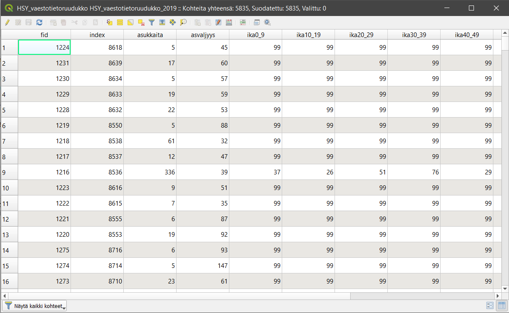
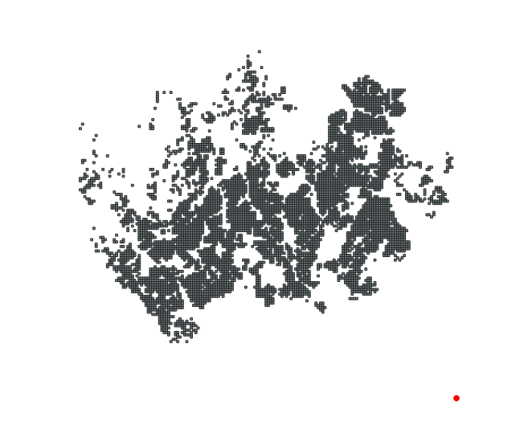
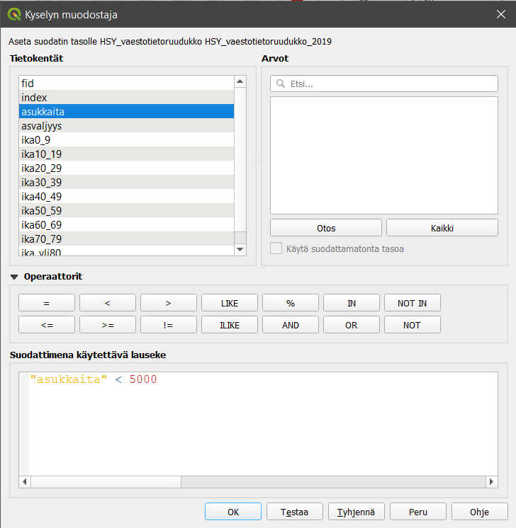
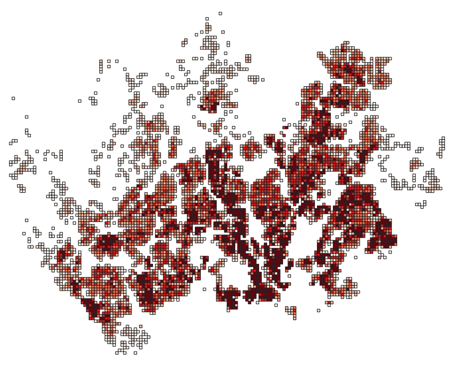
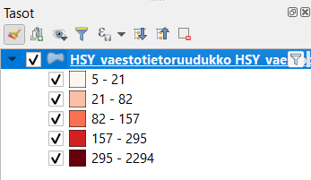
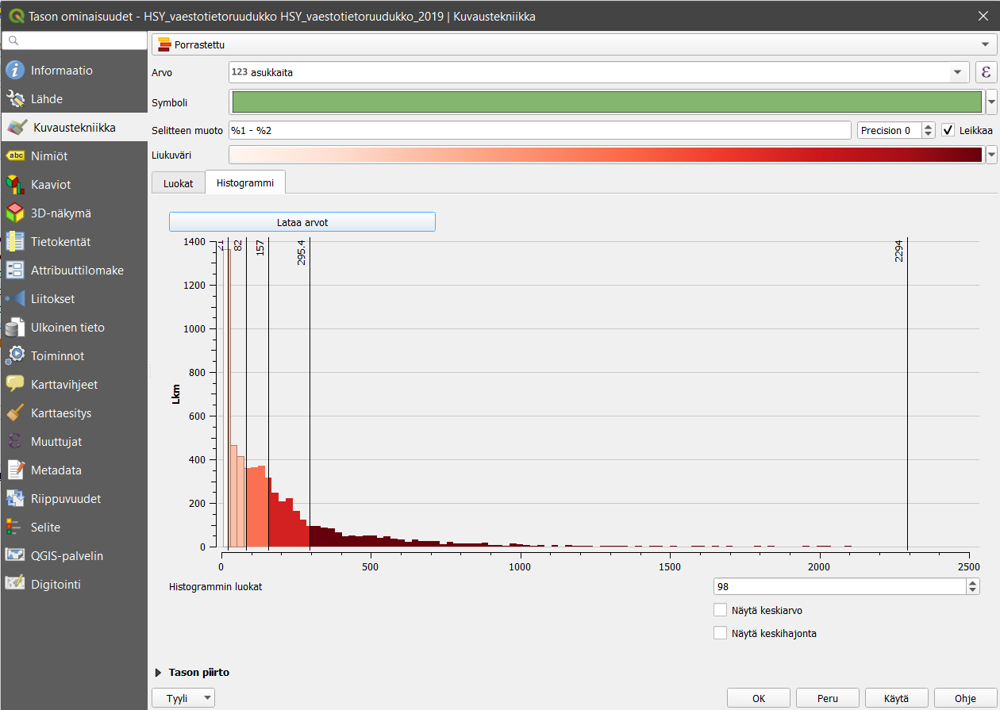
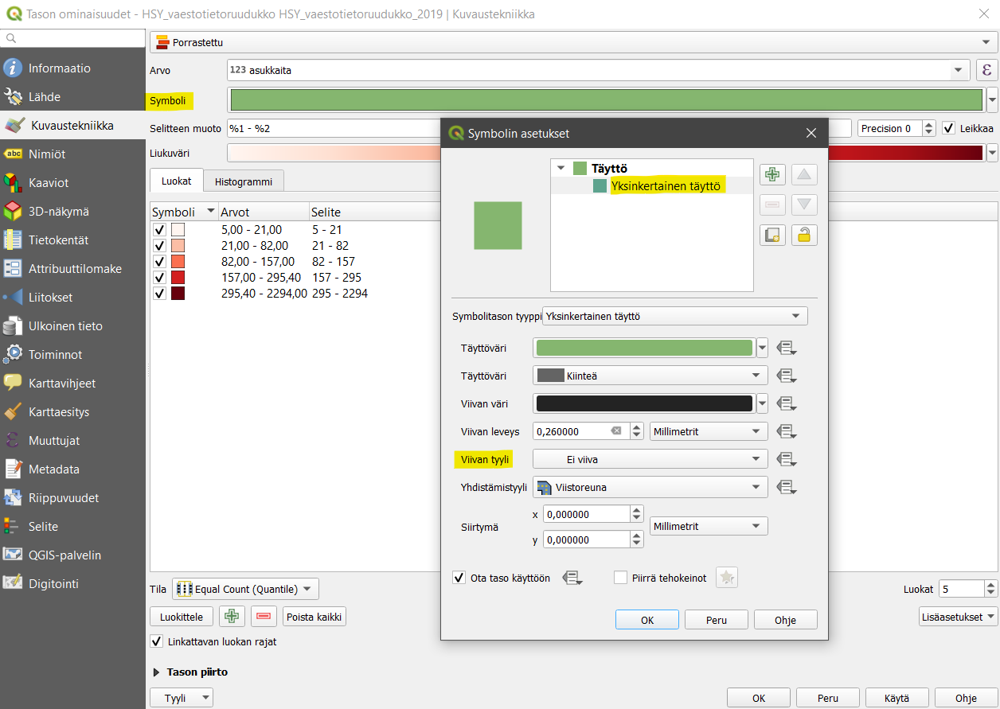
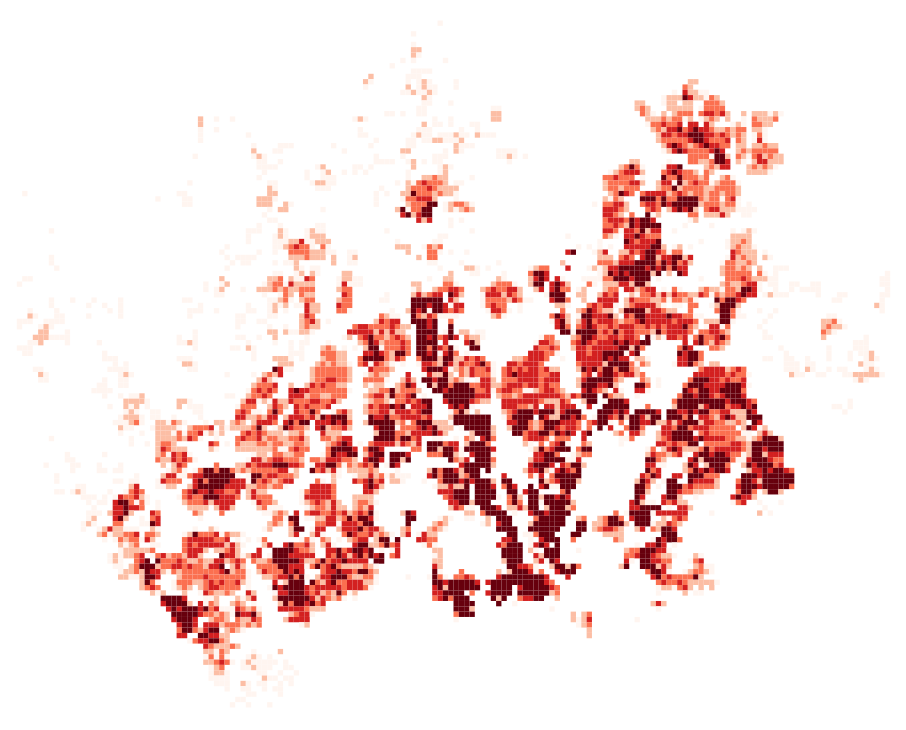

# Harjoitus 6: Paikkatietoaineiston luokittelu

**Harjoituksen sisältö**

Harjoituksessa tutustutaan QGISin visualisointi- ja luokittelutoimintoihin.

**Harjoituksen tavoite**

Opiskelija osaa luokitella ja visualisoida paikkatietoaineistoja QGISin työkaluilla.

**Arvioitu kesto**

35 minuuttia.

**Valmistautuminen**

Avaa uusi QGIS-projekti (**Projekti \> Uusi**) ja tallenna se nimellä **\"QGIS-harjoitus 6\"**. Lisää projektiin seuraavat aineistot:

-   **..kurssihakemisto/6. Harjoitus/HSY_vaestotietoruudukko.gpkg**

## Vektoriaineiston luokittelut

Tarkastellaan aluksi **HSY_vaestotietoruudukko-vektoriaineistoa**, joten piilota muut aineistot näkyvistä. **HSY_vaestotietoruudukko-aineisto** on **GeoPackage-formaatissa**. Tutustu aineistoon avaamalla sen attribuuttitaulu (klikkaa hiiren oikeaa painiketta tason päällä ja valitse **Avaa attribuuttitaulu**). QGISiin avautuu attribuuttitauluikkuna, joka esittelee tason ominaisuuksia ja on erittäin tärkeä osa paikkatietoaineistoa. Kaikilla vektoriaineistoilla on attribuuttitaulu.



Attribuuttitietojen ymmärtämiseksi on hyvä tarkastella taulun sisältöä sekä tutustua samalla aineiston metatietoihin. Metatiedot löytyvät usein aineistontuottajan nettisivuilta tai paikkatietojen löytämiseen tarkoitetuista hakemistoista. Metatiedot kertovat mm. kuka aineiston on tuottanut, mihin tarkoitukseen, millä mittakaavalla ja missä koordinaattijärjestelmässä se on tehty. HSY_vaestotietoruudukko-aineiston on tuottanut Helsingin seudun ympäristöpalvelut ja sen metatiedot löytyvät saman kansion **HSY_vaestotietoruudukko.pdf-tiedostosta**. Avaa tiedosto ja tutustu eri kenttien (= sarakkeiden) kuvauksiin.

Attribuuttitauluissa sarakkeiden nimet ovat usein lyhennetyssä muodossa, minkä vuoksi sarakkeiden merkitystä on tyypillisesti vaikea päätellä lyhenteistä. **HSY_vaestotietoruudukko**-aineistossa silmiinpistävää on myös se, että taulukossa toistuu luku 99 useaan otteeseen. Metatietojen avulla voimme kuitenkin selvittää muun muassa sen, miten asukkaita-sarakkeen tiedot on laskettu sekä millä tavalla tiedot on poistettu ruuduissa, joissa asuu 0-4 asukasta. **Ika-sarakkeet** sisältävät asukkaiden määrät ikäluokittain, mutta niille on annettu arvo 99 aina kun ruudukon asukasmäärä on ollut alle 100. Tarkastele aineistoa myös kartalla. Huomaatko yhden ruudun, joka näyttää sijaitsevan kaukana kaakossa keskellä merta?



Irralliseen ruutuun on tässä aineistossa sijoitettu kaikki ne pk-seudun asukkaat, joilla ei ole vakituista kotiosoitetta. **Näytä kohteen tiedot** -työkalulla nähdään, että tämän ruudun asukasmäärä on kymmenkertaisesti suurempi kuin minkään muun aineiston ruudun. Se siis vääristää luokittelua ja aineistosta laskettuja tilastoja (mm. keskimääräinen asukastiheys ruutua kohti). Suodatetaan tämä ruutu pois aineistosta: klikkaa tason nimeä hiiren oikealla ja valitse **Suodata...** Kirjoita (tai valitse tietokentistä ja operaattoreista klikkaamalla) suodatuslausekkeeksi **\"asukkaita\" \< 5000**. Voit testata suodatuksen toimivuutta klikkaamalla **Testaa**.



Nyt QGIS näyttää aineistostasi vain ne ruudut, jotka täyttävät annetun ehdon eli joiden kokonaisasukasmäärä on alle 5000.

Paikkatietoineiston ymmärtäminen ennen sen käsittelyä on välttämätöntä. Voimme nyt esimerkiksi päättää, että haluamme tuottaa teemakartan asukkaita-sarakkeen tietojen pohjalta. Näin pystymme myös paremmin tulkitsemaan karttaa ja valitsemaan visualisointia varten sopivat asetukset.

Avaa **Tason ominaisuudet** ja valitse tason kuvaustekniikaksi **Porrastettu**. Valitse seuraavasta pudotusvalikosta, minkä kentän arvoihin luokittelusi perustuu (tässä 'asukkaita'). Aseta vielä oheisen kuvan mukaiset **Arvo-, Liukuväri-, Tila- ja Luokat-määrittelyt**.


Kun olet saanut ne asetettua, paina **Luokittele**, ja luokitus tulee näkyviin. Voit myös muokata manuaalisesti arvovälejä kaksoisklikkaamalla **Arvot**-saraketta tai luokkien nimiä kaksoisklikkaamalla **Selite**-saraketta. Luokkien nimet näkyvät **Tasot**-paneelissa ja myös karttatulosteen selitteessä. Paina **Käytä**, niin näet muutokset kartalla. Karttanäytölle pitäisi muodostua jokseenkin tämän näköinen tilastoteemakartta:





Jos Tasot-paneelissasi ei näy selitettä, paina tason nimen vasemmalla olevaa pientä nuolta ja selitteet avautuvat tason alle kuvan mukaisesti. Palaa vielä **Kuvaustekniikka**-asetuksiin ja kokeile **Tila \> Tasaväli**. Paina uudelleen **Luokittele** jos arvot eivät päivity. Kokeile myös vaihtaa luokkien lukumäärää, luokitustapoja ja värityksiä, kunnes löydät mielestäsi sopivan tuloksen. Voit vertailla eri luokittelumenetelmiä ja tutkia aineiston jakaumaa histogrammin avulla. **Histogrammi** löytyy omalta välilehdeltään. Paina **Lataa arvot** saadaksesi histogrammin ja luokkien rajat näkyviin.



Muuta vielä symbolin tyyliä. Avaa uudelleen tason ominaisuustiedot ja klikkaa **Symboli**-kohdan väripalkkia.



**Symbolin asetukset** -ikkuna aukenee. Siirry **Yksinkertainen täyttö** -symbolitasolle ja aseta **Viivan väriksi läpikuultava** tai **Viivan tyyliksi Ei viivaa**. Paina **OK** ja **OK**. Zoomaa karttaan tutkimaan tulosta ja palaa tyyliasetuksiin, jos haluat tehdä vielä muutoksia.



Kun olet valmis, tallenna projektitiedosto kurssihakemistoon pikanäppäimellä **CTRL + T** tai päävalikosta **Projekti \> Tallenna**.

::: hint-box
**Psst! Koulutuksen jälkeen saat henkilökohtaista tukea Gispon tukipalvelusta. Lähetä kysymyksesi tai kommenttisi osoitteeseen [tuki\@gispo.fi](mailto:tuki@gispo.fi){.email}!**
:::

## Testaa tietosi...

```{=html}
<iframe src="https://docs.google.com/forms/d/e/1FAIpQLSdlBcOH7YQVS8-yONN4zpa6iKBMBIOAswTOKV_JOkXH5UcBkA/viewform?embedded=true" width="700" height="600" frameborder="0" marginheight="0" marginwidth="0"></iframe>
```