# Harjoitus 7: Karttatuloste ja kartta-atlas

**Harjoituksen sisältö**

Harjoituksessa tehdään karttatuloste sekä kartta-atlas.

**Harjoituksen tavoite**

Opiskelija osaa laatia karttatulosteen halutussa mittakaavassa sekä tehdä tulosteesta PDF-tiedoston.

**Arvioitu kesto**

40 minuuttia.

**Valmistautuminen**

Avaa uusi QGIS-projekti (**Projekti \> Uusi**) ja tallenna se nimellä **\"QGIS-harjoitus 7\"**. Lisää projektiin seuraavat aineistot:

-   **../kurssihakemisto/7. Harjoitus/Vaestotietoruudukko_2022.gpkg**

-   **../kurssihakemisto/7. Harjoitus/PKS_postinumeroalueet_2023.gpkg**

-   **Haluamasi taustakartta, esimerkiksi Selain \> XYZ Tiles \> OpenStreetMap**

 


## Karttatuloste

Piilota PKS_postinumeroalueet_2023-aineisto karttaikkunastasi ja jätä **Vaestotietoruudukko_2022**-aineisto ja **OpenStreetMap**-aineisto näkyviin. Visualisoi Vaestotietoruudukko_2022-aineisto haluamallasi tavalla - voit esimerkiksi luokitella aineiston asvaljyys-kentän mukaisesti. Voit visualisoida myös OpenStreetMap-rasteriaineistoa halutessasi. Karttasi voi näyttää esimerkiksi tältä:


Uuden tulosteen muodostaminen voidaan aloittaa kahdella tavalla, joko valitsemalla **Projekti \> Uusi taitto** tai klikkaamalla **Uusi taitto** -työkalua 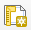 . Kaikkia taittoja voidaan hallinnoida **Näytä taittojen hallinta** -työkalulla . Luo uusi taitto ja anna taitolle jokin sitä kuvaava nimi, jonka jälkeen uusi taitto avautuu **Tulosteen muodostaja** -ikkunaan. Tästä ikkunasta löytyy hieman erilaisia työkaluja kuin QGISin normaalista työtilasta.

Klikkaa ensimmäiseksi tulostusalueella hiiren oikealla painikkeella ja valitse **Sivun ominaisuudet**. Valitse oikealta **Elementin ominaisuudet** -välilehti ja aseta **sivun kooksi A4 ja suunnaksi Vaaka**. Valitse sitten **Taitto**-välilehti ja tarkista, että viennin **resoluutio on 300 dpi**.

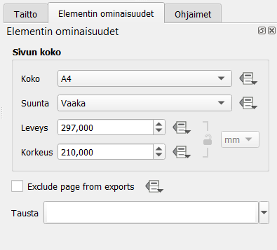 

Nyt taiton pohjatyöt on tehty ja varsinainen taittotyö voidaan aloittaa. Lisätään taittoon ensimmäiseksi karttaikkuna. Klikkaa vasemmasta työkalupalkista **Lisää Kartta -työkalua**  . Vedä tulosalueelle haluamasi kokoinen suorakulmio, minkä jälkeen kartta piirtyy suorakulmion sisään.


Valitse sitten **Valitse/siirrä elementtiä -työkalu** 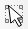 vasemmasta työkalupalkista ja klikkaa karttaelementti aktiiviseksi. Valitse **Elementin ominaisuudet -välilehti**. Muuta kartan parametrejä seuraavasti:

-   Kartan mittakaava 1:250 000

-   Valitse **Kehys** aktiiviseksi, jolloin karttaelementille piirtyy reunat

 

Siirrä karttaelementin sisältöä **Siirrä elementtiä -työkalulla**  . Karttaelementin tulee olla aktiivinen, jotta Siirrä elementtiä -työkalu toimii. Karttatuloste voi näyttää tällä hetkellä esimerkiksi tältä:


Myös muut alla listatut työkalut ovat hyödyllisiä:

 Valitse/siirrä elementtiä

 Siirrä elementin sisältöä (esimerkiksi kartan sisältöä)

 Zoomaa taiton näkymässä

Lisää taittoosi nyt otsikko **Lisää Otsikko -työkalulla**  . **Elementin ominaisuudet** -välilehdeltä voit muokata otsikon ominaisuuksia tekstinkäsittelyohjelmista tutuilla työkaluilla. Aseta tekstin vaaka- ja pystykohdistukseksi **Keskellä**. Voit muuttaa muitakin otsikkoelementin asetuksia halutessasi.

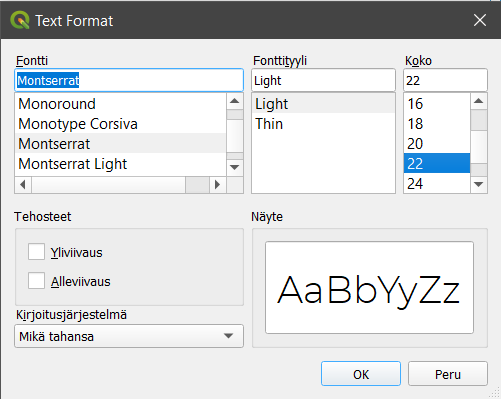 

Lisää seuraavaksi taittoon selite **Lisää Selite -työkalulla**  . Voit huomata, että selitteeseen tulee kaikki QGIS-työtilan puolella olevat tasot sekä tasojen ei-niin-silmää-miellyttävät nimet.

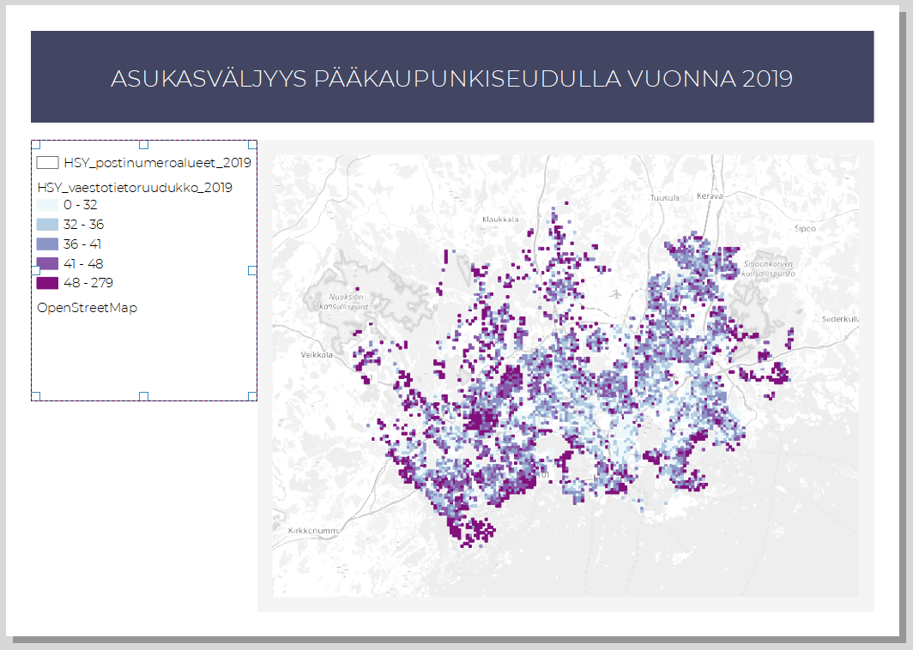

Klikkaa selite aktiiviseksi ja mene **Elementin ominaisuudet \> Selitteen merkinnät** -kohtaan. Ota ensimmäiseksi rasti pois **Päivitä automaattisesti** -kohdasta, jotta voit muokata selitteessä näkyviä tasoja vapaasti. Aseta rasti kohtaan **Only show items inside linked map**, jolloin selitteessä näytetään vain ne aineistot, jotka näkyvät karttaelementissä. Klikkaa hiiren oikealla painikkeella **Vaestotietoruudukko_2022**-aineistoa ja aktivoi kohta **Piilotettu**. Tämä asetus piilottaa tason nimen. Tee sama **OpenStreetMap**-aineiston kohdalla.

 

::: hint-box
**Psst! Mikäli aineiston piilotus selitteestä ei onnistu, aineistoja voi poistaa selitteestä myös miinus-merkistä.**
:::

Nyt selitteen pitäisi näyttää jo paremmalta. Lisää selitteelle otsikko **Tärkeimmät ominaisuudet** -kohdasta. Voit lisäksi muotoilla selitettä haluamasi näköiseksi kohdista **Fontit ja tekstin muotoilu, Symboli** sekä **Jaottelu**. Aseta selitteelle samanlainen reuna kuin karttaelementille.


Lisää taittoosi mittakaava **Lisää Mittakaavajana -työkalulla**  . Mene jälleen **Elementin ominaisuudet** -välilehdelle ja tarkastele eri ominaisuuksia. Vaihda **Tyyli**-kohtaan **Jana, jakoviivat yläpuolella**. Muuta visualisointia haluamaksesi.

Lisätään karttatulosteeseen lopuksi myös pohjoisnuoli työkalulla . Pohjoisnuoli on hyödyllinen, jos jostain syystä pohjoinen on jossakin muualla kuin ylhäällä. Aseta **Elementin ominaisuudet** -välilehdellä pohjoisnuolesi kierto ruksimalla kohta **Synkronoi kartan kanssa**. Jos nyt kierrät karttaelementtiä, pohjoisnuoli kiertyy mukana.

Voit lisätä pohjoisnuolen (tai minkä tahansa muun symbolin/kuvan) myös **Lisää uusi kuva taittoon -työkalulla**  . Vedä taittoon kohta, johon haluat pohjoisnuolen sijoittuvan. Valitse sen jälkeen **Elementin ominaisuudet** -välilehdeltä **Hakemistopolut**-kohdasta haluamasi pohjoisnuoli (selaa sisältöä alaspäin, jos et heti näe nuolia). Tyylittele nuoli haluamallasi tavalla. Jos haluat lisätä tulosteelle jonkin oman kuvatiedostosi (esimerkiksi yrityksen logon), vaihda täppä **Rasterikuva** -kohtaan ja etsi haluamasi kuva resurssinhallinnan kautta.


Valmis karttatuloste voi näyttää esimerkiksi tältä:


Halutessasi voit tallentaa käyttämäsi taittomallin **Tallenna malliksi** -työkalulla 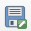 ja hyödyntää sitä jatkossa seuraavien karttatulosteiden tekemiseen. Voit esimerkiksi muotoilla karttatulostemallin organisaatiollesi (logot, värit, tekstin paikka...). Karttatulosteen voi viedä kuvaksi (PNG/JPEG), muodoksi (SVG), digitulosteeksi (PDF) tai lähettää fyysiseen tulostimeen tulostettavaksi.


Voit halutessasi tallentaa karttatulosteesi kuvatiedostoksi esimerkiksi kurssihakemistoon. Sopiva resoluutio karttatulosteellesi riippuu kartan käyttötarkoituksesta, mutta oletusarvoinen 300 dpi tallentaa resoluutioltaan hyvinkin tarkkoja kuvia.

## Kartta-atlas

QGIS mahdollistaa myös kartta-atlaksen tekemisen. Kartta-atlas on ns. karttakirja, jonka avulla voidaan tuottaa automatisoidusti paljon karttoja samasta teemasta. Seuraavassa esimerkissä tuotetaan kartta-atlas Helsingin postinumeroalueista tutkien niitä väestön jakautumisen näkökulmasta. Tavoitteenamme on tuottaa 173 karttaa, jotka kattavat kaikki pääkaupunkiseudun postinumeroalueet. Aseta nyt **PKS_postinumeroalueet_2023-aineisto** näkyväksi yhdessä Vaestotietoruudukko_2022-aineiston sekä OpenStreetMapin kanssa. Visualisoi postinumeroaineisto niin, että polygonin täyttö on läpinäkyvä ja rajat näkyvät hyvin.


Luo uusi taitto. Lisää taittoon karttaelementti, johon piirtyvät karttaikkunassa näkyvät projektin tasot. Lisää taittoon otsikko, selite, mittakaava ja muita haluamiasi graafisia tai kartografisia elementtejä (kuten logo tai pohjoisnuoli). Karttaelementin mittakaava kannattaa asettaa yhden postinumeroalueen laajuiseksi (esimerkiksi 1:25 000), sillä lopputuloksessa kartta-atlaksen karttalehdet kohdentuvat automaattisesti postinumeroalueiden kokoon. Karttatuloste voi tässä vaiheessa näyttää esimerkiksi tältä:

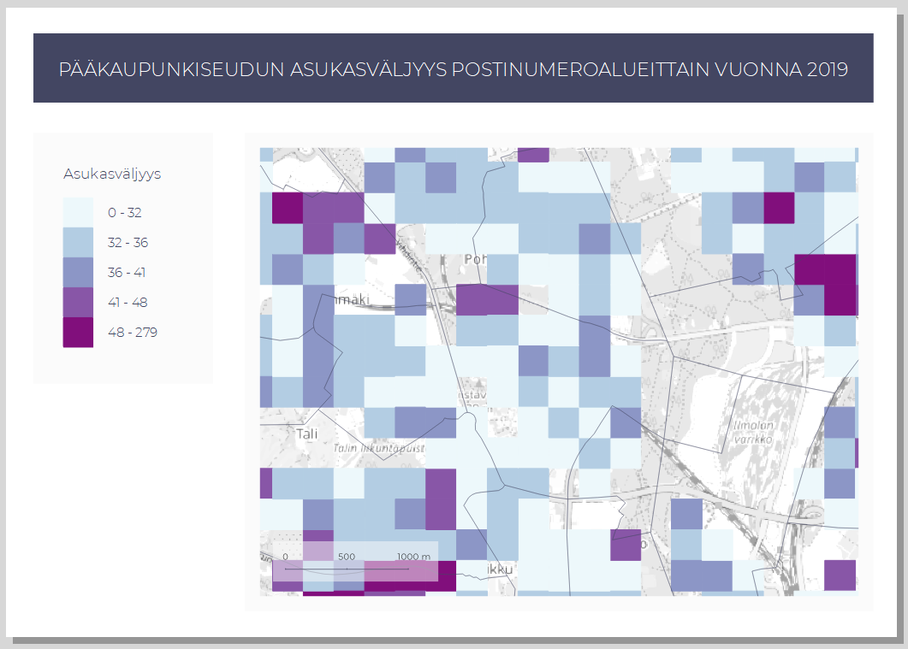

Sitten aloitetaan kartta-atlaksen tuottaminen. Kartta-atlas-ominaisuus on aktivoitava, ennen kuin sitä voidaan hyödyntää QGISin tulosteen muodostajassa. Valitse ylävalikosta **Atlas \> Atlaksen asetukset**. Oikealle ilmestyy uusi **Atlas-välilehti**, josta aktivoidaan kohta **Luo atlas**. Aseta **Coverage layer** -kohtaan se taso, jonka alueisiin kartta-atlas perustuu - tässä tapauksessa se on **PKS_postinumeroalueet_2023**.

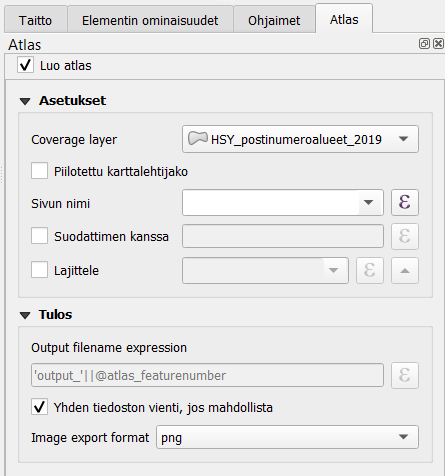

Varmista, että karttakomponentti on valittuna: valitse **Valitse/Siirrä elementtiä -työkalu** vasemmasta työkalupalkista ja klikkaa kartta aktiiviseksi. Muokkaa kartta-atlasasetuksia oikean puolen sivupalkissa **Elementin ominaisuudet \> Atlas ohjaa tätä**.


Painikkeella 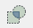 saat auki leikkausasetukset. Voit leikata joko osan karttasi tasoista tai kaikki tasot atlaksen kulloisenkin kohteen mukaisesti.

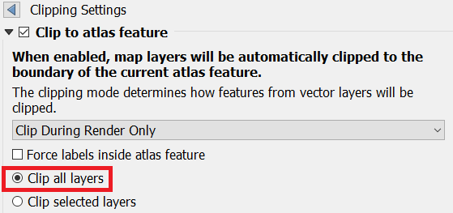 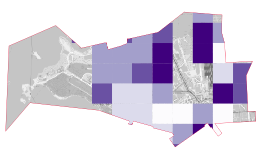

Tämän jälkeen voimme esikatsella kartta-atlastamme valitsemalla ylävalikosta **Atlas \> Esikatsele Atlasta**. Esikatselun avulla voit vilkaista, miltä kartta-atlas näyttää tulostaessa. Käytä nuolia esikatselu-työkalupalkista. Huomaa, että voit tehdä samanaikaisesti muutoksia karttatulosteen tyyliasetuksiin tai vaikkapa tason luokitteluväreihin.


Lisää karttatulosteeseen yleiskatsauskarttanäkymä eli indeksikartta valitsemalla **Lisää uusi kartta taittoon** -työkalu ja lisäämällä pienempi karttaelementti isomman viereen. Indeksikartta näyttää, millä alueella liikutaan. Valitse indeksikarttaelementti aktiiviseksi ja mene **Elementin omaisuudet \> Yleiskatsaukset** ja lisää yleiskatsaus plussasta. Määritä asetukset kuvan mukaisesti:


Voit halutessasi myös muuttaa yleiskatsauskartan kehyksen tyylin. Kokeile atlaksen esikatselua niin huomaat, että yleiskatsauskartan kehys liikkuu pääkartan mukana. Kun olet valmis, voit tulostaa kartta-atlaksen halutessasi **Vie atlas** -työkalulla. Huomaa, että jokaisesta kartta-atlaksen sivusta syntyy kuva, joten tallentaminen voi viedä aikaa.


Voit tulostaa atlaksen yksittäisinä kuvina tai yhteen tiedostoon PDF-formaatissa. Yhteen tiedostoon tallentaminen onnistuu aktivoimalla **Yhden tiedoston vienti, jos mahdollista** -asetuksen Atlas-välilehdellä.

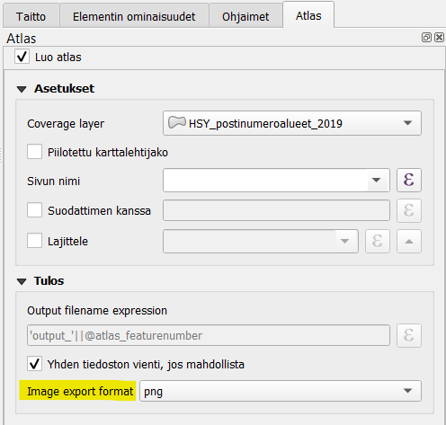

Valmiin kartta-atlaksen sivu voi näyttää esimerkiksi tältä:


Huomaa, kuinka yleiskarttanäkymän neliö vaihtaa paikkaa kun kohdennetun kartan alue vaihtuu.

Kun olet valmis, tallenna projektitiedosto kurssihakemistoon pikanäppäimellä **CTRL + T** (englanninkielisessä QGISissä **CTRL + S**) tai päävalikosta **Projekti \> Tallenna**.

::: hint-box
**Psst! Koulutuksen jälkeen saat henkilökohtaista tukea Gispon tukipalvelusta. Lähetä kysymyksesi tai kommenttisi osoitteeseen [koulutustuki\@gispo.fi](mailto:koulutustuki@gispo.fi){.email}!**
:::

## Testaa tietosi...

```{=html}
<iframe src="https://docs.google.com/forms/d/e/1FAIpQLSf5SRzTsxm7NEfMxKk5O6Ik99gpXoUj8ct2X2eIDyVIa0n7Qw/viewform?embedded=true" width="700" height="600" frameborder="0" marginheight="0" marginwidth="0"></iframe>
```
