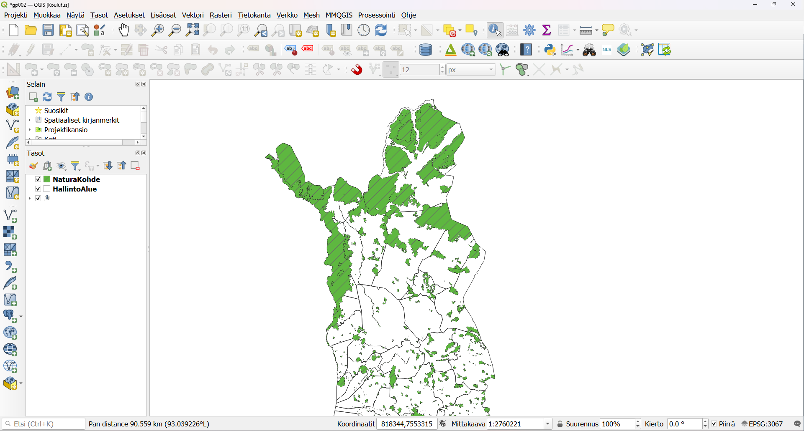
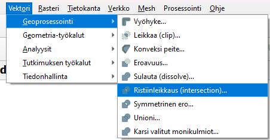
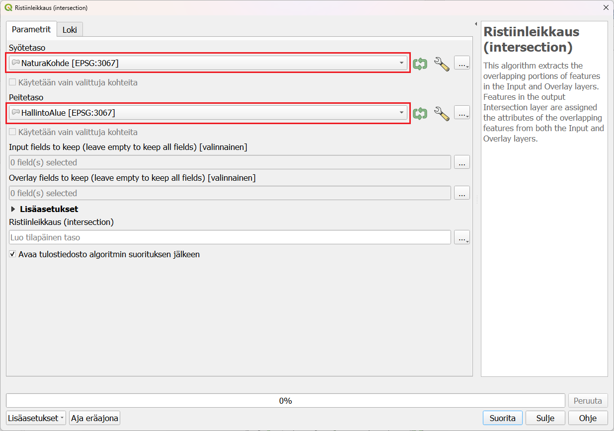
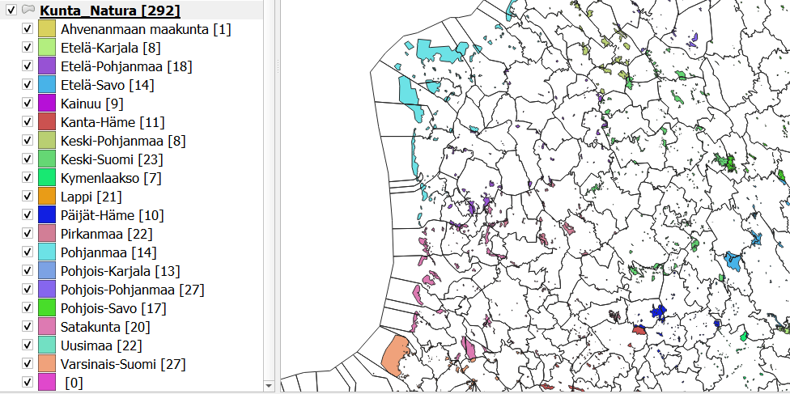
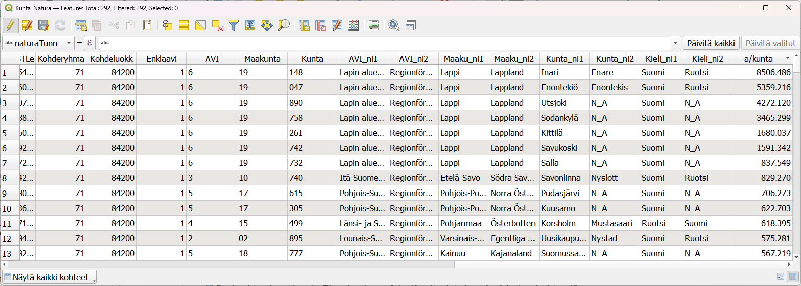

# Kappale 9

## Luento 9

## Harjoitus 9: Paikkatietoanalyysit

**Harjoituksen sisältö**

Harjoituksessa tutustutaan QGISin paikkatietoanalyysien tekoon.

**Harjoituksen tavoite**

Opiskelijalla on perustiedot erilaisten paikkatietoanalyysien muodostamisesta QGIS-ohjelmistossa.

**Arvioitu kesto**

40 minuuttia.

**Valmistautuminen**

Avaa uusi QGIS-projekti (**Projekti \> Uusi**) ja tallenna se nimellä **"QGIS-harjoitus 9"**. Lisää projektiin seuraavat aineistot:

-   **..kurssihakemisto/9. Harjoitus/HallintoAlue.shp**

-   **..kurssihakemisto/9. Harjoitus/TieViiva.shp**

Muokkaa Hallintoalue- tason täyttö läpinäkyväksi. Karttanäkymän tulisi näyttää tältä:

Voit tarkistaa/muokata projektisi koordinaattijärjestelmän asetuksia (**Projekti \> Projektin asetukset \> Koordinaattijärjestelmä**) tai klikkaamalla oikeasta alareunasta löytyvää kuvaketta:

Kummatkin tavat avaavat projektin koordinaattijärjestelmän määrityslomakkeen. Tarkista, että järjestelmä on **ETRS89/TM35FIN (EPSG:3067)**. Voit lisätä ongelmitta aineistot eri karttaprojektioissa. **Monet analyysityökalut eivät kuitenkaan toimi tai antavat epätarkkoja tuloksia**, jos analyysin aineistoilla on eri koordinaattijärjestelmät. Tällöin ne täytyy tallentaa uudelleen ja tehdä tallennusvaiheessa muunnos samaan järjestelmään. Tällä kertaa ongelmia ei tule, koska aineistot on alun perin tuotettu samassa koordinaattijärjestelmässä.

## Vektorianalyysit

Tässä harjoituksessa on tarkoitus etsiä ne kunnat, joiden alueella kulkee suomalainen versio kuuluisasta **Route 66 -tiestä**. Lyhyesti harjoituksen kulku on seuraava:

-   Valitaan tieaineistosta ne tieviivat, joiden numero on 66.

-   Tehdään spatiaalinen analyysi kunta- ja tieviiva-aineiston kanssa, jonka myötä viiva-aineisto saa kunta-aineiston sisältämät tiedot.

-   Yhdistetään tieviivat kunnan nimen avulla.

Monista **TieViiva -taso** klikkaamalla tason nimeä hiiren oikealla ja valitse **Monista taso**. Avaa **TieViiva kopio**-tason ominaisuudet. Valitse **Lähde**-välilehti ja vaihda tason nimeksi **Tie 66**. Seuraavaksi suodatetaan tämän uuden tason sisältö vastaamaan nimeä. Klikkaa **Tie 66** -tasoa hiiren oikealla painikkeella ja valitse **Suodata...**. Syötä **Suodattimena käytettävä lauseke** -kohtaan seuraava lauseke:

::: code-box
"Tienumero" = 66
:::

Saat kentän nimen suoraan lausekkeeseen **Tietokentät**-kohdasta tuplaklikkaamalla. Muuta uuden tason kuvaustekniikkaa, jotta se erottuu muista kartta-aineistoista.

Ristiinleikataan seuraavaksi tieaineisto kuntarajojen mukaan. Valitse ylävalikosta **Vektori \> Geoprosessointi \> Ristiinleikkaus (intersection)**, joka avaa QGISiin uuden ikkunan. Aseta **syötetasoksi Tie 66** ja **peitetasoksi HallintoAlue**.

Suorita analyysi painamalla **Suorita** ja paina sen jälkeen **Sulje**. Syntyy uusi väliaikainen tulostaso, joka näyttää karttaikkunassa samalta kuin alkuperäinen aineisto.

::: hint-box
**Kun vertaat eri tiestöaineistojen (Tie 66) ja ristiinleikkaustason ominaisuustietoja, mitä huomaat?**
:::

Luokittele syntynyt uusi taso kunnan nimen perusteella käyttäen kenttää Kunta_ni1 (**Ominaisuudet \> Kuvaustekniikka**). Aktivoi **Näytä kohteiden lukumäärä** -toiminto (hiiren oikealla näppäimellä tason nimen päällä **Tasoluettelossa**). Tasoluettelossa luokittelun pitäisi näyttää suunnilleen seuraavalta (värit ja viivojen paksuus on sen mukainen kuin olet määritellyt):

Seuraavaksi voimme yhdistää erilliset tieviivat **Sulauta (dissolve)** -työkalun avulla. Valitse työkalu **Vektori \> Geoprosessointi \> Sulauta**. Aseta **Syötetasoksi** ristiinleikkauksessa syntynyt taso. Sulauta **Ristiinleikkaus-aineisto** kunnan nimen (tai numeron) perusteella: paina **Dissolve field(s)** -kohdan vieressä olevaa painiketta ja valitse kentäksi **Kunta_ni1**. Tallenna lopputulos esimerkiksi kurssihakemistoon haluamallasi nimellä (esimerkiksi tie66_sulautettu.gpkg). Paina **Suorita** ja sitten **Sulje**.

Voit kopioida aiemmin luodun tason tyylin helposti uudelle aineistoille. Valitse hiiren oikealla näppäimellä avautuvasta valikosta **Tyylit \> Kopioi tyyli \> All style categories**. Valitse äsken luotu taso ja **Tyylit \> Liitä tyyli \> All style categories**.

Kun lisäät vielä kohteiden lukumäärän laskennan päälle, niin lopputuloksen pitäisi tasoluettelossa olla seuraava:

Lopuksi voidaan laskea kunkin kunnan osuus tien 66 kokonaispituudesta (vaikkapa ylläpitokustannuksien jakamista varten). Lasketaan ensin kunkin sulautetun tieviivan pituus. Avaa ominaisuustietotaulukko, muuta taulukko muokattavaksi ja käytä tiedon laskinta samalla tavalla kuin pinta-alan laskemisen yhteydessä. Luo uusi kenttä, jossa on kunkin tieviivan pituus hyödyntämällä **Geometria**-kohdasta **\$length**-funktiota. Kentän tyyppi voi olla kokonaisluku, jolloin saamme pituuden metrin tarkkuudella. Jos kentän haluaa ilmoittaa desimaaleissa, voi lukua pyöristää **round**-funktion avulla.

Lisää nyt uusi kenttä, jossa lasketaan prosenttiosuudet kullekin kunnalle. Teiden kokonaispituuden voi laskea **Tilastollinen yhteenveto -paneelin**  avulla. Valitse paneelissa tarkasteltavaksi tasoksi taso, jossa pituudet ovat, ja tämän jälkeen toisesta pudotusvalikosta pituus-kenttä. Näet **Summa**-kentässä tien kokonaispituuden.

Nyt voit laskea **Kentän arvojen laskin** -työkalulla vielä yhden uuden kentän, pituuksien prosenttiosuuden.

Jos lausekkeessa halutaan välttää absoluuttisia lukuja ja tehdä siitä dynaamisempi, lauseke voi olla myös seuraava:

::: code-box
"pituus" / sum("pituus") \* 100
:::

Mikäli **Pituus**-kentän arvot muuttuvat, myös suhteellisen tieosuuden luku muuttuu.

Kun olet valmis, tallenna projektitiedosto kurssihakemistoon pikanäppäimellä **CTRL + T** (englanninkielisessä QGISissä CTRL + S) tai päävalikosta **Projekti \> Tallenna**.

::: hint-box
**Psst! Koulutuksen jälkeen saat henkilökohtaista tukea Gispon tukipalvelusta. Lähetä kysymyksesi tai kommenttisi osoitteeseen [tuki\@gispo.fi](mailto:tuki@gispo.fi){.email}!**
:::

## Testaa tietosi...

