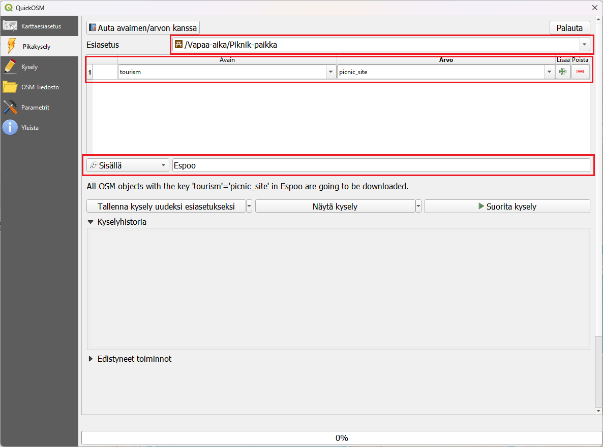
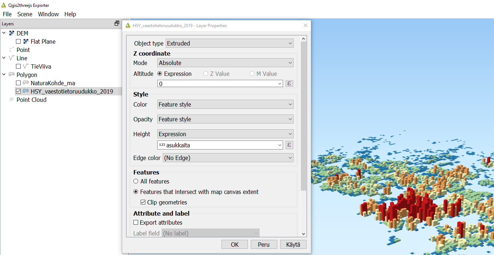
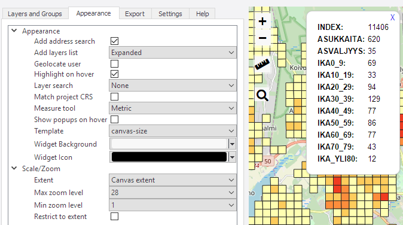

# Kappale 10

## Luento 10

## Harjoitus 10: QGISin lisäosat

**Harjoituksen sisältö**

Harjoituksessa tutustutaan QGISin monipuolisiin lisäosiin ja opitaan käyttämään muutamaa keskeistä lisäosaa.

**Harjoituksen tavoite**

Opiskelijalla tietää perusasiat QGISin lisäosien käytöstä ja osaa myös hyödyntää niitä.

**Arvioitu kesto**

40 minuuttia.

**Valmistautuminen**

Avaa uusi QGIS-projekti (**Projekti \> Uusi**) ja tallenna se nimellä \"**QGIS-harjoitus 10**\". Lataa projektiin seuraavat aineistot:

-   **..kurssihakemisto/10. Harjoitus/L4133B.asc**

-   **..kurssihakemisto/10. Harjoitus/HSY_vaestotietoruudukko.gpkg**

## Lisäosien hallinta

Lisäosia lisätään käyttöön päävalikosta **Lisäosat \> Hallitse ja asenna lisäosia...** -valikon kautta. Valitse **Asennettu**-välilehti ja saat esille kaikki asennetut lisäosat. Huomaa, että suurinta osaa niistä ei ole aktivoitu. Lisäosien aktivointi lisää erilaisia valikkoja ja paneeleja QGISin käyttöliittymään. Siksi on hyödyllistä piilottaa ne joita ei käytetä.

## QuickMapServices

QuickMapServices-lisäosan kautta saat QGISin karttaprojektiin verkosta erilaisia kuten OpenStreetMap tai Maanmittauslaitoksen taustakarttasarjat tai ortoilmakuvat. Avaa **Lisäosat \> Hallitse ja asenna lisäosia... \> Kaikki** ja etsi QuickMapServices tekstillä:

Paina vielä **Asenna lisäosa** ja paina sen jälkeen **Sulje**. Uusi valikko tulee päävalikon **Verkko** alle. Valitse **Verkko \> QuickMapServices \> OSM \> OSM Standard**. Karttaikkunassa on nyt OpenStreetMap taustakarttana. Järjestä tasot siten, että väestöaineisto on hyvin näkyvissä. Voit myös piilottaa korkeusmalliaineistot, jos ne haittaavat visualisointia. Kokeile lisäksi muita taustakarttoja.

## Qgis2threejs

Lisää samaan tapaan Qgis2threejs-lisäosa. Tämä lisäosa mahdollistaa nopean kolmiulotteisen visualisoinnin luomisen web-selaimelle käyttäen threejs-kirjastoa. Lisäosan valikko tulee myös **Verkko**-valikkoon. Avaa **Qgis2threejs Exporter** ja valitse **DEM Layer** -valikosta **Flat Plane**. Valitse sen jälkeen **Polygon**-kohdan alta **väestötietoruudukkoaineisto** ja tuplaklikkaa sitä avataksesi **asetukset**. Aseta **Z-coordinate** -kohdan **Mode**-asetukseksi **Absolute** ja **Height-arvoksi asukkaita**-kentän arvo.

Voit esikatsella 3D-mallia lisäosassa ja halutessasi tallentaa sen HTML-muotoon valikosta **File \> Export to web**.

## Qgis2web

Qgis2web-lisäosa on helppokäyttöinen lisäosa verkkokartan luomista varten. Sillä voi tuottaa verkkokarttoja hyödyntäen Leaflet- tai OpenLayers-kirjastoja. Qgis2web on hyödyllinen apuväline näiden kirjastojen opetteluun ja verkkokarttajulkaisujen tekemiseen. Asenna Qgis2web-lisäosa ja avaa se valikosta **Verkko \> Qgis2web \> Create web map**. Valitse **väestötietoruudukko-aineiston** kentille **Popup fields** -kohdan alta **Inline label**, ja klikkaa **Update preview**. Kun kartta on päivittynyt, klikkaa ruudukkoa.

Vaihda **Appearance-välilehdelle** ja muuta asetukset kuvan mukaisesti:

Paina lopulta **Export** tallentaaksesi kartan HTML-tiedostoon. Tiedosto aukeaa automaattisesti selaimelle. Kokeile verkkokartassasi etsiä osoitteita ja käyttää mittaustyökalua.

## Prosessointityökalut

Iso joukko työkaluja on saatavilla **Prosessointi**-valikon kautta. Prosessointityökalut on lisäosa, joka on oletuksena aktivoitu QGISiin. Sillä on oma paikka päävalikossa **Prosessointi \> Työkalut**. Työkalut tulevat esiin paneelina karttaikkunan oikealle puolelle. Etsi työkalujen joukosta **Vyöhyke-työkalu (= Buffer)**. Voit kirjoittaa **Etsi...**-kenttään sanan "buffer", jolloin työkalu löytyy helposti. Avaa työkalu, valitse lähtötasoksi **HSY_vaestotietoruudukko** ja aseta **Etäisyys-kenttään -50 metriä**. Pidä puskuroinnin työkalun tulos väliaikaisena tiedostona tai tallenna se pysyväksi.

Tuloksena on negatiivinen puskuri, eli alkuperäistä pienempi ruudukko. Prosessointityökalujen kautta pääse käyttämään työkaluja monesta muusta ohjelmistoista (niiden ohjelmistokirjastot täytyy tällöin olla asennettu koneeseen). Muun muassa GRASS-, GDAL-, Orfeo Toolbox- ja SAGA-työkalut ovat saatavilla.

Jos sinulle jää aikaa, käy läpi muita lisäosia ja tarkastele mitä työkaluja sieltä löytyy, jotka voivat auttaa sinua omassa työssäsi.

Kun olet valmis, tallenna projektitiedosto kurssihakemistoon pikanäppäimellä **CTRL + T** (englanninkielisessä QGISissä **CTRL + S**) tai päävalikosta **Projekti \> Tallenna**.

::: hint-box
**Psst! Koulutuksen jälkeen saat henkilökohtaista tukea Gispon tukipalvelusta. Lähetä kysymyksesi tai kommenttisi osoitteeseen [tuki\@gispo.fi](mailto:tuki@gispo.fi){.email}!**
:::

## Testaa tietosi...