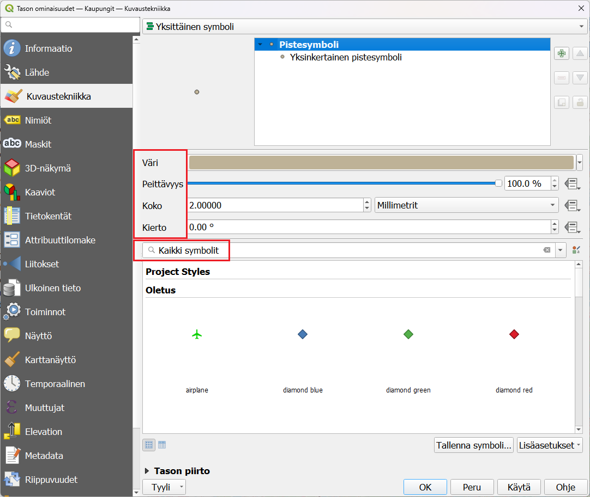
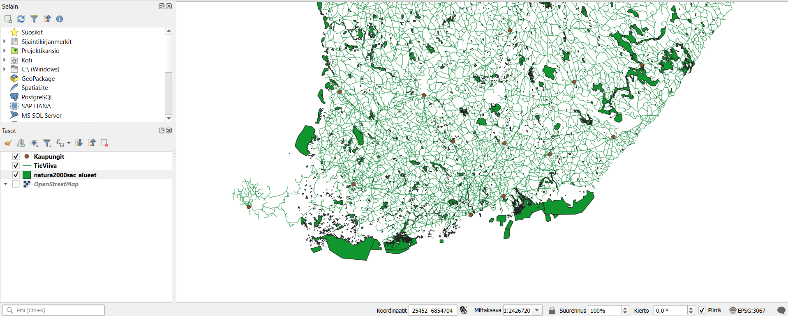
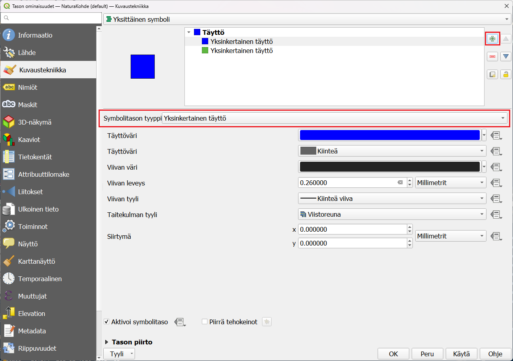

# Harjoitus 3: Paikkatietoaineiston visualisointi

## Harjoituksen sisältö

Harjoituksessa tehdään visualisoinnit sekä vektori- että rasteriaineistosta.

## Harjoituksen tavoite

Koulutettava oppii eri aineistotyyppien visualisointitapoja.

## Valmistautuminen

Käynnistä QGIS-ohjelmisto. Avaa uusi QGIS-projekti ja tallenna se nimellä (**Projekti → Tallenna nimellä...**) "**QGIS_harjoitus_3**".

Lisää projektiin seuraavat aineistot:

-   **.../Harjoitus 3/TieViiva.shp**

-   **.../Harjoitus 3/NaturaKohde.shp**

-   **.../Harjoitus 3/Kaupungit.shp**

## Vektoriaineistojen visualisointi

Aloita tutkimalla Kaupungit -tasoa, joka sisältää Natural Earth kaupunkiaineiston Suomesta. Jos et näe pisteitä kartallasi, vedä taso muiden tasojen päälle painamalla hiiren vasenta painiketta ja raahaa taso ylimmäksi listauksessa. Paina hiiren oikealla painikkeella tason nimeä (Kaupungit) tasoluettelossa. Valitse valikosta **Ominaisuudet**:

**Tason ominaisuudet** -ikkuna aukeaa. Huomaa vasemmalla oleva sivupalkki, josta löytyy eri ominaisuudet jaoteltuna aihekohtaisesti. Samaisessa sivupalkissa on **Kuvaustekniikka-alavalikko**, jonka valittuasi pääset muokkaamaan tason tyyliominaisuuksia:

{width="70%"}

Vaihda **Väri- ja koko-arvot**, ja paina **Käytä**. Sillä tavalla saat näkyviin tekemäsi muutokset sulkematta **Tason ominaisuudet -ikkunaa**. Avaa vielä jokin **symbolikirjasto**, esimerkiksi **Suosikit**, ja muuta pisteen tyyliksi jokin sinua miellyttävä tyyli. Voit myös kiertää symbolia vaihtamalla **kierto-arvon** astelukua. Paina sitten **OK**, ikkuna sulkeutuu ja kaupunkitaso näkyy nyt määrittämäsi visualisointityylin tavalla.

Saat avattua edistyneet visualisointiasetukset painamalla **Yksinkertainen pistesymboli** valintaa. Täältä saat muokattua symbolin lisäksi esimerkiksi reunojen väriä, paksuutta sekä viivan tyyliä. Voit myös poistaa ääriviivat tai symbolin värityksen kokonaan jättäen vain ääriviivat. Muut paikkatietoaineistojen visualisoinnin työkalut saa käyttöön samalla tavalla, avaamalla hiiren oikealla **Ominaisuudet** ja sivupalkista **Kuvaustekniikka**. Klikkaamalla sivellintä Tasot-paneelin yläreunasta tai pikanäppäimellä **F7** saat avatuksi **Tason tyylit -ikkunan**, joka on jatkuvasti avoinna karttaikkunan oikeassa laidassa. Tällöin voit helposti vaihtaa kaikkien tasojen kuvaustekniikkaa ja näet heti, miltä uusi tyyli näyttää.

Eri vektoriaineistotyypeillä (piste, viiva, monikulmio) on erilaiset kuvaustekniikan työkalut, vaikkakin ne muistuttavat paljon toisiaan. Esimerkiksi pistetasolle ei voida tehdä samoja tyylittelyjä kuin viiva- tai monikulmiotasolle. Rasteriaineistojen työkalut taas eroavat melko paljon vektoriaineistojen työkaluista.

## Viiva- ja monikulmioaineiston visualisointi

Kokeile nyt itse muokata viiva- ja monikulmioaineistoja haluamaksesi. Avaa aiemmin lisätty tiestötason kuvaustekniikkaikkuna samalla tavalla kuin äsken pistetason yhteydessä. Huomaa erot viiva- ja pistetason kuvaustekniikan määrittelyissä:

{width="70%"}

Vaihda viivan **Väri** ja **Leveys** ja paina taas **Käytä**. Tutki mitä valmiita tyylejä QGISiin on tallennettu ja testaa miltä ne näyttävät oman karttasi visualisoinnissa.

Visualisoi vielä monikulmioaineisto haluamallasi tavalla. Avaa NaturaKohteet kuvaustekniikkaikkuna ja huomaa erot verrattuna piste- ja viiva-aineistojen ominaisuuksiin. Muokkaa tason väriä **Väri-kohdasta** ja valitse tasolle jokin symboli haluamastasi kirjastosta. Voit myös kokeilla eri **Peittävyys-arvoja**. Paina Käytä ja kun olet testannut tarpeeksi, paina **OK**.

Saattaa olla, että aineistotasot peittävät toisensa vaikka siten, että monikulmio aineisto peittää muut sen alle jäävät aineistot. Kokeile muuttaa tasojen keskinäistä järjestystä ja siten tasojen näkymistä raahaamalla/vetämällä tasot uuteen järjestykseen **Tasoluettelossa**. Useimmiten monikulmiotasot on hyvä jättää alimmiksi tasoiksi. Jos kartalla halutaan visualisoida jotakin rasterikuvaa, kannattaa se/ne yleensä pitää myös alimpina tasoina. Uudelleen järjestettynä karttasi näyttää tältä:

Voit myös piilottaa tai näyttää tasoja painamalla tason nimen vasemmalla puolella olevaa ruutua.

## Lisätehtävä: Monikulmioaineiston edistynyt visualisointi

Visualisointeihin voi tehdä myös useampia tasoja monipuolisemman kuvaustekniikan saavuttamiseksi. Muokataan **NaturaKohde**-aineiston visualisointia. Tavoitteena on saada kutakuinkin tällainen visualisointi tasolle:

Ensimmäiseksi muutamme vektoriaineiston väriä. Avaa tason **Ominaisuudet → Kuvaustekniikka** ja klikkaa **Väri-kohdassa** olevaa väripalkkia. Valitse haluamasi väri vektoriaineistolle. Huomaa, että voit määritellä värit arvo **HSV-** (Hue, Saturation, Value) tai **RGB-arvoilla** (Red, Green, Blue). **Peittävyys-arvolla** säädät värin läpinäkyvyyttä. Kokeile myös **Värikarttaa**, **Väripyörää** ja **Liukuväriä** (välilehdet). Valittuasi sopivan värin, paina **OK**. Paina sen jälkeen **Ominaisuudet-ikkunasta Käytä**.

{width="70%"}

Avaa edistyneet visualisointityökalut painamalla **Yksinkertainen täyttö**. Lisää toinen visualisointitaso täyttöön painamalla vihreää  nappia oikeasta reunasta. Tason tyyppiä voi vaihtaa **Symbolitason tyyppi** valikosta. Vaihda tason tyyliksi **Täyttö viivakuosilla**. Täyttöön tulee lisää valintoja, viivakuosin valinnat sekä itse viivoituksen muokkaamisen mahdollisuus.

{width="60%"}

Voit muokata viivoituksen kiertoa, jaottelua ja siirtymää **Täyttö viivakuosilla**. Kierron voit asettaa esimerkiksi 45 °. Testaa mikä sopii sinun visualisointiinsi parhaiten painamalla **Käytä** ja katsomalla miltä karttasi näyttää. Viivan ominaisuuksia saa muokattua avaamalla viivan edistyneet visualisoinnit. Voit muokata viivan väriä, leveyttä sekä tyyliä.

{width="70%"}

Muuta vielä aineiston reunaviiva katkoviivaksi kohdasta **Piirron tyyli**. Viivan paksuudeksi voit määritellä 0,8 millimetriä. Lopuksi voit vielä määritellä **Tason piirto -kohdasta** (valikko aukeaa pientä nuolta klikkaamalla) **Peittävyys-kohtaan** arvoksi 70%.

::: hint-box
**Psst! Muista tallentaa QGIS-projekti harjoituksen lopuksi.**
:::
