# Harjoitus 5: Karttatuloste

## Harjoituksen sisältö

Harjoituksessa tehdään karttatuloste.

## Harjoituksen tavoite

Koulutettava oppii laatimaan karttatulosteen halutussa mittakaavassa sekä tehdä tulosteesta PDF-tiedoston.

## Valmistautuminen

Käynnistä QGIS-ohjelmisto. Avaa edellisen harjoituksen QGIS-projekti ja tallenna se nimellä (**Projekti → Tallenna nimellä…**) “**QGIS_harjoitus_5**”.

## Karttatuloste

Uuden tulosteen muodostaminen voidaan aloittaa kahdella tavalla, valitse **Projekti → Uusi taitto** tai paina työkalua:  

Ensimmäisenä kysytään uuden taiton nimeä. Anna taitolle jokin sitä hyvin kuvaava nimi. Taittoa varten avautuu uusi ikkuna.

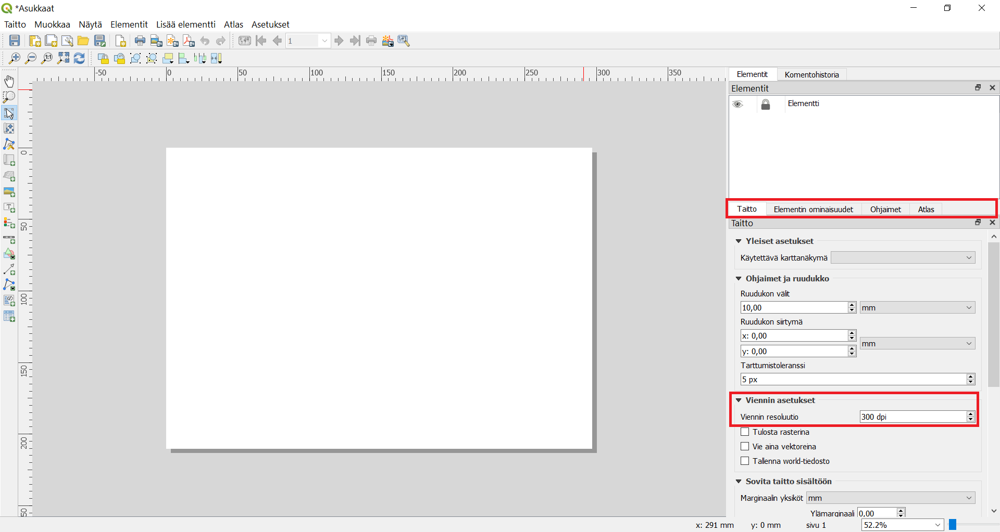

Paina tulosalueella hiiren oikealla näppäimellä ja valitse **Sivun ominaisuudet**. Tarkista **Elementin ominaisuudet -välilehdestä** oikeasta paneelista, että paperin kooksi A4, suunta **Vaaka** ja **Taitto-välilehdestä**, että viennin resoluutio on 300 dpi.
Tämän jälkeen voimme sijoittaa karttanäkymän tulosteelle, valitse työkalupalkista työkalu:

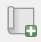

Vedä tulosalueelle suorakulmio, karttanäkymän mukainen kartta piirtyy näytölle.

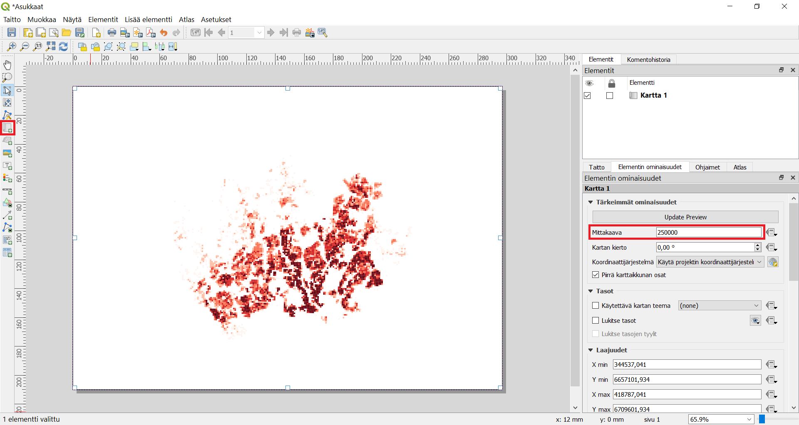

Valitse **Elementin ominaisuudet -välilehti** ja muuta kartan parametrejä seuraavasti:

- Kartan mittakaavaksi 1:200 000
- Valitse Kehys (piirtää kartalle reunaviivat)

Huomaa, että karttatulosteen hallinnassa on mahdollisuus siirtää yksittäisiä kohteita (nimikkeitä) tai muokata kartan sijaintia.
Kohteen ollessa valittuna, voit siirtää sitä tulosteella seuraavan työkalun avulla:

|         |                                 |
|:-------:|:-------------------------------:|
|  | Valitse/siirrä elementtiä |
|  | Siirrä elementin sisältöä (esimerkiksi kartan sisältöä) |
|  | Zoomaa taiton näkymässä |

QGISin avulla voit muokata karttatulosteesi ulkoasua. Otsikko tai muu teksti voidaan lisätä **Lisää uusi nimiö** -työkalulla: 

Lisää uusi selite käyttäen:
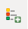

Ja lisää uusi mittakaava käyttäen: 
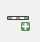

Huomaa, että näiden taiton elementtien ominaisuuksia voit muokata oikeanpuoleisen sivupalkin **Elementin ominaisuudet -välilehden** avulla.
Tekstiä voi muokata tekstinkäsittelyohjelmista tutuilla työkaluilla:

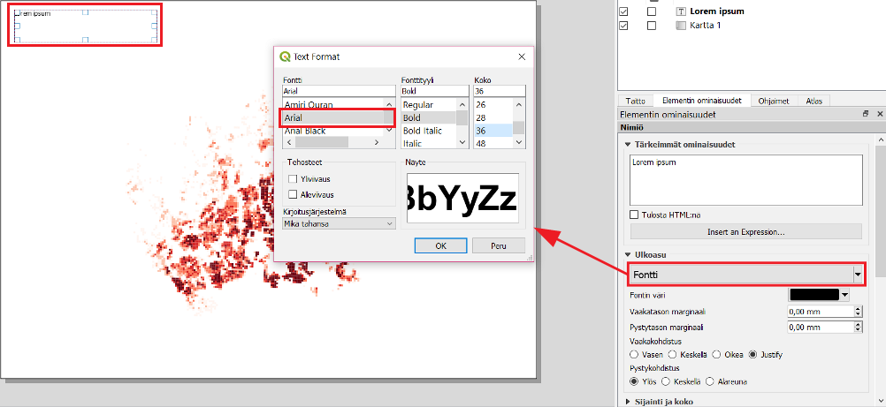

Voit myös muokata selitteen ominaisuuksia. Huomaa, että sinun on poistettava kohdan **Päivitä automaattisesti** rasti.
Pohjoisnuolen lisääminen tapahtuu lisäämällä kuva tällä työkalulla (vasemmasta palkista): 

Valitse sen jälkeen **Elementin ominaisuudet -ikkunasta** mieleisesi pohjoisnuoli-kuva (selaa sisältöä alaspäin, jos et heti näe nuolia).

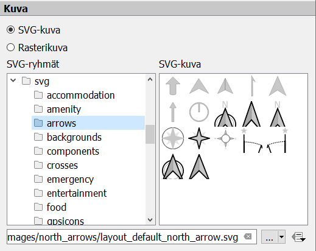

Lopputulos voi olla esimerkiksi seuraavanlainen:

Halutessasi voit tallentaa käyttämäsi tulostemallin (layout englanniksi) ja hyödyntää sitä jatkossa seuraavien karttatulosteiden tekemiseen. Voit esimerkiksi muotoilla kollegoidesi käyttöön karttatulostemallin organisaatiollesi (logot, värit, tekstin paikka, jne.). Tämä onnistuu **Tallenna malliksi -työkalulla**: 

Lopputuloksen voit tulostaa tiedostoksi (kuvaksi tai pdf:ksi) tai tulostimeen. 

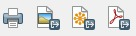

Sopiva resoluutio karttatulosteellesi riippuu kartan käyttötarkoituksesta, mutta oletusarvoinen 300 dpi tallentaa resoluutioltaan hyvinkin tarkkoja kuvia. Voit valita arvoksi vaikkapa 200 dpi. 

:::{.hint-box}
**Psst! Muista tallentaa QGIS-projekti harjoituksen lopuksi.**
:::

## Lisätehtävä: kartta-atlas
QGIS mahdollistaa myös kartta-atlaksen tekemisen. Kartta-atlas on ns. karttakirja, jonka avulla voidaan tuottaa automatisoidusti paljon karttoja samasta teemasta. Seuraavassa esimerkissä tuotamme kartta-atlaksen Helsingin postinumeroalueista tutkien niitä väestön jakautumisen näkökulmasta. Tavoitteenamme on tuottaa 173 karttaa, jotka kattavat kaikki pääkaupunkiseudun postinumeroalueet.

* Lataa ensiksi postinumeroalueet paikkatietoaineiston avoindata.fi-sivustolta: 
  https://www.avoindata.fi/data/fi/dataset/paakaupunkiseudun-postinumeroalueet
  Lataa aineisto haluamassasi muodossa kurssikansioosi ja lisää se oppimallasi tavalla QGIS-projektiin.
  
TAI
* - **Lisää .../kurssihakemisto/HSY/Postinumeroalueet_2019.gpkg** eli HSY:n postinumeroaineisto QGIS-projektiisi. Huom! Tämä aineisto on tallennettu koordinaattijärjestelmässä EPSG: 3067. 

Nyt projektissa on tasoina ainakin väestöruutuaineisto ja postinumeroalueet. Voit myös lisätä muita haluamiasi tasoja projektiin (esimerkiksi tieviivat). 
Avaa uusi tuloste ja aseta sen sommittelu haluamaasi kokoon (esimerkiksi A5). 

Lisää tulosteelle kartta, johon piirtyvät karttaikkunassa näkyvät projektin tasot. Lisää otsikko, selite ja muut karttatulosteen graafiset tai kartografiset elementit (kuten logo tai pohjoisnuoli) totuttuun tapaan. Lähennä karttanäkymä n. yhden postinumeroalueen laajuiseksi (esim. 1:25 000), sillä lopputuloksessa kartta-atlaksen karttalehdet automaattisesti kohdentuvat postinumeroalueiden kokoon.

Sitten aloitetaan kartta-atlaksen tuottaminen. Aktivoimme tulosteelle kartta-atlastilan oikean ominaisuuspalkin Atlaksen luonti-välilehdestä kuvan osoittamalla tavalla. Karttalehtijakotasoksi valitsemme tason, jonka alueisiin kartta-atlas perustuu. Tässä tapauksessa se on postinumeroalueet-taso. 

Varmista, että karttakomponentti on valittuna, valitse se **Valitse/Siirrä elementti -työkalulla** vasemmasta työpalkista ja klikkaamalla kartta aktiiviseksi:

Muokkaamme kartta-atlasasetuksia oikean puolen sivupalkissa **Elementin ominaisuudet → Atlas ohjaa tätä**.

Tämän jälkeen voimme esikatsella kartta-atlastamme **Esikatsele Atlasta -työkalulla** (käyttöliittymän yläreunassa):

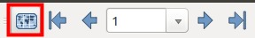

Esikatselun avulla voit vilkaista, miltä kartta-atlas näyttäisi tulostaessa. Käytä nuolia esikatselutyöpalkista Huomaa, että voit tehdä samanaikaisesti muutoksia karttatulosteen tyyliasetuksiin tai vaikkapa tason luokitteluväreihin.
Jos haluat voit lisätä tulosteeseen myös yleiskatsauskarttanäkymän, joka helpottaa kohteen sijainnin määrittämistä kartta-atlaksessa. Yleiskatsaus eli indeksikartta ilmaisee, millä alueella kartalla liikutaan.
Lisää sitä varten tulosteeseen pienempi karttaikkuna, jota käytetään indeksikarttana. Valitse uuden karttaelementin **Elementin omaisuudet -paneelista Yleiskatsaukset** ja määritä asetukset kuvan mukaisesti:

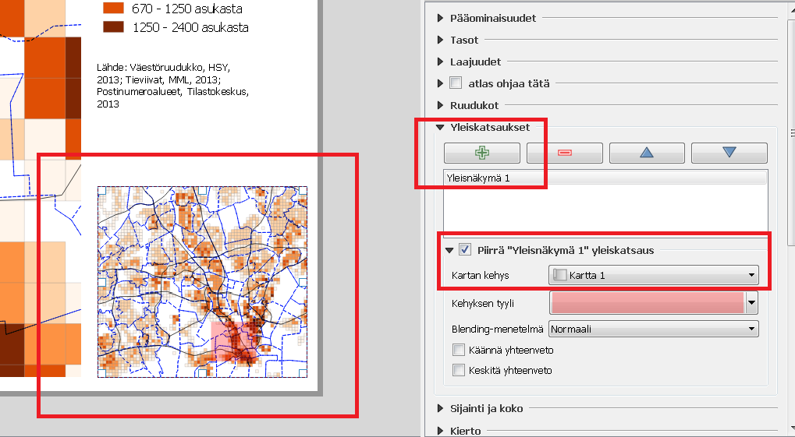

Voit myös muuttaa indeksikartan **Kehyksen tyylin**.
Kun olet valmis, voit tulostaa kartta-atlaksen **Vie atlas kuvina -työkalulla**. Huomaa, että jokaisesta kartta-atlaksen syntyy kuva eli tulostamisessa voi kestää.

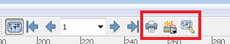

Voit tulostaa atlaksen yksittäisinä kuvina tai yhteen tiedostoon PDF-formaatissa. Yhteen tiedostoon tallentaminen onnistuu aktivoimalla **Yhden tiedoston vienti jos mahdollista** -asetuksen Atlaksen luonti -välilehdessä:

Kartta-atlastuloste voisi näyttää esimerkiksi tältä:

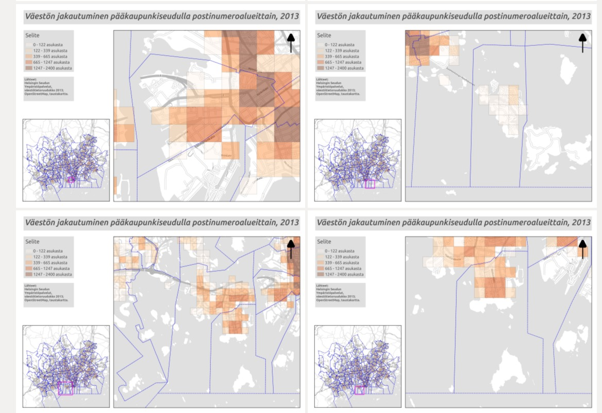

Kuvan esimerkissä on käyttöön otettu myös yleiskatsauskarttanäkymä (vasen alareuna) ja taustakarttana käytetty OpenStreetMap Finlandin WMS-palvelua avaa.fi-julkaisualustan kautta (http://avaa.tdata.fi/openstreetmap). Huomaa, kuinka yleiskarttanäkymän pieni vaaleanpunainen neliö vaihtaa paikkaa sitä mukaa kun kohdennetun kartan alue vaihtuu.
