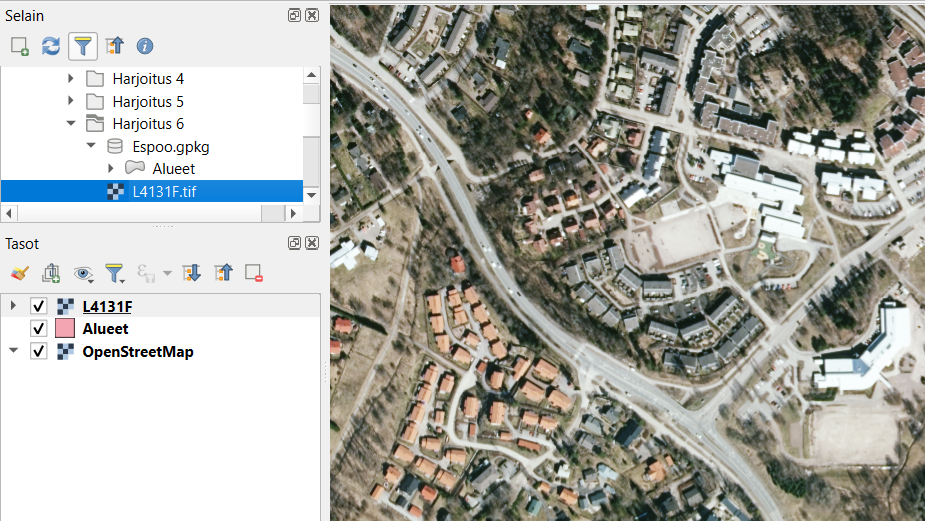
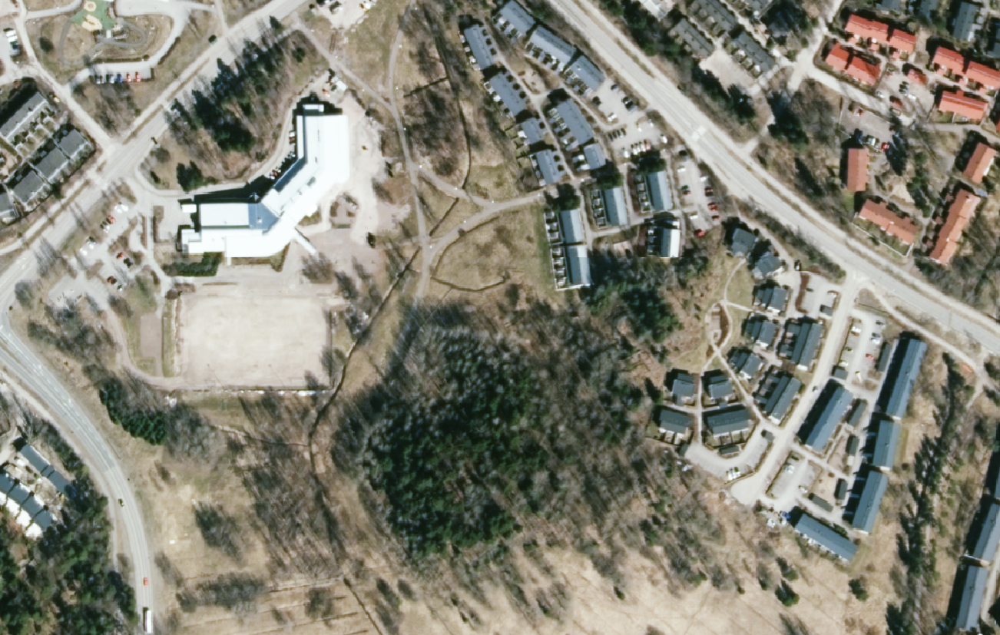
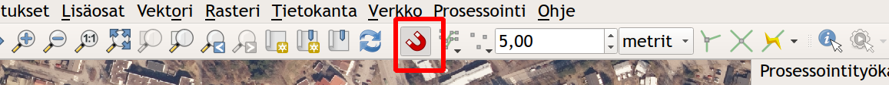
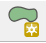
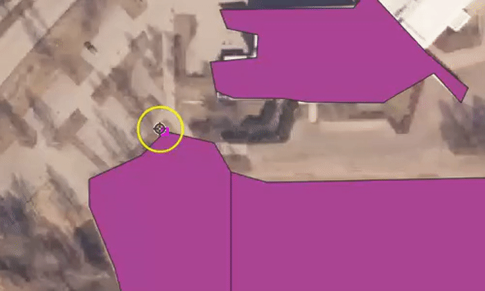
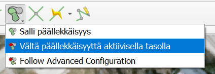

# Harjoitus 6: Paikkatietoaineiston editointi

## Harjoituksen sisältö
Harjoituksessa digitoidaan uusi vektorimuotoinen paikkatietoaineisto.

## Harjoituksen tavoite
Opiskelija oppii kuinka paikkatietoaineistoja tuotetaan ja editoidaan.

## Valmistautuminen
Luo uusi QGIS-projekti ja tallenna se nimellä (**Projekti → Tallenna nimellä…**) “**QGIS_harjoitus_6**”.

## Aineistojen lisääminen

Tuo kurssihakemistosta tyhjä taso digitointia varten: **.../Harjoitus 6/Espoo.gpkg**. Aineisto näkyy QGISin tasot-paneelissa nimellä Espoo - Alueet.
Digitointia varten tarvitset pohjakartan, jonka perusteella voit tehdä alueita aiemmin tuotuun GeoPackageen. Voit käyttää digitoinnin pohjana Maanmittauslaitoksen ilmakuvia. Lisää nyt ortoilmakuva **L4131F.jp2-rasteritiedosto** kansiosta **.../Harjoitus 6/L4131F** QGISiin. Muista, että myös rasteriaineistot saat käyttöösi helposti raahaamalla tiedoston karttaikkunaan tai **Tasot-paneeliin**. 

## Digitoinnin aloittaminen
Valitse kartalta mieleisesi alue, jota lähdet digitoimaan. Zoomaa tarpeeksi lähelle, jotta erotat digitoitavat alueet hyvin (esim. rakennukset).

**Tarttumisen työkalut** - työkalupalkin saa kiinnitettyä käyttöliittymään (ellei se jo siinä ole) joko… 
1 … painamalla QGISin käyttöliittymän reunoilla hiiren oikealla ja rastittamalla Työkalut-kohdan alta Tarttumisen työkalut tai sitten
2 … avaamalla erillisen ikkunan tarttumisen asetuksille ylämenusta Työkalut → Tarttumisen työkalut.
Aktivoi itse työkalu käyttöösi työkalupakistasi löytyvästä punaisesta **magneetti-ikonista** ja aseta sen asetukset seuraavasti.

Asetuksissa määritetään tarttumiseen käytettävä yksikkö (metri) ja etäisyys (5 metriä). Lisäksi asetetaan tarttumisen kohdistuvan aktiiviseen tasoon, sen taitepisteisiin ja/tai segmentteihin sekä myös **Topologinen muokkaus** ja **Tarttuminen risteyksessä** (Snapping on intersection).

Klikkaa seuraavaksi **Lisää monikulmiokohde -työkalua**    ja aloita digitointi. 

Digitoi nyt 5-8 polygonia. Voit tehdä rakennuksia, metsä- tai peltoalueita haluamasi mukaan. Jos haluat tehdä vierekkäisiä kohteita, tarkista, että sinulla on tarttuminen **punaisesta magneetista** päällä. Kun digitoit, työkalu tarttuu kiinni viereisen polygonin kulmaan, kun olet tarpeeksi lähellä. Viereisen polygonin kulmaan tulee pieni pinkki neliö, joka tarkoittaa että työkalu tarttuu tähän pisteeseen. Tee jokaiselle vierekkäiselle kulmalle sama, niin saat tehtyä vierekkäiset polygonit helposti. Alla tästä vielä animaatio.

Kun olet valmis, klikkaa jälleen kynä-ikonia lopettaaksesi ja tallentaaksesi editoinnin. 

> Psst! Muista tallentaa QGIS-projekti harjoituksen lopuksi.

## Lisätehtävä: Tarttumisen työkalut

Tarttumisen työkaluissa on myös muita ominaisuuksia, joita voi hyödyntää digitoinnissa. Viereiseen polygoniin tarttumisen sijasta voit välttää päällekkäisten kohteiden syntymisen voi myös välttää asetuksilla. Aktivoi tarttumisen työkalupalkista **Vältä päällekkäisyyttä aktiivisella tasolla** painamalla päällekkäisyys kuvakkeen oikeasta alareunasta pientä mustaa nuolta. 

Nyt kun digitoit tasolle uuden polygonin, joka menee aiempien tekemiesi polygonien päälle, QGIS leikkaa automaattisesti uuden polygonin reunat aikaisempien mukaisesti.

## Lisätehtävä: CAD-digitointi
Voit kokeilla myös CAD-pohjaista digitointia, joka on kehittynyt verrattain paljon QGISin uudessa versiossa. Työkalut saat esiin lisäämällä **Digitoinnin lisätyökalut** -ylämenusta **Näytä → Työkalut → Digitoinnin lisätyökalut**. 
Kokeile erilaisia työkaluja, esimerkiksi Täytä piiri -työkalua. Tätä voit hyödyntää esimerkkitapauksena peltoja digitoidessa. Kuvitellaan, että peltojen sisään jää aina välillä pieniä metsäsaarekkeita, jotka olisi digitoitava metsä-kohteiksi.

 **Täytä piiri -työkalulla** pystyt irrottamaan alueen omaksi objektiksi (ks. kuva alla).

