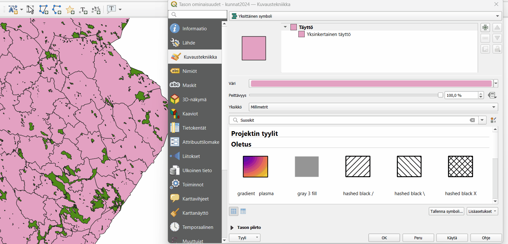
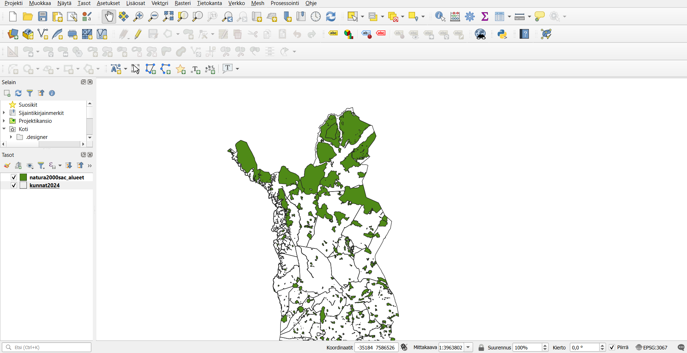
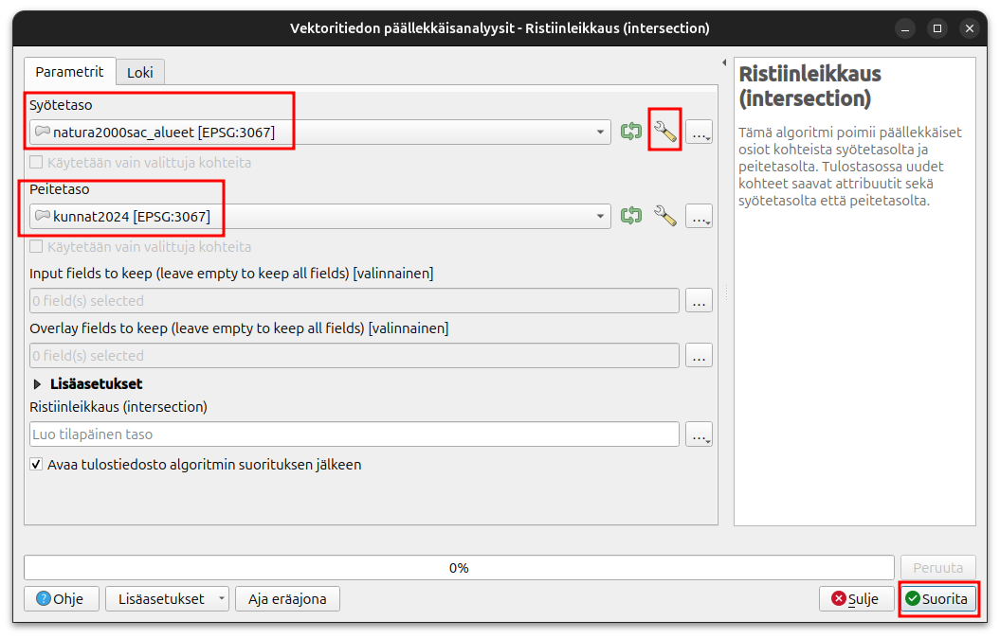
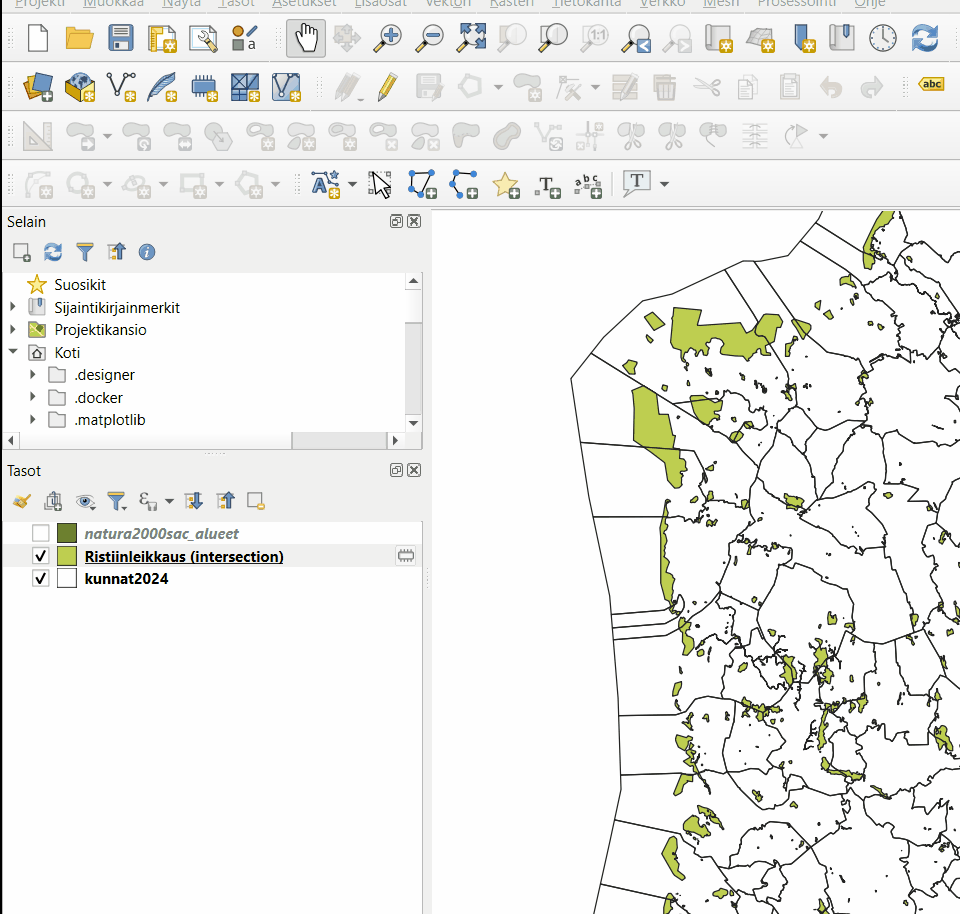
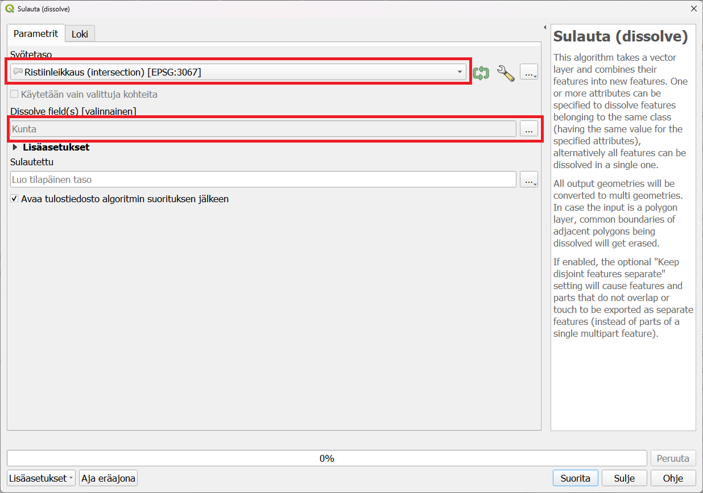
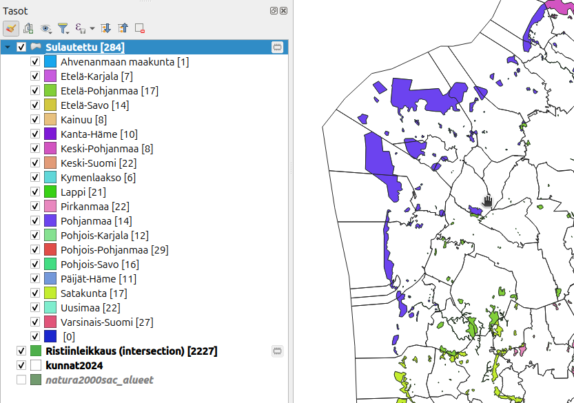
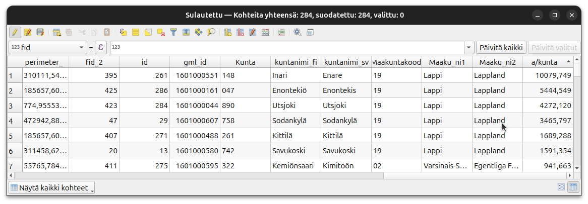

# Harjoitus 7: Paikkatietoanalyysit

## Harjoituksen sisältö

Harjoituksessa tutustutaan QGISin erilaisiin paikkatietoanalyyseihin.

## Harjoituksen tavoite

Koulutettava oppii käyttämään eri aineistoille tarkoitettuja paikkatietoanalyysejä tarkoituksenmukaisesti.

## Valmistautuminen

Luo uusi QGIS-projekti ja tallenna se nimellä (**Projekti → Tallenna nimellä...) "QGIS_harjoitus_7"**.
Lisää projektiin seuraavat tasot:

-   **.../Harjoitus 7/HallintoAlue.shp**

-   **.../Harjoitus 7/NaturaKohde.shp**

Voit asettaa HallintoAlue-monikulmion täytevärin pois ja saada siten NaturaKohde-aineiston paremmin näkyviin:

Karttanäkymä näyttää nyt kunkin väriasetuksia lukuunottamatta tältä:

Tarkista projektisi koordinaattijärjestelmän asetukset **Projekti → Ominaisuudet → Koordinaattijärjestelmä** -välilehdessä tai klikkaamalla QGISin oikeasta alareunasta, jossa on kirjaimet EPSG ja nelinumeroinen koodi.

Molemmilla tavoilla saat auki projektin koordinaattijärjestelmän määrityslomakkeen.
Tarkista, että järjestelmä on ETRS89 / ETRS-TM35FIN.
Muista, että voit lisätä ongelmitta projektiisi aineistoja eri karttaprojektioissa.
Voit tarkistaa myös tasojesi koordinaattijärjestelmän valitsemalla avaamalla tason ominaisuudet ja valitsemalla **Informaatio** tai **Lähde** välilehden.
Kummastakin löydät aineiston koordinaattijärjestelmän.
Monet analyysityökalut eivät toimi jos analyysin lähtöaineistot eivät ole samassa koordinaattijärjestelmässä.

::: hint-box
Huomautus GK-koordinaatiston EPSG-koodeista!

Suomalaiset koordinaattijärjestelmät (vanhat ja uudet) ovat pääosin hyvin tuettuina QGIS-ohjelmistossa.
On kuitenkin huomautettava, että EPSG-määrittelyissä on lievää epäjohdonmukaisuutta.
Esimerkiksi tarkemmat GK-koordinaattijärjestelmän koodit löytyvät EPSG:n luettelosta kahteen kertaan: EPSG:3126 -- EPSG:3138 koodeilla löytyvät koordinaattijärjestelmät ETRS-GK19FIN - ETRS-GK31FIN.
Nämä ovat kuitenkin "virheellisiä", keskimeridiaanin koordinaatti on aina 500 000.

OIKEAT EPSG-koodit: EPSG:3873 - EPSG:3885

VIRHEELLISET EPSG-koodit: EPSG:3126 - EPSG:3138
:::

## Vektorianalyysit

Tässä harjoituksessa selvitetään Natura-alueiden pinta-ala kunnittain.
Lyhyesti harjoituksen kulku on:

\- Tehdään spatiaalinen analyysi kunta- ja Natura-aineiston kanssa, jossa leikataan Natura-alueet kunnittain, jotta Natura-alueisiin saadaan kunta-aineiston sisältämät tiedot

\- Yhdistetään Natura-alueet kunnittain ja lasketaan niiden pinta-ala

Seuraavaksi lähdemme käsittelemään aineistoja **Vektori**-ylämenusta, josta löytyvät ensisijaiset työkalut vektorianalyysien toteuttamiseen:

Käynnistä **Ristiinleikkaus (intersection...)**-työkalu **Geoprosessointi**-valikosta.
Määrittele syötetasoksi NaturaKohde ja leikkaavaksi tasoksi HallintoAlue-aineisto. Aineistossa voi olla geometriavirheitä, joten suodatetaan ne pois analyysista. Paina syötetason vierestä Asetukset  ja valitse **Invalid feature filtering** asetukseksi "Skip (Ignore) features with invalid geometries.Näin analyysi ei lopu, vaikka aineistossa on virheellisiä kohteita.
Teemme tälle aineistolle vielä toisen analyysin, joten voit luoda tilapäisen tason:

Suorita analyysi painamalla Suorita ja paina sen jälkeen **Sulje**.
Analyysi luo uuden väliaikaisen tulostason nimeltä **Ristiinleikkaus (intersection)**.
Karttaikkunassa aineisto näyttää samalta kuin alkuperäinen aineisto.

Vertaile tasojen (**NaturaKohde** ja **Ristiinleikkaus (intersection)**) ominaisuustietoja.
Mitä huomaat?
Voit aktivoida myös **Näytä kohteiden lukumäärä** -toiminnon (paina hiiren oikealla näppäimellä tason nimen päällä Tasoluettelossa) katsoaksesi onko aineiston lukumäärä sama.

Analyysin tuloksena ristiinleikatussa aineistossa tulisi olla enemmän kohteita ja ominaisuustietotaulukossa HallintoAlue-aineiston sarakkeet lisänä.

Koska saman kunnan alueella voi olla usempia eri Natura-alueita, seuraavaksi siis yhdistämme eri kuntien alueella olevat alueet **Sulauta**-työkalun avulla.
Valitse työkalu **Vektori → Geoprosessointi → Sulauta**.

Valitse syötetasoksi aiemmin tehty Ristiinleikkaus-taso ja valitse sulautuksen perusteena oleva sarake painamalla Dissolve fields kohdasta .
Valitse ja laita täppä **Kunta** sarakkeeseen ja paina oikealta **OK**.
Sarakkeen pitäisi tulla harmaana Dissolve fields valinnaksi.

Paina **Suorita** ja sitten **Sulje**.
Tarkista taas kuinka paljon aineistossa on kohteita.
Voit myös visualisoida aineiston esimerkiksi maakunnittain avaamalla **kuvaustekniikan** ja valitsemalla symbolin tyypiksi **Luokiteltu**, vaihda arvokenttään **"Maaku_ni1"** ja paina alareunasta **Luokittele** ja **OK**.

Lopuksi voimme laskea, kuinka monta neliömetriä kullakin kunnalla on suojeltu Natura-alueena.
Avaa sulautetun tason ominaisuustietotaulukko ja laita taso editoitavaksi.
Avaa **Kentän arvojen laskin**-työkalua.
Luo uusi kenttä, jossa on kunnan Natura-alueiden pinta-ala neliökilometreinä **$area** funktion avulla.Voit antaa kentän tyypiksi desimaalinumero (reaali).
Voit laskea pinta-alan neliökilometreinä jakolaskun avulla jakamalla funktion 1 000 000.

Missä kunnassa tai maakunnassa on eniten suojeltuja alueita?

::: note-box
**Psst! Muista tallentaa QGIS-projekti harjoituksen lopuksi.**
:::
