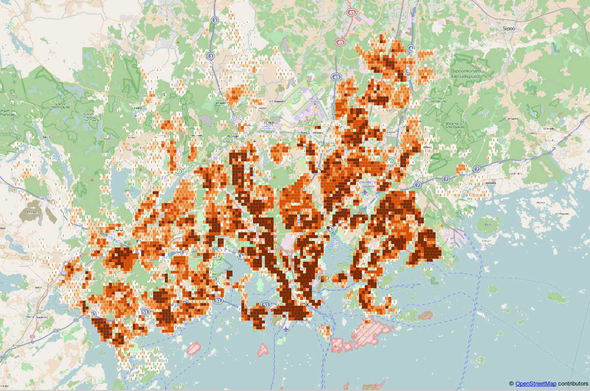
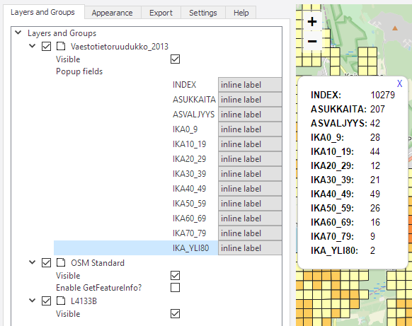

# Harjoitus 8: QGISin lisäosat

## Harjoituksen sisältö

Harjoituksessa asennetaan muutama QGIS-lisäosa.

## Harjoituksen tavoite

Koulutettava oppii asentamaan QGIS-lisäosia ja ymmärtää niiden toimintaperiaatteet.

## Valmistautuminen

Käynnistä QGIS-ohjelmisto ja avaa uusi QGIS-projekti.

## Lisäosien hallinta

Lisäosia lisätään käyttöön päävalikosta **Lisäosat → Hallitse ja asenna lisäosia...** -valikon kautta.
Valitse **Asennettu**-välilehti ja saat esille kaikki asennetut lisäosat.
Huomaa, että suurinta osaa niistä ei ole aktivoitu.
Lisäosien aktivointi lisää erilaisia valikkoja ja paneeleja QGISin käyttöliittymään.
Siksi on hyödyllistä piilottaa ne joita ei käytetä.

## QuickMapServices

**QuickMapServices (QMS) -lisäosan** kautta saat QGISin karttaprojektiin erilaisia taustakarttoja verkosta, kuten OpenStreetMaps, Google Maps tai Bing Maps.
Avaa **Lisäosat → Hallitse ja asenna lisäosia...**, valitse **Kaikki**-välilehti ja etsi quickmapservices tekstillä:

Paina vielä **Install plugin** ja paina sen jälkeen **Sulje**.
Uusi valikko tulee päävalikon **Verkko** alle.
Valitse **Verkko → QuickMapServices → OSM → OSM Standard**.
Karttaikkunassa on nyt **OpenStreetMap** taustakarttana.
Lisää karttoja voit etsiä Valitsemalla **Verkko → QuickMapServices → Search QMS**. Sivupalkkiin avautuu hakuikkuna, josta voit hakea hakusanoilla erilaisia karttoja käyttöösi.
Testaa etsiä esimerkiksi **Stamen** karttoja tai etsi onko omalla tai naapurikunnallasi karttoja palvelussa!

## QuickOSM

Etsi ja asenna **QuickOSM**-lisäosa.
Tällä lisäosalla voit etsiä OpenStreetMapista erilaisia kohteita ja saada ne kartallesi visualisoitavaksi tai analysoitavaksi tasoksi.
Lisäosan voit avata **Vektori → QuickOSM → QuickOSM**.
Avautuvassa ikkunassa voit etsiä kohteita avaimen ja arvon kautta.
Etsitään esimerkiksi Espoon piknik-paikat.
**Esiasetuksissa** voit etsiä suomeksi, jos aihe löytyy suoraan valikosta.
Tässä tapauksessa se löytyy ja täyttää suoraan valikkoon oikean avaimen ja arvon.
Lisää vielä oikea kaupunki ja paina oikealta **"Suorita kysely"**

{width="70%"}

Kartalle tulee kaksi uutta väliaikaista tasoa: pistemäinen kohde sekä aluekohde piknik-paikoista Espoossa.
Voit visualisoida tasot miten haluat.
Muista tallentaa tasot erikseen itsellesi, jos haluat käyttää niitä myöhemmin.
Paina tasoa hiiren oikealla **Vie → Tallenna kohteet nimellä** ja valitse muoto sekä minne haluat tiedoston tallentaa.

{width="70%"}

Tutki, mitä muita kohteita voit löytää OpenStreetMapilta.
Testaa löytää esimerkiksi golfkentät tai pyörätiet jostain kaupungista.
Jos esiasetuksista ei löydä haluamaasi tasoa, yritä etsiä se avaimen ja arvon avulla.

## Lisätehtävä: Qgis2threejs

Lisää vielä **Qgis2threejs**-lisäosa.
Tämä lisäosa mahdollistaa nopean kolmiulotteisen visualisoinnin luomisen web-selaimelle käyttäen threejs-kirjastoa.
Lisäosan valikko tulee myös **Verkko**-valikkoon.
Avaa **Qgis2threejs Exporter** ja valitse **DEM Layer -valikosta** korkeusmalliaineisto (tässä L4133B).
Valitse sen jälkeen **Polygon**-kohdan alta väestötietoruudukkoaineisto ja tuplaklikkaa sitä avataksesi asetukset.
Aseta Z-coordinate kohdan **Mode-asetukseksi Relative to "L4133B" layer** ja **Height-kentän** arvoksi asukkaita-kentän arvo.

Voit tarkastella visualisointia esikatseluikkunassa tai exportoida sen html-tiedostoksi jolloin sen voi avata selaimella.

## Lisätehtävä: Qgis2web

Qgis2web -lisäosa on helppokäyttöinen lisäosa verkkokartan luomista varten.
Sillä voi tuottaa verkkokarttoja hyödyntäen **Leaflet**- tai **OpenLayers**-kirjastoja.
Qgis2web on hyödyllinen apuväline näiden kirjastojen opetteluun ja verkkokarttajulkaisujen tekemiseen.
Avaa Qgis2web valikosta **Verkko → Qgis2web → Create web map**.
Valitse väestötietoruudukko-aineiston kentille **Popup fields** -kohdan alta **Inline label**, ja klikkaa **Update preview**.
Kun kartta on päivittynyt, klikkaa ruudukkoa.

Vaihda **Appearance**-välilehdelle ja muuta asetukset kuvan mukaisesti:

Paina lopulta **Export** tallentaaksesi kartan HTML-tiedostoon.
Tiedosto aukeaa automaattisesti selaimelle.
Kokeile verkkokartassasi etsiä osoitteita ja käyttää mittaustyökalua.

::: note-box
**Psst! Muista tallentaa QGIS-projekti harjoituksen lopuksi.**
:::
