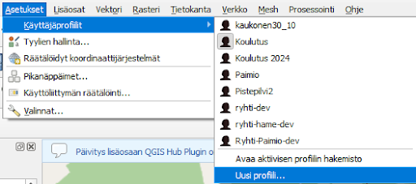
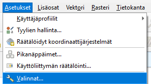
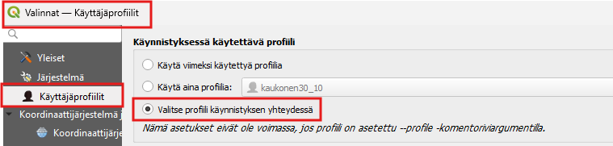
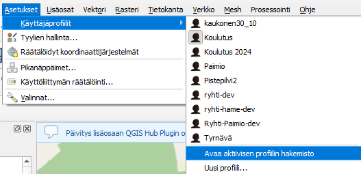
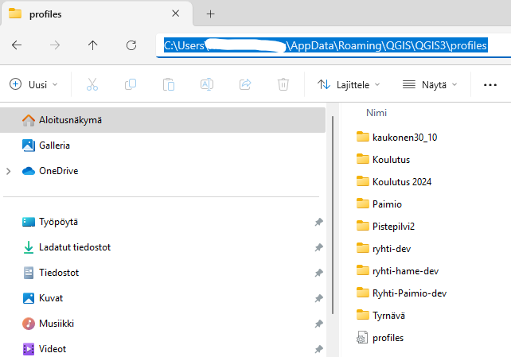

# Harjoitus 1: Profiilit

## Uuden profiilin luominen

QGISissä voidaan luoda valmiita profiileja erilaisiin käyttötarkoituksiin. Voit määrittää ja räätälöidä profiileihin esim. tietokantayhteyksiä, kieliasetuksia ja työkalupalkkeja, jotka ovat näkyvillä. Saat luotua uuden profiilin valitsemalla  **Asetukset > Käyttäjäprofiilit > Uusi profiili**.

Anna profiilille tarkoitukseen sopiva nimi. Tämän jälkeen QGIS käynnistää ohjelman uudestaan ja avaa äsken luomasi profiilin. Jos käytössäsi on useita profiileja, voit asettaa QGISin kysymään, mitä profiilia haluat käyttää, kun käynnistät QGISin. Valitse **Asetukset > Valinnat > Käyttäjäprofiilit > Valitse profiili käynnistyksen yhteydessä**.

## Profiilin poistaminen

Profiilin saa poistettu esimerkiksi valitsemalla **Asetukset > Käyttäjäprofiilit > Avaa aktiivisen profiilin hakemisto**. 

Näin löydät polun,  jonne koneesi tallentaa profiilit. Tässä esimerkissä profiilit ovat tallentuneet kuvan mukaisen polun päähän. Valitsemalla profiles -kansion sisältä jonkin profiilin aktiiviseksi ja painamalla delete, profiilin saa poistettua.

