# Harjoitus 2: Paikkatietoaineistot ja niiden avaaminen

Vektorimuotoisten paikkatietoaineiston tyypillisiä formaatteja ovat Shapefile, Mif/Tab, Gml, Kml, SpatiaLite, GeoPackage, DGN ja DWG. Tutustutaan seuraavaksi shapefilen ja GeoPackagen eroihin.

## Shapefilen ja GeoPackagen erot

1.  Klikkaa **Selain**-paneelissa GeoPackagea hiiren oikealla ja valitse **Uusi Yhteys**.

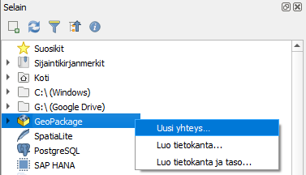

2.  Etsi harjoitusmateriaalipaketissa tullut Retkeilydata.gpkg omalta koneeltasi ja paina Avaa.

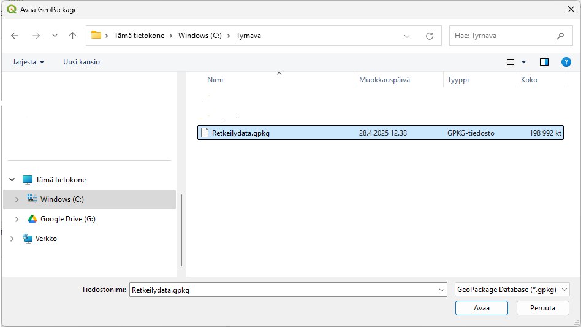

3.  Paina Retkeilydata.gpkg edessä olevaa nuolta. Mitä GeoPackage sisältää?

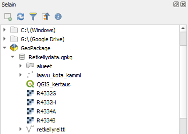

4.  Etsi seuraavaksi selainpaneelin kautta harjoitusmateriaalin mukana tullut shapefilekansio ja tarkastele sen sisältöä ensin Selain-paneelissa.

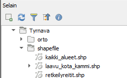

5.  Tarkastele sitten shapefile-kansion sisältöä tiedostojen hallinnassa. Klikkaa hiiren oikealla shapefile-kansiota ja valitse Avaa hakemisto.

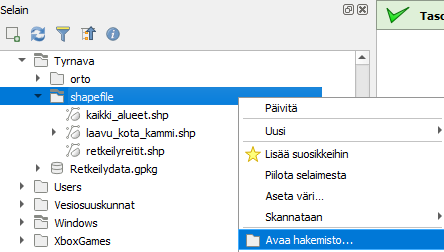

6.  Tutki Retkeilydata.gpkg aineistoa samalla tavalla.

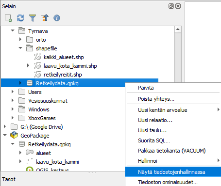

7.  Miten aineistot eroavat toisistaan? Mitä etuja gpkg-tiedostolla on shapefileen verrattuna?

## Paikkatietoaineistojen avaaminen

QGIS -ohjelmaan voidaan avata paikkatietoaineistoja usealla tavalla:

1.  perusvalikon kautta (perusvalikon kautta (**Tasot \> Lisää taso \> valitse millaisen tason haluat lisätä**)

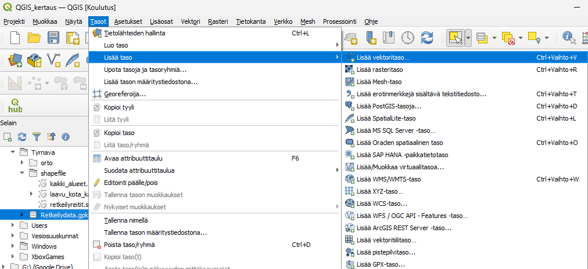

2.  Pikavalikon kautta 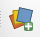

3.  Raahaamalla Selaimen kautta tai suoraan koneen resurssien hallinnan kautta.

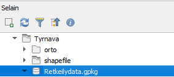

Projektitiedostot puolestaan aukeavat:

1.  Perusvalikon kautta

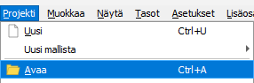

2.  Avaa -painikkeella 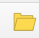

3.  Tai raahaamalla

Avaa seuraavaksi harjoitusmateriaaleja eri tavoilla.

1.  Avaa vektoritasoja shapefilekansiosta eri tavalla: raahaamalla Selain-paneelista ja Avaa tietolähteiden hallinta painikkeen avulla. 

2. Avaa gpkg-tiedosto raahaamalla se selaimen kautta. 

3. Avaa retkeilydatan sisällä oleva QGIS_kertaus-projektitiedosto, joko raahaamalla selaimen kautta tai Avaa-painikkeella. 

4. Mikä tapa tuntuu helpoimmalta? Mikä hankalimmalta? Mitä tapaa olet aiemmin käyttänyt?
