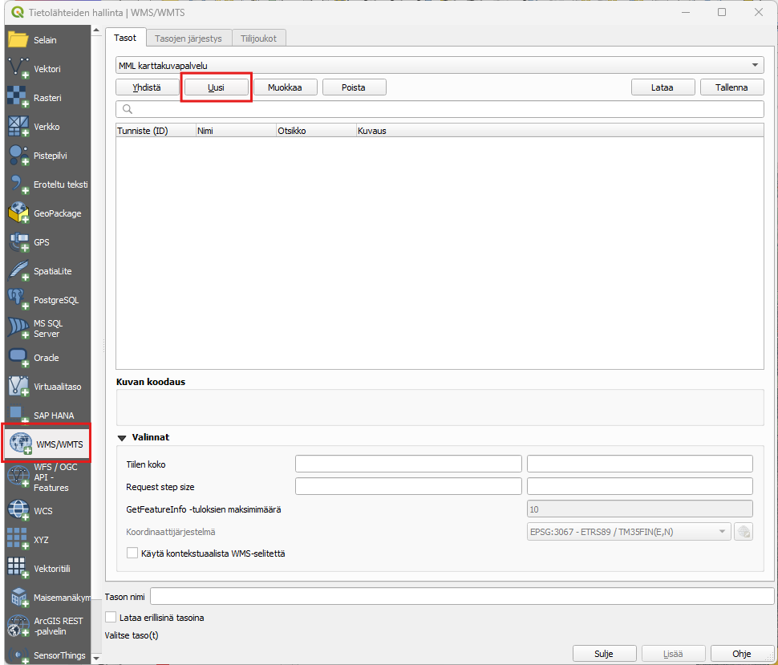
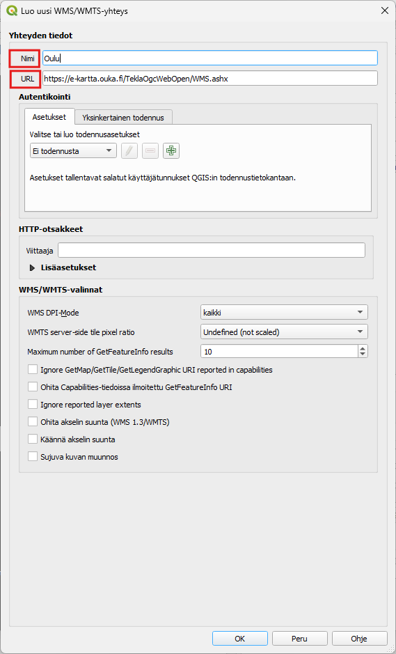
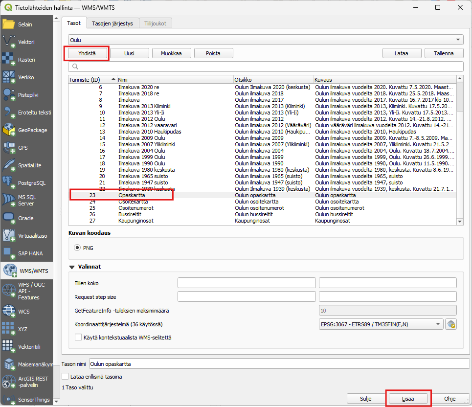
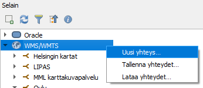
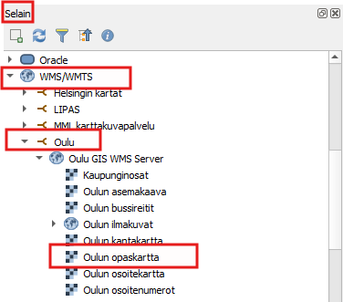

# Harjoitus 3: Paikkatietopalvelut

Harjoituksessa palautetaan mieleen, miten WMS- ja WFS-palveluita lisätään QGIS-projektiin. WMS- ja WFS -palvelulla saadaan lisätty QGIS-ohjelmaan kartta-aineistoja ilman, että kartat pitäisi ladata ensin omalle koneelle.

## WMS-palvelu

WMS-palvelussa (Web Map Service) aineistot ovat rasterimuotoisia, eli kartat muodostuvat pikseleistä. Nämä aineistot sopivat hyvin esimerkiksi analyysien taustakartoiksi.

1. Avaa tyhjä projektitiedosto painamalla **Uusi projekti** 

2. Paina **Avaa tietolähteiden hallinta ** 

3. Valitse avautuvassa ikkunassa WMS/WMTS ja paina Uusi.

4. Määrittele seuraavassa ikkunassa haluamasi nimi WMS-palvelulle. On tärkeää, että muistat itse, mikä nimi vastaa mitäkin aineistoa. SYötä URL-kenttään WMS-palvelun osoite sekä tarvittaessa käyttäjänimi ja salasana. Voit luoda yhteyden esimerkiksi Oulun alueen opaskarttaan https\://e-kartta.ouka.fi/TeklaOgcWebOpen/WMS.ashx tai etsiä esimerkiksi [Gispon sivustolla](https://www.gispo.fi/blogi/avoimen-datan-wms-ja-wfs-karttapalveluita/) olevalta listalta itseäsi kiinnostavan aineiston.

5. Palvelun määrityksen jälkeen paina OK. 

6. Seuraavassa ikkunassa paina Yhdistä. Näin otamme yhteyden WMS-palveluun ja saamme alle listan palvelusta saatavilla olevista karttatasoista. Valitse Opaskartta tai jokin muu taso ja  paina Lisää. Huomaa, että voit joutua odottamaan hetken, kun karttatasoa ladataan palvelimelta.

7. Tutki hetki karttaa liikkumalla sen alueella zoomaamalla eri etäisyyksille ja pohdi, mihin tarkoitukseen voisit hyödyntää  WMS-palvelua? Voit lisäillä myös muita tasoja samasta palvelusta tai lisätä jonkun toisen palvelun projektiin. 

Huom. Voit avata olemassa olevia yhteyksiä tai lisätä uusia yhteyksiä myös Selain-paneelin kautta. Saat luotua uuden yhteyden klikkaamalla WMS/WMTS-tasoa hiiren oikealla ja valitsemalla Uusi yhteys.

## WFS-palvelu

WFS-palvelu (Web Feature Service) mahdollistaa paikkatietokohteiden kyselyn ja lataamisen vektorimuodossa QGISiin.

1. Paina **Avaa tietolähteiden hallinta** 

2. Valitse avautuvassa ikkunassa WFS/OGC API Features ja paina Uusi.

3. Etsi mieleinen WFS-palvelu (tai käytä liikuntapalveluaineistoa http\://lipas.cc.jyu.fi/geoserver/lipas/ows?) ja lisää yhteys QGISiin samoin kuin tehtiin WMS-palvelun kohdalla eli anna palvelulle Nimi ja lisää URL-kenttään palvelun osoite ja paina OK.

4. Valitse mieleinen taso ja lisää se projektiin, samalla tavalla kuin WMS-palvelun tason lisäys tehtiin. Huom. Myös WFS-palveluita voi lisätä selaimen kautta.

5. Tutki lisäämääsi aineistoa. Miten se eroaa WMS-palvelun aineistosta? Miten voisit hyödyntää WFS-palveluita?
