# Harjoitus 4: Digitointi ja editointi

Harjoituksessa palautetaan mieleen GeoPackagen luonti, digitoinnin keskeiset työkalut ja aineiston muokkaus. 

## Uusien aineistojen luominen

1. Luo editointia/digitointia varten uusi GeoPackage-aineisto valitsemalla **Tasot > Luo taso > Uusi GeoPackage -taso**. 

2. Paina Tietokanta-kentän vieressä olevaa “…”-näppäintä ja tallenna uusi GeoPackage omalle koneellesi nimellä “Digitointi”. Anna sen jälkeen uudelle tasolle nimi, esimerkiksi “Alueet” ja varmista, että olet luomassa geometriatyypiltään polygoniaineistoa. Määrittele koordinaattijärjestelmäksi ETRS-TM35FIN (EPSG:3067).

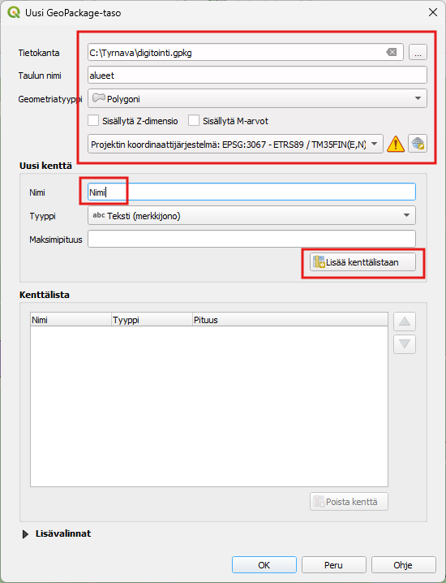

3. Lisää samassa ikkunassa uudelle Alueet-aineistolle muutama kenttä attribuuttitauluun Uusi kenttä-kohdassa. Kun aineistolle luodaan uusi tietokenttä, sille tulee määrittää nimi ja tyyppi. Tietokentälle voi määrittää myös maksimipituuden (= kuinka monta merkkiä kenttä voi sisältää). Lisätään aluksi tietokenttä “Nimi”, jonka tyyppi on Teksti. Paina sitten Lisää kenttälistaan, jolloin Alueet-aineistoon lisätään uusi tietokenttä. Alla olevaan Kenttälista-kohtaan pitäisi ilmestyä uusi tietokenttä näillä määrityksillä.

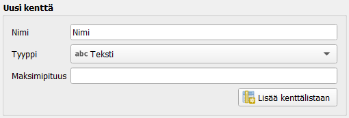
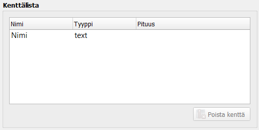

4. Paina sitten OK. GeoPackageen muodostuu uusi tyhjä Alueet-taulu ja QGIS-työtilan Tasot-paneeliin ilmestyy myös uusi Alueet-vektoritaso. Avaa uuden tason attribuuttitaulu ja tarkista, että se on tyhjä. Attribuuttitaulussa tulee olla vain kaksi kenttää: fid ja Nimi. QGIS luo fid-kentän automaattisesti ja se toimii uniikkina id-kenttänä kohteille. Nimi-kenttä taas määriteltiin tason luomisen yhteydessä.

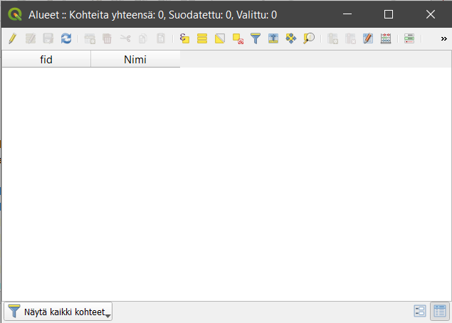

5. Aloita digitointi valitsemalla alueet -taso aktiiviseksi tasot- Listauksesta.

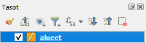

6. Paina **Tason muokkaus päälle/pois** -työkalua . Huomaat, että Digitointi-työkalupalkin muutkin työkalut aktivoituvat.

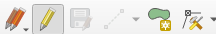

7. Valitse piirron työkaluksi **Lisää monikulmio kohde** 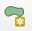 ja piirrä ensimmäinen aluekohde.
Aloita digitointi painamalla hiiren vasemmalla painikkeella. 
Kierrä alue näpäyttäen taitepisteitä hiiren vasemmalla. 
Kun olet valmis, napauta hiiren oikeaa näppäintä ja näin uusi monikulmio on luotu.

8. Digitoi muutama aluemainen kohde.

9. Lisää seuraavaksi harjoituksen alussa luotuun GeoPackageen pistemäinen taso. Klikkaa Uusi GeoPackage taso 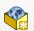. 
    a. Avauteneessa ikkunassa valitse  “...” painikkeen kautta aiemmin harjoituksessa luotu digitointi.gpkg.  
    b. Anna taulun nimeksi Pisteet
    c. Valitse geometriatyypiksi piste ja varmista, että koordinaatisto on EPSG:3067
    d. Lisää kohteille jokin uusi kenttä esim. nimi ja paina lopuksi **OK**.
    e. Ohjelma kertoo, että tiedosto on jo olemassa. Haluamme lisätä luodun pistetason aiempaan digitointi -GeoPackageen, joten vastaa kysymykseen **Lisää uusi taso**.

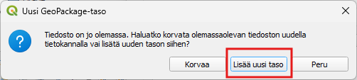

10. Digitoi muutamia pisteitä. Käynnistä digitointi kynä-kuvakkeesta ja valitse sitten .

11. Lopuksi voit lisätä vielä GeoPackageen viivatason. Toimi samoin kuin alueiden ja pisteiden kohdalla, mutta valitse geometriaksi viiva (LineString).

## Tarttumisen työkalut

Digitoinnin yhteydessä voi käyttää Snapping (tarttumis) -ominaisuutta. Ominaisuus mahdollistaa digitoinnissa valmiiden kohteiden taitepisteiden eli vertexien käyttämisen piirrettävässä kohteessa. Kun ominaisuus on valittuna tietylle tasolle, kursori tarttuu lähelle vietynä kyseisen tason kohteen taitepisteeseen. Näin voidaan valita esimerkiksi toisen tien kulma tai päätepiste tarkasti ja saadaan digitoitua yhtenäisiä viivaverkostoja.

1. Valitse seuraavaksi valikosta **Näytä > Työkalut > Tarttumisen työkalut**. Tarttumisen työkalut ilmestyvät työkalupaneeliin: Klikkaa magneetti-ikonia ottaaksesi tarttumisen käyttöön.

2. Klikkaa tämän jälkeen magneetti-ikonin oikealla puolella olevaa painiketta ja valitse Avaa tarttumisen valinnat.

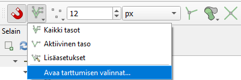.

3. Määritä tarttumisasetukset alla olevan kuvan mukaisesti. Tartutaan vain aktiiviseen tasoon, tartutaan sekä kulmapisteisiin että segmentteihin 5 metrin säteellä, ja laitetaan päälle myös topologinen muokkaus. Asetusten määrittämisen jälkeen voit sulkea Tarttumisen asetukset -ikkunan.

.

4. Kun tarttuminen on asetettu aktiiviseksi ja viet kursorin piirtämäsi esim. viivan lähelle, näet tarttumisen toiminnan tarttumissymbolista (jotta näet symbolit, pitää kohteen piirto olla päällä:	

    - taitepisteeseen tarttuminen 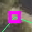.
    - segmenttiin tarttuminen 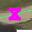.
    
5. Klikkaa hiiren vasemmalla esim. viivatasolla olevaa viivaa ja uusi viiva tarttuu olemassa olevaan viivaan.  Käytä tarttumis-ominaisuutta, jotta saat luotua toisiinsa saumattomasti liittyvän viivaverkon.

Tarttumisen työkalupalkissa on myös muita digitointia helpottavia työkaluja. 

6. Testaa seuraavaksi **Trace**-työkalua painamalla **Ota seuraaminen käyttöön**-painiketta .
    a. Piirrä 	seuraavaksi viiva niin, että seuraat osittain jo jotain olemassa 	olevaa viivaa. Aloita viivan piirto jonkin jo olemassa olevan viivan läheltä. Kun olet jo olemassa olevan viivan luona, kiinnitä uusi viiva olemassa olevaan hiiren vasemmalla painikkeella ja lähde liikuttamaan hiirtä olemassa olevaa viivaa pitkin. Uusi viiva piirtyy vanhan viivan päälle ohuena katkoviivana.   
    b. Kun haluat lopettaa viivan seuraamisen, näpäytä viiva kiinni olemassa olevan viivan taitepisteeseen tai segmenttiin ja jatka digitointia tavalliseen tapaan.
    
7. Aluemaisia kohteita piirtäessä voidaan hyödyntää Topologista muokkausta painamalla .  Tämä työkalu mahdollistaa sen, että saat helposti topologisesti ehyen aluemaisten kohteiden digitoinnin aikaiseksi. Laita lisäksi päälle asetus Vältä päällekkäisyyttä aktiivisella tasolla.

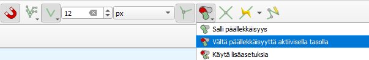

a. Aloita kuvion digitointi toisen kuvion sisäpuolelta ja ylitä kuvioraja halutusta kohdasta. 
b. Päätä digitointi takaisin kuvion sisälle näpäyttämällä oikealla painikkeella. Toiminto rajaa uuden kuvion automaattisesti vanhojen kuvioiden reunaan. Aloitus- ja päätöskuvion ei tarvitse olla sama. Ohjelma leikkaa aineistosta 	pois päällekkäiset alueet.

