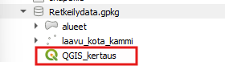
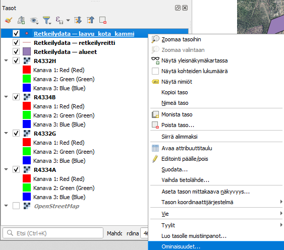
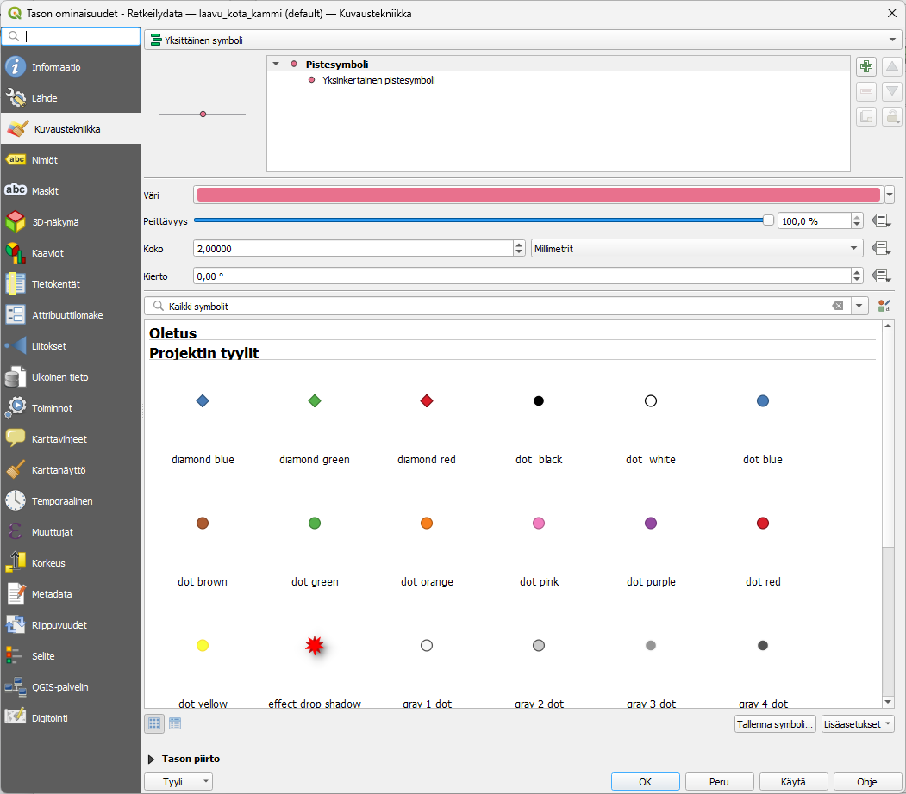
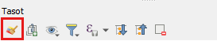
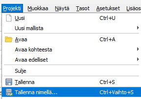

# Harjoitus 5: Visualisointi

Paikkatietoaineistojen visualisointi on keskeinen osa karttajulkaisuiden tekoa, sillä tasojen piirtotyyli vaikuttaa olennaisesti siihen miltä kartta näyttää. Palautetaan mieleen, miten vektoriaineistoja visualisoidaan QGISissä. Tässä harjoituksessa kerrataan visualisoinnin perusteet.

1. Avaa harjoitusmateriaalin QGIS_kertaus projekti Retkeilydata-GeoPackagen kautta.

2. Paina hiiren oikealla painikkeella Retkeilydata_laavu_kota_kammi -tason päällä ja valitse auenneesta listasta **Ominaisuudet**, jolloin **Tason ominaisuudet** -ikkuna aukeaa.

3. Valitse auenneen ikkunan vasemmasta laidasta Kuvaustekniikka, jolloin pääset muokkaamaan tason kuvaustekniikkaa.

4. Vaihda kohteen väri  ja koko mieleiseksi. Painamalla **Käytä**, näet muutokset kartalla.

5. Kokeile erilaisia tyylejä.

6. Kun olet tyytyväinen muutoksiin paina **OK**.

7. Pääset muuttamaan kuvaustekniikkaa myös Tasot-paneelin pensseli-kuvakkeen kautta. Paina pensselin kuvaa ja koita muuttaa kuvaustekniikkaa tätä kautta. Mitä eroja huomaat kuvaustekniikan muuttamisessa tätä kautta?

8. Muuta vielä viiva- ja aluekohteiden kuvaustekniikka mieleiseksi.

9. Tallenna projekti nimellä Harj5 valitsemalla **Projekti → Tallenna nimellä**.

