# Harjoitus 6: Karttatuloste

Tässä harjoituksessa palautetaan mieleen karttatuloseen luominen laatimalla harjoituksessa 5 visualisoiduista kohteista karttatuloste. 

Uuden tulosteen muodostaminen voidaan aloittaa kahdella tavalla: 

1. valitse **Projekti → Uusi taitto**

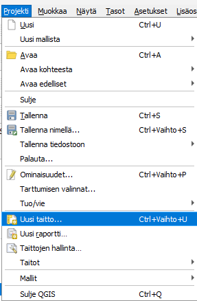

2. paina työkalua: 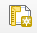

3. Tämän jälkeen taitolle annetaan nimi, joka kuvaa kartan sisältöä.

4. Taiton ominaisuuksia kuten paperin kokoa ja suuntaa pääsee muuttamaan painamalla hiiren oikealla taittodokumentin päällä ja valitsemalla **Sivun ominaisuudet**.

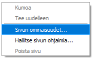

5. Aseta sivun kooksi esimerkiksi A4 ja suunnaksi pysty.

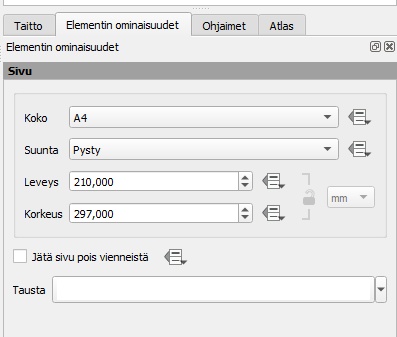

6. Määritä Taitto-välilehdellä Viennin resoluutioksi esim. 300 dpi.

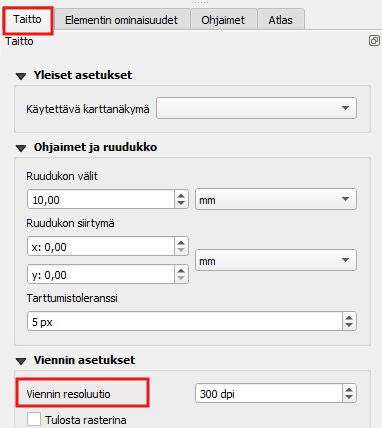

7. Lisää seuraavaksi taittoon karttanäkymä joko
    a. Valitsemalla **Lisää elementti → Lisää kartta** tai
    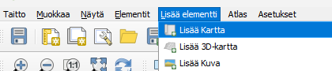
    b. suoraan kuvakkeen Lisää kartta kautta 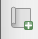
    
 8. Otsikko tai muu teksti voidaan lisätä Lisää uusi nimiö -työkalulla: 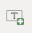
 
 9. Lisää uusi selite käyttäen: 
 
 10. Lisää uusi mittakaava käyttäen: 
 
 Huomaa, että näiden taiton elementtien ominaisuuksia voit muokata oikeanpuoleisen sivupalkin Elementin ominaisuudet -välilehden avulla. Tekstiä voi muokata tekstinkäsittelyohjelmista tutuilla työkaluilla:
 
 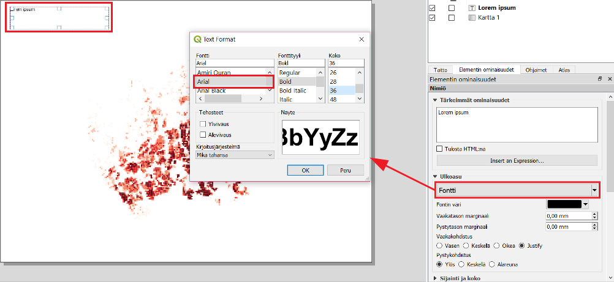
 
 11. Voit myös muokata selitteen ominaisuuksia. Huomaa, että sinun on poistettava kohdan **Päivitä automaattisesti** rasti. 
 
 12. Pohjoisnuolen lisääminen tapahtuu lisäämällä kuva tällä työkalulla (vasemmasta palkista):  
     a. Valitse sen jälkeen Elementin ominaisuudet -ikkunasta mieleisesi pohjoisnuoli-kuva (selaa sisältöä alaspäin, jos et heti näe nuolia).
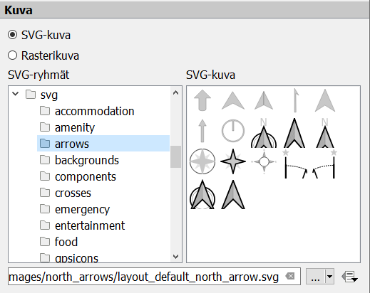

Halutessasi voit tallentaa käyttämäsi tulostemallin (layout englanniksi) ja hyödyntää sitä jatkossa seuraavien karttatulosteiden tekemiseen. Voit esimerkiksi muotoilla kollegoidesi käyttöön karttatulostemallin organisaatiollesi (logot, värit, tekstin paikka, jne.). Tämä onnistuu Tallenna malliksi -työkalulla: 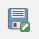

Lopputuloksen voit tulostaa tiedostoksi (kuvaksi tai pdf:ksi) tai tulostimeen.

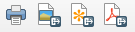