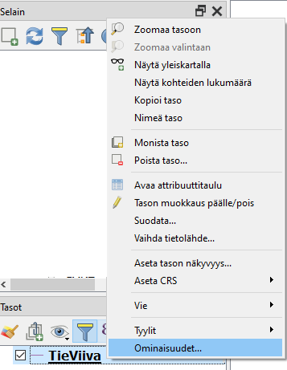
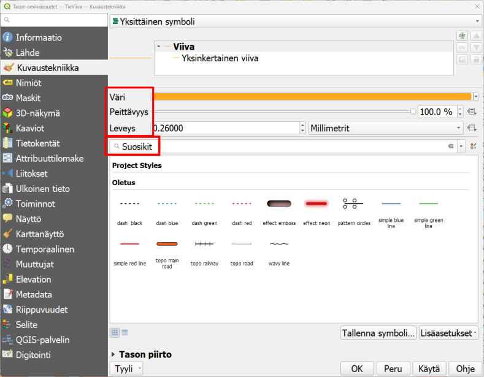

# Harjoitus 3: Paikkatietoaineiston visualisointi

## Harjoituksen sisältö

Harjoituksessa tehdään visualisoinnit sekä vektori- että rasteriaineistosta.

## Harjoituksen tavoite

Koulutettava oppii eri aineistotyyppien visualisointitapoja.

## Valmistautuminen

Käynnistä QGIS-ohjelmisto. Avaa uusi QGIS-projekti ja tallenna se nimellä (**Projekti → Tallenna nimellä...**) "**QGIS_harjoitus_3**".

## Vektoriaineistojen visualisointi

Aloita tutkimalla edellisessä harjoituksessa avattua tiestötasoa. Jos teit uuden QGIS-projektitiedoston, lisää taso painamalla **Lisää vektoritaso -painiketta** ja selaamalla tiedostoon **.../kurssihakemisto/Harjoitus 3/TieViiva.shp**. Paina hiiren oikealla painikkeella tason nimeä (TieViiva) tasoluettelossa. Valitse valikosta **Ominaisuudet**:

**Tason ominaisuudet** -ikkuna aukeaa. Huomaa vasemmalla oleva sivupalkki, josta löytyy eri ominaisuudet jaoteltuna aihekohtaisesti. Samaisessa sivupalkissa on **Kuvaustekniikka-alamenu**, jonka valittuasi pääset muokkaamaan tason tyyliominaisuuksia:

{width="70%"}

Vaihda **Väri- ja Leveys-arvot**, ja paina **Käytä**. Sillä tavalla saat näkyviin tekemäsi muutokset sulkematta **Tason ominaisuudet -ikkunaa**. Avaa vielä jokin **symbolikirjasto**, esimerkiksi **Suosikit**, ja muuta viivan tyyliksi jokin sinua miellyttävä tyyli. Paina sitten **OK**, ikkuna sulkeutuu ja tiestö-taso näkyy nyt määrittämäsi visualisointityylin tavalla. Muut paikkatietoaineistojen visualisoinnin työkalut saa käyttöön samalla tavalla, avaamalla hiiren oikealla **Ominaisuudet** ja sivupalkista **Kuvaustekniikka**. Eri vektoriaineistotyypeillä (piste, viiva, monikulmio) on erilaiset kuvaustekniikan työkalut, vaikkakin ne muistuttavat paljon toisiaan. Esimerkiksi pistetasolle ei voida tehdä samoja tyylittelyjä kuin viiva- tai monikulmiotasolle. Rasteriaineistojen työkalut taas eroavat melko paljon vektoriaineistojen työkaluista. Katsomme näitä myöhemmin tässä harjoituksessa.

Lisätään nyt toinen vektorimuotoinen aineisto QGIS-projektiimme. Käytä samaa työkalua kuin edellisessä harjoituksessa: avaa siis uusi taso painamalla **Lisää vektoritaso** -näppäintä. Etsi **.../kurssihakemisto/Harjoitus 3/ne_10m_populated_places/** hakemistosta aineisto nimellä **ne_10m_populated_places_suomi.shp**. Tämä aineisto sisältää NaturalEarth-kaupunkiaineiston Suomesta. Avaa pistetason kuvaustekniikkaikkuna samalla tavalla kuin äsken viivatason yhteydessä. Huomaa erot viiva- ja pistetason kuvaustekniikan määrittelyissä:

{width="70%"}

Vaihda pisteen **Väri** ja **Koko** ja paina taas **Käytä**. Pikanäppäimellä **F7** saat avatuksi **Tason tyylit -ikkunan**, joka on jatkuvasti avoinna karttaikkunan oikeassa laidassa. Tällöin voit helposti vaihtaa kaikkien tasojen kuvaustekniikkaa ja näet heti, miltä uusi tyyli näyttää. Vaihda symbolia ja kokeile myös, miten **Kierto** vaikuttaa symbolin näkymiseen.

Toistetaan samat asiat vielä monikulmiotason kanssa. Avaa nyt Suomen Natura-alueet, **Harjoitus 3**-hakemistosta **NaturaKohde_ma.shp**

{width="70%"}

ja lisää aineisto projektiin. Avaa sen kuvaustekniikkaikkuna ja huomaa erot verrattuna piste- ja viiva-aineistojen ominaisuuksiin. Muokkaa tason väriä **Väri-kohdasta** ja valitse tasolle jokin symboli haluamastasi kirjastosta. Voit myös kokeilla eri **Peittävyys-arvoja**. Paina Käytä ja kun olet testannut tarpeeksi, paina **OK**.

Saattaa olla, että aineistotasot peittävät toisensa vaikka siten, että monikulmio aineisto peittää muut sen alle jäävät aineistot. Kokeile muuttaa tasojen keskinäistä järjestystä ja siten tasojen näkymistä raahaamalla/vetämällä tasot uuteen järjestykseen **Tasoluettelossa**. Useimmiten monikulmiotasot on hyvä jättää alimmiksi tasoiksi. Jos kartalla halutaan visualisoida jotakin rasterikuvaa, kannattaa se/ne yleensä pitää myös alimpina tasoina. Uudelleen järjestettynä karttasi näyttää tältä:

Voit myös piilottaa tai näyttää tasoja painamalla tason nimen vasemmalla puolella olevaa ruutua.

## Monikulmioaineiston edistynyt visualisointi

Ensimmäiseksi muutamme vektoriaineiston väriä. Avaa tason **Ominaisuudet → Kuvaustekniikka** ja klikkaa **Väri-kohdassa** olevaa väripalkkia. Valitse haluamasi väri vektoriaineistolle. Huomaa, että voit määritellä värit arvo **HSV-** (Hue, Saturation, Value) tai **RGB-arvoilla** (Red, Green, Blue). **Peittävyys-arvolla** säädät värin läpinäkyvyyttä. Kokeile myös **Värikarttaa**, **Väripyörää** ja **Liukuväri** (välilehdet). Valittuasi sopivan värin, paina **OK**. Paina sen jälkeen **Ominaisuudet-ikkunasta Käytä**. Näin **Ominaisuudet-ikkuna** pysyy auki ja voit katsoa tyylien muutoksia karttanäkymässä. Kun olet valinnut haluamasi värin, paina **OK**.

{width="70%"}

Avaa uudelleen tason **Ominaisuudet-ikkuna**. **Kuvaustekniikka-asetuksista**, valitse ensin **Simple fill** oheisen kuvan mukaisesti:

{width="70%"}

Sen jälkeen valitse reunaviiva katkoviivaksi kohdasta **Piirron tyyli**. Viivan paksuudeksi voit määritellä 0,8 millimetriä. Lopuksi voit vielä määritellä **Tason piirto -kohdasta** (valikko aukeaa pientä nuolta klikkaamalla) **Peittävyys-kohtaan** arvoksi 70%.

::: hint-box
**Psst! Muista tallentaa QGIS-projekti harjoituksen lopuksi.**
:::
