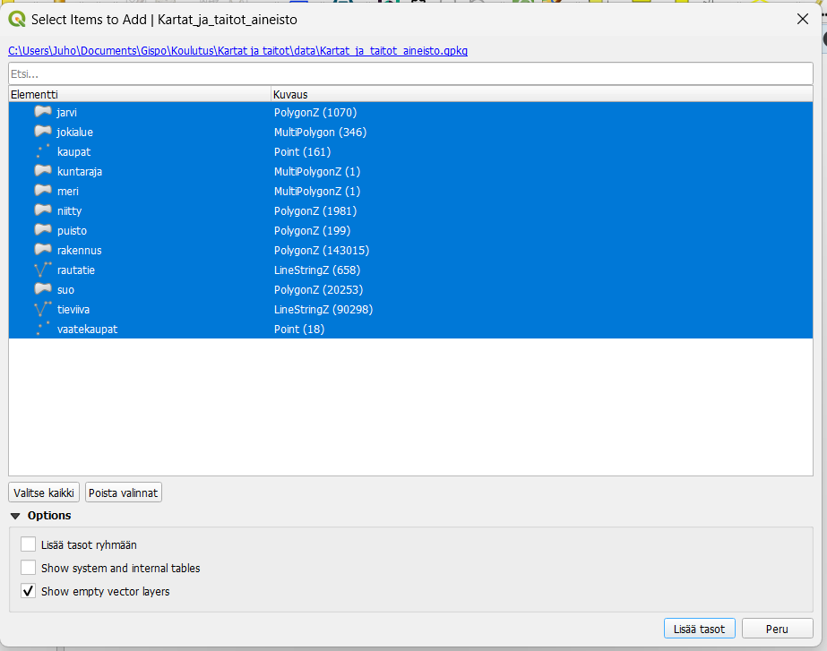
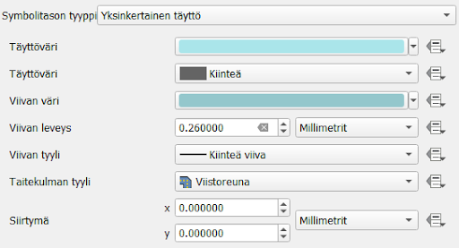
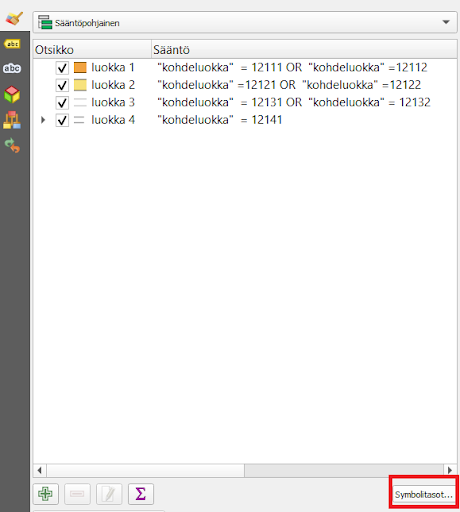

# Harjoitus 1: Vektoriaineistojen visualisointi

## Harjoituksen sisältö

Harjoituksessa avataan QGIS ja tuodaan kurssilla käytettävät aineistot
ohjelmistoon. Tämän jälkeen aineistoja visualisoidaan esimerkkikuvan
mukaisesti.

## Harjoituksen tavoite

Koulutettava oppii tuomaan GeoPackage-muodossa olevia aineistoja QGISiin
ja visualisoimaan piste-, viiva- ja polygonikohteita.

## Kurssimateriaalin lataus

Kurssilla tarvittavat paikkatieto-aineistot on ladattavissa Google
Drivestä linkistä

::: note-box
[Kurssihakemisto.zip](https://drive.google.com/file/d/1dInubc0XceDUzJOV-QhexULHqu8NeQcu/view?usp=drive_link)
:::

## Valmistautuminen

Avaa uusi QGIS-projekti (Projekti \> Uusi) ja tallenna se nimellä
**QGIS-harjoitus 1**. Lisää projektiin seuraavat aineistot:

-   **...kurssihakemisto/Kartat_ja_taitot.gpkg**

## Aineiston tuonti ja järjestely

Kurssimateriaali on koottu yhteen GeoPackageen, joka tuodaan QGISiin.
Avaa **Tietolähteiden hallinta -\> Vektori -\> Etsi lataamasi
Kartat_ja_taitot.gpkg** ja Lisää. Valitse kaikki tasot ja paina vielä
**Lisää**.

Aineisto sisältää piste- viiva- ja polygonikohteita, Voit tutkia
minkälaisia tasoja GeoPackagessa on. Helpottaaksemme käsittelyä voimme
jakaa kunkin aineistotyypin eri kansioihin. Luo piste-, viiva- ja
polygonikohteille omat kansionsa painamalla 
Tasot-paneelin yläreunasta. Nimeä tasoryhmä lisäämisvaiheessa kun se on
aktiivinen, tai klikkaamalla tasoryhmää tasoluettelossa hiiren oikealla
ja valitsemalla "Nimeä ryhmä". Kun olet luonut kolme uutta kansiota,
raahaa pistekohteet omaan kansioonsa, polygonit omaansa ja viivat
omaansa. Näin saadaan aineisto järkevästi järjesteltyä. Jos kaikki
kohteet eivät näy kunnolla, vaihda tasojen paikkaa raahaamalla
esimerkiksi pistetasot polygonien yläpuolelle. QGIS visualisoi kohteet
sen mukaan, miten ne ovat tasoluettelossa, eli ylimpänä olevat tasot
ovat päällimmäisenä.

## Tasojen visualisointi

Kun tuot uuden vektoriaineiston QGISiin, ohjelma arpoo satunnaiset värit
kaikille kohteille. Visualisoidaan karttakohteita järkevämmän näköiseksi
karttakokonaisuudeksi.

Esimerkkikuva lopputuloksesta:

### Polygonien visualisointi

Avaa **Tason tyylit** -paneeli menemällä **Näytä \> Paneelit \> Tason
tyylit**. QGISiin avautuu uusi sivupalkki, jossa voit valita tason
yläreunasta ja muuttaa sen kuvaustekniikkaa.

Aloitetaan kuvaustekniikan muokkaaminen suurista polygoneista. Valitse
esimerkiksi meri-taso ensimmäiseksi Tason tyylit-paneelista. Saat
edistyneet visualisointityökalut auki painamalla Yksinkertainen täyttö
-kohtaa:

Täältä saat muokattua tarkemmin polygonin väriä ja täyttötyyppiä sekä
ulkoviivan väriä ja ominaisuuksia. Värivalintaa painamalla saat
laitettua myös valmiin HTML-koodin valitsimeksi. Vaihda tason täyttöväri
ja viivan väri itsellesi mieluisiksi.

Alla on esimerkkinä mitä värejä harjoituksen esimerkkikuvassa on
käytetty. Voit testata myös eri värejä ja katsoa, miten ne toimivat
kartallasi. **Älä visualisoi rakennuksia vielä**.

::: code-box
**Esimerkkikuvan värit**

**Meri:** täyttöväri: #aae5ea reunaviiva: #94c7cc

**Kuntaraja:** täyttöväri: #dcecbd reunaviiva: #000000

**Rakennus:** täyttöväri: #a2875d reunaviiva: #60564b

**Puisto:** täyttöväri: #a7b882 ei reunaviivaa

**Niitty:** täyttöväri: #fedc8b reunaviiva: #888888

**Järvi:** täyttöväri: #aae5ea reunaviiva: #94c7cc
:::

### Sääntöpohjainen visualisointi

Viivakohteet voivat olla päällekkäisiä tasoja muiden tyyppisten tasojen
päällä. Aineistossa tiet ja rakennukset menevät usein päällekkäin
eivätkä toimi kaikilla mittakaavatasoilla sujuvasti yhteen. Tehdään siis
ensiksi **rakennus**-polygonitasolle siis **sääntöpohjainen
visualisointi**.

Tasolla on oletuksena yksi sääntö, tuplaklikkaa sitä muokataksesi sitä.

Tarkoituksena on luoda sääntö, jonka perusteella QGIS näyttää
rakennukset vain 1 : 10 000 -mittakaavassa ja sitä tarkemmissa
mittakaavatasoissa. Haluamme valita visualisointiin kaikki talot, joten
valitse suodattimeksi **"Else"**. Suodatuksen lisävalintoihin pääsemme
tieaineiston parissa. Nyt meille riittää, että laitamme täpän Scale
range -kohtaan ja täytämme pienimmäksi mittakaavaksi 1:10 000 ja
suurimmaksi 1:1. Tämä mittakaava on se, jolla monia opaskarttoja
tarkastellaan.

Nyt kun muutat QGISin näkymässä kartan mittakaavaa (käyttämällä vaikkapa
hiiren rullaa tai kannettavan tietokoneen hiiren lähennystä ja
loitonnusta), huomaat että rakennukset tulevat näkyviin ja katoavat
mittakaavatason mukaan.

### Tieaineisto

Tieviiva-aineisto sisältää erityyppisiä teitä. Avaa aineiston
attribuuttitaulukko ja tarkastele mitä se sisältää.
Kohdeluokka-sarakkeessa on luokiteltu tiet seitsemään eri luokkaan.
Kartoissa on kuitenkin usein neljä eri luokkaa tietyypeille, joten
käytetään samaa luokittelua.

::: hint-box
Tässä harjoituksessa käytetyt kohdeluokat perustuvat
Maanmittauslaitoksen luokitukseen Autotie Ia (12111), Autotie Ib
(12112), Autotie IIa (12121), Autotie IIb (12122), Autotie IIIa (12131),
Autotie IIIb (12132), Ajotie (12141). Tarkemmat tiedot aineistosta
löytyvät:
<https://www.maanmittauslaitos.fi/sites/maanmittauslaitos.fi/files/attachments/2023/06/Maastotietokohteet_2023_05.pdf>
:::

Jotta saamme luotua mittakaavaperusteisen näkyvyyden aineistolle ja
tehtyä eri luokille omat visualisointinsa, valitse tieviiva-aineistolle
sääntöpohjainen visualisointi. Tee uusi sääntö paneelin vasemmasta
alareunasta  -painikkeesta. Tästä tulee
**luokka 1**.

Lisää suodatin, scale range sekä kaksi visualisointitasoa kohteelle:

**Otsikko:** Luokka 1

**Suodatin**: `"kohdeluokka" = 12111 OR "kohdeluokka" =12112`

**Scale range**: 1:100000000, 1:1

Valitse aineistolle ensin yksi yksinkertainen täyttö, jossa on haluamasi
väri. Sen jälkeen paina  -painiketta ja
lisää toiseksi väriksi musta.

Jotta saat mustan värin reunaviivaksi ja valitsemasi värin pysymään tien
päävärinä, aseta musta väri alimmaiseksi painamalla
 -painiketta ja asettamalla mustan viivan
paksuus täyttöväriä isommaksi.

::: code-box
Esimerkkikuvan asetukset luokalle 1 olivat:

**Viiva 1 (sisus)**: täyttöväri: #f1a342 paksuus: 2,2 mm

**Viiva 2 (reuna)**: täyttöväri: #000000 paksuus: 2,6 mm
:::

Tee lopuille kolmelle luokalle samalla tavalla sääntöpohjainen
luokittelu ja mittakaavaperusteinen näkyvyys näillä arvoilla:

::: code-box
**Luokka 2** \"kohdeluokka\" =12121 OR \"kohdeluokka\" =12122

Scale range: 1:20001, 1:1

Viiva 1: täyttöväri: #f7e27c paksuus: 2,8 mm

Viiva 2: täyttöväri: #000000 paksuus: 3,1 mm

**Luokka 3** \"kohdeluokka\" = 12131 OR \"kohdeluokka\" = 12132

Scale range: 1:10001, 1:1

Viiva 1: täyttöväri: #ffffff paksuus: 1,2

Viiva 2: täyttöväri: #7e7a7a paksuus 1,6

**Luokka 4** \"kohdeluokka\" = 12141

Scale range: 1:10 001, 1:1

Viiva 1: täyttöväri: #ffffff paksuus: 1,2

Viiva 2: täyttöväri: #a4a9a2 paksuus: 1,8 Viivan tyyli: pisteviiva
:::

Nyt tiet ovat muuten valmiita, mutta monissa kohdin reunaviivat
näyttävät menevän väärin. Muutetaan siis vielä teiden piirtojärjestys,
jotta reunaviivat menevät piiloon. Paina "symbolitasot":

Määrittele järjestys kuvan mukaisesti klikkaamalla värin kenttää ja
kirjoittamalla siihen (musta jää 0:ksi, muut värit muutetaan arvoon 1):

Nyt reunaviivat on saatu piiloon. Seuraavaksi vielä asetetaan teiden
keskinäinen piirtojärjestys niin, että päätiet piirtyvät pikkuteiden
päälle. Klikkaa alalaidasta "Tason piirto" -kohtaa ja laita täppä "Säädä
kohteiden piirtojärjestystä" -kohtaan. Tämän jälkeen paina sen vieressä
olevaa symbolia avataksesi lisäasetukset.

 

Aseta arvot kuten kuvassa (Lauseke: *kohdeluokka*, Nouseva/laskeva:
*Laskeva*). Nyt QGIS järjestää kohteet kohdeluokka-sarakkeen arvojen
mukaan niin, että isoimman arvon omistavat kohteet tulevat
päällimmäisiksi. Paina **OK**.

### Rautatie

QGISissä on myös valmiita visualisointeja, jotka näkyvät
visualisointiasetusten alkunäkymässä. Katso symbolikirjaston
suosikeista, miltä näyttäisivät vaikkapa "topo railway" tai "topo
steps". Saat visualisoinnit käyttöön klikkaamalla niitä.

Voit myös ottaa jonkin valmiin symbolin visualisointisi pohjaksi, jota
alat editoimaan. Esimerkiksi "topo stepsin" alle voit lisätä alle
vaaleanharmaan yhtenäisen viivan samaan tapaan kuin teissä lisättiin
musta reunaviiva päävärin alle. Lopputulos näyttää silloin tältä:

### Pistekohteet

Harjoitusaineistossa on kaksi pistekohdetta, kaupat ja vaatekaupat. Emme
visualisoi kaupat-tasoa, joten jätä se pois näkyvistä. Avaa sen sijaan
vaatekaupat-taso editoitavaksi **Tason tyylit** -paneeliin.

Klikkaa "Yksinkertainen pistesymboli" -kohtaa avataksesi edistyneet
visualisointitoiminnot. Valitse Symbolitason tyyppi -pudotusvalikosta
"SVG-symbolitaso".

Nyt voit valita pisteen sijasta jonkin muun symbolin vaatekaupoille.
Selaa eri kansioita ja hae mielestäsi hyvä symboli. Valitse haluamasi
symboli klikkaamalla sitä SVG-kuvat-ikkunassa.

Kuvake ei näy vielä välttämättä kovin hyvin, joten muuta sen kokoa niin,
että se erottuu helposti. Vaihda sille myös uusi täyttöväri halutessasi.

Kun olet valmis, tallenna projektitiedosto kurssihakemistoon
pikanäppäimellä **CTRL + S** tai päävalikosta **Projekti \> Tallenna**.

## Lisätehtävä

Palaa polygonitasoihin ja valitse suot-taso. Luo tasolle toinen
visualisointitaso painamalla .

Tee alemmasta tasosta hieman läpinäkyvä säätämällä sen täyttövärin
peittävyyttä väriasetuksista 55 prosenttiin.

täyttöväri:: #0f7c79 täyttövärin läpinäkyvyys 55% reunaviiva: #000000

Sen jälkeen vaihda päällimmäisen symbolitason tyypiksi **Täyttö
viivakuosilla**. Vaihda jaottelu täytön kohdalta ja viivan väri ja
leveys avaamalla viivatason edistyneet visualisointiominaisuudet

viivakuosi jaottelu 2,400000 viivan leveys 0,10000 viivan väri #335175

Voit halutessasi visualisoida myös puistot niin, että lisäät täytön
pistekuviolla yksinkertaisen täytön lisäksi. Pistekohteeksi voit
puolestaan valita SVG-ikonin, esimerkiksi puun. Nyt puistoalueissa on
vihreä tausta ja vihreitä pieniä puita.

::: hint-box
**Psst! Muista tallentaa QGIS-projekti harjoituksen lopuksi.**
:::
