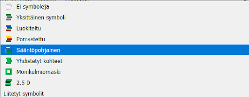
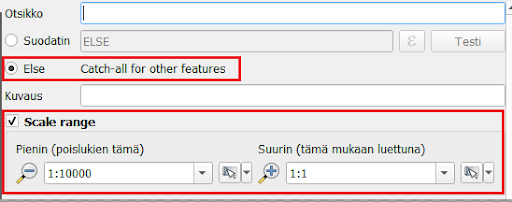
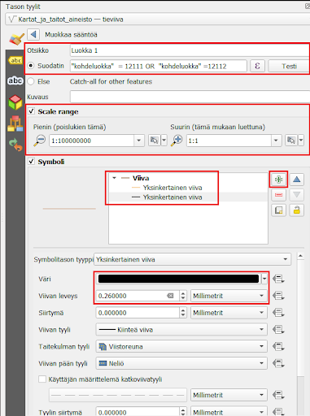
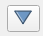
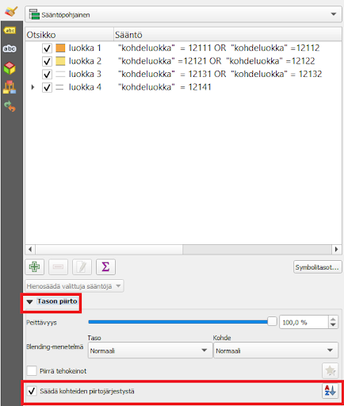
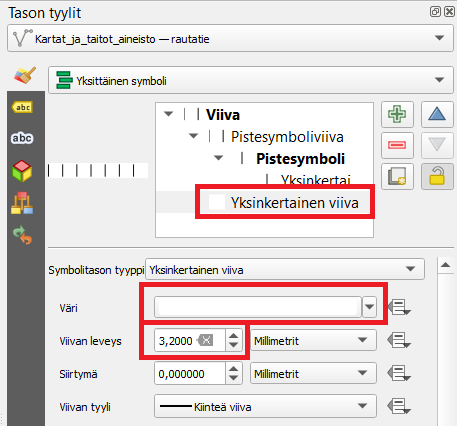

# Harjoitus 1b: Viivakohteet ja sääntöpohjainen visualisointi

## Harjoituksen sisältö

Harjoituksessa visualisoidaan viivakohteita vektoriaineistosta
käyttäen hyväksi sääntöpohjaista visualisointia.

## Harjoituksen tavoite

Koulutettava oppii viivakohteiden visualisointitavat sekä
ymmärtää, miten luoda sääntöpohjaisia kuvaustekniikoita
tasoille. Koulutettava oppii myös tieaineistoihin liittyviä
edistyneempiä kuvaustekniikoita.

## Valmistautuminen

Avaa edellisessä harjoituksessa luotu QGIS-projekti.

### Sääntöpohjainen visualisointi

Viivakohteet voivat olla päällekkäisiä tasoja muiden tyyppisten tasojen
päällä. Jotta viivakohteet erottuvat taustasta (esimerkiksi puistoalueiden
läpi menevät polut), ne laitetaan usein aluekohteiden päälle. 
Aineistossa tiet ja rakennukset menevät usein päällekkäin eivätkä toimi 
kaikilla mittakaavatasoilla sujuvasti yhteen. Tehdään siis ensiksi 
**rakennus**-polygonitasolle siis **sääntöpohjainen visualisointi**.

Tasolla on oletuksena yksi sääntö (kaikki kohteet kuvataan kaikilla
mittakaavoilla samalla tavalla), tuplaklikkaa sitä muokataksesi sitä.

Tarkoituksena on luoda sääntö, jonka perusteella QGIS näyttää
rakennukset vain 1 : 10 000 -mittakaavassa ja sitä tarkemmissa
mittakaavatasoissa.

Haluamme valita visualisointiin kaikki talot, joten
valitse suodattimeksi **"Else"**. Suodatuksen lisävalintoihin pääsemme
tieaineiston parissa. Nyt meille riittää, että laitamme täpän Scale
range -kohtaan ja täytämme pienimmäksi mittakaavaksi 1:10 000 ja
suurimmaksi 1:1. Tämä mittakaavaväli on se, jolla mm. monia opaskarttoja
tarkastellaan.

Nyt kun muutat QGISin näkymässä kartan mittakaavaa (käyttämällä vaikkapa
hiiren rullaa tai kannettavan tietokoneen hiiren lähennystä ja
loitonnusta), huomaat että rakennukset tulevat näkyviin ja katoavat
mittakaavatason mukaan.

### Tieaineisto

Tieviiva-aineisto sisältää erityyppisiä teitä. Avaa aineiston
attribuuttitaulukko ja tarkastele mitä se sisältää. Huomaat, että
Kohdeluokka-sarakkeessa tiet on luokiteltu seitsemään eri luokkaan.
Kartoissa on kuitenkin usein vain neljä eri luokkaa tietyypeille, joten
käytetään samaa luokittelua.

::: hint-box
Tässä harjoituksessa käytetyt kohdeluokat perustuvat
Maanmittauslaitoksen luokitukseen Autotie Ia (12111), Autotie Ib
(12112), Autotie IIa (12121), Autotie IIb (12122), Autotie IIIa (12131),
Autotie IIIb (12132), Ajotie (12141). Tarkemmat tiedot aineistosta
löytyvät:
<https://www.maanmittauslaitos.fi/sites/maanmittauslaitos.fi/files/attachments/2023/06/Maastotietokohteet_2023_05.pdf>
:::

Jotta saamme luotua mittakaavaperusteisen näkyvyyden aineistolle ja
tehtyä eri luokille omat visualisointinsa, valitaan tieviiva-aineistolle
sääntöpohjainen visualisointi. Tee uusi sääntö paneelin vasemmasta
alareunasta  -painikkeesta. Tästä tulee
**luokka 1**.

Lisää suodatin, scale range (mittakaavaperusteinen näkyvyys) sekä 
kaksi visualisointitasoa kohteelle:

**Otsikko:** Luokka 1

**Suodatin**: `"kohdeluokka" = 12111 OR "kohdeluokka" =12112`

**Scale range**: 1:100000000, 1:1

Valitse aineistolle ensin yksi yksinkertainen täyttö, jossa on haluamasi
väri. Sen jälkeen paina  -painiketta ja
lisää toiseksi väriksi musta. Ensimmäisestä väristä tehdään tien pääväri
ja mustasta tien reunaviivan väri.

Jotta saat mustan värin reunaviivaksi, aseta se visualisointijärjestyksessä 
alimmaiseksi painamalla  -painiketta ja 
asettamalla mustan viivan paksuus täyttövärin paksuutta isommaksi. Näin
QGIS luo siis ensin leveän mustan viivan, jonka päälle tulee toisella
värillä hieman kapeampi viiva - lopputulos saa tieaineiston näyttämään
tiealueelta, jolla on reunaviiva.

::: code-box
Esimerkkikuvan asetukset luokalle 1 olivat:

**Viiva 1 (sisus)**: täyttöväri: #f1a342 paksuus: 2,2 mm

**Viiva 2 (reuna)**: täyttöväri: #000000 paksuus: 2,6 mm
:::

Tee lopuille kolmelle luokalle samalla tavalla sääntöpohjainen
luokittelu ja mittakaavaperusteinen näkyvyys näillä arvoilla:

::: code-box
**Luokka 2** "kohdeluokka" =12121 OR "kohdeluokka" =12122

Scale range: 1:20001, 1:1

Viiva 1: täyttöväri: #f7e27c paksuus: 2,8 mm

Viiva 2: täyttöväri: #000000 paksuus: 3,1 mm

**Luokka 3** "kohdeluokka" = 12131 OR "kohdeluokka" = 12132

Scale range: 1:10001, 1:1

Viiva 1: täyttöväri: #ffffff paksuus: 1,2

Viiva 2: täyttöväri: #7e7a7a paksuus 1,6

**Luokka 4** "kohdeluokka" = 12141

Scale range: 1:10 001, 1:1

Viiva 1: täyttöväri: #ffffff paksuus: 1,2

Viiva 2: täyttöväri: #a4a9a2 paksuus: 1,8 Viivan tyyli: pisteviiva
:::

Nyt tiet ovat muuten valmiita, mutta monissa kohdin reunaviivat
näyttävät menevän väärin, esimerkiksi risteykset näyttävät
sekaville. Muutetaan siis vielä teiden piirtojärjestys,
jotta reunaviivat menevät piiloon. Paina "symbolitasot":

Määrittele järjestys kuvan mukaisesti klikkaamalla värin kenttää ja
kirjoittamalla siihen (musta jää 0:ksi, muut värit muutetaan arvoon 1):

Nyt QGIS piirtää mustan värin ensin ja sen päälle täyttövärin. Näin
reunaviivat on saatu piiloon. Seuraavaksi vielä asetetaan teiden
keskinäinen piirtojärjestys niin, että päätiet piirtyvät pikkuteiden
päälle. Klikkaa alalaidasta "Tason piirto" -kohtaa ja laita täppä "Säädä
kohteiden piirtojärjestystä" -kohtaan. Tämän jälkeen paina sen vieressä
olevaa symbolia avataksesi lisäasetukset.

 

Aseta arvot kuten kuvassa (Lauseke: *kohdeluokka*, Nouseva/laskeva:
*Laskeva*). Nyt QGIS järjestää kohteet kohdeluokka-sarakkeen arvojen
mukaan niin, että isoimman arvon omistavat kohteet tulevat
päällimmäisiksi. Paina **OK**.

### Rautatie

QGISissä on myös valmiita visualisointeja, jotka näkyvät
visualisointiasetusten alkunäkymässä. Katso symbolikirjaston
suosikeista, miltä näyttäisi vaikkapa "topo railway". Saat 
valmiin kuvaustyylin käyttöön klikkaamalla sitä hiiren vasemmalla
painikkeella. Voit tutkia, miten tyyli on tehty, klikkaamalla sen
visualisointitapoja. Mitä saat muutettua "Pistesymboliviiva"- tai
"Yksinkertainen pistesymboli"-otsikoiden alta?

Voit käyttää valmista symbolia visualisointisi pohjana, jota
alat editoimaan. Esimerkiksi "topo railwayn" alle voit lisätä alle
valkoisen yhtenäisen viivan samaan tapaan kuin teissä lisättiin
musta reunaviiva päävärin alle. Tämän voit tehdä valitsemalla
Yksinkertainen viiva -visualisointitason ja muokkaamalla siinä
olevan mustan, kapean viivan leveäksi ja valkoiseksi.

Muokattavat kohdat ja esimerkkiarvot:

Lopputulos:

Kun olet valmis, tallenna projektitiedosto kurssihakemistoon pikanäppäimellä CTRL + S tai päävalikosta Projekti > Tallenna.