# Harjoitus 2: Nimiöt

## Harjoituksen sisältö

Harjoituksessa lisätään nimiöt tieviivastoon ja pistekohteisiin.

## Harjoituksen tavoite

Koulutettava oppii QGISin nimiöintivalikon käyttämisen sekä Nimiöiden työkalupalkin työkalut. Koulutettavalla on ymmärrys QGISin nimiöiden luomisesta ja muokkaamisesta.

## Teiden nimiöinti

Valitse Tieviivat-taso ja avaa Tason tyylit -paneelista **"Nimiöt"**. Valitse pudotusvalikosta "Yksinkertainen nimiöinti". Valitse Arvo-kohtaan "nimi_suomi".
Näin saadaan luotua kaikille teille samanlainen nimiöinti, joka hakee kullekin tielle nimiön tekstin "nimi_suomi" -kentän tiedoista.

Aivan aluksi valitse itsellesi mieluisa fontti. Valitse myös itsellesi mieluisa fonttikoko ja väri.

Jos et löydä jotain harjoituksessa käytettävää välilehteä, käytä nuolia paneelin oikeassa laidassa.

Seuraavaksi määritellään tarkemmin nimiöiden sijoittelu. Mene **Sijoittaminen**-välilehdelle. Aseta tilaksi "Seuraa viivaa", jolloin nimiö pysyy viivan mukana myös kaarroksissa. Jos haluat nimiöt teiden sisälle, aseta "Sallitut asemoinnit" -kohtaan täppä "Viivalla". Ota muut valinnat pois, jolloin QGIS sijoittaa nimiöt vain ja ainoastaan viivalle. Jos valitset tässä useamman vaihtoehdon, QGIS sijoittaa nimiön mihin tahansa niistä sen mukaan, mihin nimiö mahtuu.

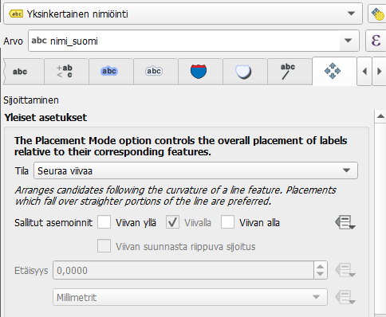

Seuraavaksi asetetaan jokaiselle tielle näkymään vain yksi nimiö, eli kullakin tiellä lukee sen nimi vain kerran. Mene **Karttanäyttö**-välilehdelle, joka on Sijoittaminen-välilehden oikealla puolella. Rullaa valikkoa alaspäin, kunnes löydät kohdan "Yhdistä kytketyt viivat välttääksesi kopioidut nimiöt".

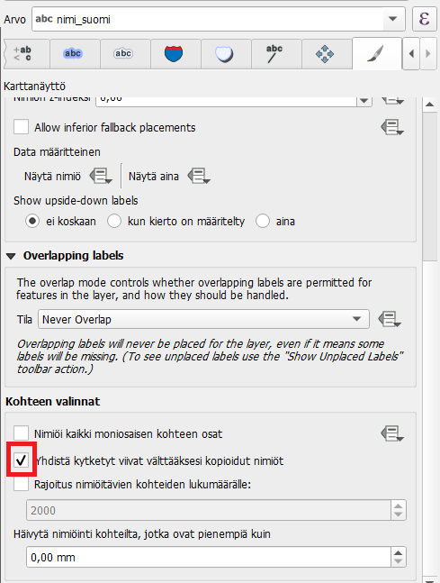

Jos fontti ei meinaa erottua taustasta, yksinkertainen kikka on käyttää valkoista väriä fontille ja luoda sille musta tekstivyöhyke. Palaa siis ensimmäiselle välilehdelle. Valitse fontin väriksi valkoinen (#ffffff) ja siirry sitten Vyöhyke-välilehdelle. Laita raksi kohtaan "Piirrä tekstivyöhyke". Oletuksena vyöhykkeen väri on valkoinen, mutta vaihda se mustaksi (#00000). Tämän jälkeen voit muuttaa vyöhykkeen kokoa niin, että siitä tulee siisti reunaviiva fontille.

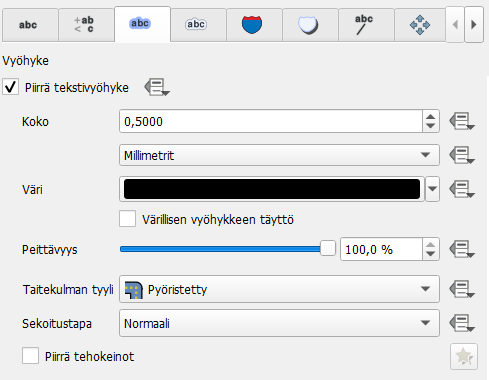

Katso mitä löytyy välilehdiltä "Tausta" ja "Varjo". Kokeile erilaisten taustojen ja varjostusten piirtämistä nimiöihin. Keksitkö näille jotain käyttötarkoitusta omassa työssäsi?

### Vaatekaupat-tason nimiöinti

Seuraavaksi opettelemme nimiöiden siirtämistä käsin ja tutkimme Nimiöiden työkalupalkkia.

Valitse vaatekaupat-taso. Mene Nimiöt-välilehdelle ja aseta Yksinkertainen nimiöinti. Laita arvoksi "Name". Name-sarake on listan aivan loppupäässä, joten joudut selaamaan listaa pitkälle löytääksesi sen. Aseta haluamasi fontti, fonttikoko ja väri nimiöille.

Avaa seuraavaksi Sijoittaminen-välilehti. Huomaat, että se näyttää hieman erilaiselta pistekohteilla.

Oletuksena QGISin sijoittelutila pistekohteiden nimiöille on **Kartografinen**. Tällöin QGIS pyrkii sijoittamaan nimiöt näkyviin automaattisesti kokeilemalla niitä eri puolille pistettä, alkaen ylhäältä oikealta suhteessa pisteeseen. Huono puoli tässä on se, että nimiöt voivat olla jollain mittakaavalla järkevästi näkyvillä, mutta muuttaa sitten paikkaa toisella.

::: hint-box
Vinkki! QGISin oletusjärjestys sijoittelulle on ylös oikealle (**TR**), ylös vasemmalle (**TL**), alas oikealle (**BR**), alas vasemmalle (**BL**), keskelle oikealle (**TR**), keskelle vasemmalle (**TL**), ylös hieman oikealle (**TSR**) ja ylös hieman vasemmalle (**TSL**). Tätä voidaan muokata lausekkeella kohdasta Position Priority \> Muokkaa.

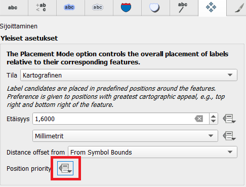

Ohessa esimerkkilauseke sijoituspaikan valintaan. Ohjeet lausekkeiden muodostamiseen löydät lausekeikkunan vasemmasta alalaidasta.

:::

Seuraavaksi tarkastelemme, näkyvätkö kaikkien kohteiden nimiöt ja siirrämme niitä käsin paremmille paikoille. Etsi siis QGISin yläpalkista Nimiöiden työkalupalkki, joka näyttää tältä:

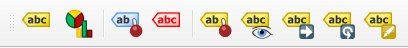

Jos työkalupalkki ei ole oletuksena sinulle näkyvissä, saat sen näkyviin menemällä QGISin ylävalikosta Näytä > Työkalut > ja klikkaamalla kohtaa Nimiöiden työkalupalkki.

Työkalupalkin toiminnot ovat järjestyksessä vasemmalta oikealle: 
*Korosta kiinnitetyt kohteet
Näytä sijoittamattomat (näkymättömät) nimiöinnit
Kiinnitä/poista kiinnitys
Näytä/poista näkyvistä nimiöinti
Siirrä nimiöintiä
Kierrä nimiöintiä
Muokkaa nimiöinnin ominaisuuksia.*

Aloita Nimiöiden työkalupalkin tutkiminen esimerkiksi siirtämällä joitain päällekkäisiä nimiöitä tai näyttämällä sijoittamattomat nimiöinnit. 
Kun aloitat nimiöiden käsin siirtämisen, QGIS kysyy sinulta mihin kenttään nämä tiedot sidotaan QGIS-projektin sisällä. Valitse "fid"-kenttä. fid on jokaisen kohteen uniikki ID-tunnus, jolloin kun muokkaat yhtä nimiötä, QGIS tallentaa tekemäsi muutokset vain tuohon yhteen kohteeseen. Jos valitsisit jonkin toisen kentän, jossa kahdella tai useammalla eri kohteella olisi sama arvo, yhteen kohteeseen tehdyt muutokset tulisivat voimaan kaikissa näissä kohteissa.

::: hint-box
Jos jossain käyttämässäsi aineistossa ei ole fid-kenttää, voit luoda sen kentän arvojen laskimella käyttämällä muuttujaa `$id`
:::

Koita saada kaikkien kohteiden nimiöt näkyviin määrittämällä niille käsin jokin paikka. Kysy tarvittaessa kurssin kouluttajalta lisätietoa työkalujen toimintaperiaatteista, tai pidä hiirtä hetki työkalun päällä, jolloin työkalun vinkki tulee näkyviin.

## Apuviivat (Callouts)

Kun olet sijoitellut nimiöt paremmin, jotkin nimiöt ovat saattaneet mennä hyvinkin kauas niistä kohteista, joihin ne liittyvät. Piirretään näihin vielä apuviivat selkeyttämään niiden lukemista. Mene Tason tyylit -paneelissa Nimiöt-välilehdelle, ja sieltä Osoitinviivat-välilehdelle. Laita täppä kohtaan "Piirrä osoitinviiva". Oletuksena osoitinviiva tulee kaikkiin nimiöihin ja kohteisiin, mutta koita muuttaa "Minimipituus"-kohdan arvoa niin, että osoitinviiva tulee vain niiden nimiöiden ja kohteiden väliin, joilla on merkittävä välimatka toisiinsa nähden.

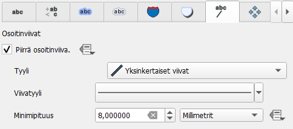

Kun olet valmis, tallenna projektitiedosto kurssihakemistoon pikanäppäimellä CTRL + S tai päävalikosta Projekti > Tallenna.

## Lisätehtävä: rivinvaihto ja muokatut nimiöt

Usein nimiöissä halutaan esittää monta tietoa yhdestä kohteesta, esimerkiksi sen nimi suomeksi ja ruotsiksi. Jos halutaan esittää kohteesta kahden attribuuttilomakkeen kentän tiedot tai itse kirjoitettua tekstiä ja jonkin kentän tiedot, pitää muokata Arvo-kentän saraketta.

## Lisätehtävä: Kustomoitu nimiö Merikoskelle

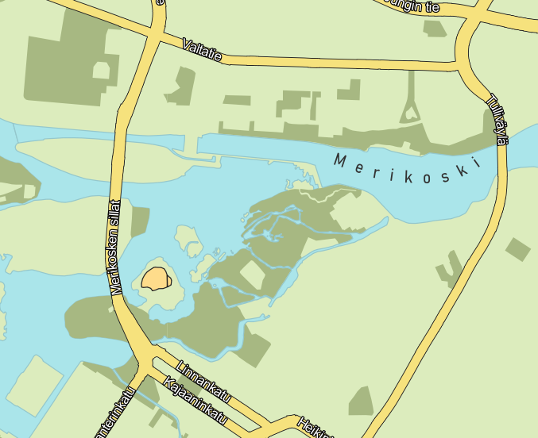

Seuraavaksi tehdään nimiö, joka ei seuraa kohteen laitoja tai muotoa, vaan menee käyttäjän määrittämällä tavalla, tässä tapauksessa kaarella.

Luo aluksi uusi väliaikainen taso painamalla Luo väliaikainen luonnostaso -painiketta.

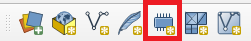

Anna tason nimeksi Merikoski, geometriatyypiksi LineString ja koordinaattijärjestelmäksi Projektin koordinaattijärjestelmä (EPSG: 3067). Tämän jälkeen luo uusi kenttä, jonka nimi on "Nimi" ja tyyppi Teksti (merkkijono). Kun olet määrittänyt uuden kentän, paina "Lisää kenttälistaan", jolloin se tulee kenttälistaan.

Paina lopuksi OK. Seuraavaksi lisätään viiva uudelle tasolle. Klikkaa taso aktiiviseksi painamalla sitä kerran tasoluettelossa. Paina päälle tason editointitila painamalla kynäpainiketta. Aloita uuden viivakohteen digitointi painamalla Lisää viivakohde -ikonia.

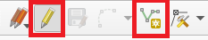

Nyt klikkaile jokialueelle kaareva viiva siihen kohtaan, mihin haluat joen nimen tulevan. Lopeta digitointi painamalla hiiren oikeaa. Syötä avautuvaan ikkunaan nimen arvoksi "Merikoski".

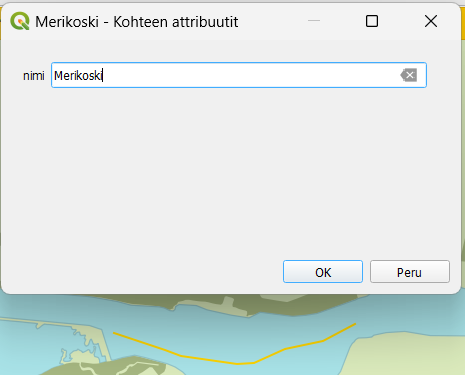

Avaa nyt Tason tyylit -paneelista Kuvaustekniikka-välilehti, ja valitse kuvaustekniikaksi "Ei symbolia". Siirry Nimiöt-välilehdelle ja valitse "Yksinkertainen nimiöinti". Valitse Arvo-kohtaan nimi-sarake. Nyt aiemmin syötetty Merikoski-teksti tulee näkyviin, vaikka itse viivakohdetta ei näy. Mene Sijoittaminen-välilehdelle ja aseta Tilaksi "Seuraa viivaa" ja sallituksi asemoinniksi "Viivan yllä".

Nyt voit vaihtaa halutessasi vielä fonttia vastaamaan muiden kohteiden fonttia. Kokeile myös Muotoilu-välilehdeltä lisätä kirjainväliä.

Huomaa: väliaikainen luonnostaso katoaa, kun suljet projektin. Jos haluat tallentaa sen pysyväksi, klikkaa hiiren oikealla sitä Tasot-paneelissa. Valitse avautuvasta valikosta Vie > Tallenna kohteet nimellä. Voit valita nyt tiedostotyypin, tallennuskansion ja millä nimellä taso tallennetaan. Jos haluat viedä tason samaan GeoPackageen muiden aineistojen kanssa, valitse Muoto-kohdasta GeoPackage. Tiedostonimi-rivillä paina kolmea pistettä "..." ja etsi se kansio, jossa kurssiaineisto on tallennettuna. Valitse sieltä Kartat_ja_taitot_aineisto.gpkg ja paina "Tallenna". Kartat_ja_taitot_aineisto.gpkg. Vaihda tason nimeksi Merikoski. Sen jälkeen paina **OK**.

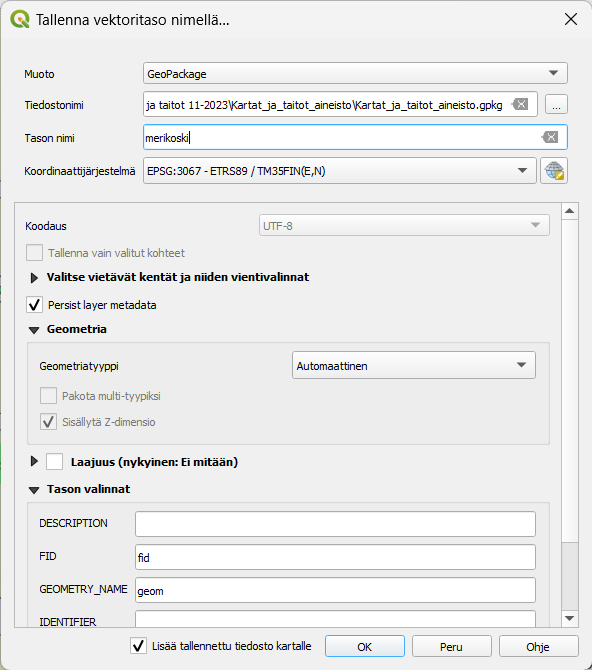

Kun olet valmis, tallenna projektitiedosto kurssihakemistoon pikanäppäimellä **CTRL + T** tai päävalikosta **Projekti \> Tallenna**.
