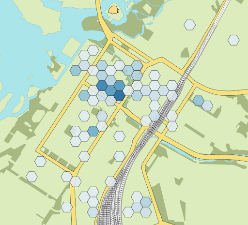
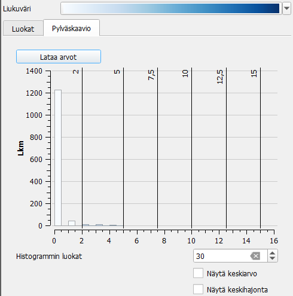
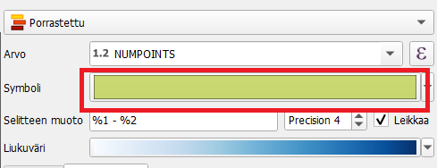
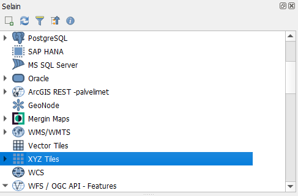
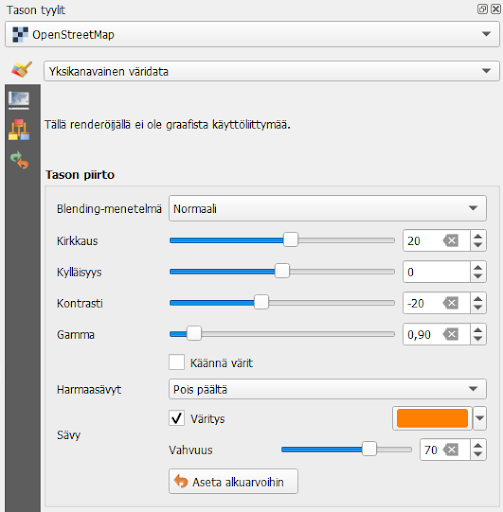

# Harjoitus 3: Teemakartta

## Harjoituksen sisältö

Harjoituksessa tehdään koropleettikartta, joka kuvaa kauppojen keskittymistä Oulussa.

## Harjoituksen tavoite

Koulutettava oppii luomaan heksagoniruudukon, laskemaan pisteet polygoneista ja käyttämään luokittelutyyliä visualisointiin. Hän tietää myös, mistä QGISin eri väripaletit löytyvät.

Tässä harjoituksessa tehdään koropleettikartta, joka perustuu OpenStreetMapin kauppakohteisiin.

Mene **Vektori \> Tutkimuksen työkalut \> Luo Ruudukko**. Ruudukon tyypiksi valitaan heksagoni ja ruudukon laajuudeksi joko "Map Canvas" tai "Draw on map canvas". Valitse keskusta-alue piirtämällä.

Aseta vaakatason ja pystytason välitykseksi 100m. Koordinaattijärjestelmänä EPSG: 3067, luodaan toistaiseksi tilapäinen taso. Paina lopuksi **"Suorita"**.

Nyt QGIS on luonut ruudukon antamallesi alueelle.

Sen jälkeen lasketaan kuinka monta kauppaa kussakin ruudussa on. QGISin pääikkunan vasemmassa alalaidassa on haku, josta voit hakea **"Laske pisteet monikulmion sisällä"**. Klikkaa se auki listasta. Valitse Monikulmiot-kohdan pudotusvalikosta juuri luotu Ruudukko-tasoja Pisteet-kohtaan kaupat-taso. Laskurikentän nimeksi voi jättää NUMPOINTS, ja lopuksi paina **"Suorita"**.

QGIS luo nyt uuden tason, joka on äskeinen heksagonitaso, mutta jossa on attribuuttitaulussa uusi NUMPOINTS-sarake, joka kertoo kussakin heksagonissa olevien kauppojen lukumäärän. Paina uutta Lkm-tasoa tasoluettelossa hiiren oikealla ja avaa attribuuttitaulu varmistaaksesi, että prosessi on onnistunut.

Seuraavaksi visualisoidaan Lkm-taso. Aseta tällä kertaa Yksittäinen symboli -visualisoinnin sijaan kuvaustyyliksi Porrastettu. Valitse Arvo-kohtaan "NUMPOINTS" ja paina "Luokittele". Oletuksena tuleva luokittelu tai väriskaala ei ole ehkä kaikkein toimivin, joten lähdetään muuttamaan niitä.

Liukuvärinä on oletuksena Random colors. Klikkaa sen vieressä olevasta nuolesta lisää valintoja auki. Huomaa, että kohdasta **Kaikki liukuvärit** saat näkyviin vielä lisää väriskaaloja. Voit myös klikata **Luo uusi liukuväri**. Kohdista "katalogi: cpt-city" ja "katalogi: ColorBrewer" saat auki vielä lisää valmiita värimäärityksiä. Gradientti-valinnalla voit luoda itse oman liukuvärin määrittämällä alku- ja loppuvärin. Color presets mahdollistaa uusien väripalettien määrittelyn itse ja niiden tallentamisen/tuomisen. Tutki nyt itse QGISin väripaletteja ja valitse mieleisesi paletti tähän tarkoitukseen.

Tutki myös Tila-kohdassa olevaa oletusta **Equal count**. Miten visualisointi muuttuu, jos valitset jonkin toisen luokittelutavan tai muutat luokkien määrää? Voit tarkastella aineistoa myös "Pylväskaavio"-välilehdellä. Paina "Lataa arvot" -painiketta, jos mitään ei näy.

Voit halutessasi ottaa pois ensimmäisen luokan näkyvistä ottamalla siitä täpän pois, kuten esimerkkikuvassa on tehty. Tällöin heksagonit, joissa on esimerkiksi 0-5 kohdetta, poistuvat kartalta.

::: hint-box
Vinkki! Vaikka olet luokitellut aineiston ja määrittänyt visualisoinnit eri luokille, voit muokata kaikkien luokkien visualisoinnin perusasetuksia samalla kertaa. Klikkaa Symboli-tekstin vieressä olevaa värillistä ruutua. Tämä avaa tutun visualisointiasetusikkunan. Voit esimerkiksi tätä kautta vaihtaa heksagonien peittävyyden 90%:iin tai vaihtaa niiden reunaviivan väriä.
:::

Yksittäisen luokan visualisointityyliä voit muuttaa tuplaklikkaamalla luokan symbolia. Yksittäisen luokan luokkarajoja voi muuttaa tuplaklikkaamalla "Arvot"-sarakkeen arvoa, ja karttatulosteessa näkyvää selitettä voi muuttaa tuplaklikkaamalla luokkaa "Selite"-sarakkeesta.

Kun olet valmis, tallenna projektitiedosto kurssihakemistoon pikanäppäimellä CTRL + S tai päävalikosta Projekti \> Tallenna.

## Lisätehtävä: WMS-tason visualisointi

Kokeile miltä aineisto näyttää, jos sinulla olisi yksivärinen taustakartta. Avaa QGISin Selain-paneelista XYZ Tiles -kohta painamalla sen vieressä olevaa väkästä.

Tuplaklikkaa avautuvasta listasta **OpenStreetMapia**. Nyt QGIS tuo sinulle uuden taustakartan. Aseta tasoista ainoastaan se ja luomasi Lkm-taso näkyviin.

Klikkaa OpenStreetMapia tasoluettelossa ja aloita sen visualisointi. Saat kartan yksiväriseksi laittamalla täpän kohtaan "Väritys". Hae sitten heksagoneihin valitsemaasi väripalettiin sopiva väri, jolla värität taustakartan. Pyri siihen, että taustakartta jää taka-alalle ja nostaa selkeästi heksagoniaineiston näkyviin. Voit muuttaa kirkkaus-, kylläisyys- ja kontrastiasetuksia sekä gamma-asetusta. Voit myös säätää värityksen vahvuutta.

::: hint-box
**Psst! Koulutuksen jälkeen saat henkilökohtaista tukea Gispon tukipalvelusta. Lähetä kysymyksesi tai kommenttisi osoitteeseen [koulutustuki\@gispo.fi](mailto:koulutustuki@gispo.fi){.email}!**
:::
