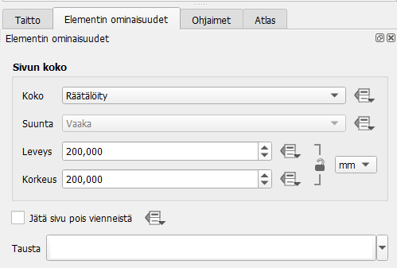
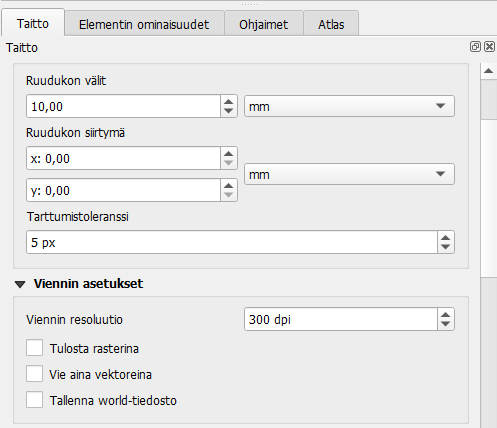
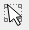
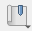
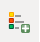
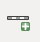
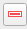

# Harjoitus 4: Taitto

## Harjoituksen sisältö

Harjoituksessa tehdään valmiista kartasta taitto

## Harjoituksen tavoite

Koulutettava oppii käyttämään QGISin taittotyökaluja monipuolisesti ja
tekemään informatiivisen karttataiton.

Tehdään kartasta taitto, johon sommitellaan kartan selite, mittakaava,
pohjoisnuoli sekä tiedot aineistosta. Esimerkkikuva lopputuloksesta:

Avaa uusi taitto joko **Projekti -\> Uusi taitto** tai painamalla
 työkalupalkissasi. Anna taitolle kuvaava
nimi, esimerkiksi Oulun opaskartta ja paina **OK**.

Paina tulosalueella hiiren oikealla näppäimellä ja valitse **Sivun
ominaisuudet**. Oletuksena **Elementin ominaisuudet** -välilehdestä
oikeassa paneelissa on paperin kokona A4 ja suunta Vaaka. Muutetaan
taiton kokoa 200 x 200 mm. Tarkista Taitto-välilehdestä, että viennin
resoluutio on 300 dpi, joka varmistaa sen, että lopputuote on tarpeeksi
tarkka ja hyvälaatuinen lähetettäväksi vaikka painofirmalle.

 

Ennen kuin lisäämme mitään karttakuvaa taittoon, luodaan elementtien
sijoittelun helpottamiseksi ruudukko ja reunamarginaalit. Mene
ylävalikoista **Näytä \> Ruudukko**. Valitse myös **Näytä \> Tartu
ruudukkoon**. Taitto-välilehdeltä oikean reunan paneelista voit asettaa
ruudukon välien koon, esimerkiksi 10mm.

Mene seuraavaksi **Ohjaimet**-välilehdelle. Yleensä painotuotteissa
käytetään 3mm marginaalia sivuissa, joten luodaan vaaka- ja
pystyohjaimet arvoilla 3mm ja 197mm. Voit lisätä ne helposti painamalla
-painiketta ja tuplaklikkaamalla ilmestyvää
riviä ja kirjoittamalla arvot niihin.

Nyt voimme sijoittaa karttanäkymän tulosteelle. Valitse työkalupalkista
työkalu 

Vedä paperin alueelle työkalulla suorakulmio, jotta saat QGISin
karttanäkymän mukaisen kartan taittoikkunaan. Kartta piirtyy
taittoikkunaan samalla zoomaustasolla, kun se on karttaikkunan puolella.
Voit rajata kartan mittakaavaa **Elementin ominaisuudet** -välilehdeltä.
Huomaa, että karttatulosteen hallinnassa on mahdollisuus siirtää
yksittäisiä kohteita (nimikkeitä) tai muokata kartan sijaintia. Kohteen
ollessa valittuna, voit siirtää sitä tulosteella
 -työkalun avulla.

Elementin ominaisuudet -välilehdellä on useita työkaluja, jotka
helpottavat kartan rajauksen ja mittakaavan muokkaamista:

|                               |                                                                   |
|:-----------------------------:|:-----------------------------------------------------------------:|
|  | Päivitä kartta (mikäli olet tehnyt muutoksia pääikkunan puolella) |
|  |             Tuo kartan laajuus pääikkunasta taittoon              |
|  |              Vie kartan laajuus taitosta pääikkunaan              |
|  |           Aseta kartan mittakaava vastaamaan pääikkunaa           |
|  |       Aseta pääikkunan mittakaava vastaamaan taittonäkymää        |
|  |                 Käytä spatiaalisia kirjanmerkkejä                 |
|  |             Muokkaa kartan rajausta interaktiivisesti             |
|  |                        Nimiöiden asetukset                        |
|  |                       Leikkauksen asetukset                       |

Tutki näitä työkaluja ja katso, miten ne toimivat. Olisiko jostain
näistä hyötyä sinun työprosesseissasi?

QGISin avulla voit tehdä muutakin kuin lisätä kartan tulosteeseen.

Otsikko tai muu teksti voidaan lisätä Lisää uusi nimiö -työkalulla:
 Lisää uusi selite käyttäen:
 Lisää uusi mittakaava käyttäen:

Huomaa, että näiden taiton elementtien ominaisuuksia voit muokata
oikeanpuoleisen sivupalkin **Elementin ominaisuudet** -välilehden
avulla. Valitse ensin haluamasi elementti joko klikkaamalla sitä
taitossa tai Elementit-listassa, joka sijaitsee ikkunan oikeassa
yläkulmassa.

Tekstin fontin määrittelyn lisäksi tekstikohteille voidaan piirtää
tausta tai kehys, sitä voidaan kiertää tai sijoitella eri tavoin
suhteessa tekstilaatikkoon. Myös tekstin HTML-muotoilu on mahdollista,
jos laitat täpän kohtaan "Tulosta HTML:nä". Etsi nämä toiminnallisuudet
tekstikohteen ominaisuuksista.

Luo seuraavaksi selite karttatulosteeseen. Voit myös muokata selitteen
ominaisuuksia **Elementin ominaisuudet** -välilehdeltä. Huomaa, että
sinun on poistettava kohdan **Päivitä automaattisesti** rasti. Tämän
jälkeen voit vaikkapa poistaa kaikki muut tasot kuin Lkm-tason
selitteestä valitsemalla ne hiiren vasemmalla ja sitten painamalla
 -painiketta. Voit muuttaa myös selitteen
fonttia kohdasta "Fontit ja selitteen muotoilu", määrittää taustan
värin/läpinäkyvyyden tai sijoittaa selitevärit oikealle puolelle
seliteikkunaa (valitse Arrangement-kohtaan "Symbolit oikealla").

Pohjoisnuolen lisääminen tapahtuu valitsemalla:

Valitse sen jälkeen Elementin ominaisuudet -ikkunasta mieleisesi
pohjoisnuoli-kuva (selaa sisältöä alaspäin, jos et heti näe nuolia).

Halutessasi voit tallentaa käyttämäsi tulostemallin (layout englanniksi)
ja hyödyntää sitä jatkossa seuraavien karttatulosteiden tekemiseen. Voit
esimerkiksi muotoilla kollegoidesi käyttöön karttatulostemallin
organisaatiollesi (logot, värit, tekstin paikka, jne.). Tämä onnistuu
**Tallenna malliksi**  -työkalulla:
Lopputuloksen voit tulostaa tiedostoksi (kuvaksi tai pdf:ksi) tai
tulostimeen.

Sopiva resoluutio karttatulosteellesi riippuu kartan
käyttötarkoituksesta, mutta oletusarvoinen 300 dpi tallentaa
resoluutioltaan hyvinkin tarkkoja kuvia. Kokeile myös PDF-viennissä "Luo
geospatiaalinen PDF (GeoPDF)" -toimintoa. Tämä luo PDF-tiedoston, joka
voidaan tuoda suoraan QGISiin niin, että se sisältää aineistot ja on
georeferoitu oikein.

::: hint-box
**Psst! Muista tallentaa QGIS-projekti harjoituksen lopuksi.**
:::
