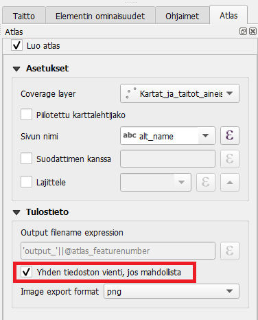

# Harjoitus 5: Kartta-atlas

## Harjoituksen sisältö

Harjoituksessa luodaan kartta-atlas käyttäen aiemmin opittua.

## Harjoituksen tavoite

Koulutettava oppii luomaan karttalehtijaon ja tekemään sen pohjalta kartta-atlaksen.

## Kartta-atlaksen tekeminen

QGIS mahdollistaa myös kartta-atlaksen tekemisen.
Kartta-atlas on ns. karttakirja, jonka avulla voidaan tuottaa automatisoidusti paljon karttoja samasta teemasta.
Seuraavassa esimerkissä tuotamme kartta-atlaksen Oulusta, jossa jokainen karttalehti perustuu käyttäjän itse tekemään karttalehtijakoon.

Avaa QGISin pääikkuna. Luo uusi väliaikainen luonnostaso menemällä **Tasot -> Uusi taso -> Uusi väliaikainen luonnostaso**. Aseta tason geometriatyypiksi polygoni ja koordinaattijärjestelmäksi projektin koordinaattijärjestelmä (EPSG:3067). Nimeksi voit laittaa "Karttalehtijako". Tasolle ei tarvitse lisätä uusia kenttiä, paina vain **OK**.

Taso ilmestyy nyt tasovalikkoon ja siinä on editointitila päällä. Aloita uusien polygonien piirtäminen painamalla . Piirrä eri puolille Oulua kolme suorakulmiota. Kun olet valmis, lopeta editointi klikkaamalla kynäikonia ja tallenna taso painamalla 
.

Avaa seuraavaksi uusi taitto.
Voit antaa sen nimeksi Oulu_atlas.
Jätä tällä kertaa sivu vaakasuoraksi A4:ksi.

Lisää tulosteelle kartta, johon piirtyvät karttaikkunassa näkyvät projektin tasot.
Lisää otsikko, selite ja muut karttatulosteen graafiset tai kartografiset elementit (kuten logo tai pohjoisnuoli) totuttuun tapaan.

Sitten aloitetaan kartta-atlaksen tuottaminen.
Aktivoimme tulosteelle kartta-atlastilan oikean ominaisuuspalkin Atlaksen luonti-välilehdestä kuvan osoittamalla tavalla.
Karttalehtijakotasoksi valitsemme tason, jonka alueisiin kartta-atlas perustuu.
Tässä tapauksessa se on Uusi luonnostaso.

Nyt vielä määritämme, että karttalehtijako ohjaa luomaamme karttakuvaa.
Varmista, että kartta on valittuna valitsemalla se **Valitse/Siirrä elementti**  -työkalulla vasemmasta työpalkista ja klikkaamalla kartta aktiiviseksi: Sen jälkeen valitse oikean puolen sivupalkissa **Elementin ominaisuudet -> Atlas ohjaa tätä**. 

Voit määritellä myös marginaalin kohteen ympärille.
Jos teet todella tarkkaa työtä, valitse marginaaliksi 0 %, muussa tapauksessa se voi olla oletusarvoinen 10 %.
Tämän jälkeen voimme esikatsella kartta-atlastamme Esikatsele Atlasta -työkalulla (käyttöliittymän yläreunassa):

Esikatselun avulla voit vilkaista, miltä kartta-atlas näyttäisi tulostaessa. Käytä nuolia esikatselutyöpalkista liikkuaksesi eri karttasivujen välillä. Huomaa, että voit tehdä samanaikaisesti muutoksia karttatulosteen tyyliasetuksiin tai vaikkapa tason luokitteluväreihin. Kiinnitä myös huomiota siihen, mitkä elementit muuttuvat karttasivuilla ja mitkä pysyvät samana.

Jos haluat, voit lisätä tulosteeseen myös yleiskatsauskarttanäkymän, joka helpottaa kohteen sijainnin määrittämistä kartta-atlaksessa. Yleiskatsaus eli indeksikartta ilmaisee, millä alueella kartalla liikutaan.
Lisää sitä varten tulosteeseen pienempi karttaikkuna, jota käytetään indeksikarttana.
Valitse uuden karttaelementin **Elementin omaisuudet** -paneelista **Yleiskatsaukset** ja määritä asetukset.
Voit myös muuttaa indeksikartan kehyksen tyylin.

Kun olet valmis, voit tulostaa kartta-atlaksen Vie atlas kuvina -työkalulla.
Huomaa, että jokaisesta kartta-atlaksen sivusta syntyy kuva, eli tulostamisessa voi kestää.

Voit tulostaa atlaksen yksittäisinä kuvina tai yhteen tiedostoon PDF-formaatissa.
Yhteen tiedostoon tallentaminen onnistuu aktivoimalla "Yhden tiedoston vienti jos mahdollista" -asetuksen Atlaksen luonti -välilehdessä: 

Kartta-atlastuloste voisi näyttää esimerkiksi tältä:

::: hint-box
Vinkki!
Voit myös lisätä dynaamista tekstiä kartta-atlakseen. Luo tekstikenttä ja klikkaa sen Elementin ominaisuudet -välilehdeltä "Dynaaminen teksti" -painiketta. Etsi avautuvasta valikosta esimerkiksi päivämäärä, kartta-atlaksen sivu ja kartta-atlaksen sivumäärä. QGIS tuo nämä tiedot lausekkeina tekstieditoriin, mutta näyttää lausekkeiden tuloksen taitossa. Kun olet valmis, tallenna projektitiedosto kurssihakemistoon pikanäppäimellä CTRL + T tai päävalikosta Projekti \> Tallenna.
:::

::: hint-box
**Psst!** Muista tallentaa QGIS-projekti harjoituksen lopuksi.
:::
