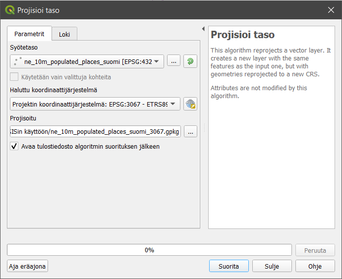

# Harjoitus 3: Koordinaattijärjestelmät

**Harjoituksen sisältö**

Harjoituksessa tutustutaan koordinaattijärjestelmien määrittelyyn QGISissä.

**Harjoituksen tavoite**

Harjoituksen jälkeen koulutettava osaa määrittää koordinaattijärjestelmän niin kokonaiselle projektille kuin yksittäiselle paikkatietoaineistollekin.

**Arvioitu kesto**

30 minuuttia.

**Valmistautuminen**

Avaa uusi QGIS-projekti (**Projekti \> Uusi**) ja tallenna se nimellä "**QGIS-harjoitus 4**". Lisää projektiin seuraavat aineistot:

-   **..kurssihakemisto/4. Harjoitus/TieViiva.shp**

-   **..kurssihakemisto/4. Harjoitus/ne_10m_populated_places_suomi.shp**

::: note-box
**Psst! Paikkatietoaineistolla pitäisi aina olla asetettuna jokin koordinaattijärjestelmä!**
:::

## Projektin koordinaattijärjestelmä

Paikkatietoaineistoja tuotetaan jatkuvasti erilaisiin koordinaattijärjestelmiin, mikä voi tehdä erilaisten aineistojen yhtäaikaisesta tarkastelusta samassa karttaikkunassa haastavaa. QGIS ratkaisee tämän ongelman **projektin koordinaattijärjestelmän** avulla: kaikki projektiin avatut paikkatietoaineistot **projisoidaan "lennossa"** projektin koordinaattijärjestelmään, vaikka yksittäisillä aineistoilla olisi todellisuudessa eri koordinaattijärjestelmät. Toisin sanoen, eri koordinaattijärjestelmässä olevien aineistojen koordinaatit lasketaan "lennossa" projektin koordinaattijärjestelmää vastaaviksi (englannin kielen lyhenne on OTF - on the fly). 

Huomaa, että **"lennossa"-ilmaisulla** tarkoitetaan sitä, että paikkatietoaineisto piirtyy **tilapäisesti** projektin koordinaattijärjestelmään ilman, että sen alkuperäinen koordinaattijärjestelmä muuttuu. Tällä tavoin mahdollistetaan aineistojen piirtäminen ja visualisointi yhdessä. Avaa nyt päävalikosta **Projekti \> Ominaisuudet**... ja valitse vasemmasta palkista **Koordinaattijärjestelmä**. Pääset projektin koordinaattijärjestelmän asetuksiin myös klikkaamalla **QGIS-työtilan** oikeassa alareunassa olevaa **EPSG-painiketta**  .

Projektin koordinaattijärjestelmä näkyy **Äskettäin käytetyt koordinaattijärjestelmät** -listauksessa ensimmäisenä: **ETRS89/TM35FIN (EPSG: 3067)**. QGIS määrittelee projektin koordinaattijärjestelmän automaattisesti ensimmäiseksi lisätyn paikkatietoaineiston perusteella. Projektiin lisättiin ensimmäisenä Maanmittauslaitoksen **TieViiva-aineiston**, jonka koordinaattijärjestelmä on **ETRS89/TM35FIN (EPSG:3067)** -- näin ollen QGIS asetti sen koko projektin koordinaattijärjestelmäksi.

Vaihda (= uudelleenprojisoi lennossa) projektin koordinaattijärjestelmäksi **WGS 84 (EPSG: 4326)** ja paina **OK**. Löydät halutun koordinaattijärjestelmän helpoiten kirjoittamalla EPSG-koodin **Suodatin**-kenttään.

Koordinaattijärjestelmän muuttamisen jälkeen klikkaa **Zoomaa täydeksi** -työkalua  , niin paikkatietoaineistot keskittyvät karttaikkunaan. Voit huomata, että paikkatietoaineistomme ovat nyt uudelleenprojisoituneet lennossa WGS 84 -koordinaattijärjestelmään ja samalla Suomi on vääristynyt muodoltaan.

Vie hiiresi Helsingin kohdalle ja tarkastele alapalkin **Koordinaatit-kenttää**. Koordinaatit näyttävät jokseenkin tältä:

Vaihda nyt projektin koordinaattijärjestelmä takaisin **ETRS89/TM35FIN-koordinaattijärjestelmään**. Vie hiiresi uudestaan Helsingin kohdalle ja tarkastele **Koordinaatit-kenttää**.

Voit huomata, että koordinaattien suuruusluokka on hyvin erilainen. Tämä johtuu siitä, että koordinaattijärjestelmät käyttävät eri mittayksiköitä. ETRS89/TM35FIN-koordinaattijärjestelmän yksiköt ovat metrejä (itä ja pohjoinen / x ja y), kun taas WGS 84 -koordinaattijärjestelmässä koordinaatit ovat asteina (pituus ja leveys). ETRS89/TM35FIN-koordinaattijärjestelmässä on määritetty origo eli piste, jonka koordinaatit ovat (0, 0). WGS 84-koordinaattijärjestelmässä tuo piste sijaitsee päiväntasaajalla UTM-kaistalla 35. UTM on maailmanlaajuisesti käytössä oleva projektio, joka jakaa maapallon 6° leveisiin kaistoihin. Kaista UTM01 sijaitsee Alaskan länsipuolella. Koska koordinaattijärjestelmien arvoja voidaan ilmentää sekä metreinä että asteina, niiden koordinaattiarvoja ei voida suoraan vertailla toisiinsa. Koordinaatit tulee uudelleenprojisoida yhteiseen koordinaattijärjestelmään.

## Paikkatietoaineiston koordinaattijärjestelmä

Tarkastele nyt tason **ne_10m_populated_places_suomi** koordinaattijärjestelmää klikkaamalla tasoa hiiren oikealla painikkeella **Tasot**-paneelissa ja valitsemalla **Ominaisuudet...**. QGISiin avautuu **Tason ominaisuudet** -ikkuna, josta löytyy paljon tietoa kyseisestä paikkatietoaineistosta. **Informaatio-välilehdeltä** löydät tietoa mm. paikkatietoaineiston koodauksesta, geometriatyypistä, koordinaattijärjestelmästä ja kohteiden lukumäärästä. Huomaa, että tämän kyseisen tason koordinaattijärjestelmä on todellisuudessa eri kuin **TieViiva-aineiston** tai projektin koordinaattijärjestelmä. Silti QGIS esittää aineiston karttaikkunassa ETRS89/TM35FIN-koordinaattijärjestelmässä, sillä projektin koordinaattijärjestelmä on dominoiva.

Avaa seuraavaksi **Tason ominaisuudet** -ikkunan vasemmasta palkista **Lähde-välilehti**. Huomaa, että voisit vaihtaa järjestelmää **Koordinaattijärjestelmä**-alasvetolaatikon avulla. Älä kuitenkaan tee sitä nyt. Koordinaattijärjestelmän muuttaminen **Lähde**-välilehdellä muuttaa vain aineiston koordinaattijärjestelmämääritystä. Aineiston koordinaatit eivät muutu, ja väärällä määrityksellä aineisto ei piirry oikeaan paikkaan. Jos haluaisit muuttaa aineiston koordinaattijärjestelmää, aineisto tulee uudelleenprojisoida eli sen koordinaatit on laskettava uudelleen. Sulje **Tason ominaisuudet** -ikkuna klikkaamalla **OK**.

## Paikkatietoaineiston uudelleenprojisointi

Toisinaan on tärkeää, että paikkatietoaineistot ovat samassa koordinaattijärjestelmässä -- esimerkiksi osa QGISin prosessointityökaluista ei tuota oikeaa tulosta jos lähtöaineistot ovat keskenään eri koordinaattijärjestelmissä. Näin ollen paikkatietoaineisto on uudelleenprojisoitava ja tallennettava uutena paikkatietoaineistona. Uudelleenprojisoidaan nyt **ne_10m_populated_places_suomi-taso** WGS 84 -koordinaattijärjestelmästä ETRS89/TM35FIN-koordinaattijärjestelmään.

### Tapa 1: Projisoi taso -prosessityökalu

Uudelleenprojisoinnin voi tehdä suoraan QGIS-prosessointityökalun avulla valitsemalla ylävalikosta **Vektori \> Tiedonhallinta \> Projisoi taso...** Aseta syötetasoksi **ne_10m_populated_places_suomi** ja valitse halutuksi koordinaattijärjestelmäksi **ETRS89/TM35FIN (EPSG: 3067)**. Klikkaa **Projisoitu-** kentän kohdalla ... \> **Tallenna tiedostoon** ja valitse sijainti, minne haluat tallentaa uudelleenprojisoidun aineiston. Anna tasolle nimeksi **ne_10m_populated_places_suomi_3067** ja tarkista, että aineisto tallentuu **GeoPackage-formaattiin**. Klikkaa lopuksi **Suorita**.

QGISin **Tasot-paneeliin** ilmestyy uudelleenprojisoitu paikkatietoaineisto. Voit tarkistaa koordinaattijärjestelmän tason ominaisuuksista.

### Tapa 2: Tallennus Tasot-paneelissa

Klikkaa tasoa **Tasot**-paneelissa hiiren oikealla painikkeella ja valitse **Vie \> Tallenna kohteet nimellä...** Tällä työkalulla voit tallentaa paikkatietoaineiston uudella nimellä ja samanaikaisesti suorittaa niille erilaisia toimenpiteitä. Voisit esimerkiksi vaihtaa tiedostomuodon ja/tai tallentaa vain valitsemasi osan aineistosta.

Vaihdetaan ensin tiedostomuoto **Shape-tiedostostaGeoPackageen**. Valitse tämän jälkeen **Tiedoston nimi** -kohdassa uudelleenprojisoidun aineiston sijainti ja anna sille nimeksi n**e_10m_populated_places_suomi_3067**. Aseta koordinaattijärjestelmäksi **ETRS89/TM35FIN (EPSG: 3067)** ja rastita **Lisää tallennettu tiedosto kartalle**. Paina sitten **OK**.

QGISin **Tasot**-paneeliin ilmestyy uudelleenprojisoitu paikkatietoaineisto. Voit tarkistaa koordinaattijärjestelmän tason ominaisuuksista.

Kun olet valmis, tallenna projektitiedosto kurssihakemistoon pikanäppäimellä **CTRL + T** tai päävalikosta **Projekti \> Tallenna**.

::: hint-box
**Psst! Koulutuksen jälkeen saat henkilökohtaista tukea Gispon tukipalvelusta. Lähetä kysymyksesi tai kommenttisi osoitteeseen [koulutustuki\@gispo.fi](mailto:koulutustuki@gispo.fi){.email}!**
:::
