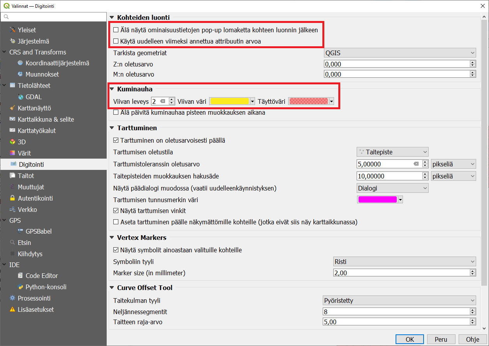

# Harjoitus 4: Digitoinnin perusteet

**Harjoituksen sisältö**

Harjoituksessa luodaan vektoriaineisto hyödyntäen digitoinnin perustyökaluja.

**Harjoituksen tavoite**

Harjoituksen jälkeen osallistuja osaa lisätä ja luoda tasoja QGISiin.

**Arvioitu kesto**

10 minuuttia.

## Valmistautuminen

Avaa uusi QGIS-projekti (**Projekti \> Uusi**) ja tallenna se nimellä "**QGIS-harjoitus 4**".

## Muokkauksen yleisasetukset

Muokkauksen toimintoa ja muita yleisiä muokkaustyöasetuksia voit muuttaa päävalikon ikkunassa **Asetukset \> Valinnat \> Digitointi**. Jos et esimerkiksi halua, että ominaisuustietojen muokkausikkuna tulee esiin jokaisen polygonin piirtämisen jälkeen niin rastita **Älä näytä ominaisuustietojen pop-up lomaketta kohteen luonnin jälkeen**. Jätä se kuitenkin päälle tällä kertaa. Kokeile myös vaihtaa kohteiden muokkausväri keltaiseksi (**Kuminauha**) ja **Taitepisteen** symbolin tyyli ja koko. Paina **OK**, niin asetukset tulevat voimaan.

## Editoinnin valmistelu

Aloitetaan tekemällä editointia helpottavia valmisteluja. Avaa **Työkalut-valikko** valisemalla **Näytä \> Työkalut**. Aktivoi omaan projektiisi **Työkalut-valikosta** seuraavat työkalut:

-   Digitoinnin työkalupalkki

-   Digitoinnin lisätyökalujen palkki

-   Tarttumisen työkalut\

Usein ensimmäinen operaatio aineistojen luomisessa on taustakartan lisääminen. Taustakartta helpottaa liikkumista ja aineistojen tarkistusta. Uudemmissa QGISin versioissa on OpenStreetMapin taustakarttatasot saatavilla valmiina. Lisää taustakartta projektiin vasemmalta tuplaklikkaamalla  **Selain-paneelista XYZ Tiles \> OpenStreetMap**.

Zoomaa kartta Suomen kohdalle ja koska haluamme tehdä tarkkaa editointia oikeassa koordinaattijärjestelmässä, muutetaan projektin koordinaattijärjestelmä Suomen kansalliseen **EUREF-FIN 3067**. Klikkaa projektin oikeasta alakulmasta, jossa lukee tällä hetkellä EPSG:3857, jonka QGIS on asettanut taustakartan perusteella.

Paina tämän jälkeen **OK,** jonka jälkeen avautuva ikkuna kysyy sinulta koordinaattimuunnoksesta. Valitse uudestaan **OK** ja nyt projektisi on oikeassa koordinaattijärjestelmässä.

::: hint-box
Psst! Muista tukipalvelu! Koulutuksen jälkeen saat henkilökohtaista tukea Gispon tukipalvelun kautta lähettämällä yksinkertaisesti koulutustuki\@gispo.fi -sähköpostiosoitteeseen kysymyksen tai kommentin jostakin sinua mietityttävästä asiasta. Gispon tiimi auttaa sinua toimiesi äärellä. Kysymykset käsitellään henkilökohtaisesti.
:::

