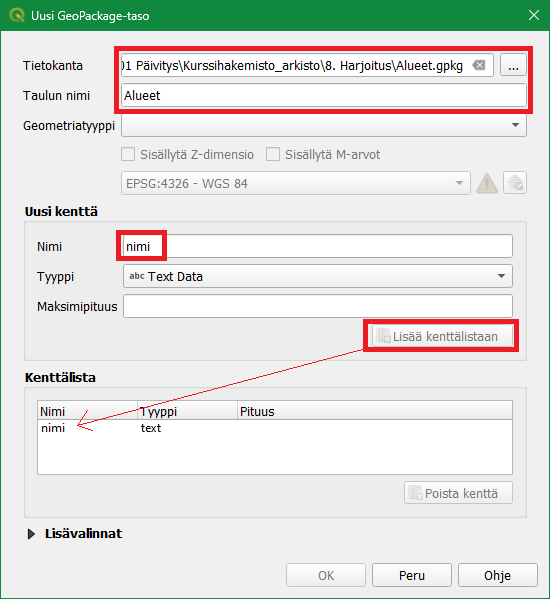
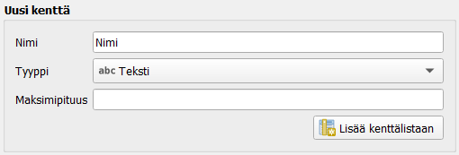
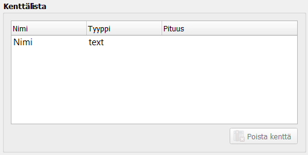
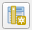
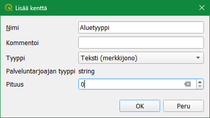
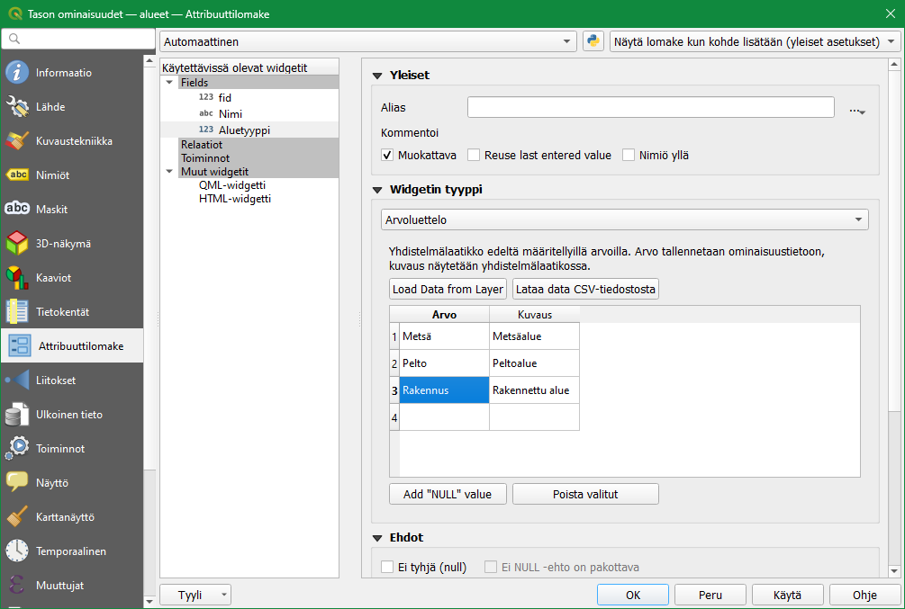
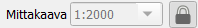
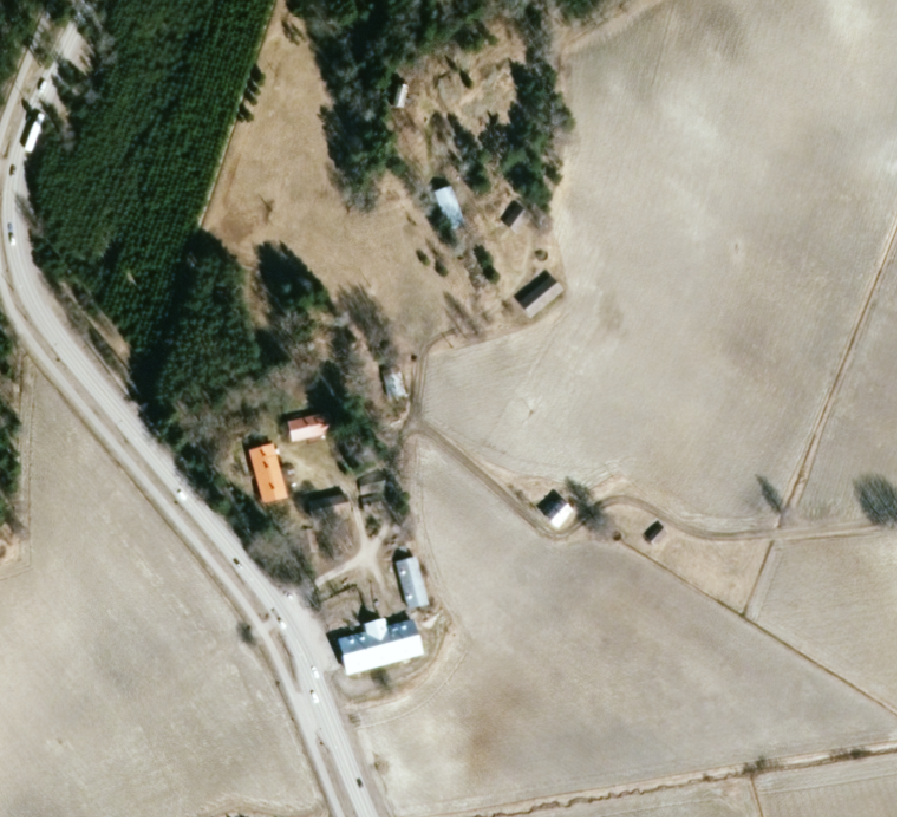
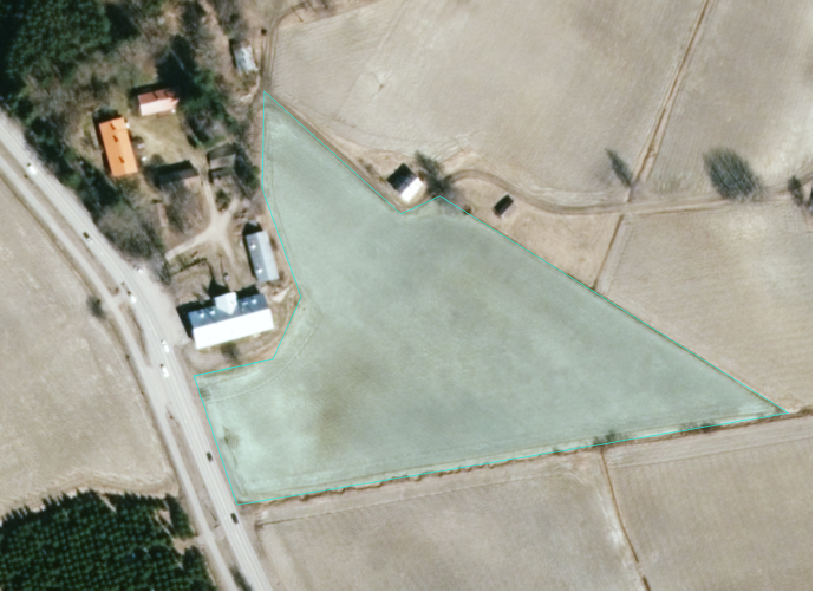
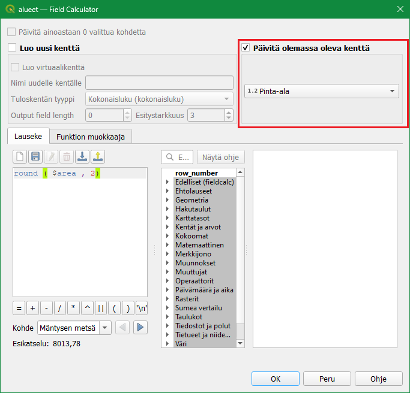

# Harjoitus 5: Paikkatietoaineiston digitointi/editointi

**Harjoituksen sisältö**

Harjoituksessa muodostetaan uusi paikkatietoaineisto ja digitoidaan ilmakuvalta uutta tietoa.

**Harjoituksen tavoite**

Opiskelija osaa muodostaa paikkatietoaineiston ja muokata sitä.

**Arvioitu kesto**

40 minuuttia.

**Valmistautuminen**

Jatka edellisen harjoituksen projektitiedostolla, harjoitus 4, mutta tallenna se nyt nimellä **"QGIS-harjoitus 5"**. Lisää projektiin seuraava WMS- rajapintayhteys:

-   <https://kartat.espoo.fi/teklaogcweb/wms.ashx> nimellä Espoon WMS

Lisää projektiin taso **Espoon WMS** \> **Espoon ortokarttoja** \> **Espoon ortokartta 2021**.

::: hint-box
**Psst! Muista aina varmistaa että aineistolla ja projektilla on oikea koordinaattijärjestelmä!**
:::

## Vektoriaineiston luominen

Luodaan editointia/digitointia varten uusi GeoPackage-aineisto valitsemalla **Tasot \> Luo taso \> Uusi GeoPackage -taso**. Avautuvassa ikkunassa huomaat, että **Tietokanta**-kentälle avautuu mahdollisesti jokin toinen GeoPackage-aineisto. Olisi siis mahdollista lisätä olemassa olevaan GeoPackage-pakettiin myös uusi taso. Luodaan tällä kertaa kuitenkin kokonaan uusi GeoPackage. Paina Tietokanta-kentän vieressä olevaa "**...**"-näppäintä ja tallenna uusi GeoPackage kurssihakemistoon nimellä "**Alueet**". Anna sen jälkeen uudelle tasolle nimi, esimerkiksi "**Alueet**" ja varmista, että olet luomassa geometriatyypiltään polygoniaineistoa. Määrittele koordinaattijärjestelmäksi **ETRS-TM35FIN (EPSG:3067)**.

Lisätään samassa ikkunassa uudelle Alueet-aineistolle muutama kenttä attribuuttitauluun **Uusi kenttä**-kohdassa. Kun aineistolle luodaan uusi tietokenttä, sille tulee määrittää nimi ja tyyppi. Tietokentälle voi määrittää myös maksimipituuden (= kuinka monta merkkiä kenttä voi sisältää). Lisätään aluksi tietokenttä "**Nimi**", jonka tyyppi on **Teksti**. Paina sitten **Lisää kenttälistaan**, jolloin Alueet-aineistoon lisätään uusi tietokenttä. Alla olevaan Kenttälista-kohtaan pitäisi ilmestyä uusi tietokenttä näillä määrityksillä.

 

Paina sitten **OK**. GeoPackageen muodostuu uusi tyhjä **Alueet-taulu** ja QGIS-työtilan **Tasot**-paneeliin ilmestyy myös uusi **Alueet-vektoritaso**. Avaa uuden tason attribuuttitaulu ja tarkista, että se on tyhjä. Attribuuttitaulussa tulee olla vain kaksi kenttää: **fid ja Nimi**. QGIS luo fid-kentän automaattisesti ja se toimii uniikkina id-kenttänä kohteille. Nimi-kenttä taas määriteltiin tason luomisen yhteydessä.

Klikkaa seuraavaksi **Alueet-tasoa** hiiren oikealla painikkeella ja valitse **Ominaisuudet...**. Valitse avautuvasta ikkunasta **Tietokentät-välilehti**. Täältä löydät tiedon aineiston tietokenttien tyypeistä ja muista määrittelyistä.

Tässä ikkunassa voit myös muokata attribuuttitaulun perusrakennetta. Laita muokkaustila päälle lyijykynä-symbolista ja lisää attribuuttitauluun uusi kenttä  . Anna kentälle nimeksi "**Alueyyppi**" ja määrittele se **tekstikentäksi** kuvan mukaisesti.

Paina sitten **OK**, niin uusi kenttä tulee listalle. Klikkaa kynäikonista uudelleen poistuaksesi muokkaustilasta ja valitse **Tallenna**. Älä vielä poistu **Tason ominaisuudet** -ikkunasta.

## Tietorakenteen valmistelu ja editointiasetukset

QGISin automaattisesti luoma fid-kenttä antaa jokaiselle digitoitavalle kohteelle oman uniikin tunnisteen. Digitoijan ei tule kajota tähän kenttään lainkaan, joten estetään sen muokkaus. Mene **Tason ominaisuudet** -ikkunassa **Attribuuttilomake-välilehdelle** ja valitse **Fields-listasta** fid. Mene oikealle puolelle **Yleistä**-kohtaan ja poista valinta kohdasta **Muokattava**. Nyt kyseistä kenttää ei voi vahingossakaan muokata.

Valitse seuraavaksi listalta äsken luomasi **Aluetyyppi**-kenttä. Jos kenttä ei ole listassa, paina **OK** sulkeaksesi **Tason ominaisuudet** -ikkunan ja avaa se uudelleen. **Aluetyyppi**-kentän pitäisi nyt näkyä listauksessa. Attribuuttitietojen täyttöä varten voidaan määritellä erilaisia sääntöjä. Säännöillä helpotetaan editointia ja tietojen hallintaa. Valitse **Muokkauksen tyyppi** -kohdan alasvetovalikosta **Arvoluettelo**. Arvoluettelon avulla voit rajoittaa sitä, mitä arvoja kenttään voidaan täyttää. Nopeutat myös editointia, sillä jatkossa voit valita attribuutit alavetolaatikostosta, joka sisältää arvoluetteloon määritellyt arvot. Luo nyt kolme arvoa: **Metsä**, **Pelto** ja **Rakennus**. Lisää myös arvoille lyhyet kuvaukset: **Metsäalue**, **Peltoalue** ja **Rakennettu alue.** 

Kun olet valmis, paina **OK** sulkeaksesi **Tason ominaisuudet** -ikkunan.

## Vektoriaineiston editointi

Ennen editoinnin/digitoinnin aloitusta kannattaa määrittää mittakaava (= tarkkuus), jolla editointia tehdään. Aseta QGIS-työtilan **Tilapalkin Mittakaava**-kohtaan 1:2000 ja lukitse mittakaava viereisestä kuvakkeesta. Nyt mittakaava ei muutu, vain suurennustaso muuttuu.

Etsi ilmakuvasta haluamasi alue editoitavaksi. Valittavassa alueessa olisi hyvä olla metsiä, peltoja ja rakennuksia.

Valitse seuraavaksi valikosta **Näytä \> Työkalut \> Tarttumisen työkalut**. Tarttumisen työkalut ilmestyvät työkalupaneeliin: Klikkaa magneetti-ikonia ottaaksesi tarttumisen käyttöön. Klikkaa tämän jälkeen magneetti-ikonin oikealla puolella olevaa painiketta ja valitse **Avaa tarttumisen valinnat**.

{width="373"}

Määritä tarttumisasetukset alla olevan kuvan mukaisesti. Tartutaan vain aktiiviseen tasoon, tartutaan sekä kulmapisteisiin että segmentteihin 5 metrin säteellä, ja laitetaan päälle myös topologinen muokkaus. Asetusten määrittämisen jälkeen voit sulkea **Tarttumisen asetukset** -ikkunan.

Seuraavaksi aloitamme aineiston muokkaamisen klikkaamalla **Tason muokkaus päälle/pois** -työkalua . Huomaat, että **Digitointi**-työkalupalkin muutkin työkalut aktivoituvat.

Valitse työkaluksi **Lisää kohde**  ja aloita digitointi. Hiiren vasemmalla näppäimellä voit klikata kartalla kohteen kulmapisteet. Kun polygoni on valmis, napauta hiiren oikeaa näppäintä, jolloin QGIS luo uuden polygonin. Digitoi esimerkiksi peltoalue:

Uuden kohteen luomisen yhteydessä voit täyttää sen attribuuttitiedot automaattisesti avautuvaan lomakkeeseen. Täydennä **Nimi**- ja **Tyyppi**-kentät (esimerkiksi Peltosen pelto ja Pellot) ja paina **OK**.

Ensimmäinen kohde on nyt digitoitu!

## Geometrioiden lisääminen

Aloita seuraavan polygonin digitointi. Huomaa, että kun viet hiiren viisi metriä lähemmäksi jo digitoitua viivaa tai kulmapistettä, niin QGIS ehdottaa uutta kulmapistettä. Digitoi toinen alue ensimmäisen alueen vierestä. Yhteistä reunaa on ehkä hieman hankala seurata. Sitä varten on asetus, joka helpottaa huomattavasti editointia, jotta ei synny vahingossakaan päällekkäisiä polygoneja. Paina magneetti-ikonin viereistä painiketta ja valitse **Avaa tarttumisen asetukset...**.

Täytä asetukset alla olevan kuvan mukaisesti:

Digitoi nyt uusia polygoneja. Aina kun haluat yhteisen rajan, voit digitoida toisen polygonin sisälle, sillä QGIS leikkaa pois päällekkäisiä alueita. Alla esimerkki, jossa digitoitavan polygonin yksi seinusta menee toisen polygonin päälle. Kun digitoitu polygoni on luotu, QGIS poistaa automaattisesti päällekkäisyyden.

 

Digitoi muutama alue ja muista tallentaa digitoinnin tulokset aina välillä **Nykyiset muokkaukset -työkalun**  avulla.

Kun olet digitoinut 5–8 uutta kohdetta poistu muokkaustilasta painamalla uudelleen lyijykynä-työkalua. Tallenna muutokset ja määrittele kuvaustekniikka polygoneille. Luokittelu tyypin mukaan voisi olla järkevä visualisointikeino arvoluettelokohteille. Alempana on esimerkkikuva digitoiduista alueilta, mutta voit valita vapaasti digitoitavat kohteesi: 

## Ominaisuustietojen lisääminen

Seuraavaksi laskemme pinta-alan ominaisuustietoja edellä muodostettuun paikkatietoaineistoon. Avaa **Alueet-tason** attribuuttitaulu. Laita muokkaustila päälle ja muokkaa muutamaa **Nimi**-kentän alueen nimeä samalla tavalla kun tekisit laskentataulussa (tuplaklikkaamalla). Huomaa, että muokkaaminen on mahdollista vain jos muokkaustila on päällä. Avaa nyt **Kentän arvojen laskin -työkalu**  . Tällä toiminnolla voidaan luoda uusia tai päivittää jo olemassa olevia attribuuttitaulun kenttiä. Täydennä pinta-alan laskentaa varten seuraavat tiedot:

Lauseke käyttää automaattista pinta-alafunktiota **\$area**, joka palauttaa alueen pinta-alan neliömetreinä. Jos digitoimasi alueet ovat isoja, voit jakaa tuloksen miljoonalla, jolloin saadaan pinta-ala neliökilometreinä. Painamalla **OK** saat laskettua kunkin alueen pinta-alan omaan kenttäänsä:

Samaa lauseketta voi vielä muokata käyttämällä funktiota **round**, joka pyöristää luvun haluttuun tarkkuuteen. Parametrina annettu luku kertoo, montako desimaalia round jättää näkyviin. Syötä lausekekenttään seuraava lauseke:

::: code-box
round(\$area, 2)
:::

Kun olet valmis, tallenna projektitiedosto kurssihakemistoon pikanäppäimellä **CTRL + T** (tai englanninkielisessä QGISissä **CTRL + S**) tai päävalikosta **Projekti \> Tallenna**.

::: hint-box
**Psst! Koulutuksen jälkeen saat henkilökohtaista tukea Gispon tukipalvelusta. Lähetä kysymyksesi tai kommenttisi osoitteeseen [koulutustuki\@gispo.fi](mailto:koulutustuki@gispo.fi){.email}!**
:::
