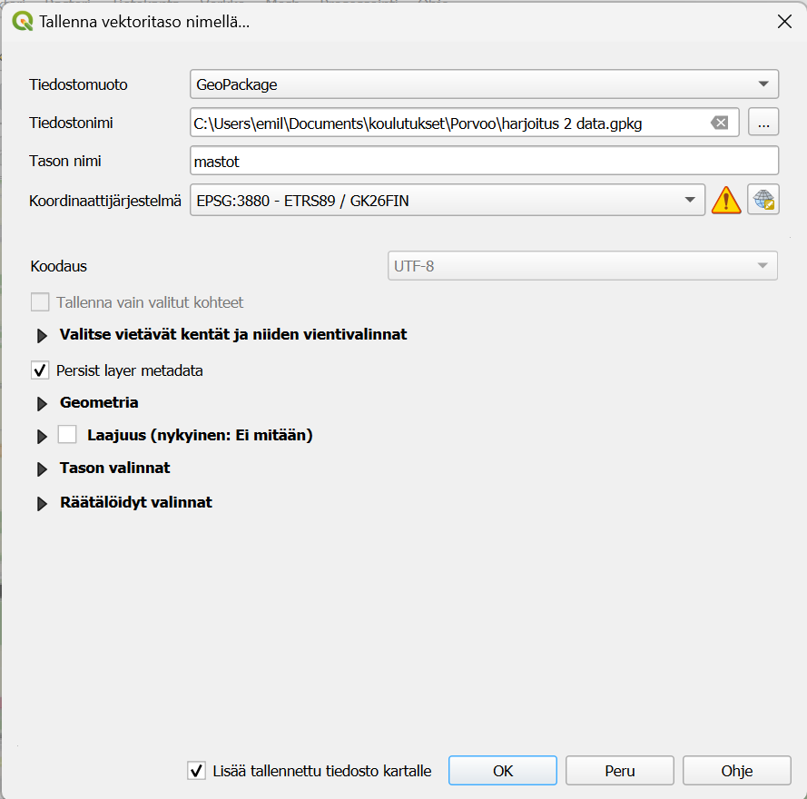
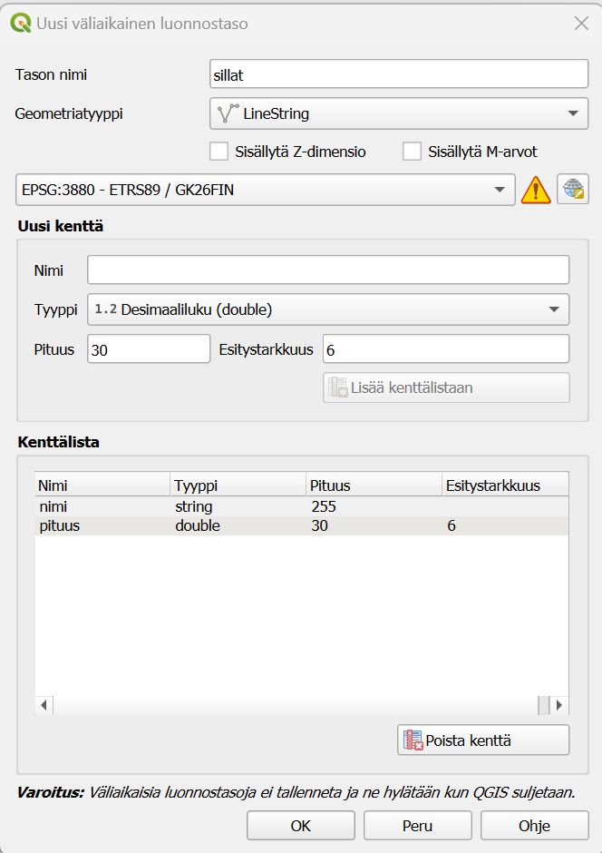
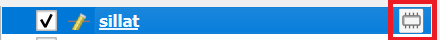
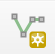
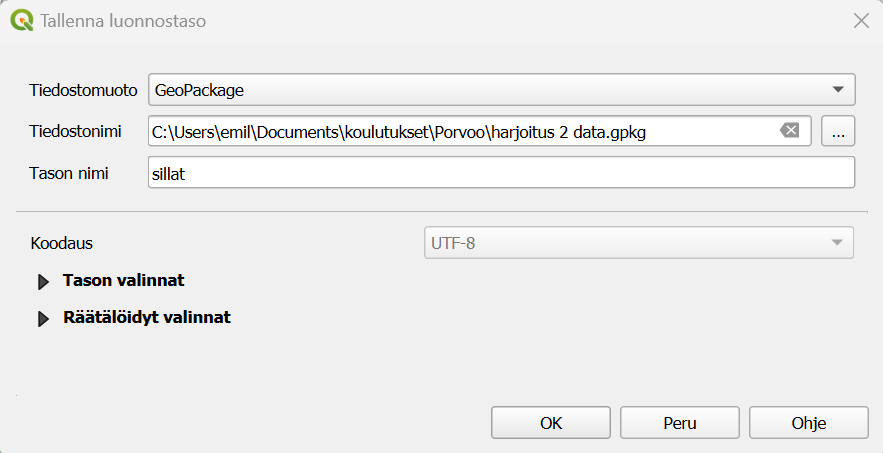

# Harjoitus 1: QGISin perustoiminnot

**Harjoituksen sisältö**

Harjoituksessa tehdään QGISin perustoimintoja, kuten aineistojen tallentaminen, konvertointi, koordinaattijärjestelmän muunnokset.

**Harjoituksen tavoite**

Harjoituksen jälkeen opiskelija osaa käyttämään QGISin perustoimintoja.

## Valmistautuminen

Avaa uusi QGIS-projekti (**Projekti \> Uusi**) ja tallenna se nimellä "**QGIS-harjoitus 1**".

## MapInfon tiedostot QGISiin

QGIS tukee kaikki keskeisimmät paikkatietoformaatit. Myös MapInfon tiedostoja voidaan helposti avata QGISissä. Yksinkertaisin tapa tuoda .tab, .mif ja .mid-tiedostoja QGISiin on vetää ne QGIS-ohjelmiston karttaikkunaan. Voit myös tehdä sen valikon kautta: **Tasot -> Lisää tasot -> Lisää vekoritaso**. Etsi oikea tiedosto ja paina **OK**. Huomioi, että esimerkiksi MapInfon .tab tiedoston kyljessä on muutama muu tiedosto (.ID, .MAP, .DAT) jotka pitää pysyä aina samassa paikassa .tab tiedoston kanssa. Muuten aineisto ei toimi oikealla tavalla.

Tähän "monta tiedostoa samalle aineistolle"-rumbaan löytyy ratkaisu: GeoPackage. QGISin oletusformaatti GeoPackge on kuin pieni paikallinen tietokanta omana tiedostona, mihin voi tallentaa monta eri tasoa, tyylejä sekä jopa QGISin projektia. Tällä tavalla voit esimerkiksi näppärästi siirtää kaikki tarvittavat tasot oikeilla tyyleillä kolleegalle. Lähettämällä pelkän .gpkg-tiedoston vaikkapa sähköpostitse.

Ensin tarvitaan taustakartta. Valitse Selain-paneelista XYZ-tiles ja tuplaklikkaa "OpenStreetMap"-yhteyttä. Siirry Porvoon alueelle. Projektin koordinaattijärjestelmäksi suositellaan tässä tapauksessa Porvoolle sopivaa EPSG:3880. Painamalla alaoikealla olevaa EPSG-koodia voit vaihtaa kyseisen projektin koordinaattijärjestelmää. Valitse tähän EPSG:3880. Paina **OK**.

Lisätään tässä vaiheessa QGIS-projektiin uutta aineistoa. Etsi kurssihakemistosta **mastot.tab* ja lisää se QGIS-projektiin. Aineisto pitäisi asettua oikeille paikolle. Aineisto sisältää Porvoon keskustan alueen mastoja (Maanmittauslaitoksen maastotietokannan mukaan). Haluamme nyt tehdä muunnoksen .tab formaatista .gpkg formaattiin. Helpoin tapa on silloin vaan tallentaa tasoa uudestaan, ja valitsemalla oikea tiedostoformaatti. 

## Aineistomuunnos tai uuden aineiston tallentaminen

Eli aloita klikkamalla oikealla mastot-tasoa "Tasot"-paneelissa. Valitse **Vie -> Tallenna kohteet nimellä**. Vaihda tiedostomuoto GeoPackageksi ja pienestä napista, missä on kolme pistettä niin valitset itsellesi järkevän paikan tiedostolle. Voit nimetä tiedoston esimerkiksi näin "harjoitus 1 data". Tämä on siis nyt tämän harjoituksen GeoPackage-tiedosto ja tähän tallennetaan usempi taso (Huomaa, että logiikka MapInfon tiedostomuotoja verratuna on hiukan erilainen). Ensimmäisen tason nimi voi olla **mastot**. Koordinaattijärjestelmäksi valitaan EPSG:3880, pienen maapallo-napin takaa. Huomaat ehkä, että pieni varoituskolmio ilmenee. Jos pidät hiiren kolmion päällä, niin QGIS kertoo, että tämän koordinaattijärjestelmän tarkkuus on parhaimmillaan 0,1 metriä. Eli meidän tapauksessa tästä ei tarvitse huolehtia. Paina **OK**. Hienoa! Olet nyt muuntanut .tab tiedoston .gpkg-muotoon. 

## Väliaikainen luonnostaso

Luodaan seuraavaksi uusi väliaikainen luonnostaso joka sitten tallennetaan samaan GeoPackage-tiedostoon. Valitse **Luo uusi väliaikainen luonnostaso** 

::: hint-box
Psst! Väliaikaiset luonnostasot eivät tallennu omaksi tiedostoksi. Eli jos suljet tämän QGIS-projektin, niin väliaiksen luonnostason kohteet ovat hävinneet. Väliaikaiset luonnostasot ovat näppäriä silloin, kun tiedetään, että siitä ei ole tulossa omaa lopputuotosta, vaan ne ovat nimensä mukaisesti väliaikaisia luonnoksia. 
:::

Anna uudelle tasolle nimen "sillat". Geometriatyyppi on LineString ja koordinattijärjestelmä sama kuin aiemmin. Voit lisätä uuden kentän jonka nimi on "nimi" ja tyyppi on Teksti. Lisää myös kenttä nimeltään "pituus" ja jonka tyyppi on Desimaaliluku. 

Uusi väliaikainen luonnostaso näkyy nyt Tasot-paneelissa. Erotat tason pysyvistä tasoita pienen "ötökän" näköisestä symbolista.

Lisää yksi silta painamalla -symbolia ja vedä tämän jälkeen viiva kartalla. Painamalla hiiren oikeaa näppäintä lopetat uuden viivan piirtämistä ja pieni ikkuna avautuu, mihin voit kirjoittaa nimen ja pituuden. Voit myös jättää tiedot tyhjiksi. Tallenna väliaikaisen luonnostason uusi silta ja siirry pois tason editointitilasta painamalla kynä-symbolia. Klikkaa nyt hiiren oikealla samaa tasoa ja valitse "Tee pysyväksi". Valitse tiedostonimeksi edellinen tiedosto ja anna tason nimeksi "sillat". Paina **OK**. Hienoa! Nyt sinulla on jo kaksi tasoa samassa GeoPackage-tiedostossa. 

## Selain-paneelin käyttö

Aineistoja voi lisätä QGISiin monella tavalla. Yksi hyvä tapa saada yleiskuvaa GeoPackagen sisällöstä on Selain-paneelin kautta. Tätä kautta pääset helposti näkemään omia tiedostojasi. Jos sinulla on esimerkiksi oma kansio tietylle aineistolle voit myös tallentaa sen suosikiksi. Alla olevassa videossa näet, miten voit lisätä kansion suosikkeihin jotta siihen on helpompi pääsy ja myös miten nopean yhteyden GeoPackage-tiedstoon luodaan.

## Kuvaustekniikan tallentaminen

Muistatko vielä miten kuvaustekniikkaa voi muuttaa? Tasot paneelista valitset "Avaa tason tyylit-paneeli". Vasemmalla näkyy nyt tason kuvaustekniikka. Kokeile lisätä sillan viivalle paksuutta ja vaihtaa sen väriä.

Kun olet tyytyväinen visualisointiin voit tallentaa sen. Kuvaustekniikat tallenntuu aina QGISin projektin mukana, eli usein ei ole tarpeen tallentaa kuvaustekniikkaa erikseen, jos käyttää samaa projektia. Jos olet lähettämässä aineiston kolleegalle, eli GeoPackage-tiedoston niin voit tallentaa kuvaustekniikan GeoPackage-tiedostoon. 

Klikkaa oikealla "Sillat"-tasoa ja valitse **Vie** ja **Tallenna QGIS tason tyylitiedosto**. Valitse tallennustapa "In datasource database", anna tyylille nimi sekä valitse, että tyyli on oletuksena (kuva alla).

Jos haluat varmistaa, että kuvaustekniikka on pysynyt mukana voit esimerkiksi avata uuden tyhjän QGIS-projektin ja tuoda sillat-taso siihen. Jos kaikki näyttää hyvältä voisit esimerkiksi lähettää .gpkg-tiedoston eteenpäin ja vastaanottajalla olisi täsmälleen samanlainen kuvaustekniikka. 

## Projektin tallentaminen GeoPackageen

Joskus on tarvetta jakaa kokonainen projekti kollegan kanssa. Silloin koko projektin voi tallentaa samaan GeoPackage-tiedostoon aineistojen kanssa. Voidaan kokeilla sitä nyt. Mene ylävalikkon "Projekti" ja valitse sieltä **Tallenna tiedostoon** ja **GeoPackage...**. Uudessa ikkunassa valitset "Harjoitus 1 data"-tiedoston. Anna nimeksi vaikkapa "harjoitusprojekti" ja paina **OK**. Nyt projektikin on tallentunut GeoPackage-tiedostoon. Nyt avata uuden tyhjän projektin ja kokeilla avata projekti GeoPackage-tiedostosta. Eli **Projekti -> Avaa kohteet -> GeoPackage...**

