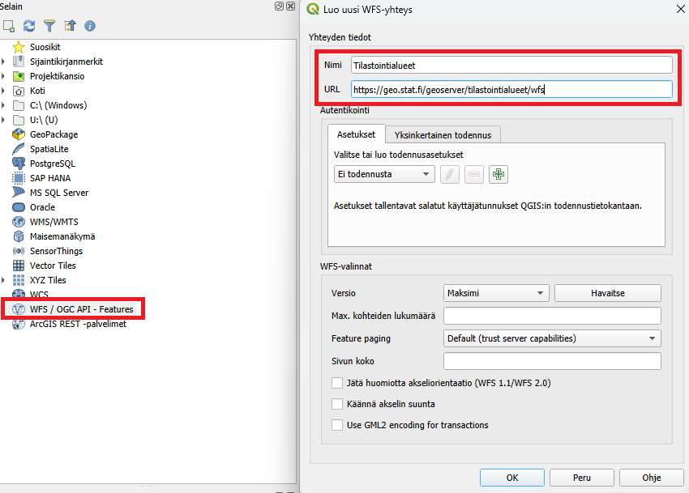
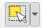
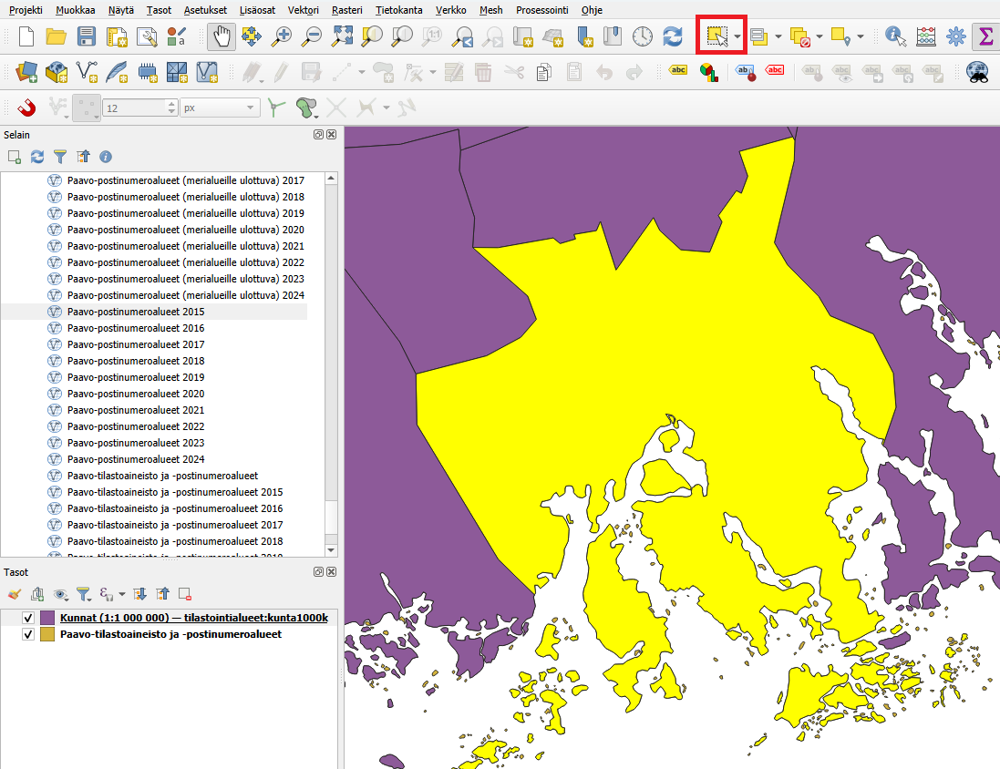
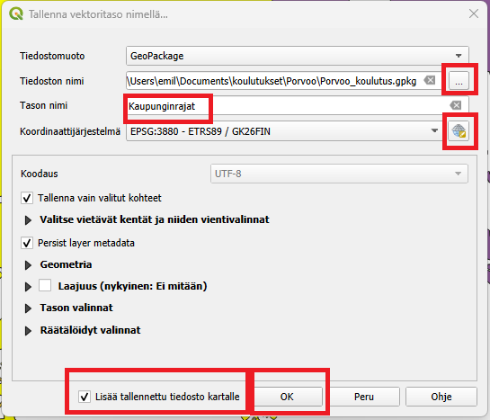
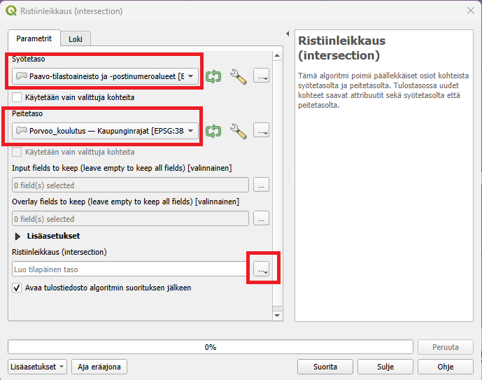
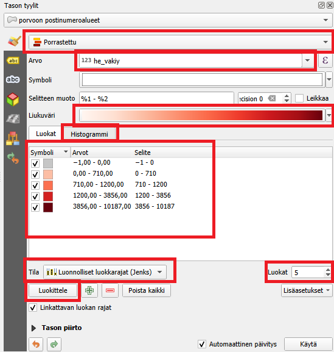
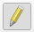
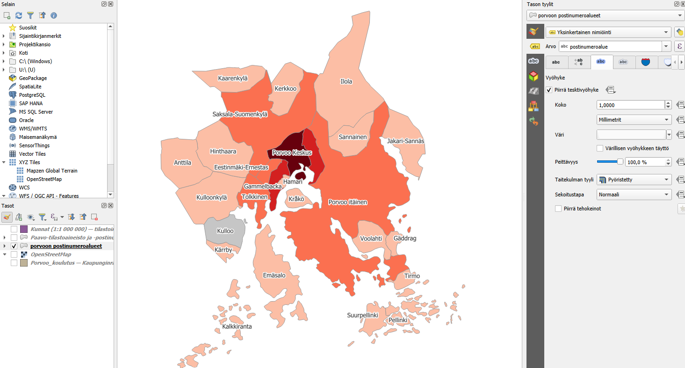

# Harjoitus 2: Teemakartta

## Harjoituksen sisältö

Harjoituksessa tehdään teemakartta Porvoon alueelta käyttäen postinumeroalueita ja rajapintapalveluja.

## Harjoituksen tavoite

Koulutettava oppii luomaan teemakartan sekä harjoittelee rajapintapalvelujen käyttöä.

Avaa QGIS ja aloita tyhjästä projektista. Aloitetaan heti lisäämällä kaikki Suomen kuntarajat [Tilastokeskuksen rajapintapalvelusta](https://stat.fi/org/avoindata/paikkatietoaineistot.html#kuntapohjaiset). Uuden tason voi lisätä muutamalla tavalla. Voit esimerkiksi selain-paneelissa etsiä **WFS / OGC API - Features** kohdan ja klikata sitä oikealla hiirennäppäimellä. Valitse **Uusi yhteys**. Anna yhteydelle selkeä nimi ja lisää tämä Tilastokeskuksen rajapintapalvelun osoite URL-kenttään:

::: note-box
https://geo.stat.fi/geoserver/tilastointialueet/wfs
:::

Lisää tämän jälkeen myös uusi yhteys toiseen rajapintapalveluun, [Tilastokeskuksen Paavo-rajapinta](https://stat.fi/org/avoindata/paikkatietoaineistot/paavo.html) missä on kaikki Suomen postinumeroalueet. Paavo-rajapinnan osoite on:

::: note-box
https://geo.stat.fi/geoserver/postialue/wfs
:::

Siirry viimeistään nyt Porvoon alueelle käyttäen karttanavigoinnin työkaluja.

Lisätään nyt Kuntaraja-rajapinnasta taso nimeltään **Kunnat (1:1 000 000)** sekä Paavo-rajapinnasta taso nimeltään **Paavo-tilastointiaineisto ja -postinumeroalueet**. Tarkista, että on oikeat tasot. Harjoituksen kannalta on tärkeää, että Paavo-aineisto sisältää myös tilastointiaineistoa. Voit avata attribuuttitaulukkoa klikkaamalla tasoa oikealla hiirennäppäimellä Tasot-paneelissa ja valita sieltä "Avaa attribuuttitaulukko". Tarkista, että sarake nimeltään "he_vakiy" on olemassa. Tässä sarakkeessa on postinumeroalueen väkimäärä. 

Seuraavaksi viedään Porvoon kaupungin alue ulos omana tiedostona. Paina ensin **Kunnat (1:1 000 000)**-tasoa Tasot-paneelissa. Valitse tämän jälkeen Valinta-työkalu:   ja valitse karttaikkunasta Porvoota. Nyt Porvoon alue pitäisi korostua keltaisella (kuva)

Paina oikealla **Kunnat (1:1 000 000)**-tasoa ja valitse **Vie -> Tallenna Valitut kohteet nimellä**. Uudessa ikkunassa valitset paikan uudelle tiedostolle pienestä napista missä on kolme pistettä (kuva). Tiedoston nimi on tässä kuvassa "Porvoo_koulutus". Tason nimeksi voit laittaa esimerkiksi "Kaupunginrajat". Tarkista, että olet tallentamassa GeoPackage-tiedoston.

Valitse myös pienestä maapallosta Porvoolle sopivan koordinattijärjestelmän eli ETRS89 / GK26FIN (kuva alla). Sen saa helpoin kirjoittamalla Suodatin-kohtaan EPSG-koodin 3880. Paina tämän jälkeen **OK**.

Lisää tallennettu tiedosto kartalle-kohdassa on hyvä olla ruksi ja paina tämän jälkeen **OK**.

Nyt meillä on oma taso missä on vain Porvoon kaupungin alue. Seuraavaksi tarvitaan Porvoon alueella olevat postinumeroalueet. Jotta saadaan ainoastaan ne jotka ovat Porvoon alueella niin voidaan käyttää Ristiinleikkaus-työkalua. Valitse ylävalikosta **Vektori -> Geoprosessointi -> Ristiinleikkaus (Intersection)**

Syötetaso on Postinumeroalueet ja Peitetasona on äsken luomasi Porvoon kaupuginraja-taso. Valitse vielä kolmesta pisteestä **Tallenna GeoPackageen** ja valitse sama GeoPackage-tiedosto, mitä käytit äsken kaupunginraja-tasolle. Näin saat molemmat tasot tallennettu samaan tiedostoon. Kun olet valinnut saman GeoPackage-tiedoston ja tallentanut niin se pyytää nimeä. Tähän voi laittaa esimerkiksi **Porvoon postinumeroalueet**. Kun painat **Suorita** niin työkalu luo sinulle uuden tason, missä on ainoastaan Porvoon alueella olevat postinumeroalueet.

::: hint-box
Huomaat ehkä, että ihan kaupunginrajalla niin on hyvin pieniä leikattuja postinumeroalueita. Tämä johtuu siitä, että Suomessa postinumeroalueet ei mene nätisti kuntarajojen mukaan. Näitä voisi esimerkisi siivota käsin pois, valitsemalla alueet ja painamalla delete kun on editointi-tilassa. Tässä harjoituksessa sitä ei tehdä (ellei jää runsaasti aikaa).
:::

Nyt päästään visualisoimaan tasoa. Tasot-paneelista voit valita "Avaa tason tyylit-paneeli", jolloin sinulla aukeaa oikealla tyyli-ikkuna (kuva).

Nyt voit helposti muokata Porvoon postinumeroalueet-tasoa. Oletuksena on valittu "Yksittäinen symboli" kuvaustekniikaksi. Koska meidän tarkoitus on luoda teemkarttaa väestöluvulla, niin valitse **"Porrastettu"**. Jos kyseessä olisi valmiita kategorioita niin käytettäisiin "Luokiteltua"-kuvaustekniikkaa. Kun olet valinnut "Porrastettu" niin valitse myös minkä arvon (eli muuttujan) mukaan luokkia muodostetaan. Tähän voit laittaa **"he_vakiy"**, missä on väestön lukumäärä. Valitse mieluisa liukuväri. Valitse tämän jälkeen **Tila**kohdasta esimerkiksi **Luonnolliset luokkarajat (Jenks)**. Huomaa myös **Luokat**-numeroarvo oikealla. Paina tämän jälkeen **Luokittele**. Nyt luotiin automattiset luokat. Yksittäisen luokan luokkarajoja voi muuttaa tuplaklikkaamalla "Arvot"-sarakkeen arvoa, ja karttatulosteessa näkyvää selitettä voi muuttaa tuplaklikkaamalla luokkaa "Selite"-sarakkeesta.  Tämä määrittää kuinka monta luokkaa haluat. Aineiston jakaumaa voit tarkistaa "Histogrammi"-välilehdeltä.

Yksittäisen luokan visualisointityyliä voit muuttaa tuplaklikkaamalla luokan symbolia. Yksittäisen luokan luokkarajoja voi muuttaa tuplaklikkaamalla "Arvot"-sarakkeen arvoa, ja karttatulosteessa näkyvää selitettä voi muuttaa tuplaklikkaamalla luokkaa "Selite"-sarakkeesta. Onneksi olkoon! Olet luonut teemakartan! Jatka muokkaamista kunnes olet tyytyväinen!

Kun olet valmis, tallenna projektitiedosto kurssihakemistoon pikanäppäimellä CTRL + S tai päävalikosta Projekti \> Tallenna.

## Lisätehtävä 1: Poista rajalla olevat postinumeroalueet

Kuten huomasimme, postinumeroalueet eivät seuraa kuntarajoja, joten niitä pieniä alueita kuntarajojen lähellä voitaisiin siivota pois. Valitse Porvoon postinumeroalueet-tasoa Tasot-paneelista. Paina tämän jälkeen **Editointi päälle** kynä-symbolista. Valitse tämän jälkeen **Valinta-työkalu**.

Nyt voit valita kaikki ylimääräiset postinumeroalueosat painamalla aluetta ja tämän jälkeen **Delete**-näppäintä. JOs haluat valita useamman alueen kerralla niin pidä ctrl-näppäin alhaalla kun valitset alueita. Kun olet valmis niin muista tallentaa muutokset ja pistä editointi pois päältä. 

## Lisätehtävä 2: Lisää nimiöt 

Lisää nimiöt **Nimiöt**-välilehdeltä Kuvaustekniikka-ikkunasta. Jos haluat, että kartalla sanotaan postinumeroalueen nimi niin valitse arvoksi **postinumeroalue**-sarake. Voit vaihtoehtoisesti käyttää **he_vakiy**-saraketta, jos haluat esittää tarkan arvon siitä, kuinka moni henkilö asuu postinumeroalueella. Jos teksti on vaikeasti luettava voit esimerkiksi lisätä tekstille vyöhykkeen **Vyöhyke**-välilehdelle. Esimerkkikuva alla.

::: hint-box
**Psst! Muista tallentaa QGIS-projekti harjoituksen lopuksi.**
:::
