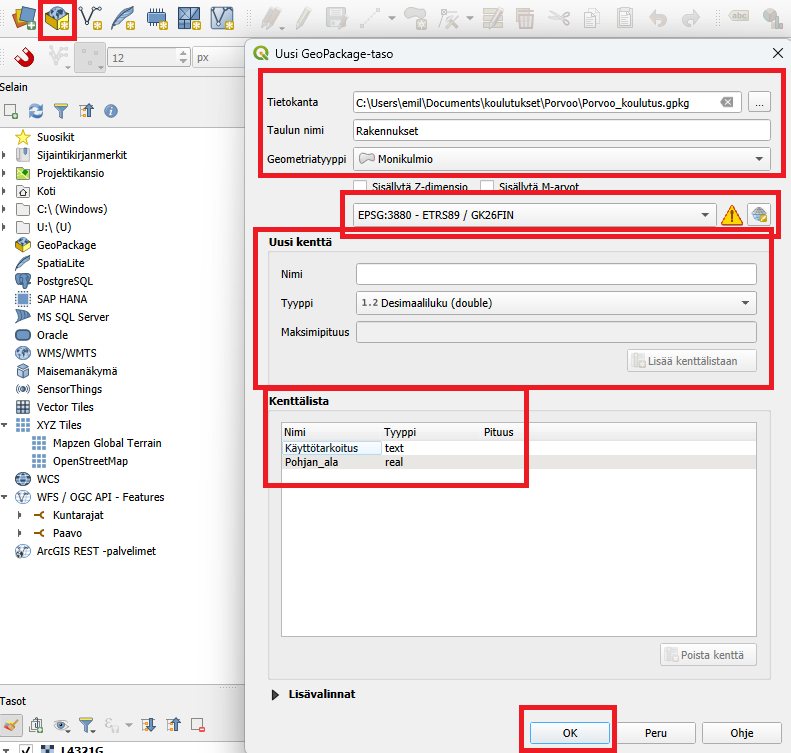
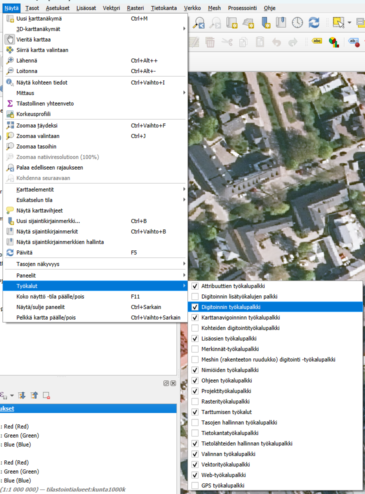
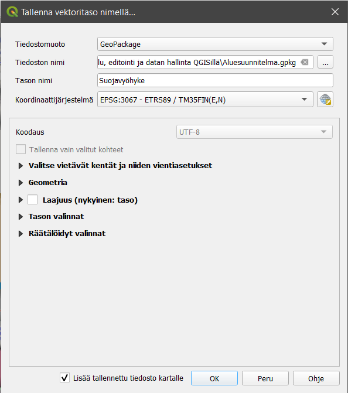
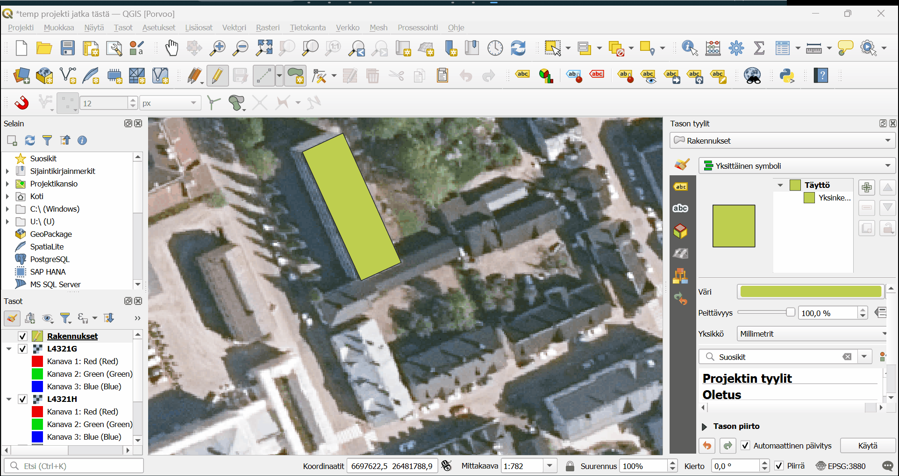
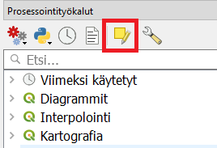

# Harjoitus 3: Digitointi

**Harjoituksen sisältö**

Harjoituksessa tehdään digitoinnin operaatioita QGISillä.

**Harjoituksen tavoite**

Harjoituksen jälkeen opiskelija osaa hyödyntää monipuolisemmin digitoinnin ja editoinnin ominaisuuksia.

## Valmistautuminen

Avaa uusi QGIS-projekti (**Projekti \> Uusi**) ja tallenna se nimellä "**QGIS-harjoitus 3**".

Lisää projektiin kurssihakemistosta seuraavat ortokuvat Maanmittauslaitokselta:

-   L4321G

-   L4321H

## Uusi taso ja digitoinnin perustyökalut

Tässä harjoituksessa teemme rakennuksia rakennuspaikoille. 

Aloita valitsemalla työkalupalkista **Uusi GeoPackage-taso**. Tällä kertaa valitsemme **Tietokanta**-kenttään kohteeksi aiemmin luodun "Porvoo_koulutus"-Geopackagetiedoston, jolloin uusi taso tulee lisätyiksi siihen. Kun olet valinnut Porvoo_koulutus.gpkg:n tietokannaksi, anna tason nimeksi "Rakennukset" ja valitse geometriaksi "monikulmio". Koordinaattijärjestelmä pitäisi olla EPSG:3880.Lisää kaksi uutta kenttää. Nimeksi ensimäiselle "Käyttötarkoitus" ja Tyyppi "Teksti". Toiselle nimi "Pohjan_ala" ja Tyyppi "Desimaaliluku".

Tallennettaessa QGIS kysyy, korvataanko aiemmin luotu GeoPackage vai lisätäänkö uusi taso siihen. Valitse Lisää uusi taso.

Tarkista, että sinulla on esillä **Digitoinnin työkalupalkki** sekä **Tarttumisen työkalut**. Tämän voit tehdä Näytä-ylävalikon kautta (Työkalut)

Laita Rakennukset-tason muokkaustila päälle 

Nyt voit piirtää uusia kohteita Rakennus-tasolle painamalla ensin "Lisää monikulmiokohde"  

Sen jälkeen voit vapaasti piirtää rakennuksen taustakartan mukaan. Kokeile piirtää yksi rakennus ja kun olet valmis niin painat hiiren oikealla näppäimellä. Nyt voit lisätä rakennuksen käyttötarkoituksen (voit keksiä itse). Pinta-alaa ei laiteta, koska sitä lasketaan geometrian mukaan myöhemmin.

## Tarttuminen

QGISillä on monta hyödyllistä työkalua, jotka helpottavat digitointia. Voit seuraavaksi laittaa "Tarttuminen" päälle magneettisymbolista 
Tarttuminen tarkoittaa, että kun olet piirtämässä uutta kohdetta, niin voit helposti tarttua kiinnni olemassa oleviin kohteisiin, jotta ei tule päällekkäisyyksiä.

Etsi nyt kartalta rakennus joka on kiinni toisessa rakennuksessa. Piirrä ensin yksi rakennus ja tarkista, että sinulla on Tarttuminen päällä. Piirrä sitten se toinen rakennus niin, että se "tarttuu kiinni" ensimmäiseen rakennukseen. Voit katsoa esimerkin yllä olevasta kuvasta.

## Lisätyökalut apuun

Kun ollaan piirtämässä rakennuksia niin voisi olla hyvä saada 90 asteen kulmia rakennuksiin. Mene **Näytä**-ylävalikon kautta **Paneelit**-valikkoon ja tarkista, että **Digitoinnin lisätyökalut**-paneeli on näkyvissä. Ota sitten digitoinnin lisätyökalut käyttöön painamalla .

Lisätyökalujen avulla voi saada näkyville apuviivat ja tarttumisasetukset tiettyihin kulmiin, esimerkiksi 45 tai 90 asteen välein. Toiminnon saa päälle laajennetun digitoinnin paneelista (ikkunan vasemmassa laidassa). Laita  **tartu yleismpiin kulmiin --\> 90.0, 180.0, 270.0, 360.0** päälle -nappulasta

Oletuksena nollakulma on vaakatasossa piirtoalueen suhteen, mutta piirtämisen alettua kulma lasketaan viimeisen piirretyn viivan mukaan ja näkyviin tulee tukiviivoja haluttujen kulmien kohdalle.

Kokeile nyt piirtää muutama muu rakennus 90 asteen kulmilla. Muista tallentaa tason muutoksia tasaisin väliajoin. 

## Lisätehtävä 1: Kokeile työkaluja rohkeast
Voit kokeilla myös CAD-pohjaista digitointia, joka on kehittynyt verrattain paljon QGISin uudessa versiossa. Työkalut sait siis esiin lisäämällä **Digitoinnin lisätyökalut** -ylämenusta **Näytä → Työkalut → Digitoinnin lisätyökalut**. 
Kokeile erilaisia työkaluja, esimerkiksi **Täytä piiri** -työkalua. Tätä voit hyödyntää esimerkiksi rakennuksen sisäpihan piirtämisessä. Eli voidaan niin sanotusti tehdä reikä rakennuksen keskelle.

## Lisätehtävä 2: Testaa rakentamistila

Jos piirtämisen apuna tarvitaan etäisyyttä tietystä pisteestä tai tiettyä kulmaa johonkin olemassa olevaan linjaan, rakentamistilan avulla saa näkyville apuviivoja piirtämisen tueksi. Rakentamistilan ollessa aktiivisena ei voi piirtää, mutta sen avulla voidaan hakea näkyviin tarvittavia apuviivoja esim. etäisyyden tai kulman suhteen. Rakentamistilaa voi käyttää ennen tai kesken piirtämisen.

Rakentamistila aktivoidaan laajennetun digitoinnin paneelista löytyvästä -nappulasta. Sen saa päälle/pois päältä myös pikakomennolla **C**.

Huom! Rakentamistilassa ollessa ei piirretä mitään. Kun olet saanut rakentamistilassa toivotut apuviivat näkyville ja haluat aloittaa varsinaisen piirtämisen, rakentamistila tulee sulkea joko painamalla hiirellä  tai **C**-näppäimellä. Apuviivat jäävät näkyviin ja voit piirtää niiden avulla pisteen haluamaasi paikkaan.

## Lisätehtävä 3: Lisää Rakennukset tasolle funktio, jolla pinta-ala tieto päivittyy automaattisesti

Avaa Rakennukset-tason ominaisuudet. Mene kohtaan Attribuuttilomake. Valitse kentistä Pohjan_ala ja selaa kohtaan Oletusarvot. Avaa oikean reunan funktio-painikkeesta auki lausekkeen muokkaus -ikkuna. Valitse Geometrian alta `$area`. Funktion voi myös itse kirjoittaa suoraan oletusarvot -kenttään. Jos haluat vielä pyöristää arvoa niin, ettei kaikki desimaalit näy niin käytä round-funktiota. Jos esimerkiksi haluat pyöristää pinta-alan kahden desimaalin tarkkuudella lauseke on `round($area,2)`. **Lopuksi muista laittaa täppä tuohon "Käytä oletusarvoa päivityksessä" kohtaan**, niin QGIS laskee uudelle polygonille automaattisesti pinta-alan! 🎉

Kun olet valmis, tallenna projektitiedosto.

Olemme julkaisseet blogin myös liittyen [CAD-aineistojen käsittelyyn QGISissä](https://gispo.fi/blogi/cad-aineistot-ja-qgis/).

::: hint-box
Psst! Gispolla on ihan oma kurssi kaavojen tekemiseen QGISillä nimeltään [Yleiskaavoitus QGISillä](https://www.gispo.fi/koulutus/yleiskaavoitus-qgisilla/)
:::

