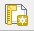
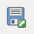

# Harjoitus 4: Karttatuloste

## Harjoituksen sisältö

Harjoituksessa tehdään karttatuloste.

## Harjoituksen tavoite

Koulutettava oppii laatimaan karttatulosteen halutussa mittakaavassa sekä tehdä tulosteesta PDF-tiedoston.

## Valmistautuminen

Käynnistä QGIS-ohjelmisto. Avaa toisen harjoituksen projekti, eli se missä tehtiin teemakarttaa.

## Karttatuloste

Uuden tulosteen muodostaminen voidaan aloittaa kahdella tavalla, valitse **Projekti → Uusi taitto** tai paina työkalua:

Ensimmäisenä kysytään uuden taiton nimeä. Anna taitolle jokin sitä hyvin kuvaava nimi. Taittoa varten avautuu uusi ikkuna.

Paina tulosalueella hiiren oikealla näppäimellä ja valitse **Sivun ominaisuudet**. Tarkista **Elementin ominaisuudet -välilehdestä** oikeasta paneelista, että paperin kooksi A4, suunta **Vaaka** ja **Taitto-välilehdestä**, että viennin resoluutio on 300 dpi. Tämän jälkeen voimme sijoittaa karttanäkymän tulosteelle, valitse työkalupalkista työkalu:

Vedä tulosalueelle suorakulmio, karttanäkymän mukainen kartta piirtyy näytölle.

Valitse **Elementin ominaisuudet -välilehti** ja muuta kartan parametrejä seuraavasti:

-   Kartan mittakaavaksi 1:250 000
-   Valitse Kehys (piirtää kartalle reunaviivat)

Huomaa, että karttatulosteen hallinnassa on mahdollisuus siirtää yksittäisiä kohteita (nimikkeitä) tai muokata kartan sijaintia. Kohteen ollessa valittuna, voit siirtää sitä tulosteella seuraavan työkalun avulla:

|                                  |                                                         |
|:------------------:|:--------------------------------------------------:|
|  |                Valitse/siirrä elementtiä                |
|  | Siirrä elementin sisältöä (esimerkiksi kartan sisältöä) |
|  |                 Zoomaa taiton näkymässä                 |

QGISin avulla voit muokata karttatulosteesi ulkoasua. Otsikko tai muu teksti voidaan lisätä **Lisää uusi nimiö** -työkalulla: 

Lisää uusi selite käyttäen: 

Ja lisää uusi mittakaava käyttäen: 

Huomaa, että näiden taiton elementtien ominaisuuksia voit muokata oikeanpuoleisen sivupalkin **Elementin ominaisuudet -välilehden** avulla. Tekstiä voi muokata tekstinkäsittelyohjelmista tutuilla työkaluilla:

Voit myös muokata selitteen ominaisuuksia. Huomaa, että sinun on poistettava kohdan **Päivitä automaattisesti** rasti. Pohjoisnuolen lisääminen tapahtuu lisäämällä kuva tällä työkalulla (vasemmasta palkista): 

Valitse sen jälkeen **Elementin ominaisuudet -ikkunasta** mieleisesi pohjoisnuoli-kuva (selaa sisältöä alaspäin, jos et heti näe nuolia).

Lopputulos voi olla esimerkiksi seuraavanlainen:

Halutessasi voit tallentaa käyttämäsi tulostemallin (layout englanniksi) ja hyödyntää sitä jatkossa seuraavien karttatulosteiden tekemiseen. Voit esimerkiksi muotoilla kollegoidesi käyttöön karttatulostemallin organisaatiollesi (logot, värit, tekstin paikka, jne.). Tämä onnistuu **Tallenna malliksi -työkalulla**: 

Lopputuloksen voit tulostaa tiedostoksi (kuvaksi tai pdf:ksi) tai tulostimeen.

Sopiva resoluutio karttatulosteellesi riippuu kartan käyttötarkoituksesta, mutta oletusarvoinen 300 dpi tallentaa resoluutioltaan hyvinkin tarkkoja kuvia. Voit valita arvoksi vaikkapa 200 dpi.

::: hint-box
**Psst! Muista tallentaa QGIS-projekti harjoituksen lopuksi.**
:::
