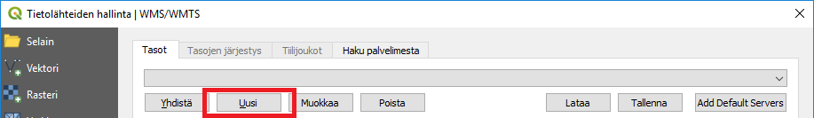

# Harjoitus 2: Paikkatietoaineistot ja -palvelut

## Harjoituksen sisältö

Harjoituksessa lisätään erilaisia paikkatietoaineistoja ja -palveluita QGIS-ohjelmistoon.

## Harjoituksen tavoite

Koulutettava oppii lisäämään erilaisia paikkatietoaineistoja ja -palveluja QGIS-projektiin.

## Valmistautuminen

Avaa edellisen harjoituksen QGIS-projekti ja tallenna se nimellä (**Projekti → Tallenna nimellä...**) "**QGIS_harjoitus_2**".

::: hint-box
**Psst! Muista tallentaa QGIS-projekti säännöllisesti harjoituksen etenemisen yhteydessä.**
:::

## WMS-palvelun lisääminen

Seuraavaksi lisäämme WMS (Web Map Service) -palveluiden avulla muutaman aineiston projektiin. Valitse WMS-palveluiden lisäystyökalu **Tietolähteiden hallinta** -ikkunan välilehdeltä.

Tämä työkalu avaa WMS-palvelujen käyttö- ja määrityslomakkeen. Koneessasi saattaa olla jo määriteltynä useita WMS-palveluja. Saat ne auki alasvetovalikosta. Tässä harjoituksessa lisäämme muutaman uuden WMS-palvelun, joten valitse **Uusi** avautuneesta ikkunasta:

Määrittele seuraavassa ikkunassa haluamasi nimi WMS-palvelulle. On tärkeää, että muistat itse, mikä nimi vastaa mitäkin aineistoa, mutta paras on tietysti olla johdonmukainen ja kuvata esimerkiksi tietyn kaupungin palvelurajapintaa kyseisen kaupungin nimeä hyödyntäen (kts. esim. alla). URL-kentälle laitetaan WMS-palvelun osoite sekä tarvittaessa käyttäjänimi ja salasana. Luo uusi yhteys Espoon kaupungin WMS-palveluun: <https://kartat.espoo.fi/teklaogcweb/wms.ashx>

Palvelun määrityksen jälkeen paina **OK**. Paina vielä **Yhdistä**. Näin otamme yhteyden WMS-palveluun ja saamme alle listan palvelusta saatavilla olevista karttatasoista. Valitse **Ajantasa_asemakaava_vektori** tai haluamasi muu karttataso ja paina **Lisää**. Huomaa, että voit joutua odottamaan hetken, kun karttatasoa ladataan palvelimelta.

{width="70%"}

Luo nyt muutama WMS-palveluyhteys lisää. Voit hakea ja kopioida suoraan niin WMS- kuin WFS-palveluiden URL-osoitteita Gispon ylläpitämässä vapaasti käytettävästä rajapintaluettelosta seuraavan osoitteen takaa (<https://www.gispo.fi/blogi/avoimen-datan-wms-ja-wfs-karttapalveluita/>). Listaamme myös alle muutaman WMS-palvelun URL-osoitteen:

-   <https://kartta.hsy.fi/geoserver/wms>
-   <http://tiles.kartat.kapsi.fi/peruskartta>
-   <https://geoserver.museovirasto.fi/geoserver/rajapinta_suojellut/wms>

**Yhdistä-painikkeen** yläpuolisesta alasvetovalikosta voit valita haluamasi yhteyden ja ladata sieltä haluamasi tasot. Valitse siis ensin palvelu alasvetovalikosta ja paina sitten **Yhdistä**. Selaa aineistoja ja lataa vielä pari paikkatietoaineistoa eri palveluista. Voit valita aineistoja oman kiinnostuksesi mukaan. Kun olet löytänyt haluamasi aineiston, valitse se (voit valita useita kerrallaan) ja paina **Lisää**, niin aineisto latautuu ja tulee käyttöön QGISissä.

## WFS-palvelun lisääminen

Seuraavaksi lisäämme QGISiin WFS (Web Feature Service) -palveluja käyttöömme. Muistamme luento-osuudesta, että WFS-palvelu mahdollistaa itse paikkatietokohteiden kyselyn ja lataamisen vektorimuodossa asiakasohjelmaan (eli tapauksessamme QGISiin). Valitse WFS-palveluiden lisäystyökalu seuraavasta pikakuvakkeesta: 

WFS-palvelujen yhdistäminen toimii samalla logiikalla kuin edellä määritellyt WMS-palvelut.

Lisää taas muutama WFS-palvelu ja nimeä ne haluamallasi tavalla. Jos et vielä avannut mainittua Gispon ylläpitämää WMS- ja WFS-rajapintojen listaa verkosta, avaa se nyt. Hae sieltä haluamasi WFS-palvelun URL tai lisää seuraavasta listasta WFS-palveluita:

-   <https://kartat.espoo.fi/teklaogcweb/wfs.ashx?OUTPUTFORMAT=GML2>
-   <https://kartta.hsy.fi/geoserver/wfs>
-   <https://geoserver.museovirasto.fi/geoserver/rajapinta_suojellut/wfs>

Jos haluat käyttää tiedossasi olevaa suljettua (salasanaa vaativaa) palvelua, niin lisää käyttäjätunnus ja salasana palveluyhteyden luomisen aikana. Käyttäjätunnuksia kysytään automaattisesti, jos valitut karttatasot niin on määritetty. Kun olet luonut muutaman WFS-palveluyhteyden, voit ottaa niihin yhteyden samalla tavalla kuin WMS-palveluiden yhteydessä. Valitse taas oman kiinnostuksesi mukaan aineistoja lisättäväksi QGISiin. Kuten sanottu, huomataan, että tällä kertaa aineistot ovat vektoriaineistomuodossa. Eli voit tutkia niiden geometrioita ja ominaisuustietoja QGISissa. 

Kun olet luonut muutaman WFS-palveluyhteyden, voit ottaa niihin yhteyden samalla tavalla kuin WMS-palveluiden yhteydessä. Valitse taas oman kiinnostuksen mukaan aineistoja lisättäväksi QGISiin. Nyt kun sinulla on enemmän tasoja tasoluettelossa, voit ryhmittää tasoja, jotta sinun on helpompi hallita tasoja yhdessä. Hyödynnä myös muita tasoluettelon pikanäppäimiä tasoluettelon yläpuolelta:

Yllä olevassa kuvassa näkyy vain yksi taso, mutta sinulla on varmasti jo useampi taso luettelossasi. Tee esimerkiksi omat ryhmät WFS- ja WMS-tasoille tasoluettelossa.

## Valitseminen ja tallentaminen

Kokeile valita muutamia kohteita ja tallentaa ne paikallisesti kurssihakemistoosi. Valitseminen tapahtuu seuraavalla työkalulla:

Voit pitää ctrl-nappia alhaalla niin pystyt valitsemaan useamman kohteen. Jos haluat poistaa valinnan, paina kohdetta uudestaan. Valitut kohteet näkyvät oletuksena keltaisella. Jos haluat poistaa kaikki valinnat paina seuraavaa nappia:

Kun haluat tallentaa niin painat hiiren oikealla tasoa tasoluettelossa ja valitset **Vie -> Tallenna valitut kohteet nimellä**. 

::: hint-box
**Psst! Koulutuksen jälkeen saat henkilökohtaista tukea Gispon tukipalvelusta. Lähetä kysymyksesi tai kommenttisi osoitteeseen [koulutustuki\@gispo.fi](mailto:koulutustuki@gispo.fi){.email}!**
:::
