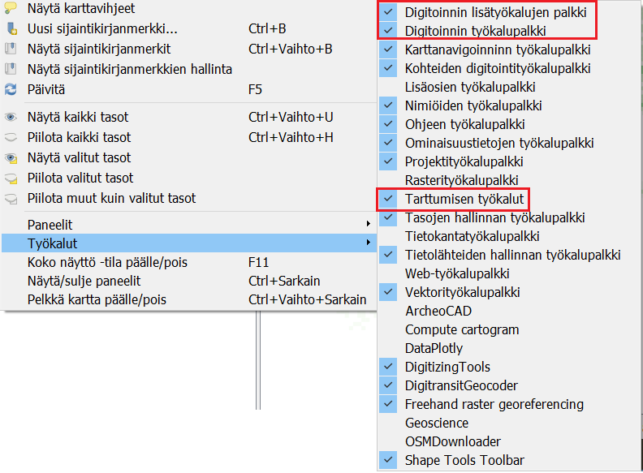
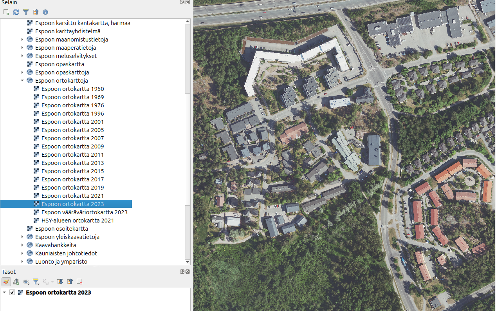

# Harjoitus 4: Digitoinnin valmistelut

**Harjoituksen sisältö**

Harjoituksessa luodaan vektoriaineisto hyödyntäen digitoinnin perustyökaluja.

**Harjoituksen tavoite**

Harjoituksen jälkeen osallistuja osaa lisätä ja luoda tasoja QGISiin.

**Arvioitu kesto**

10 minuuttia.

## Valmistautuminen

Avaa uusi QGIS-projekti (**Projekti \> Uusi**) ja tallenna se nimellä "**QGIS-harjoitus 4**".

## Muokkauksen yleisasetukset

Muokkauksen toimintoa ja muita yleisiä muokkaustyöasetuksia voit muuttaa päävalikon ikkunassa **Asetukset \> Valinnat \> Digitointi**. Jos et esimerkiksi halua, että ominaisuustietojen muokkausikkuna tulee esiin jokaisen polygonin piirtämisen jälkeen niin rastita **Älä näytä ominaisuustietojen pop-up lomaketta kohteen luonnin jälkeen**. Jätä se kuitenkin päälle tällä kertaa. Kokeile myös vaihtaa kohteiden muokkausväri keltaiseksi (**Kuminauha**) ja **Taitepisteen** symbolin tyyli ja koko. Paina **OK**, niin asetukset tulevat voimaan.

## Digitoinnin valmistelu

Aloitetaan tekemällä digitointia helpottavia valmisteluja. Avaa **Työkalut-valikko** valisemalla **Näytä \> Työkalut**. Aktivoi omaan projektiisi **Työkalut-valikosta** seuraavat työkalut:

-   Digitoinnin työkalupalkki

-   Digitoinnin lisätyökalujen palkki

-   Tarttumisen työkalut\

Usein ensimmäinen operaatio aineistojen luomisessa on taustakartan lisääminen. Taustakartta helpottaa liikkumista ja aineistojen tarkistusta. Tänään käytetään Espoon kapungin ilmakuvaa taustana, mutta voit myös käyttää jotain muuta taustakartaa. Avaa Espoon kaupugin WMS-rajapinta (jonka lisäsit edellisessä harjoituksessa) ja lisää sen kautta tason **Espoon ortokartta 2023**.

Zoomaa kartta haluamasi kohdalle ja koska haluamme tehdä tarkkaa digitointia oikeassa koordinaattijärjestelmässä niin varmista, että projektin koordinaattijärjestelmä on Espoon alueelle sopiva **ETRS89/GK25FIN (EPSG:3879)**. Tarkista se projektin oikeasta alakulmasta, jossa lukee tällä EPSG-koodi.

::: hint-box
Psst! Muista tukipalvelu! Koulutuksen jälkeen saat henkilökohtaista tukea Gispon tukipalvelun kautta lähettämällä yksinkertaisesti tuki\@gispo.fi -sähköpostiosoitteeseen kysymyksen tai kommentin jostakin sinua mietityttävästä asiasta. Gispon tiimi auttaa sinua toimiesi äärellä. Kysymykset käsitellään henkilökohtaisesti.
:::

