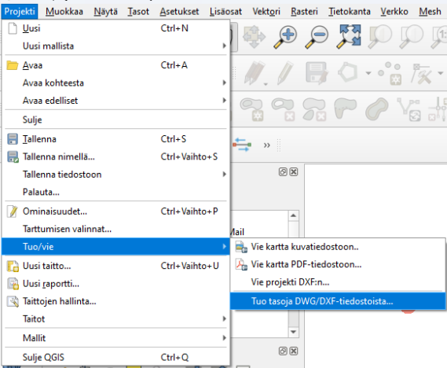
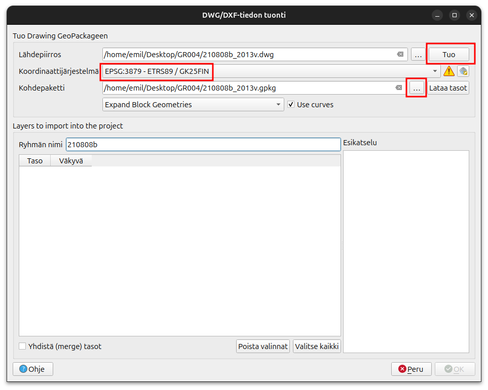
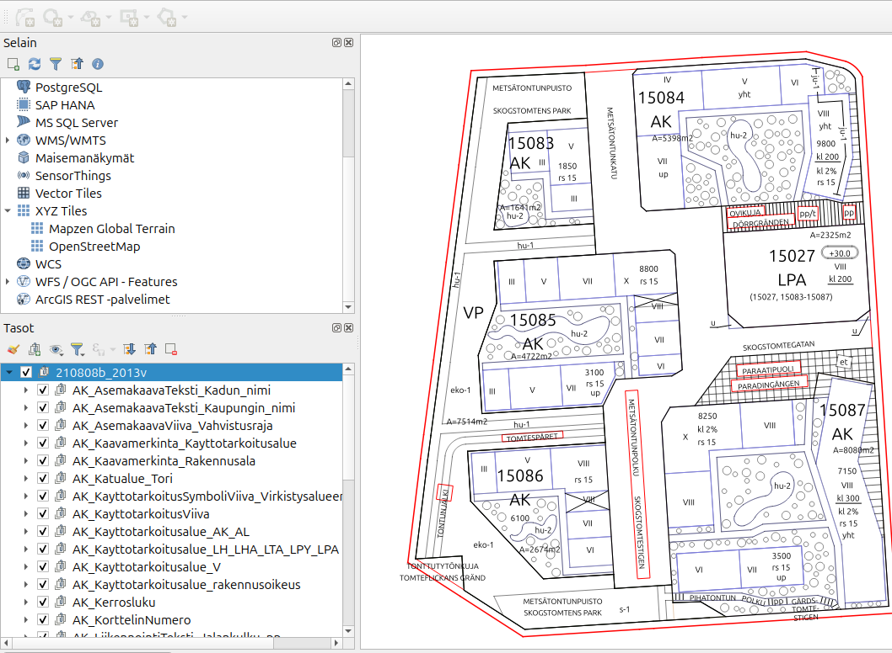
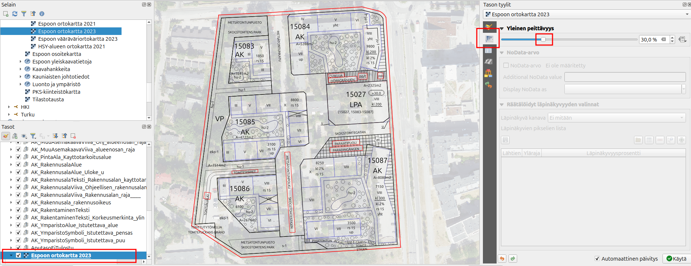

# Harjoitus 9: CAD-aineistot QGISissä

## Harjoituksen sisältö

Harjoituksessa tuodaan CAD-aineistoja QGIS-työtilaan

## Harjoituksen tavoite

Koulutettava oppii tuomaan DWG-aineistoja QGIS-työtilaan ja käsittelemään niitä QGISissä.

## Valmistautuminen

Käynnistä QGIS-ohjelmisto. Tallenna QGIS-projekti nimellä (**Projekti → Tallenna nimellä…**) “**QGIS_harjoitus_9**”.

## CAD-aineiston tuonti

Tässä harjoituksessa ohjeistetaan kuinka käytetään QGISin “Tuo DWG/DXF”-työkalua, joka aineiston avaamisen lisäksi luo GeoPackage-tiedoston sen sisällöstä. 

Toinen vaihtoehto olisi tuoda aineisto projektiin uutena vektoritasona (Tasot -> Lisää taso -> Lisää vektoritaso). Näistä ensin mainittu työkalu antaa paremman näkymän aineistoon, sillä se jakaa aineiston CAD-ohjelmistossa nimettyihin tasoryhmiin. Sen sijaan aineiston tuonti vektoritasona tuo kaikki polygoni-, viiva- ja pisteaineistot projektiin geometrian mukaan jaettuina tasoina, minkä seurauksena haluamiaan tietoja joutuu kaivelemaan aineiston attribuuttitaulukoista. Joidenkin aineistojen tapauksessa myös Tuo DWG/DXF-työkalu on ainoa tapa saada aineisto auki QGISissä, jos jostain syystä vektoritasona tuominen ei toimi.

## Erilaiset CAD-aineistot

|Formaatti|Selite|Toimii QGISissä| 
|:-------:|:---------------:|:----------:| 
| .dwg | AutoCADin oletusformaatti |Versio 2018 ja uudemmat eivät toimi. Vanhemmat versiot toimivat.| 
| .dgn | Microstationin oletusformaatti | Ei, paitsi jos käyttää vanhaa (v7) dgn-tiedostoa.| 
| .dxf | AutoCadin formaatti kun halutaan siirtyä toiseen ohjelmistoon  |Kyllä| 

Mene QGISin asetusvalikossa Projekti -> Tuo/vie -> Tuo tasoja DWG/DXF-tiedostoista. 
Uudessa ikkunassa pitää luoda uusi Geopackage-tiedosto, johon valittu DWG-tiedosto viedään. Valitse Lähdepiirrokseksi eli tuotavaksi DWG-sisällöksi kurssihakemistosta **210808b_2013v.dwg**. Tämä tiedosto on vanhempi versio .dwg-muodosta. 

::: hint-box
Jos kokeilet tuoda uusimman version .dwg tiedosto (210808b.dwg), niin huomaat, että QGIS ilmoittaa että tiedostomuotoa ei tueta.
:::

Valitse tämän jälkeen kolmen pisteen takaa Kohdepaketti-kohdasta hyvä sijainti ja nimi uudelle GeoPackage-tiedostolle. Valitse myös oikea koordinaattijärjestelmä. Kurssihakemiston tiedostoilla koordinaattijärjestelmä on **ETRS89 / GK25FIN (EPSG:3879)**. Älä huolestu pienestä kolmiosta. Pitämällä hiirtä komlmion päällä, niin selviää, että tällä koordinaattijärjestelmällä tarkkuus rajoittuu 0,1 metriin. 

Paina seuraavaksi **Tuo** nappia. Riippuen piirrustuksen laajudesta niin voi kestää pieni hetki, että tasot latautuvat. Voit tämän jälkeen painaa **OK**-nappia. Nytkin voi kestää hetken, että QGIS saa auki kaikki tasot. 

Tämän jälkeen niin Tasot-paneeliin ilmestyy uusi tasoryhmä. Tämän tasoryhmän alla on monta alatasoryhmää. Näiden sisällä on sitten tasot. On hyvin mahdollista, että karttanäkymäsi on edelleen tyhjä. Kokeile painaa jotain tasoa tai ryhmää oikealla hiirennäppäimellä ja valitse **Zoomaa ryhmään/Zoomaa tasoihin**. 

Jos olet epävarma missä kohde sijaitsee voi lisätä haluamasi taustakartan esim. Espoon WMS-rajapinnan kautta. Voit myös mennä Selain-paneelissa XYZ-tiles-kohtaan ja tuplaklikkata OpenStreetMap-yhteyttä. Muista siirtää taustakarttaa alimmaksitasoksi tasoluettelossa. Jos taustakarttasi paistaa liian paljon läpi, voit säätää sen läpinäkyvyyttä avaamalla tason tyylit ja menemällä **Läpinäkyvyys**-välilehdelle. Tästä voit säätää miten läpinäkyvä taustakarttasi on.

::: hint-box
Jos haluat saada auki piirrustuksesi QGISissä niin suosittelemme, että **käytät ensisijaisesti .dxf-muotoa** (ellei ohjelmistosi tue suoriltaan jotain paikkatietoformaattia, kuten GeoPackage). Eli vie ulos käyttämästäsi CAD-ohjelmistosta mieluiten .dxf tiedostoa. Jos tämä ei ole mahdollista niin tallenna vanhempaan (esim. versio 2013) .dwg-muotoon, tai vanhempaan (v7) .dgn-muotoon. Kokeile sitten tuoda nämä QGISiin. Jos ei kuitenkaan tunnu toimivan, niin voit kokeilla muuntaa dwg/dgn tiedoston .dxf-muotoon, muunnosohjelman kautta, joka toimii netissä. Hakukoneen kautta löytää monta vaihtoehtoa, esimerkiksi [tämä](https://cloudconvert.com/dwg-to-dxf). 
:::

## Paikkatietoaineiston vienti CAD-muotoon

QGIS osaa myös viedä paikkatietoaineiston CAD-muotoon. Suosittelemme ensisijaisesti viemään tiedostoa dxf-muodossa. Voit myös kokeilla viedä aineistot .dgn-muodossa, mutta siihen saattaa liittyä enemmän rajoituksia. Voit tallentaa yksittäisen tason dxf tai dgn-muodossa samalla tavalla kuin olisit tallentamassa tason paikkatietomuotoon. Eli klikkaa tasoa hiiren oikealla ja valite **Vie -> Tallenna kohteet nimellä**. Tällä tavalla saat yksittäisen tason dxf tai dgn-muotoon. Jos haluat siirtää viedä kokonaista projektia .dxf-muodossa niin sekin onnistuu QGISillä. Valitse **Projekti -> Tuo/Vie -> Vie projekti DXF:n...**. Voit kokeilla molempia tapoja.

::: hint-box
Miksi on niin vaikeata saada auki nämä tiedostot QGISissä? Yksi syy on ainakin se, että CAD-aineistot ovat usein suljettuja formaatteja ja ne eivät seuraa avoimina standardeja (kuten esimerkiksi GeoPackage).
:::

